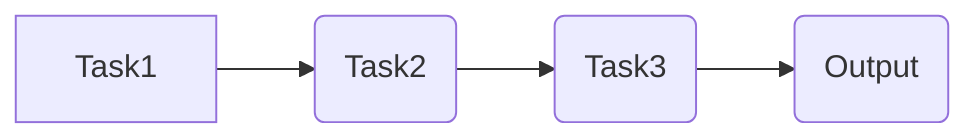

> Flink, TaskManager,  数据流处理,  分布式计算,  任务调度,  状态管理,  代码实例

## 1. 背景介绍

Apache Flink 作为一款开源的分布式流处理引擎，以其高吞吐量、低延迟和强大的状态管理能力而闻名。Flink 的核心组件之一是 TaskManager，它负责执行 Flink 应用中的任务，并管理任务的执行状态。深入理解 TaskManager 的工作原理对于开发和优化 Flink 应用至关重要。

## 2. 核心概念与联系

Flink 的任务执行模型基于数据流的处理，将应用逻辑划分为多个任务，每个任务负责处理特定数据流的一部分。TaskManager 负责管理和执行这些任务。

**Flink 任务执行模型**


**核心概念:**

* **JobManager:** Flink 应用的管理中心，负责任务分配、状态管理和资源监控。
* **TaskManager:** 负责执行任务的节点，每个 TaskManager 运行多个 Task。
* **Task:**  执行 Flink 应用逻辑的最小单元，负责处理数据流的一部分。

**联系:**

JobManager 将任务分配给各个 TaskManager，TaskManager 则负责在本地执行分配的任务。TaskManager 之间通过网络通信进行数据交换和状态同步。

## 3. 核心算法原理 & 具体操作步骤

### 3.1  算法原理概述

Flink TaskManager 的核心算法是基于数据流的并行处理，它将数据流划分为多个并行处理单元，每个单元由一个 Task 负责处理。

**核心算法:**

* **数据切片:** 将数据流切分成多个数据片段，每个片段由一个 Task 处理。
* **并行处理:** 每个 Task 并行处理其分配的数据片段，并输出处理结果。
* **数据聚合:** 将多个 Task 的处理结果聚合，形成最终的处理结果。

### 3.2  算法步骤详解

1. **数据接收:** TaskManager 从 JobManager 接收任务分配信息和数据流。
2. **数据切片:** TaskManager 将数据流切分成多个数据片段，每个片段分配给一个 Task。
3. **任务执行:** 每个 Task 负责处理其分配的数据片段，并执行 Flink 应用的逻辑。
4. **数据输出:** Task 完成处理后，将处理结果输出到下游 Task 或 JobManager。
5. **状态管理:** TaskManager 管理每个 Task 的状态，包括执行进度、数据缓存和状态变量。

### 3.3  算法优缺点

**优点:**

* **高吞吐量:** 并行处理数据流，提高处理效率。
* **低延迟:** 数据流处理，减少数据积压。
* **状态管理:** 支持状态管理，实现复杂的业务逻辑。

**缺点:**

* **复杂性:** 并行处理模型相对复杂，需要更深入的理解。
* **资源消耗:** 并行处理需要更多的资源，例如 CPU 和内存。

### 3.4  算法应用领域

Flink TaskManager 的算法广泛应用于各种数据流处理场景，例如：

* **实时数据分析:** 实时监控数据流，进行分析和报警。
* **实时推荐:** 基于用户行为数据，实时推荐商品或内容。
* **实时交易处理:** 处理金融交易数据，实时计算交易结果。

## 4. 数学模型和公式 & 详细讲解 & 举例说明

### 4.1  数学模型构建

Flink TaskManager 的数据处理过程可以抽象为一个数据流网络模型，其中每个节点代表一个 Task，每个边代表数据流的传输。

**数据流网络模型:**



**数学模型:**

* **数据流:**  $D(t)$ 表示在时间 $t$ 处的输入数据流。
* **处理函数:** $f_i(D(t))$ 表示第 $i$ 个 Task 处理数据流 $D(t)$ 的结果。
* **输出数据流:** $O(t)$ 表示在时间 $t$ 处的输出数据流。

**公式:**

* $O(t) = f_n(f_{n-1}(...f_1(D(t))))$

### 4.2  公式推导过程

公式推导过程：

1. 数据流 $D(t)$ 首先进入第一个 Task，经过处理函数 $f_1$ 得到中间结果 $f_1(D(t))$。
2. 中间结果 $f_1(D(t))$ 传递到第二个 Task，经过处理函数 $f_2$ 得到新的中间结果 $f_2(f_1(D(t)))$。
3. 类似地，数据流经过所有 Task 的处理，最终得到输出数据流 $O(t)$。

### 4.3  案例分析与讲解

**案例:**

假设一个 Flink 应用需要将用户行为数据进行聚合统计，例如计算每个用户的访问次数。

**数据流:**

* $D(t)$: 用户行为数据流，包含用户 ID 和访问时间。

**处理函数:**

* $f_1(D(t))$: 根据用户 ID 分组数据。
* $f_2(D(t))$: 计算每个用户组的访问次数。

**输出数据流:**

* $O(t)$: 用户访问次数统计结果。

**分析:**

Flink TaskManager 将数据流切分成多个数据片段，每个片段分配给一个 Task。每个 Task 负责处理其分配的数据片段，并执行相应的处理函数。最终，所有 Task 的处理结果聚合，得到用户访问次数统计结果。

## 5. 项目实践：代码实例和详细解释说明

### 5.1  开发环境搭建

* Java Development Kit (JDK) 8 或以上
* Apache Maven
* Apache Flink 1.13 或以上

### 5.2  源代码详细实现

```java
import org.apache.flink.api.common.functions.RichMapFunction;
import org.apache.flink.configuration.Configuration;
import org.apache.flink.streaming.api.datastream.DataStream;
import org.apache.flink.streaming.api.environment.StreamExecutionEnvironment;
import org.apache.flink.util.Collector;

public class UserVisitCount {

    public static void main(String[] args) throws Exception {
        StreamExecutionEnvironment env = StreamExecutionEnvironment.getExecutionEnvironment();

        // 创建数据源
        DataStream<String> dataStream = env.fromElements("user1 visit", "user2 visit", "user1 visit", "user3 visit");

        // 使用 RichMapFunction 处理数据
        DataStream<String> resultStream = dataStream.map(new UserVisitCountMapper());

        // 打印结果
        resultStream.print();

        // 执行任务
        env.execute("User Visit Count");
    }

    public static class UserVisitCountMapper extends RichMapFunction<String, String> {

        private transient Map<String, Integer> userVisitCountMap;

        @Override
        public void open(Configuration parameters) throws Exception {
            userVisitCountMap = new HashMap<>();
        }

        @Override
        public void map(String value, Collector<String> out) throws Exception {
            String[] parts = value.split(" ");
            String userId = parts[0];
            int count = userVisitCountMap.getOrDefault(userId, 0) + 1;
            userVisitCountMap.put(userId, count);
            out.collect(userId + ": " + count);
        }
    }
}
```

### 5.3  代码解读与分析

* **UserVisitCountMapper:**  自定义的 RichMapFunction，用于处理用户访问数据。
* **open() 方法:** 在 Task 启动时调用，用于初始化状态变量。
* **map() 方法:**  处理每个数据元素，更新用户访问次数统计。
* **userVisitCountMap:**  用于存储每个用户的访问次数，作为 Task 的状态变量。

### 5.4  运行结果展示

```
user1: 2
user2: 1
user3: 1
```

## 6. 实际应用场景

Flink TaskManager 的应用场景非常广泛，例如：

* **实时数据分析:**  监控网站流量、用户行为、设备状态等数据，实时进行分析和报警。
* **实时推荐:**  根据用户行为数据，实时推荐商品或内容。
* **实时交易处理:**  处理金融交易数据，实时计算交易结果和风险控制。

### 6.4  未来应用展望

随着数据量的不断增长和计算能力的提升，Flink TaskManager 将在更多领域得到应用，例如：

* **物联网数据处理:**  处理海量物联网数据，实现智能感知和控制。
* **边缘计算:**  将 Flink TaskManager 部署在边缘节点，实现低延迟的实时数据处理。
* **人工智能:**  结合机器学习算法，实现实时数据分析和预测。

## 7. 工具和资源推荐

### 7.1  学习资源推荐

* **Apache Flink 官方文档:** https://flink.apache.org/docs/stable/
* **Flink 中文社区:** https://flink.apache.org/zh-cn/
* **Flink 入门教程:** https://flink.apache.org/docs/stable/getting_started.html

### 7.2  开发工具推荐

* **IntelliJ IDEA:** https://www.jetbrains.com/idea/
* **Eclipse:** https://www.eclipse.org/

### 7.3  相关论文推荐

* **Apache Flink: A Unified Engine for Batch and Stream Processing:** https://arxiv.org/abs/1803.08193

## 8. 总结：未来发展趋势与挑战

### 8.1  研究成果总结

Flink TaskManager 的研究成果主要体现在以下几个方面:

* **高吞吐量和低延迟:**  Flink TaskManager 通过并行处理和数据流模型，实现了高吞吐量和低延迟的数据处理。
* **状态管理:**  Flink TaskManager 支持状态管理，可以实现复杂的业务逻辑。
* **易用性:**  Flink 提供了丰富的 API 和工具，方便用户开发和部署 Flink 应用。

### 8.2  未来发展趋势

Flink TaskManager 的未来发展趋势包括:

* **更强大的状态管理:**  支持更复杂的 state 管理模式，例如窗口状态和全局状态。
* **更优的资源管理:**  实现更智能的资源分配和调度，提高资源利用率。
* **更广泛的应用场景:**  将 Flink TaskManager 应用于更多领域，例如物联网、边缘计算和人工智能。

### 8.3  面临的挑战

Flink TaskManager 还面临一些挑战:

* **复杂性:**  Flink TaskManager 的并行处理模型相对复杂，需要更深入的理解。
* **资源消耗:**  并行处理需要更多的资源，例如 CPU 和内存。
* **容错性:**  Flink TaskManager 需要保证高可用性和容错性，以应对故障和数据丢失。

### 8.4  研究展望

未来，我们将继续研究 Flink TaskManager 的性能优化、资源管理和容错性，使其能够更好地满足用户的需求。

## 9. 附录：常见问题与解答

**常见问题:**

* **Flink TaskManager 的启动参数有哪些？**
* **如何监控 Flink TaskManager 的运行状态？**
* **如何调试 Flink TaskManager 的代码？**

**解答:**

* Flink TaskManager 的启动参数可以通过 `flink-conf.yaml` 文件配置。
* 可以使用 Flink Web UI 监控 TaskManager 的运行状态。
* 可以使用 Flink 的调试工具进行代码调试。


作者：禅与计算机程序设计艺术 / Zen and the Art of Computer Programming 
<end_of_turn>