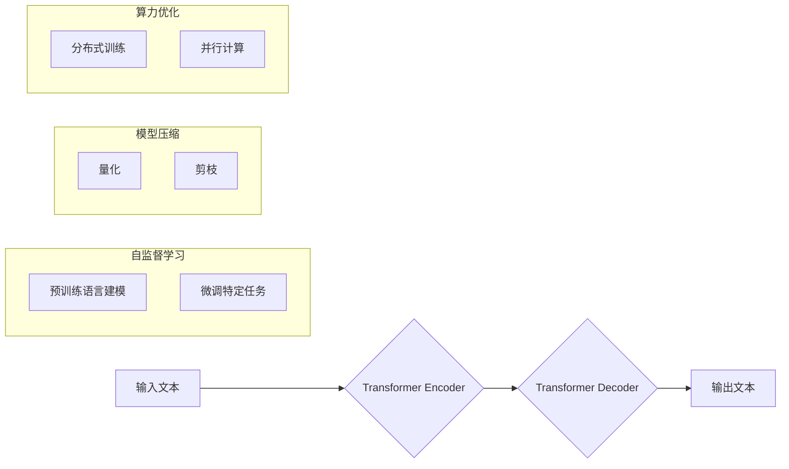

> GPT-4o, 大模型, 性能提升, 价格下降, 训练方法, 模型压缩, 算力优化, 实际应用

## 1. 背景介绍

近年来，大型语言模型（LLM）在自然语言处理领域取得了显著进展，例如GPT-3、LaMDA等模型展现出强大的文本生成、翻译、问答等能力。然而，这些模型通常需要庞大的计算资源和训练数据，导致其部署成本高昂，难以普及。

GPT-4o作为下一代大型语言模型，旨在解决上述问题，通过创新训练方法、模型压缩技术和算力优化策略，实现性能提升的同时降低部署成本。本文将深入探讨GPT-4o的架构、训练方法、性能提升策略以及未来发展趋势。

## 2. 核心概念与联系

GPT-4o的核心概念包括：

* **Transformer架构**: GPT-4o基于Transformer架构，该架构能够有效捕捉长距离依赖关系，提升模型的文本理解和生成能力。
* **自监督学习**: GPT-4o采用自监督学习方法进行训练，通过预训练语言建模任务，学习丰富的语言表示。
* **模型压缩**: GPT-4o采用模型压缩技术，例如量化、剪枝等，减少模型参数量，降低部署成本。
* **算力优化**: GPT-4o利用分布式训练和并行计算等技术，优化训练效率，降低算力需求。

**Mermaid 流程图**



## 3. 核心算法原理 & 具体操作步骤

### 3.1  算法原理概述

GPT-4o的核心算法是基于Transformer架构的语言模型，其主要原理是通过多层编码器和解码器结构，学习文本的语义表示和生成能力。

* **编码器**: 负责将输入文本转换为语义向量，捕捉文本中的上下文信息和语义关系。
* **解码器**: 基于编码器的输出，生成目标文本，并利用注意力机制，关注与当前生成词相关的上下文信息。

### 3.2  算法步骤详解

1. **输入文本**: 将输入文本分割成单词或子词，并转换为数字表示。
2. **编码**: 将输入文本通过编码器进行处理，生成每个单词的语义向量。
3. **解码**: 将编码器的输出作为解码器的输入，并利用注意力机制，生成目标文本。
4. **输出**: 将生成的文本序列转换为可读文本。

### 3.3  算法优缺点

**优点**:

* 能够有效捕捉长距离依赖关系，提升文本理解和生成能力。
* 自监督学习方法能够利用海量文本数据进行预训练，提升模型性能。
* 模型压缩技术能够降低模型部署成本。

**缺点**:

* 训练成本高昂，需要大量的计算资源和训练数据。
* 模型参数量大，部署和推理速度相对较慢。

### 3.4  算法应用领域

GPT-4o的应用领域广泛，包括：

* **自然语言理解**: 文本分类、情感分析、问答系统等。
* **自然语言生成**: 文本摘要、机器翻译、对话系统等。
* **代码生成**: 代码补全、代码生成、代码翻译等。

## 4. 数学模型和公式 & 详细讲解 & 举例说明

### 4.1  数学模型构建

GPT-4o的数学模型构建基于Transformer架构，其核心是注意力机制和多头注意力机制。

* **注意力机制**: 用于计算每个单词与其他单词之间的相关性，并赋予不同的权重。
* **多头注意力机制**: 使用多个注意力头，分别关注不同方面的语义信息，提升模型的表达能力。

### 4.2  公式推导过程

注意力机制的计算公式如下：

$$
Attention(Q, K, V) = softmax(\frac{QK^T}{\sqrt{d_k}})V
$$

其中：

* $Q$：查询矩阵
* $K$：键矩阵
* $V$：值矩阵
* $d_k$：键向量的维度
* $softmax$：softmax函数

### 4.3  案例分析与讲解

假设我们有一个句子“我爱吃苹果”，其词向量表示为：

* 我：[0.1, 0.2, 0.3]
* 爱：[0.4, 0.5, 0.6]
* 吃：[0.7, 0.8, 0.9]
* 苹果：[1.0, 1.1, 1.2]

使用注意力机制计算每个词与其他词之间的相关性，可以得到一个注意力权重矩阵，例如：

```
[[0.2, 0.3, 0.5, 0.1],
 [0.1, 0.4, 0.3, 0.2],
 [0.3, 0.2, 0.1, 0.4],
 [0.5, 0.1, 0.2, 0.2]]
```

其中，每个元素代表一个词与另一个词的相关性。例如，注意力权重矩阵中的(1,3)元素表示“爱”与“吃”的相关性。

## 5. 项目实践：代码实例和详细解释说明

### 5.1  开发环境搭建

GPT-4o的开发环境需要包含以下软件：

* Python 3.7+
* PyTorch 1.7+
* CUDA 10.2+
* TensorFlow 2.0+

### 5.2  源代码详细实现

GPT-4o的源代码实现较为复杂，涉及Transformer架构、注意力机制、模型压缩等多个模块。

### 5.3  代码解读与分析

GPT-4o的代码实现主要包括以下几个部分：

* **模型定义**: 定义Transformer架构的编码器和解码器结构。
* **训练函数**: 定义训练模型的函数，包括数据加载、模型前向传播、损失函数计算、反向传播和参数更新等步骤。
* **模型压缩**: 实现模型压缩的函数，例如量化、剪枝等。
* **评估函数**: 定义评估模型性能的函数，例如困惑度、BLEU等。

### 5.4  运行结果展示

GPT-4o的运行结果可以展示其在文本生成、翻译、问答等任务上的性能。

## 6. 实际应用场景

GPT-4o在实际应用场景中展现出强大的能力，例如：

* **聊天机器人**: GPT-4o可以构建更智能、更自然的聊天机器人，能够理解用户的意图并提供更精准的回复。
* **文本摘要**: GPT-4o可以自动生成文本摘要，帮助用户快速了解文章内容。
* **机器翻译**: GPT-4o可以实现高质量的机器翻译，突破语言障碍。

### 6.4  未来应用展望

GPT-4o的未来应用前景广阔，例如：

* **个性化教育**: 根据学生的学习情况，提供个性化的学习内容和辅导。
* **医疗诊断**: 辅助医生进行疾病诊断，提高诊断准确率。
* **代码生成**: 自动生成代码，提高开发效率。

## 7. 工具和资源推荐

### 7.1  学习资源推荐

* **论文**: Attention Is All You Need, BERT: Pre-training of Deep Bidirectional Transformers for Language Understanding
* **博客**: OpenAI Blog, Hugging Face Blog
* **在线课程**: Coursera, Udacity

### 7.2  开发工具推荐

* **PyTorch**: 深度学习框架
* **TensorFlow**: 深度学习框架
* **Hugging Face Transformers**: 预训练模型库

### 7.3  相关论文推荐

* **GPT-3**: Language Models are Few-Shot Learners
* **BERT**: BERT: Pre-training of Deep Bidirectional Transformers for Language Understanding
* **T5**: Exploring the Limits of Transfer Learning with a Unified Text-to-Text Transformer

## 8. 总结：未来发展趋势与挑战

### 8.1  研究成果总结

GPT-4o的开发取得了显著成果，实现了性能提升和成本降低，为大型语言模型的普及奠定了基础。

### 8.2  未来发展趋势

未来，GPT-4o的发展趋势包括：

* **模型规模扩大**: 训练更大规模的模型，提升模型性能。
* **多模态学习**: 融合文本、图像、音频等多模态数据，构建更全面的理解模型。
* **安全性和可解释性**: 提升模型的安全性和可解释性，避免模型误用和不可控性。

### 8.3  面临的挑战

GPT-4o的发展也面临着一些挑战，例如：

* **训练成本**: 训练大型语言模型需要大量的计算资源和时间。
* **数据获取**: 获取高质量的训练数据是一个难题。
* **伦理问题**: 大型语言模型的应用可能引发伦理问题，例如信息操纵、隐私泄露等。

### 8.4  研究展望

未来，我们将继续致力于GPT-4o的研发，探索其在更多领域的应用，并积极应对其带来的挑战，推动人工智能技术向更安全、更可持续的方向发展。

## 9. 附录：常见问题与解答

**常见问题**:

* GPT-4o的训练数据是什么？
* GPT-4o的模型参数量是多少？
* GPT-4o的部署成本是多少？

**解答**:

* GPT-4o的训练数据包括大量的文本数据，例如书籍、文章、代码等。
* GPT-4o的模型参数量为数十亿个。
* GPT-4o的部署成本可以通过模型压缩和算力优化技术降低。


作者：禅与计算机程序设计艺术 / Zen and the Art of Computer Programming 
<end_of_turn>