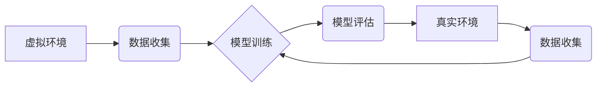

> 自动驾驶, 强化学习, 迁移学习, 虚实环境, 仿真训练, 模型部署

## 1. 背景介绍

自动驾驶技术作为人工智能领域的重要应用之一，近年来取得了显著进展。然而，由于复杂的路况环境和多样的驾驶场景，自动驾驶系统的开发仍然面临着诸多挑战。其中，安全可靠、泛化能力强、适应性好是关键问题。

强化学习（Reinforcement Learning，RL）因其能够学习复杂决策策略的优势，在自动驾驶领域得到了广泛应用。传统的RL方法通常依赖于大量的真实道路数据进行训练，但收集和标注真实数据成本高昂且存在安全风险。

虚实迁移学习（Transfer Learning in Virtual and Real Environments）作为一种新兴的学习范式，旨在利用虚拟环境中的仿真数据来辅助真实环境中的训练，从而降低真实数据需求，提高训练效率和安全性。

## 2. 核心概念与联系

**2.1 强化学习**

强化学习是一种基于交互的机器学习方法，其核心思想是通过奖励机制引导智能体学习最优的策略。

* **智能体 (Agent):** 自动驾驶系统，负责感知环境、做出决策并执行动作。
* **环境 (Environment):** 道路环境，包括车辆、行人、交通信号等。
* **状态 (State):** 智能体感知到的环境信息，例如车辆位置、速度、周围车辆信息等。
* **动作 (Action):** 智能体可以执行的操作，例如加速、减速、转向等。
* **奖励 (Reward):** 环境对智能体动作的反馈，正向奖励表示好的决策，负向奖励表示错误的决策。

**2.2 迁移学习**

迁移学习是指利用已学习到的知识和经验来解决新任务或适应新环境的一种学习范式。

* **源任务 (Source Task):** 训练模型的初始任务，例如在虚拟环境中进行驾驶训练。
* **目标任务 (Target Task):** 需要迁移学习解决的任务，例如在真实道路环境中进行驾驶。

**2.3 虚实迁移学习**

虚实迁移学习是指利用虚拟环境中的仿真数据来辅助真实环境中的训练，从而提高训练效率和安全性。

* **虚拟环境 (Virtual Environment):** 模拟真实道路环境的仿真平台，可以生成大量多样化的驾驶场景。
* **真实环境 (Real Environment):** 真实道路环境，需要部署训练好的自动驾驶系统。

**2.4 架构图**



## 3. 核心算法原理 & 具体操作步骤

### 3.1  算法原理概述

虚实迁移学习算法通常包括以下步骤：

1. **虚拟环境训练:** 在虚拟环境中使用强化学习算法训练模型，收集大量数据并学习驾驶策略。
2. **数据转换:** 将虚拟环境中的数据转换为真实环境的格式，例如将虚拟环境中的传感器数据转换为真实环境的传感器数据。
3. **迁移学习:** 利用虚拟环境中训练的模型作为初始模型，在真实环境中进行少量数据训练，从而提高模型的泛化能力和适应性。

### 3.2  算法步骤详解

1. **虚拟环境搭建:** 建立一个能够模拟真实道路环境的虚拟平台，包括道路、车辆、行人、交通信号等。
2. **强化学习模型训练:** 在虚拟环境中使用强化学习算法，例如深度强化学习（Deep Reinforcement Learning，DRL），训练自动驾驶模型。
3. **数据收集与转换:** 在虚拟环境中收集模型训练过程中产生的数据，并将其转换为真实环境的格式。
4. **迁移学习:** 将虚拟环境中训练的模型作为初始模型，在真实环境中进行少量数据训练，利用迁移学习的机制提高模型的泛化能力。
5. **模型评估与优化:** 在真实环境中评估模型的性能，并根据评估结果进行模型优化和调整。

### 3.3  算法优缺点

**优点:**

* **降低真实数据需求:** 利用虚拟环境中的仿真数据可以减少对真实道路数据的依赖，降低数据收集和标注成本。
* **提高训练效率:** 虚拟环境可以提供大量多样化的驾驶场景，可以加速模型训练速度。
* **提高安全性:** 在虚拟环境中进行训练可以避免真实道路环境中的安全风险。

**缺点:**

* **虚拟环境与真实环境差异:** 虚拟环境与真实环境存在一定的差异，例如传感器噪声、天气条件等，可能导致模型在真实环境中表现不佳。
* **数据转换的复杂性:** 将虚拟环境中的数据转换为真实环境的格式可能存在一定的技术难度。
* **迁移学习效果的限制:** 迁移学习的效果取决于源任务和目标任务之间的相似性，如果两者差异较大，迁移学习效果可能不理想。

### 3.4  算法应用领域

虚实迁移学习算法在自动驾驶领域具有广泛的应用前景，例如：

* **自动驾驶车辆的训练:** 利用虚拟环境中的仿真数据来训练自动驾驶车辆的控制策略。
* **自动驾驶系统的测试和验证:** 在虚拟环境中模拟各种驾驶场景，对自动驾驶系统进行测试和验证。
* **自动驾驶系统的优化和改进:** 利用虚拟环境中的数据分析，对自动驾驶系统的性能进行优化和改进。

## 4. 数学模型和公式 & 详细讲解 & 举例说明

### 4.1  数学模型构建

虚实迁移学习算法通常基于强化学习的数学框架，其核心是寻找最优的策略，使得智能体在环境中获得最大的累积奖励。

**状态空间:** S = {s1, s2, ..., sn}，表示智能体可以感知到的所有环境状态。

**动作空间:** A = {a1, a2, ..., am}，表示智能体可以执行的所有动作。

**奖励函数:** R(s, a)，表示智能体在状态s执行动作a后获得的奖励。

**价值函数:** V(s)，表示智能体在状态s下的期望累积奖励。

**策略函数:** π(s)，表示智能体在状态s下选择动作a的概率。

### 4.2  公式推导过程

强化学习的目标是找到最优策略π*，使得价值函数V(s)最大化。

**Bellman方程:**

$$
V(s) = \max_a \left[ R(s, a) + \gamma \sum_{s'} P(s' | s, a) V(s') \right]
$$

其中，γ是折扣因子，表示未来奖励的权重。

**策略梯度算法:**

$$
\theta_{t+1} = \theta_t + \alpha \nabla_{\theta} J(\theta)
$$

其中，θ是策略网络的参数，α是学习率，J(θ)是策略网络的奖励函数。

### 4.3  案例分析与讲解

假设一个自动驾驶车辆在十字路口处需要决策是否转弯。

* **状态空间:** 包括车辆的位置、速度、周围车辆的信息等。
* **动作空间:** 包括转向左、转向右、直行等。
* **奖励函数:** 奖励车辆安全通过十字路口，惩罚车辆发生碰撞或违反交通规则。

通过强化学习算法，自动驾驶车辆可以学习到最优的决策策略，例如在特定情况下选择转向左，在其他情况下选择直行。

## 5. 项目实践：代码实例和详细解释说明

### 5.1  开发环境搭建

* 操作系统: Ubuntu 20.04
* Python 版本: 3.8
* 深度学习框架: TensorFlow 2.x
* 仿真平台: CARLA

### 5.2  源代码详细实现

```python
# 导入必要的库
import tensorflow as tf
from tensorflow.keras.models import Sequential
from tensorflow.keras.layers import Dense, Flatten

# 定义模型结构
model = Sequential()
model.add(Flatten(input_shape=(sensor_data_shape,)))
model.add(Dense(64, activation='relu'))
model.add(Dense(32, activation='relu'))
model.add(Dense(num_actions, activation='softmax'))

# 编译模型
model.compile(optimizer='adam',
              loss='categorical_crossentropy',
              metrics=['accuracy'])

# 训练模型
model.fit(train_data, train_labels, epochs=10, batch_size=32)

# 评估模型
loss, accuracy = model.evaluate(test_data, test_labels)
print('Loss:', loss)
print('Accuracy:', accuracy)
```

### 5.3  代码解读与分析

* **模型结构:** 代码定义了一个简单的深度神经网络模型，用于预测自动驾驶车辆的动作。
* **输入数据:** 模型的输入数据是传感器数据，例如摄像头图像、雷达数据等。
* **输出数据:** 模型的输出数据是动作概率分布，例如转向左、转向右、直行等动作的概率。
* **训练过程:** 模型使用强化学习算法进行训练，例如策略梯度算法。
* **评估过程:** 模型的性能通过损失函数和准确率进行评估。

### 5.4  运行结果展示

训练完成后，可以将模型部署到自动驾驶车辆中，并进行实际测试。测试结果可以用来评估模型的性能和安全性。

## 6. 实际应用场景

虚实迁移学习算法在自动驾驶领域具有广泛的应用场景，例如：

* **自动驾驶车辆的训练:** 利用虚拟环境中的仿真数据来训练自动驾驶车辆的控制策略。
* **自动驾驶系统的测试和验证:** 在虚拟环境中模拟各种驾驶场景，对自动驾驶系统进行测试和验证。
* **自动驾驶系统的优化和改进:** 利用虚拟环境中的数据分析，对自动驾驶系统的性能进行优化和改进。

### 6.4  未来应用展望

随着虚拟现实技术和人工智能技术的不断发展，虚实迁移学习算法在自动驾驶领域将发挥越来越重要的作用。未来，虚实迁移学习算法可能被应用于以下领域：

* **个性化自动驾驶:** 根据用户的驾驶习惯和偏好，定制个性化的自动驾驶系统。
* **自动驾驶车辆的协同控制:** 利用虚实迁移学习算法，训练自动驾驶车辆之间的协同控制策略，提高交通效率和安全性。
* **自动驾驶车辆的远程操控:** 利用虚实迁移学习算法，实现远程操控自动驾驶车辆，例如在紧急情况下进行远程救援。

## 7. 工具和资源推荐

### 7.1  学习资源推荐

* **书籍:**
    * Reinforcement Learning: An Introduction by Richard S. Sutton and Andrew G. Barto
    * Deep Reinforcement Learning Hands-On by Maxim Lapan
* **在线课程:**
    * Deep Reinforcement Learning Specialization by DeepLearning.AI
    * Reinforcement Learning by David Silver (University of DeepMind)

### 7.2  开发工具推荐

* **仿真平台:** CARLA, Gazebo
* **深度学习框架:** TensorFlow, PyTorch
* **编程语言:** Python

### 7.3  相关论文推荐

* **ICLR 2023:**
    * "Learning to Drive in Diverse Environments with Meta-Reinforcement Learning"
    * "Sim-to-Real Transfer Learning for Autonomous Driving with Domain Adaptation"
* **NeurIPS 2022:**
    * "Towards Robust and Generalizable Autonomous Driving via Meta-Learning"
    * "Learning to Drive in the Real World from Simulated Experience"

## 8. 总结：未来发展趋势与挑战

### 8.1  研究成果总结

虚实迁移学习算法在自动驾驶领域取得了显著进展，能够有效降低真实数据需求，提高训练效率和安全性。

### 8.2  未来发展趋势

* **更逼真的虚拟环境:** 开发更逼真的虚拟环境，能够更好地模拟真实道路环境，提高算法的泛化能力。
* **更有效的迁移学习方法:** 研究更有效的迁移学习方法，能够更好地将虚拟环境中的知识迁移到真实环境中。
* **多模态数据融合:** 利用多模态数据，例如摄像头图像、雷达数据、激光雷达数据等，提高算法