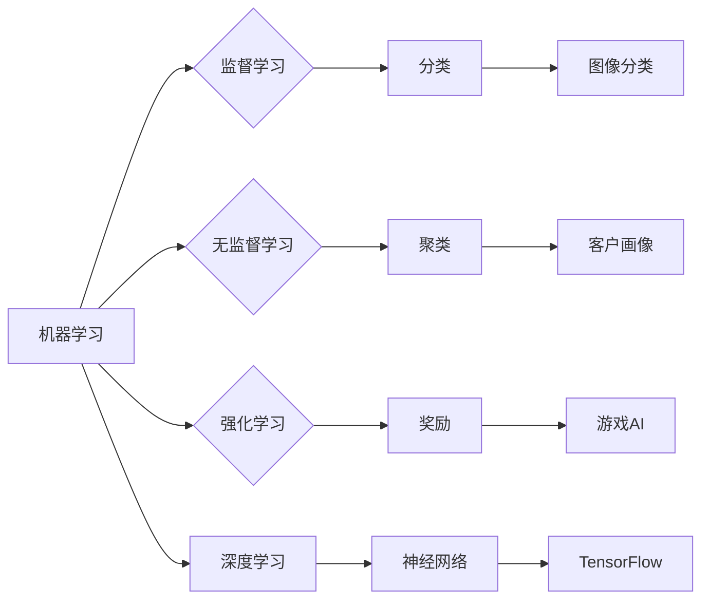

> Python,机器学习,深度学习,TensorFlow,实战,模型,算法,应用

## 1. 背景介绍

在当今数据爆炸的时代，机器学习（Machine Learning）已成为人工智能（Artificial Intelligence）的核心驱动力，并广泛应用于各个领域，例如图像识别、自然语言处理、推荐系统等。Python凭借其简洁易懂的语法、丰富的库和活跃的社区，成为了机器学习和深度学习的首选编程语言。TensorFlow，作为Google开发的开源深度学习框架，提供了强大的计算能力和灵活的模型构建工具，为机器学习研究和应用提供了坚实的基础。

本书旨在为读者提供一个从入门到精通的深度学习学习指南，通过结合理论知识和实战案例，帮助读者掌握Python机器学习和TensorFlow应用的核心技能。

## 2. 核心概念与联系

### 2.1 机器学习概述

机器学习是一种人工智能技术，它通过算法学习数据中的模式和规律，从而能够对新数据进行预测或分类。机器学习算法可以分为监督学习、无监督学习和强化学习三大类。

* **监督学习:**  利用标记数据训练模型，预测输出值。例如，图像分类、文本分类等。
* **无监督学习:**  利用未标记数据发现数据中的隐藏结构和模式。例如，聚类分析、降维等。
* **强化学习:**  通过试错学习，在环境中获得最大奖励。例如，游戏AI、机器人控制等。

### 2.2 深度学习概述

深度学习是机器学习的一个子领域，它利用多层神经网络来模拟人类大脑的学习过程。深度学习模型能够学习更复杂的特征表示，从而在图像识别、自然语言处理等领域取得突破性进展。

### 2.3 TensorFlow概述

TensorFlow是一个开源的机器学习框架，它提供了一套完整的工具和库，用于构建、训练和部署深度学习模型。TensorFlow支持多种编程语言，包括Python、C++和Java。

**核心概念与联系流程图:**

## 3. 核心算法原理 & 具体操作步骤

### 3.1  算法原理概述

本书将介绍一些常用的机器学习算法，例如线性回归、逻辑回归、支持向量机、决策树、随机森林等。这些算法的原理基于统计学和概率论，通过学习数据中的模式和规律，建立数学模型来预测或分类新数据。

### 3.2  算法步骤详解

每个机器学习算法都有其特定的步骤，一般包括以下几个阶段：

1. **数据预处理:**  清洗、转换和规范化数据，使其适合算法训练。
2. **特征工程:**  选择和提取重要的特征，提高模型的预测精度。
3. **模型训练:**  使用训练数据训练模型，调整模型参数。
4. **模型评估:**  使用测试数据评估模型的性能，例如准确率、召回率、F1-score等。
5. **模型调优:**  根据评估结果，调整模型参数或算法结构，提高模型性能。
6. **模型部署:**  将训练好的模型部署到实际应用场景中。

### 3.3  算法优缺点

每个机器学习算法都有其自身的优缺点，需要根据具体应用场景选择合适的算法。例如，线性回归算法简单易懂，但对非线性关系的拟合能力较弱；支持向量机算法能够处理高维数据，但训练时间较长；决策树算法易于解释，但容易过拟合。

### 3.4  算法应用领域

机器学习算法广泛应用于各个领域，例如：

* **图像识别:**  人脸识别、物体检测、图像分类等。
* **自然语言处理:**  文本分类、情感分析、机器翻译等。
* **推荐系统:**  商品推荐、用户画像、个性化服务等。
* **金融领域:**  欺诈检测、风险评估、信用评分等。
* **医疗领域:**  疾病诊断、药物研发、医疗影像分析等。

## 4. 数学模型和公式 & 详细讲解 & 举例说明

### 4.1  数学模型构建

机器学习算法的核心是数学模型，这些模型通过数学公式来描述数据之间的关系。例如，线性回归模型的数学公式如下：

$$y = w_0 + w_1x_1 + w_2x_2 + ... + w_nx_n + \epsilon$$

其中：

* $y$ 是预测值
* $w_0, w_1, w_2, ..., w_n$ 是模型参数
* $x_1, x_2, ..., x_n$ 是输入特征
* $\epsilon$ 是误差项

### 4.2  公式推导过程

机器学习算法的训练过程就是通过优化模型参数，使得模型预测值与真实值之间的误差最小化。常用的优化算法包括梯度下降法、随机梯度下降法、Adam优化器等。这些算法通过迭代更新模型参数，逐步逼近最优解。

### 4.3  案例分析与讲解

以线性回归为例，假设我们想要预测房屋价格，输入特征包括房屋面积、房间数量等。我们可以使用线性回归模型来建立房屋价格与特征之间的关系，并通过训练数据来学习模型参数。

## 5. 项目实践：代码实例和详细解释说明

### 5.1  开发环境搭建

本书将使用Python语言和TensorFlow框架进行开发。读者需要安装Python和TensorFlow，并配置开发环境。

### 5.2  源代码详细实现

本书将提供一些实战案例的源代码，并进行详细的代码解读和分析。例如，我们将实现一个简单的图像分类模型，使用MNIST数据集进行训练和测试。

### 5.3  代码解读与分析

代码解读将重点解释代码的逻辑结构、算法实现和关键参数设置。

### 5.4  运行结果展示

我们将展示模型训练和测试的结果，包括准确率、损失函数等指标，并分析模型的性能。

## 6. 实际应用场景

### 6.1  图像识别

深度学习在图像识别领域取得了突破性进展，例如人脸识别、物体检测、图像分类等。

### 6.2  自然语言处理

深度学习也广泛应用于自然语言处理领域，例如文本分类、情感分析、机器翻译等。

### 6.3  推荐系统

深度学习可以用于构建更精准的推荐系统，例如商品推荐、用户画像、个性化服务等。

### 6.4  未来应用展望

深度学习的应用前景广阔，未来将应用于更多领域，例如医疗诊断、自动驾驶、金融风险评估等。

## 7. 工具和资源推荐

### 7.1  学习资源推荐

* **书籍:**
    * 《Python机器学习实战》
    * 《深度学习》
    * 《TensorFlow实战》
* **在线课程:**
    * Coursera
    * edX
    * Udacity
* **博客和论坛:**
    * TensorFlow官方博客
    * Kaggle

### 7.2  开发工具推荐

* **Python:**  Python编程语言
* **TensorFlow:**  深度学习框架
* **Jupyter Notebook:**  交互式编程环境
* **Git:**  版本控制系统

### 7.3  相关论文推荐

* **AlexNet:**  ImageNet Classification with Deep Convolutional Neural Networks
* **VGGNet:**  Very Deep Convolutional Networks for Large-Scale Image Recognition
* **ResNet:**  Deep Residual Learning for Image Recognition

## 8. 总结：未来发展趋势与挑战

### 8.1  研究成果总结

深度学习在过去几年取得了显著进展，在图像识别、自然语言处理等领域取得了突破性成果。

### 8.2  未来发展趋势

* **模型更深更广:**  研究更深层次、更广范围的深度学习模型。
* **数据更丰富更有效:**  探索新的数据来源和数据增强技术，提高模型训练效率。
* **算法更智能更灵活:**  研究更智能、更灵活的深度学习算法，例如自监督学习、强化学习等。
* **应用更广泛更深入:**  将深度学习应用于更多领域，例如医疗诊断、自动驾驶、金融风险评估等。

### 8.3  面临的挑战

* **数据隐私和安全:**  深度学习模型训练需要大量数据，如何保护数据隐私和安全是一个重要挑战。
* **模型解释性和可信度:**  深度学习模型的决策过程往往难以解释，如何提高模型的解释性和可信度是一个关键问题。
* **计算资源和能源消耗:**  训练大型深度学习模型需要大量的计算资源和能源，如何降低计算成本和能源消耗是一个重要的研究方向。

### 8.4  研究展望

未来，深度学习将继续朝着更智能、更安全、更可解释的方向发展，并将在更多领域发挥重要作用。

## 9. 附录：常见问题与解答

### 9.1  常见问题

* 如何选择合适的机器学习算法？
* 如何进行数据预处理？
* 如何进行模型评估和调优？
* 如何部署深度学习模型？

### 9.2  解答

本书将提供对常见问题的解答，并提供一些实践建议。

作者：禅与计算机程序设计艺术 / Zen and the Art of Computer Programming

<end_of_turn>