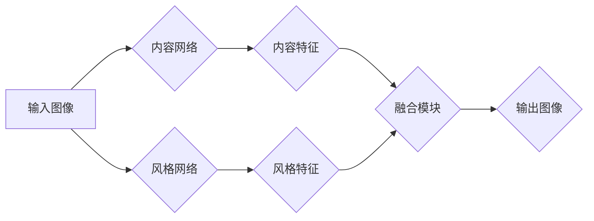

> 深度学习，风格迁移，神经网络，卷积神经网络，生成对抗网络，Python，图像处理

## 1. 背景介绍

在数字时代，图像处理技术日益发展，人们对图像的个性化需求也越来越高。风格迁移技术，作为一种图像处理方法，能够将一幅图像的风格迁移到另一幅图像上，从而创造出具有独特艺术感的图像。例如，将一张照片的风格迁移到梵高的画作风格上，或者将一张风景照的风格迁移到印象派风格上，都能产生令人惊叹的效果。

风格迁移技术在艺术创作、图像编辑、电影特效等领域有着广泛的应用前景。近年来，随着深度学习技术的快速发展，风格迁移技术取得了显著的进展。基于深度学习的风格迁移网络能够实现更逼真的风格迁移效果，并具有更高的效率和灵活性。

## 2. 核心概念与联系

### 2.1  风格迁移网络

风格迁移网络是一种特殊的深度学习网络，其核心目的是将一幅图像的内容与另一幅图像的风格融合在一起。

**网络架构:**

风格迁移网络通常由两个主要的网络组成：

* **内容网络 (Content Network):** 负责提取图像的内容特征，例如物体、场景等。
* **风格网络 (Style Network):** 负责提取图像的风格特征，例如颜色、纹理、构图等。

网络的训练目标是找到一个权重，使得生成的图像既保留了原始图像的内容，又融合了目标图像的风格。

**Mermaid 流程图:**



### 2.2  卷积神经网络 (CNN)

卷积神经网络 (CNN) 是一种专门用于处理图像数据的深度学习网络。CNN 利用卷积操作和池化操作来提取图像特征，并具有强大的图像识别和分类能力。

### 2.3  生成对抗网络 (GAN)

生成对抗网络 (GAN) 是一种由两个网络组成的对抗性学习框架。其中，生成器网络负责生成新的数据，而判别器网络负责判断数据是否为真实数据。GAN 通过对抗训练的方式，使得生成器网络能够生成越来越逼真的数据。

## 3. 核心算法原理 & 具体操作步骤

### 3.1  算法原理概述

风格迁移网络的训练过程可以概括为以下步骤：

1. **输入图像预处理:** 将输入图像进行尺寸调整和归一化处理。
2. **提取内容和风格特征:** 使用内容网络和风格网络分别提取输入图像的内容特征和风格特征。
3. **风格迁移:** 将目标图像的风格特征与输入图像的内容特征融合在一起，生成新的图像特征。
4. **图像重建:** 将新的图像特征解码成最终的输出图像。

### 3.2  算法步骤详解

1. **数据准备:** 首先需要准备两组图像数据：一组用于训练内容网络和风格网络，另一组用于测试风格迁移效果。

2. **网络训练:** 使用梯度下降算法训练风格迁移网络。训练目标是使生成的图像既保留了原始图像的内容，又融合了目标图像的风格。

3. **风格迁移:** 将待迁移图像输入到训练好的风格迁移网络中，即可生成具有目标图像风格的图像。

### 3.3  算法优缺点

**优点:**

* **效果逼真:** 基于深度学习的风格迁移网络能够实现更逼真的风格迁移效果。
* **灵活多样:** 可以迁移多种风格的图像，例如绘画风格、摄影风格、抽象风格等。
* **效率高:** 训练好的风格迁移网络可以快速生成风格迁移图像。

**缺点:**

* **训练复杂:** 训练风格迁移网络需要大量的计算资源和时间。
* **参数调整:** 需要对网络参数进行仔细调整，才能获得最佳的风格迁移效果。
* **内容失真:** 在某些情况下，风格迁移可能会导致图像内容的失真。

### 3.4  算法应用领域

风格迁移技术在以下领域有着广泛的应用前景：

* **艺术创作:** 艺术家可以使用风格迁移技术创作出具有独特艺术风格的图像。
* **图像编辑:** 用户可以使用风格迁移技术将照片的风格迁移到其他风格上，例如将照片的风格迁移到油画风格上。
* **电影特效:** 电影制作人员可以使用风格迁移技术创建具有特定风格的场景和特效。
* **游戏开发:** 游戏开发人员可以使用风格迁移技术为游戏角色和场景添加不同的风格。

## 4. 数学模型和公式 & 详细讲解 & 举例说明

### 4.1  数学模型构建

风格迁移网络的数学模型主要基于卷积神经网络 (CNN) 和生成对抗网络 (GAN) 的原理。

**内容损失函数:**

$$L_{content} = ||F_{content}(I) - F_{content}(G)||^2$$

其中，$I$ 是输入图像，$G$ 是生成的图像，$F_{content}$ 是内容网络的特征提取函数。

**风格损失函数:**

$$L_{style} = \sum_{i} \frac{1}{N_i} ||F_{style}^i(I) - F_{style}^i(G)||^2$$

其中，$F_{style}^i$ 是风格网络的第 $i$ 层特征提取函数，$N_i$ 是第 $i$ 层特征图的数量。

**总损失函数:**

$$L = L_{content} + \lambda L_{style}$$

其中，$\lambda$ 是权重参数，用于平衡内容损失和风格损失。

### 4.2  公式推导过程

**内容损失函数:**

内容损失函数衡量生成的图像与输入图像在内容特征上的差异。

**风格损失函数:**

风格损失函数衡量生成的图像与目标图像在风格特征上的差异。

**总损失函数:**

总损失函数是内容损失和风格损失的加权和，用于指导风格迁移网络的训练。

### 4.3  案例分析与讲解

假设我们想要将一张照片的风格迁移到梵高的画作风格上。

1. 我们需要找到一幅梵高的画作作为目标图像。
2. 我们需要训练一个风格迁移网络，并使用该网络将照片的风格迁移到梵高的画作风格上。
3. 在训练过程中，我们会使用内容损失函数和风格损失函数来指导网络的训练。
4. 训练完成后，我们可以使用该网络将任意照片的风格迁移到梵高的画作风格上。

## 5. 项目实践：代码实例和详细解释说明

### 5.1  开发环境搭建

* Python 3.6+
* TensorFlow 或 PyTorch 深度学习框架
* OpenCV 图像处理库
* Jupyter Notebook 或 VS Code 代码编辑器

### 5.2  源代码详细实现

```python
import tensorflow as tf
from tensorflow.keras.layers import Input, Conv2D, MaxPooling2D, UpSampling2D
from tensorflow.keras.models import Model

# 定义内容网络
def build_content_network():
    input_tensor = Input(shape=(224, 224, 3))
    x = Conv2D(64, (3, 3), activation='relu')(input_tensor)
    x = MaxPooling2D((2, 2))(x)
    x = Conv2D(128, (3, 3), activation='relu')(x)
    x = MaxPooling2D((2, 2))(x)
    x = Conv2D(256, (3, 3), activation='relu')(x)
    x = MaxPooling2D((2, 2))(x)
    x = Conv2D(512, (3, 3), activation='relu')(x)
    x = MaxPooling2D((2, 2))(x)
    content_output = Conv2D(64, (3, 3), activation='relu')(x)
    return Model(inputs=input_tensor, outputs=content_output)

# 定义风格网络
def build_style_network():
    input_tensor = Input(shape=(224, 224, 3))
    x = Conv2D(64, (3, 3), activation='relu')(input_tensor)
    x = MaxPooling2D((2, 2))(x)
    x = Conv2D(128, (3, 3), activation='relu')(x)
    x = MaxPooling2D((2, 2))(x)
    x = Conv2D(256, (3, 3), activation='relu')(x)
    x = MaxPooling2D((2, 2))(x)
    x = Conv2D(512, (3, 3), activation='relu')(x)
    x = MaxPooling2D((2, 2))(x)
    style_output = Conv2D(64, (3, 3), activation='relu')(x)
    return Model(inputs=input_tensor, outputs=style_output)

# 定义风格迁移网络
def build_style_transfer_network():
    content_network = build_content_network()
    style_network = build_style_network()

    # ... (其他网络结构和训练代码)

    return style_transfer_network

# ... (训练和测试代码)
```

### 5.3  代码解读与分析

* **内容网络和风格网络:** 代码中定义了两个网络，分别用于提取图像的内容特征和风格特征。
* **风格迁移网络:** 将内容网络和风格网络结合起来，构建了风格迁移网络。
* **损失函数:** 使用内容损失函数和风格损失函数来指导网络的训练。
* **训练和测试:** 代码中包含了训练和测试风格迁移网络的代码。

### 5.4  运行结果展示

运行代码后，可以将输入图像的风格迁移到目标图像的风格上，生成具有独特艺术感的图像。

## 6. 实际应用场景

### 6.1  艺术创作

艺术家可以使用风格迁移技术创作出具有独特艺术风格的图像。例如，可以将照片的风格迁移到梵高的画作风格上，或者将照片的风格迁移到毕加索的画作风格上。

### 6.2  图像编辑

用户可以使用风格迁移技术将照片的风格迁移到其他风格上，例如将照片的风格迁移到油画风格上，或者将照片的风格迁移到水彩画风格上。

### 6.3  电影特效

电影制作人员可以使用风格迁移技术创建具有特定风格的场景和特效。例如，可以将电影场景的风格迁移到黑白电影风格上，或者将电影场景的风格迁移到卡通风格上。

### 6.4  未来应用展望

风格迁移技术在未来将有更广泛的应用前景，例如：

* **个性化定制:** 用户可以根据自己的喜好，将照片的风格迁移到不同的艺术风格上，创建个性化的图像作品。
* **虚拟现实和增强现实:** 风格迁移技术可以用于增强虚拟现实和增强现实体验，例如将虚拟场景的风格迁移到现实世界的风格上。
* **医疗图像分析:** 风格迁移技术可以用于将医学图像的风格迁移到更易于理解的风格上，帮助医生进行诊断和治疗。

## 7. 工具和资源推荐

### 7.1  学习资源推荐

* **书籍:**
    * 《深度学习》 - Ian Goodfellow, Yoshua Bengio, Aaron Courville
    * 《Python深度学习》 - Francois Chollet
* **在线课程:**
    * Coursera: 深度学习 Specialization
    * Udacity: Deep Learning Nanodegree
* **博客和网站:**
    * TensorFlow Blog: https://blog.tensorflow.org/
    * PyTorch Blog: https://pytorch.org/blog/

### 7.2  开发工具推荐

* **深度学习框架:** TensorFlow, PyTorch
* **图像处理库:** OpenCV
* **代码编辑器:** Jupyter Notebook, VS Code

### 7.3  相关论文推荐

* **《