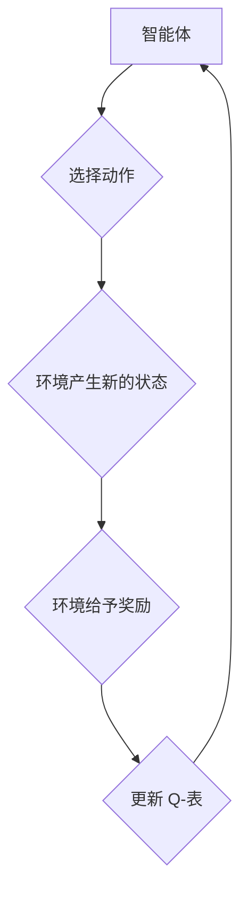

> Q-Learning,强化学习,算法原理,代码实现,机器学习,深度学习

## 1. 背景介绍

在机器学习领域，强化学习 (Reinforcement Learning, RL) 作为一种重要的学习范式，近年来取得了显著进展，并在许多应用场景中展现出强大的能力。强化学习的核心思想是通过智能体与环境的交互，学习最优的策略，以最大化累积的奖励。

Q-Learning 作为强化学习中最经典的算法之一，其核心在于学习一个 Q-表，该表存储了智能体在每个状态下采取每个动作的期望回报。通过不断与环境交互，Q-表会逐渐更新，最终学习出最优策略。

## 2. 核心概念与联系

**2.1 核心概念**

* **智能体 (Agent):**  与环境交互并采取行动的实体。
* **环境 (Environment):** 智能体所处的外部世界，会根据智能体的行动产生新的状态和奖励。
* **状态 (State):** 环境的当前描述，例如游戏中的棋盘状态。
* **动作 (Action):** 智能体在特定状态下可以采取的行动，例如在游戏中移动棋子。
* **奖励 (Reward):** 环境对智能体采取的行动给予的反馈，可以是正向奖励或负向惩罚。
* **策略 (Policy):**  智能体在不同状态下选择动作的规则。
* **价值函数 (Value Function):**  评估智能体在特定状态下采取特定动作的长期回报。

**2.2  Q-Learning 的工作原理**

Q-Learning 算法通过迭代更新 Q-表，最终学习出最优策略。



## 3. 核心算法原理 & 具体操作步骤

### 3.1  算法原理概述

Q-Learning 算法的核心思想是通过最大化期望回报来更新 Q-表。

* **Q-表:**  一个表格，存储了智能体在每个状态下采取每个动作的期望回报。
* **Bellman 方程:**  Q-Learning 算法使用 Bellman 方程来更新 Q-表。Bellman 方程描述了在当前状态下采取某个动作的期望回报与未来状态的期望回报之间的关系。

### 3.2  算法步骤详解

1. **初始化 Q-表:** 将 Q-表中的所有值初始化为 0 或一个小随机数。
2. **选择动作:**  根据当前状态和策略选择一个动作。
3. **执行动作:**  在环境中执行选择的动作。
4. **观察奖励和下一个状态:**  观察环境产生的奖励和下一个状态。
5. **更新 Q-表:**  使用 Bellman 方程更新 Q-表中的值。
6. **重复步骤 2-5:**  重复上述步骤，直到达到终止条件。

### 3.3  算法优缺点

**优点:**

* 能够学习最优策略。
* 适用于离散状态和动作空间。
* 算法相对简单易懂。

**缺点:**

* 学习过程可能很慢。
* 对于连续状态和动作空间，需要进行一些技巧性的处理。

### 3.4  算法应用领域

Q-Learning 算法在许多领域都有应用，例如：

* **游戏 AI:**  学习玩游戏的最优策略。
* **机器人控制:**  学习控制机器人的运动。
* **推荐系统:**  学习推荐用户感兴趣的内容。
* **金融交易:**  学习制定最优的交易策略。

## 4. 数学模型和公式 & 详细讲解 & 举例说明

### 4.1  数学模型构建

Q-Learning 算法的核心是 Q-表，它是一个状态-动作对的映射，每个映射值代表智能体在该状态下采取该动作的期望回报。

* **状态空间:**  S = {s1, s2, ..., sn}
* **动作空间:**  A = {a1, a2, ..., am}
* **Q-表:**  Q(s, a)

### 4.2  公式推导过程

Q-Learning 算法使用 Bellman 方程来更新 Q-表。Bellman 方程如下：

$$Q(s, a) = Q(s, a) + \alpha [r + \gamma \max_{a'} Q(s', a') - Q(s, a)]$$

其中：

* **α:** 学习率，控制学习速度。
* **γ:** 折扣因子，控制未来奖励的权重。
* **r:**  在状态 s 下采取动作 a 得到的奖励。
* **s':**  在状态 s 下采取动作 a 之后到达的状态。
* **a':**  在状态 s' 下选择的最优动作。

### 4.3  案例分析与讲解

假设有一个简单的环境，智能体可以采取两种动作：向上和向下。

* 状态空间: S = {s1, s2}
* 动作空间: A = {up, down}

Q-表初始化为：

| 状态 | 向上 | 向下 |
|---|---|---|
| s1 | 0 | 0 |
| s2 | 0 | 0 |

智能体在状态 s1 下采取向上动作，得到奖励 r = 1，并到达状态 s2。

根据 Bellman 方程，更新 Q(s1, up)：

$$Q(s1, up) = 0 + \alpha [1 + \gamma \max_{a'} Q(s2, a') - 0]$$

假设学习率 α = 0.1，折扣因子 γ = 0.9。

则 Q(s1, up) = 0.1 * (1 + 0.9 * max(Q(s2, up), Q(s2, down)))

## 5. 项目实践：代码实例和详细解释说明

### 5.1  开发环境搭建

* Python 3.x
* NumPy
* Matplotlib

### 5.2  源代码详细实现

```python
import numpy as np

class QLearningAgent:
    def __init__(self, state_space, action_space, learning_rate=0.1, discount_factor=0.9):
        self.state_space = state_space
        self.action_space = action_space
        self.learning_rate = learning_rate
        self.discount_factor = discount_factor
        self.q_table = np.zeros((len(state_space), len(action_space)))

    def choose_action(self, state):
        return np.argmax(self.q_table[state])

    def update_q_table(self, state, action, reward, next_state):
        max_q_next = np.max(self.q_table[next_state])
        self.q_table[state, action] += self.learning_rate * (reward + self.discount_factor * max_q_next - self.q_table[state, action])

# 示例使用
state_space = [0, 1]
action_space = [0, 1]
agent = QLearningAgent(state_space, action_space)

# ... 训练过程 ...

```

### 5.3  代码解读与分析

* **`QLearningAgent` 类:**  定义了 Q-Learning 智能体的核心逻辑。
* **`__init__` 方法:**  初始化 Q-表和学习参数。
* **`choose_action` 方法:**  根据当前状态选择最优动作。
* **`update_q_table` 方法:**  根据 Bellman 方程更新 Q-表。

### 5.4  运行结果展示

训练完成后，可以观察 Q-表的更新情况，并测试智能体在环境中的表现。

## 6. 实际应用场景

Q-Learning 算法在许多实际应用场景中都有应用，例如：

* **游戏 AI:**  学习玩游戏的最优策略，例如 AlphaGo 学习围棋。
* **机器人控制:**  学习控制机器人的运动，例如学习机器人如何导航。
* **推荐系统:**  学习推荐用户感兴趣的内容，例如 Netflix 的推荐系统。
* **金融交易:**  学习制定最优的交易策略，例如自动交易系统。

### 6.4  未来应用展望

随着人工智能技术的不断发展，Q-Learning 算法的应用场景将会更加广泛。例如：

* **自动驾驶:**  学习控制自动驾驶汽车。
* **医疗诊断:**  学习辅助医生进行疾病诊断。
* **个性化教育:**  学习为每个学生提供个性化的学习方案。

## 7. 工具和资源推荐

### 7.1  学习资源推荐

* **书籍:**
    * Reinforcement Learning: An Introduction by Richard S. Sutton and Andrew G. Barto
    * Deep Reinforcement Learning Hands-On by Maxim Lapan
* **在线课程:**
    * Coursera: Reinforcement Learning Specialization
    * Udacity: Deep Reinforcement Learning Nanodegree

### 7.2  开发工具推荐

* **OpenAI Gym:**  一个用于强化学习研究的开源库。
* **TensorFlow:**  一个用于深度学习的开源库。
* **PyTorch:**  另一个用于深度学习的开源库。

### 7.3  相关论文推荐

* **Playing Atari with Deep Reinforcement Learning** by Mnih et al. (2013)
* **Deep Q-Network** by Mnih et al. (2015)
* **Asynchronous Methods for Deep Reinforcement Learning** by Mnih et al. (2016)

## 8. 总结：未来发展趋势与挑战

### 8.1  研究成果总结

Q-Learning 算法作为强化学习领域的重要算法，取得了显著的成果，在许多应用场景中展现出强大的能力。

### 8.2  未来发展趋势

* **深度强化学习:**  将深度神经网络与 Q-Learning 算法结合，提高算法的学习能力和泛化能力。
* **离线强化学习:**  利用离线数据进行强化学习，减少对环境交互的需求。
* **多智能体强化学习:**  研究多个智能体在同一个环境中交互学习的算法。

### 8.3  面临的挑战

* **样本效率:**  强化学习算法通常需要大量的样本数据进行训练，这在现实应用中可能是一个挑战。
* **探索与利用的平衡:**  强化学习算法需要在探索新策略和利用已知策略之间找到平衡。
* **安全性和可解释性:**  强化学习算法的决策过程可能难以解释，这在一些安全关键的应用场景中是一个问题。

### 8.4  研究展望

未来，强化学习领域将继续朝着更智能、更安全、更可解释的方向发展。Q-Learning 算法作为强化学习的基础，也将继续在未来发展中发挥重要作用。

## 9. 附录：常见问题与解答

* **Q-Learning 和 SARSA 的区别:**  Q-Learning 是基于最优策略更新 Q-表，而 SARSA 是基于当前策略更新 Q-表。
* **如何选择学习率和折扣因子:**  学习率和折扣因子是 Q-Learning 算法的重要参数，需要根据具体应用场景进行调整。
* **如何处理连续状态和动作空间:**  对于连续状态和动作空间，需要使用一些技巧，例如将状态和动作离散化或使用函数逼近。


作者：禅与计算机程序设计艺术 / Zen and the Art of Computer Programming 
<end_of_turn>