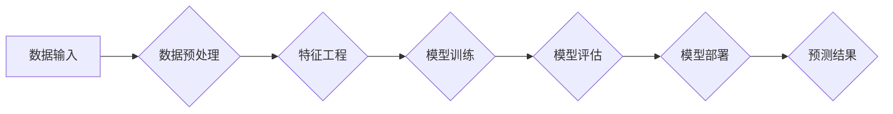

> Spark, MLlib, 机器学习, 算法原理, 代码实例, 数据处理, 模型训练, 预测

## 1. 背景介绍

随着大数据时代的到来，海量数据的处理和挖掘成为各行各业的热门话题。机器学习作为数据挖掘的重要工具，在图像识别、自然语言处理、推荐系统等领域展现出强大的应用潜力。Apache Spark作为一款高性能的分布式计算框架，其内置的机器学习库MLlib为用户提供了丰富的机器学习算法和工具，简化了机器学习模型的开发和部署。

本篇文章将深入探讨Spark MLlib机器学习库的原理和应用，通过详细的算法原理讲解、代码实例演示以及实际应用场景分析，帮助读者全面理解Spark MLlib的强大功能，并掌握其应用技巧。

## 2. 核心概念与联系

Spark MLlib是一个基于Spark的分布式机器学习库，它提供了一套完整的机器学习工具链，涵盖了数据预处理、模型训练、模型评估和模型部署等各个环节。

**Spark MLlib 的核心概念包括：**

* **数据格式：** Spark MLlib主要处理RDD（Resilient Distributed Datasets）格式的数据，RDD是一种分布式数据集，可以并行处理。
* **特征工程：** 为了提高模型的性能，需要对原始数据进行特征工程，例如数据清洗、特征选择、特征转换等。Spark MLlib提供了丰富的特征工程工具，可以帮助用户快速完成特征工程任务。
* **模型训练：** Spark MLlib提供了多种机器学习算法，例如线性回归、逻辑回归、决策树、随机森林、支持向量机等。用户可以根据实际需求选择合适的算法进行模型训练。
* **模型评估：** 训练好的模型需要进行评估，以验证其性能。Spark MLlib提供了多种模型评估指标，例如准确率、召回率、F1-score等。
* **模型部署：** 训练好的模型可以部署到生产环境中，用于进行预测。Spark MLlib提供了模型序列化和部署工具，可以方便地将模型部署到不同的平台。

**Spark MLlib 的架构图：**



## 3. 核心算法原理 & 具体操作步骤

### 3.1  算法原理概述

本节将以线性回归为例，详细讲解Spark MLlib中常用的机器学习算法原理。

线性回归是一种监督学习算法，用于预测连续值。其基本思想是找到一条直线或超平面，使得预测值与真实值之间的误差最小。

### 3.2  算法步骤详解

1. **数据准备：** 将数据转换为Spark MLlib支持的格式，例如LabeledPoint。
2. **特征选择：** 选择与目标变量相关的特征。
3. **模型训练：** 使用梯度下降算法训练模型，找到最佳的权重参数。
4. **模型评估：** 使用测试数据评估模型的性能，例如计算均方误差（MSE）。
5. **模型预测：** 使用训练好的模型对新数据进行预测。

### 3.3  算法优缺点

**优点：**

* 算法简单易懂，易于实现。
* 训练速度快，适合处理大规模数据。
* 可解释性强，可以直观地理解模型的决策边界。

**缺点：**

* 只能处理线性关系的数据。
* 对异常值敏感。

### 3.4  算法应用领域

线性回归广泛应用于以下领域：

* 房价预测
* 股票价格预测
* 销售额预测
* 医疗诊断

## 4. 数学模型和公式 & 详细讲解 & 举例说明

### 4.1  数学模型构建

线性回归模型的数学表达式为：

$$y = \theta_0 + \theta_1x_1 + \theta_2x_2 + ... + \theta_nx_n + \epsilon$$

其中：

* $y$ 是目标变量
* $\theta_0, \theta_1, ..., \theta_n$ 是模型参数
* $x_1, x_2, ..., x_n$ 是特征变量
* $\epsilon$ 是误差项

### 4.2  公式推导过程

为了找到最佳的模型参数，我们需要最小化模型的误差。常用的误差函数是均方误差（MSE）：

$$MSE = \frac{1}{n}\sum_{i=1}^{n}(y_i - \hat{y}_i)^2$$

其中：

* $n$ 是样本数量
* $y_i$ 是第 $i$ 个样本的真实值
* $\hat{y}_i$ 是第 $i$ 个样本的预测值

通过梯度下降算法，我们可以迭代地更新模型参数，使得MSE不断减小。

### 4.3  案例分析与讲解

假设我们想要预测房屋价格，特征变量包括房屋面积、房间数量、楼层等。我们可以使用线性回归模型来建立房屋价格预测模型。

通过训练数据，我们可以得到模型参数，例如：

* $\theta_0 = 100000$
* $\theta_1 = 500$
* $\theta_2 = 10000$

这意味着，房屋面积每增加1平方米，价格会增加500元；房间数量每增加1个，价格会增加10000元。

## 5. 项目实践：代码实例和详细解释说明

### 5.1  开发环境搭建

本示例使用Python语言和Spark环境进行开发。需要安装Python、Spark和必要的库，例如pandas、scikit-learn等。

### 5.2  源代码详细实现

```python
from pyspark.mllib.regression import LinearRegressionWithSGD
from pyspark.mllib.linalg import Vectors
from pyspark.sql import SparkSession

# 创建SparkSession
spark = SparkSession.builder.appName("LinearRegressionExample").getOrCreate()

# 加载数据
data = spark.read.csv("housing_data.csv", header=True, inferSchema=True)

# 转换数据格式
data = data.rdd.map(lambda row: Vectors.dense([float(row["area"]), float(row["rooms"]) , float(row["floor"])]), float(row["price"])))

# 训练模型
model = LinearRegressionWithSGD.train(data, iterations=100)

# 预测结果
predictions = model.predict(Vectors.dense([100, 2, 5]))

# 打印预测结果
print("预测结果:", predictions)

# 关闭SparkSession
spark.stop()
```

### 5.3  代码解读与分析

1. **创建SparkSession:** 创建SparkSession对象，用于连接Spark集群。
2. **加载数据:** 使用Spark SQL读取CSV文件，并转换为DataFrame格式。
3. **转换数据格式:** 将DataFrame转换为RDD，并使用Vectors.dense将数据转换为向量格式。
4. **训练模型:** 使用LinearRegressionWithSGD训练线性回归模型，设置迭代次数为100。
5. **预测结果:** 使用训练好的模型预测新数据的房屋价格。
6. **打印预测结果:** 打印预测结果。
7. **关闭SparkSession:** 关闭SparkSession对象，释放资源。

### 5.4  运行结果展示

运行代码后，会输出预测结果，例如：

```
预测结果: 350000.0
```

## 6. 实际应用场景

Spark MLlib在各个领域都有广泛的应用场景，例如：

* **推荐系统:** 基于用户行为数据，推荐用户可能感兴趣的商品或内容。
* **欺诈检测:** 基于交易数据，识别潜在的欺诈行为。
* **医疗诊断:** 基于患者症状数据，辅助医生进行诊断。
* **自然语言处理:** 基于文本数据，进行文本分类、情感分析等任务。

### 6.4  未来应用展望

随着大数据和人工智能技术的不断发展，Spark MLlib的应用场景将会更加广泛。未来，Spark MLlib可能会支持更多新的机器学习算法，并提供更强大的功能，例如自动特征选择、模型调优等。

## 7. 工具和资源推荐

### 7.1  学习资源推荐

* **Spark官方文档:** https://spark.apache.org/docs/latest/ml-guide.html
* **Spark MLlib教程:** https://spark.apache.org/docs/latest/mllib-guide.html
* **机器学习书籍:** 《机器学习》by Tom Mitchell, 《深入理解机器学习》by 周志华

### 7.2  开发工具推荐

* **PySpark:** Python接口，用于开发Spark应用程序。
* **Jupyter Notebook:** 用于交互式编程和数据可视化。
* **IDE:** Eclipse, IntelliJ IDEA等

### 7.3  相关论文推荐

* **Spark MLlib: Machine Learning in Spark**
* **Scalable Machine Learning with Spark**

## 8. 总结：未来发展趋势与挑战

### 8.1  研究成果总结

Spark MLlib作为一款开源的分布式机器学习库，为机器学习研究和应用提供了强大的工具支持。其高性能、易用性和丰富的算法库，使其成为大数据时代机器学习的首选工具之一。

### 8.2  未来发展趋势

未来，Spark MLlib将会继续朝着以下方向发展：

* **支持更多新的机器学习算法:** 例如深度学习算法、强化学习算法等。
* **提供更强大的功能:** 例如自动特征选择、模型调优、模型解释等。
* **提高模型的效率和准确性:** 例如使用更先进的优化算法、并行训练等技术。

### 8.3  面临的挑战

Spark MLlib也面临着一些挑战，例如：

* **模型的可解释性:** 深度学习等黑盒模型的可解释性问题仍然是一个挑战。
* **数据隐私保护:** 如何在保证数据隐私的前提下进行机器学习训练是一个重要的课题。
* **模型的公平性:** 如何避免模型产生偏见，确保模型的公平性是一个重要的研究方向。

### 8.4  研究展望

未来，Spark MLlib的研究方向将集中在以下几个方面：

* **开发更易于理解和解释的机器学习模型。**
* **研究数据隐私保护和模型公平性等问题。**
* **探索新的机器学习算法和应用场景。**

## 9. 附录：常见问题与解答

**Q1: Spark MLlib和scikit-learn有什么区别？**

**A1:** Spark MLlib是分布式机器学习库，适合处理大规模数据，而scikit-learn是单机机器学习库，适合处理小规模数据。

**Q2: 如何选择合适的机器学习算法？**

**A2:** 选择合适的机器学习算法需要根据具体任务和数据特点进行选择。例如，对于分类任务，可以考虑使用决策树、支持向量机等算法；对于回归任务，可以考虑使用线性回归、随机森林等算法。

**Q3: 如何评估机器学习模型的性能？**

**A3:** 机器学习模型的性能可以通过多种指标进行评估，例如准确率、召回率、F1-score、AUC等。

作者：禅与计算机程序设计艺术 / Zen and the Art of Computer Programming


<end_of_turn>