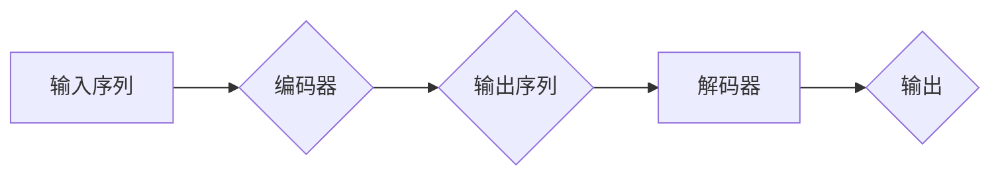

> Transformer, 编码器-解码器, 自注意力机制, 多头注意力, 位置编码, BERT, GPT

## 1. 背景介绍

自然语言处理 (NLP) 领域一直以来都致力于让计算机能够理解和生成人类语言。传统的基于循环神经网络 (RNN) 的模型在处理长文本序列时存在着梯度消失和训练速度慢等问题。2017 年，谷歌发布了基于 Transformer 架构的论文《Attention Is All You Need》，彻底改变了 NLP 领域的发展方向。Transformer 摒弃了 RNN 的循环结构，引入了自注意力机制，使得模型能够并行处理文本序列，大幅提升了训练效率和性能。

## 2. 核心概念与联系

Transformer 的核心思想是利用自注意力机制来捕捉文本序列中词语之间的关系。它将编码器-解码器结构应用于 NLP 任务，并通过多头注意力机制和位置编码等技术，有效地解决了传统 RNN 模型的缺陷。

**Mermaid 流程图:**



**核心概念:**

* **编码器-解码器结构:** Transformer 将文本序列分为编码器和解码器两部分。编码器负责将输入序列映射到一个隐藏表示，解码器则根据隐藏表示生成输出序列。
* **自注意力机制:** 自注意力机制能够捕捉文本序列中词语之间的依赖关系，无论它们在序列中的位置相隔多远。
* **多头注意力:** 多头注意力机制通过使用多个注意力头，可以学习到不同层次的语义信息。
* **位置编码:** 由于 Transformer 忽略了词语的顺序信息，因此需要使用位置编码来为每个词语添加位置信息。

## 3. 核心算法原理 & 具体操作步骤

### 3.1  算法原理概述

Transformer 的核心算法是自注意力机制。自注意力机制通过计算每个词语与所有其他词语之间的权重，来学习词语之间的关系。

### 3.2  算法步骤详解

1. **计算词嵌入:** 将每个词语映射到一个低维向量空间中。
2. **计算注意力权重:** 使用自注意力机制计算每个词语与所有其他词语之间的注意力权重。
3. **加权求和:** 将每个词语的嵌入向量与注意力权重相乘，并求和，得到每个词语的上下文表示。
4. **多头注意力:** 使用多个注意力头，并对每个头的输出进行拼接，得到最终的上下文表示。
5. **位置编码:** 为每个词语添加位置信息。
6. **前馈神经网络:** 将上下文表示输入到一个前馈神经网络中，得到最终的输出。

### 3.3  算法优缺点

**优点:**

* 并行计算能力强，训练速度快。
* 可以捕捉长距离依赖关系。
* 表现力强，在各种 NLP 任务中取得了优异的成绩。

**缺点:**

* 计算量大，参数量多，需要大量的计算资源和内存。
* 对训练数据要求较高。

### 3.4  算法应用领域

Transformer 算法在 NLP 领域有着广泛的应用，例如：

* 机器翻译
* 文本摘要
* 问答系统
* 情感分析
* 代码生成

## 4. 数学模型和公式 & 详细讲解 & 举例说明

### 4.1  数学模型构建

Transformer 的核心是自注意力机制，其数学模型可以表示为：

$$
Attention(Q, K, V) = softmax(\frac{QK^T}{\sqrt{d_k}})V
$$

其中：

* $Q$：查询矩阵
* $K$：键矩阵
* $V$：值矩阵
* $d_k$：键向量的维度
* $softmax$：softmax 函数

### 4.2  公式推导过程

自注意力机制的目的是计算每个词语与所有其他词语之间的权重。

1. 计算查询矩阵 $Q$、键矩阵 $K$ 和值矩阵 $V$。
2. 计算 $QK^T$，得到每个词语与所有其他词语之间的相似度得分。
3. 对相似度得分进行归一化，得到注意力权重。
4. 将注意力权重与值矩阵 $V$ 相乘，得到每个词语的上下文表示。

### 4.3  案例分析与讲解

假设我们有一个句子 "The cat sat on the mat"，其中每个词语的嵌入向量分别为 $q_1, q_2, ..., q_7$。

1. 计算 $Q = [q_1, q_2, ..., q_7]$、$K = [q_1, q_2, ..., q_7]$ 和 $V = [q_1, q_2, ..., q_7]$。
2. 计算 $QK^T$，得到每个词语与所有其他词语之间的相似度得分矩阵。
3. 对相似度得分矩阵进行 softmax 操作，得到注意力权重矩阵。
4. 将注意力权重矩阵与值矩阵 $V$ 相乘，得到每个词语的上下文表示。

## 5. 项目实践：代码实例和详细解释说明

### 5.1  开发环境搭建

* Python 3.6+
* PyTorch 1.0+
* CUDA 10.0+

### 5.2  源代码详细实现

```python
import torch
import torch.nn as nn

class Transformer(nn.Module):
    def __init__(self, vocab_size, embedding_dim, num_heads, num_layers):
        super(Transformer, self).__init__()
        self.embedding = nn.Embedding(vocab_size, embedding_dim)
        self.encoder_layers = nn.ModuleList([EncoderLayer(embedding_dim, num_heads) for _ in range(num_layers)])
        self.decoder_layers = nn.ModuleList([DecoderLayer(embedding_dim, num_heads) for _ in range(num_layers)])

    def forward(self, src, tgt):
        src = self.embedding(src)
        tgt = self.embedding(tgt)
        # ... (编码器和解码器逻辑)

class EncoderLayer(nn.Module):
    def __init__(self, embedding_dim, num_heads):
        super(EncoderLayer, self).__init__()
        self.self_attn = nn.MultiheadAttention(embedding_dim, num_heads)
        self.feed_forward = nn.Sequential(
            nn.Linear(embedding_dim, embedding_dim * 4),
            nn.ReLU(),
            nn.Linear(embedding_dim * 4, embedding_dim)
        )

    def forward(self, x):
        # ... (编码器层逻辑)

class DecoderLayer(nn.Module):
    def __init__(self, embedding_dim, num_heads):
        super(DecoderLayer, self).__init__()
        self.self_attn = nn.MultiheadAttention(embedding_dim, num_heads)
        self.encoder_attn = nn.MultiheadAttention(embedding_dim, num_heads)
        self.feed_forward = nn.Sequential(
            nn.Linear(embedding_dim, embedding_dim * 4),
            nn.ReLU(),
            nn.Linear(embedding_dim * 4, embedding_dim)
        )

    def forward(self, x):
        # ... (解码器层逻辑)
```

### 5.3  代码解读与分析

* Transformer 类定义了整个 Transformer 模型的结构，包括嵌入层、编码器层和解码器层。
* EncoderLayer 和 DecoderLayer 分别定义了编码器和解码器中的每一层结构，包括自注意力机制和前馈神经网络。
* `forward()` 方法定义了模型的输入和输出流程。

### 5.4  运行结果展示

运行代码后，可以得到 Transformer 模型的训练结果，例如准确率、困惑度等指标。

## 6. 实际应用场景

Transformer 算法在 NLP 领域有着广泛的应用，例如：

* **机器翻译:** Transformer 模型可以将一种语言翻译成另一种语言，例如 Google Translate 使用 Transformer 模型进行机器翻译。
* **文本摘要:** Transformer 模型可以将长文本摘要成短文本，例如 BART 模型可以用于文本摘要。
* **问答系统:** Transformer 模型可以理解自然语言问题，并从文本中找到答案，例如 BERT 模型可以用于问答系统。
* **情感分析:** Transformer 模型可以分析文本的情感倾向，例如 RoBERTa 模型可以用于情感分析。
* **代码生成:** Transformer 模型可以生成代码，例如 Codex 模型可以用于代码生成。

### 6.4  未来应用展望

Transformer 算法在未来将继续推动 NLP 领域的发展，例如：

* **更强大的多模态模型:** 将 Transformer 算法与其他模态数据（例如图像、音频）结合，构建更强大的多模态模型。
* **更个性化的 NLP 应用:** 利用 Transformer 算法，构建更个性化的 NLP 应用，例如个性化推荐、个性化教育等。
* **更低资源的 NLP 应用:** 探索更轻量级的 Transformer 模型，使其能够在低资源环境下运行。

## 7. 工具和资源推荐

### 7.1  学习资源推荐

* **论文:**
    * Attention Is All You Need
    * BERT: Pre-training of Deep Bidirectional Transformers for Language Understanding
    * GPT-3: Language Models are Few-Shot Learners
* **博客:**
    * The Illustrated Transformer
    * Jay Alammar's Blog
* **课程:**
    * Stanford CS224N: Natural Language Processing with Deep Learning

### 7.2  开发工具推荐

* **PyTorch:** 深度学习框架
* **TensorFlow:** 深度学习框架
* **Hugging Face Transformers:** 预训练 Transformer 模型库

### 7.3  相关论文推荐

* BERT: Pre-training of Deep Bidirectional Transformers for Language Understanding
* GPT-3: Language Models are Few-Shot Learners
* T5: Text-to-Text Transfer Transformer

## 8. 总结：未来发展趋势与挑战

### 8.1  研究成果总结

Transformer 算法取得了显著的成果，在各种 NLP 任务中取得了优异的性能。

### 8.2  未来发展趋势

Transformer 算法将继续发展，例如：

* **更强大的模型:** 研究更强大的 Transformer 模型，例如更大的参数规模、更复杂的架构。
* **更广泛的应用:** 将 Transformer 算法应用到更多领域，例如计算机视觉、语音识别等。
* **更有效的训练方法:** 研究更有效的 Transformer 模型训练方法，例如参数效率更高、训练时间更短。

### 8.3  面临的挑战

Transformer 算法也面临着一些挑战，例如：

* **计算资源:** Transformer 模型参数量大，训练需要大量的计算资源。
* **数据需求:** Transformer 模型需要大量的训练数据。
* **可解释性:** Transformer 模型的决策过程难以解释。

### 8.4  研究展望

未来研究将集中在解决 Transformer 算法面临的挑战，例如：

* 开发更轻量级的 Transformer 模型。
* 研究更有效的 Transformer 模型训练方法。
* 提高 Transformer 模型的可解释性。

## 9. 附录：常见问题与解答

* **什么是自注意力机制？**

自注意力机制是一种机制，它能够捕捉文本序列中词语之间的关系，无论它们在序列中的位置相隔多远。

* **Transformer 模型的优势是什么？**

Transformer 模型的优势在于：

* 并行计算能力强，训练速度快。
* 可以捕捉长距离依赖关系。
* 表现力强，在各种 NLP 任务中取得了优异的成绩。

* **Transformer 模型的缺点是什么？**

Transformer 模型的缺点在于：

* 计算量大，参数量多，需要大量的计算资源和内存。
* 对训练数据要求较高。

作者：禅与计算机程序设计艺术 / Zen and the Art of Computer Programming


<end_of_turn>