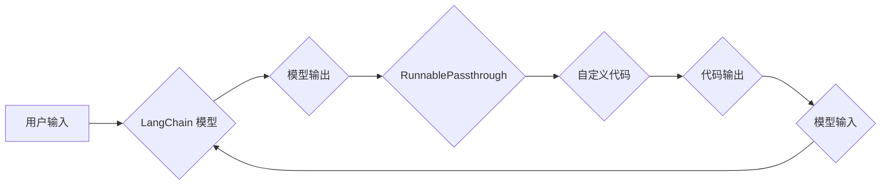

> LangChain, RunnablePassthrough, 编程, 自然语言处理, AI, 应用程序开发, 代码示例

## 1. 背景介绍

在人工智能领域蓬勃发展的今天，自然语言处理（NLP）技术已成为一个重要的研究方向。LangChain 作为一款强大的 NLP 工具库，为开发者提供了构建复杂 NLP 应用的便捷途径。其中，RunnablePassthrough 模块尤为值得关注，它允许开发者将自定义代码与 LangChain 的模型交互，从而实现更灵活和定制化的应用场景。

本篇文章将深入探讨 LangChain 的 RunnablePassthrough 模块，从核心概念到实际应用，全面解析其原理、使用方法和应用场景。

## 2. 核心概念与联系

RunnablePassthrough 模块的核心功能是允许开发者将自定义 Python 代码与 LangChain 的模型进行交互。它提供了一种机制，使得模型生成的文本可以作为自定义代码的输入，而自定义代码的输出可以作为模型的后续输入。这种交互机制使得开发者可以将模型的文本生成能力与自身业务逻辑相结合，构建更强大的 NLP 应用。

**Mermaid 流程图：**



## 3. 核心算法原理 & 具体操作步骤

### 3.1  算法原理概述

RunnablePassthrough 模块的核心算法原理是基于循环迭代的文本生成和代码执行。

1. 用户输入文本作为模型的初始输入。
2. 模型根据输入文本生成文本输出。
3. 模型输出文本作为自定义代码的输入。
4. 自定义代码执行，并生成代码输出。
5. 代码输出作为模型的后续输入，模型继续生成文本输出。
6. 重复步骤 2-5，直到达到预设的迭代次数或满足特定条件。

### 3.2  算法步骤详解

1. **初始化:** 设置模型、自定义代码、迭代次数等参数。
2. **输入文本:** 将用户输入文本作为模型的初始输入。
3. **模型生成:** 模型根据输入文本生成文本输出。
4. **代码执行:** 将模型输出文本作为自定义代码的输入，执行自定义代码，获取代码输出。
5. **迭代:** 将代码输出作为模型的后续输入，重复步骤 3-4，直到达到预设的迭代次数或满足特定条件。
6. **输出结果:** 将最终的模型输出文本作为最终结果。

### 3.3  算法优缺点

**优点:**

* **灵活定制:** 开发者可以根据自身需求编写自定义代码，实现更灵活和定制化的应用场景。
* **扩展性强:** 可以将多种外部数据源和服务与 LangChain 模型结合，构建更复杂的应用。
* **性能提升:** 通过自定义代码优化特定任务的逻辑，可以提升应用的性能。

**缺点:**

* **开发复杂度:** 需要开发者具备一定的编程和 NLP 知识，才能编写有效的自定义代码。
* **安全风险:** 如果自定义代码存在漏洞，可能会导致安全风险。
* **调试难度:** 调试自定义代码和模型交互过程可能比较复杂。

### 3.4  算法应用领域

* **文本生成:** 生成更符合特定风格和语境的文本，例如新闻报道、小说、诗歌等。
* **代码生成:** 根据自然语言描述生成代码，提高开发效率。
* **数据分析:** 将模型生成的文本作为输入，进行数据分析和挖掘。
* **对话系统:** 构建更智能和自然的对话系统，例如聊天机器人、虚拟助手等。

## 4. 数学模型和公式 & 详细讲解 & 举例说明

在 RunnablePassthrough 模块中，并没有特定的数学模型和公式。其核心原理是基于文本生成和代码执行的循环迭代过程。

然而，我们可以从模型的文本生成过程和代码执行过程的角度来分析其背后的数学原理。

**4.1  数学模型构建**

模型的文本生成过程可以看作是一个概率模型，它根据输入文本的上下文信息，预测下一个词的概率。常用的概率模型包括：

* **n-gram 模型:** 基于输入文本的前 n 个词预测下一个词的概率。
* **隐马尔可夫模型 (HMM):** 考虑文本序列的隐藏状态，预测下一个词的概率。
* **循环神经网络 (RNN):** 可以处理长文本序列，并学习文本的上下文信息。

**4.2  公式推导过程**

具体的公式推导过程取决于所使用的概率模型。例如，n-gram 模型的概率计算公式如下：

$$P(w_t | w_{t-1}, w_{t-2}, ..., w_{t-n})$$

其中，$w_t$ 是当前词，$w_{t-1}, w_{t-2}, ..., w_{t-n}$ 是前 n 个词。

**4.3  案例分析与讲解**

假设我们使用一个简单的 n-gram 模型来生成文本。输入文本为 "今天天气", 模型会根据前两个词 "今天天气" 的概率分布，预测下一个词可能是 "很好"、"晴朗" 或者其他词。

## 5. 项目实践：代码实例和详细解释说明

### 5.1  开发环境搭建

1. 安装 Python 3.7 或更高版本。
2. 安装 LangChain 库：`pip install langchain`
3. 安装其他依赖库，例如 OpenAI 库：`pip install openai`

### 5.2  源代码详细实现

```python
from langchain.llms import OpenAI
from langchain.chains import RunnableChain
from langchain.prompts import PromptTemplate

# 初始化 OpenAI 模型
llm = OpenAI(temperature=0.7)

# 定义自定义代码
def process_text(text):
    # 对文本进行处理，例如提取关键词、进行情感分析等
    # ...
    return processed_text

# 定义 PromptTemplate
template = PromptTemplate(
    input_variables=["text"],
    template="""
    {text}
    请根据文本内容，进行以下处理：
    - 提取关键词
    - 进行情感分析
    """
)

# 创建 RunnableChain
chain = RunnableChain(
    llm=llm,
    prompt=template,
    function_to_call=process_text,
)

# 调用链式操作
result = chain.run("今天天气很好")
print(result)
```

### 5.3  代码解读与分析

1. **初始化模型:** 使用 OpenAI 库初始化 OpenAI 模型。
2. **定义自定义代码:** 定义一个名为 `process_text` 的函数，用于处理文本内容。
3. **定义 PromptTemplate:** 定义一个 PromptTemplate 对象，用于构建模型的输入提示。
4. **创建 RunnableChain:** 使用 RunnableChain 类创建链式操作对象，并将模型、提示和自定义代码传递给它。
5. **调用链式操作:** 使用 `chain.run()` 方法调用链式操作，并将文本作为输入。

### 5.4  运行结果展示

运行代码后，模型会根据输入文本 "今天天气很好"，生成包含关键词和情感分析结果的文本输出。

## 6. 实际应用场景

RunnablePassthrough 模块在各种 NLP 应用场景中都有着广泛的应用，例如：

* **智能客服:** 将模型生成的文本作为客服机器人对话的输入，并使用自定义代码进行情感分析和问题分类，从而提供更智能和人性化的服务。
* **内容创作:** 使用模型生成文本作为创意素材，并使用自定义代码进行文本编辑、格式化和优化，从而提高内容创作效率。
* **代码生成:** 根据自然语言描述生成代码，并使用自定义代码进行代码格式化、代码注释和代码测试，从而提高代码开发效率。

### 6.4  未来应用展望

随着人工智能技术的不断发展，RunnablePassthrough 模块的应用场景将会更加广泛。未来，我们可以期待：

* **更强大的模型:** 模型的性能将不断提升，能够生成更准确、更流畅的文本。
* **更灵活的代码:** 开发者可以编写更复杂的自定义代码，实现更丰富的应用场景。
* **更便捷的开发工具:** 将出现更多便捷的开发工具，简化 RunnablePassthrough 模块的开发和使用过程。

## 7. 工具和资源推荐

### 7.1  学习资源推荐

* **LangChain 官方文档:** https://python.langchain.com/docs/
* **OpenAI 文档:** https://platform.openai.com/docs/

### 7.2  开发工具推荐

* **VS Code:** https://code.visualstudio.com/
* **PyCharm:** https://www.jetbrains.com/pycharm/

### 7.3  相关论文推荐

* **Attention Is All You Need:** https://arxiv.org/abs/1706.03762
* **BERT: Pre-training of Deep Bidirectional Transformers for Language Understanding:** https://arxiv.org/abs/1810.04805

## 8. 总结：未来发展趋势与挑战

RunnablePassthrough 模块为开发者提供了强大的工具，可以将模型的文本生成能力与自定义代码相结合，构建更强大的 NLP 应用。未来，随着模型性能的提升和开发工具的完善，RunnablePassthrough 模块将会在更多领域得到应用。

然而，也面临着一些挑战，例如：

* **安全风险:** 自定义代码可能存在漏洞，需要加强安全防护。
* **调试难度:** 调试自定义代码和模型交互过程可能比较复杂。
* **可解释性:** 模型的文本生成过程可能难以解释，需要进一步研究模型的可解释性。

## 9. 附录：常见问题与解答

**Q1: 如何选择合适的模型？**

A1: 选择模型需要根据具体的应用场景和需求进行考虑。例如，对于需要生成流畅自然文本的应用，可以选择 Transformer 模型；对于需要进行特定任务的应用，可以选择预训练的特定任务模型。

**Q2: 如何编写有效的自定义代码？**

A2: 自定义代码需要根据模型的输出格式和应用场景进行设计。建议使用清晰的代码结构和注释，并进行充分的测试。

**Q3: 如何解决模型生成的文本质量问题？**

A3: 可以通过调整模型的超参数、使用更丰富的训练数据、或者结合其他技术手段来提升模型生成的文本质量。


作者：禅与计算机程序设计艺术 / Zen and the Art of Computer Programming 
<end_of_turn>