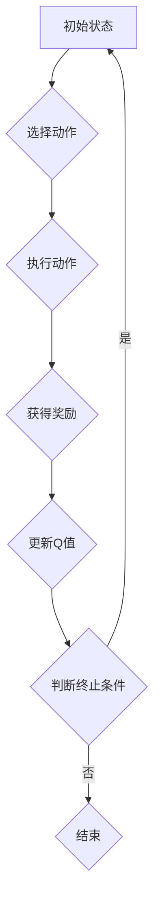

> Q-learning, 广告推荐, 强化学习, 算法原理, 项目实践, 应用场景

## 1. 背景介绍

在当今数据爆炸的时代，广告推荐已成为互联网商业模式的核心驱动力。传统的基于内容或协同过滤的推荐算法，往往难以捕捉用户细微的兴趣变化和个性化需求。而强化学习（Reinforcement Learning，RL）作为一种能够学习用户行为和反馈的智能算法，为广告推荐领域带来了新的机遇。

其中，Q-learning作为RL领域经典算法之一，凭借其简单易懂、易于实现的特点，在广告推荐领域得到了广泛应用。本文将深入探讨Q-learning算法在广告推荐中的原理、实践和应用场景，并展望其未来发展趋势。

## 2. 核心概念与联系

**2.1 强化学习概述**

强化学习是一种机器学习范式，其核心在于智能体通过与环境的交互，学习最优的策略以最大化累积奖励。

* **智能体 (Agent):**  执行动作并与环境交互的实体。
* **环境 (Environment):** 智能体所处的外部世界，提供状态信息和奖励反馈。
* **状态 (State):** 环境的当前状态，描述了系统当前的状况。
* **动作 (Action):** 智能体在特定状态下可以执行的操作。
* **奖励 (Reward):** 环境对智能体动作的反馈，可以是正向奖励或负向惩罚。
* **策略 (Policy):** 智能体在不同状态下选择动作的规则。

**2.2 Q-learning算法原理**

Q-learning算法是一种基于价值函数的强化学习算法，其目标是学习一个状态-动作价值函数Q(s,a)，该函数估计在状态s下执行动作a的长期奖励期望。

Q-learning算法的核心思想是通过迭代更新Q值，逐步逼近最优策略。更新规则如下：

$$Q(s,a) \leftarrow Q(s,a) + \alpha [r + \gamma \max_{a'} Q(s',a') - Q(s,a)]$$

其中：

* $\alpha$ 是学习率，控制着学习速度。
* $r$ 是当前状态下获得的奖励。
* $\gamma$ 是折扣因子，控制着未来奖励的权重。
* $s'$ 是执行动作a后进入的下一个状态。
* $a'$ 是在下一个状态下选择的最优动作。

**2.3 Q-learning算法流程图**



## 3. 核心算法原理 & 具体操作步骤

### 3.1 算法原理概述

Q-learning算法的核心在于通过迭代更新状态-动作价值函数Q(s,a)，学习最优策略。算法通过不断与环境交互，收集状态、动作和奖励信息，并根据这些信息更新Q值，最终逼近最优策略。

### 3.2 算法步骤详解

1. **初始化Q值表:** 为所有状态-动作对赋予初始Q值，通常设置为0。
2. **选择动作:** 根据当前状态和策略选择一个动作。
3. **执行动作:** 在环境中执行选择的动作。
4. **获得奖励:** 从环境获得奖励反馈。
5. **更新Q值:** 根据Bellman方程更新Q值，即：

$$Q(s,a) \leftarrow Q(s,a) + \alpha [r + \gamma \max_{a'} Q(s',a') - Q(s,a)]$$

6. **重复步骤2-5:** 直到达到终止条件，例如达到最大迭代次数或达到目标奖励。

### 3.3 算法优缺点

**优点:**

* **简单易懂:** Q-learning算法原理简单易懂，易于实现。
* **离线学习:** Q-learning算法可以利用历史数据进行离线学习，无需实时与环境交互。
* **适用于各种环境:** Q-learning算法可以应用于各种类型的强化学习问题。

**缺点:**

* **探索-利用困境:** Q-learning算法在学习过程中需要平衡探索新动作和利用已知策略，这被称为探索-利用困境。
* **样本效率低:** Q-learning算法需要大量的样本数据才能学习到有效的策略。
* **状态空间爆炸:** 当状态空间很大时，Q值表会变得非常庞大，难以存储和更新。

### 3.4 算法应用领域

Q-learning算法广泛应用于以下领域：

* **机器人控制:** 训练机器人执行复杂的任务，例如导航、抓取等。
* **游戏AI:** 训练游戏AI智能体，例如围棋、Go等。
* **推荐系统:** 建议用户感兴趣的内容，例如商品、电影、音乐等。
* **金融交易:** 优化投资策略，例如股票交易、期货交易等。

## 4. 数学模型和公式 & 详细讲解 & 举例说明

### 4.1 数学模型构建

在广告推荐场景下，我们可以将用户和广告构建成一个状态空间，用户行为和广告点击率构建成奖励函数。

* **状态空间:**  S = {用户特征, 广告特征}
* **动作空间:** A = {展示广告, 不展示广告}
* **奖励函数:** R(s,a) = 点击率 * 广告价值

### 4.2 公式推导过程

Q-learning算法的核心更新规则如下：

$$Q(s,a) \leftarrow Q(s,a) + \alpha [r + \gamma \max_{a'} Q(s',a') - Q(s,a)]$$

其中：

* $Q(s,a)$ 是在状态s下执行动作a的价值函数。
* $\alpha$ 是学习率，控制着学习速度。
* $r$ 是当前状态下获得的奖励，即广告点击率 * 广告价值。
* $\gamma$ 是折扣因子，控制着未来奖励的权重。
* $s'$ 是执行动作a后进入的下一个状态。
* $a'$ 是在下一个状态下选择的最优动作。

### 4.3 案例分析与讲解

假设一个用户浏览了电商网站，其特征包括年龄、性别、兴趣爱好等。网站展示了多个广告，每个广告都有其特征和价值。

当用户点击了某个广告时，系统会获得奖励，奖励值等于广告点击率乘以广告价值。

Q-learning算法会根据用户的历史行为和广告点击率，不断更新每个状态-动作对的价值函数。最终，算法会学习到在不同状态下，展示哪些广告能够获得更高的奖励。

## 5. 项目实践：代码实例和详细解释说明

### 5.1 开发环境搭建

* Python 3.x
* TensorFlow 或 PyTorch
* Jupyter Notebook

### 5.2 源代码详细实现

```python
import numpy as np

class QLearningAgent:
    def __init__(self, state_size, action_size, learning_rate=0.1, discount_factor=0.9, epsilon=0.1):
        self.state_size = state_size
        self.action_size = action_size
        self.learning_rate = learning_rate
        self.discount_factor = discount_factor
        self.epsilon = epsilon
        self.q_table = np.zeros((state_size, action_size))

    def choose_action(self, state):
        if np.random.uniform(0, 1) < self.epsilon:
            return np.random.randint(0, self.action_size)
        else:
            return np.argmax(self.q_table[state])

    def update_q_table(self, state, action, reward, next_state):
        self.q_table[state, action] += self.learning_rate * (reward + self.discount_factor * np.max(self.q_table[next_state]) - self.q_table[state, action])

# ... (其他代码实现)
```

### 5.3 代码解读与分析

* `QLearningAgent` 类实现了Q-learning算法的核心逻辑。
* `__init__` 方法初始化Q值表和算法参数。
* `choose_action` 方法根据当前状态和epsilon-greedy策略选择动作。
* `update_q_table` 方法根据Bellman方程更新Q值表。

### 5.4 运行结果展示

通过训练Q-learning模型，可以获得每个状态-动作对的价值函数，并根据价值函数选择最优动作。

## 6. 实际应用场景

### 6.1 广告推荐系统

Q-learning算法可以用于个性化广告推荐，根据用户的历史行为和偏好，推荐最相关的广告。

### 6.2 内容推荐系统

Q-learning算法可以用于推荐用户感兴趣的内容，例如新闻、视频、音乐等。

### 6.3 搜索引擎优化

Q-learning算法可以用于优化搜索引擎结果排名，根据用户的搜索行为和点击率，提高搜索结果的质量。

### 6.4 未来应用展望

随着强化学习技术的不断发展，Q-learning算法在广告推荐领域的应用场景将更加广泛，例如：

* **多用户多广告场景:** 针对多个用户和多个广告的场景，设计更复杂的强化学习模型。
* **动态广告价格优化:** 利用Q-learning算法优化广告价格，提高广告收益。
* **跨平台广告推荐:** 将用户行为数据整合到跨平台环境中，实现更精准的广告推荐。

## 7. 工具和资源推荐

### 7.1 学习资源推荐

* **强化学习书籍:**
    * Reinforcement Learning: An Introduction by Richard S. Sutton and Andrew G. Barto
    * Deep Reinforcement Learning Hands-On by Maxim Lapan
* **在线课程:**
    * Coursera: Reinforcement Learning Specialization by David Silver
    * Udacity: Deep Reinforcement Learning Nanodegree

### 7.2 开发工具推荐

* **TensorFlow:** 开源深度学习框架，支持Q-learning算法的实现。
* **PyTorch:** 开源深度学习框架，支持Q-learning算法的实现。
* **OpenAI Gym:** 强化学习环境库，提供各种标准强化学习任务。

### 7.3 相关论文推荐

* **Q-Learning: A Reinforcement Learning Algorithm** by Richard S. Sutton and Andrew G. Barto
* **Deep Q-Networks** by Volodymyr Mnih et al.
* **Proximal Policy Optimization Algorithms** by John Schulman et al.

## 8. 总结：未来发展趋势与挑战

### 8.1 研究成果总结

Q-learning算法在广告推荐领域取得了显著的成果，能够有效提高推荐准确率和用户体验。

### 8.2 未来发展趋势

* **深度强化学习:** 将深度神经网络与Q-learning算法结合，构建更强大的广告推荐模型。
* **联邦学习:** 利用联邦学习技术，在保护用户隐私的前提下进行广告推荐。
* **多模态学习:** 将文本、图像、视频等多模态数据融合到广告推荐模型中，提升推荐效果。

### 8.3 面临的挑战

* **数据稀疏性:** 广告推荐数据往往存在稀疏性，难以训练有效的模型。
* **用户隐私保护:** 广告推荐需要收集用户数据，如何保护用户隐私是一个重要的挑战。
* **算法可解释性:** 强化学习模型的决策过程往往难以解释，如何提高算法的可解释性是一个重要的研究方向。

### 8.4 研究展望

未来，Q-learning算法在广告推荐领域将继续发展，并与其他人工智能技术相结合，构建更智能、更精准、更安全的广告推荐系统。

## 9. 附录：常见问题与解答

**Q1: Q-learning算法的学习率如何设置？**

A1: 学习率控制着学习速度，过大容易导致震荡，过小容易导致学习缓慢。通常建议从0.1开始，根据实际情况进行调整。

**Q2: Q-