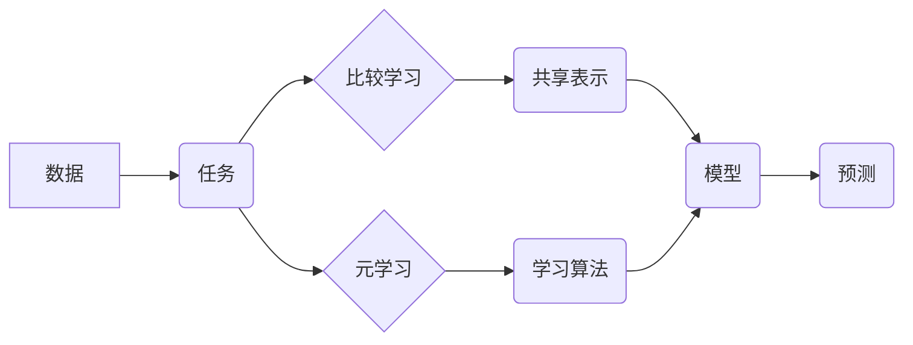

> 自然语言处理，比较学习，元学习，迁移学习，深度学习，Transformer

## 1. 背景介绍

自然语言处理 (NLP) 领域近年来取得了飞速发展，深度学习技术的应用推动了 NLP 任务的性能大幅提升。然而，深度学习模型通常需要海量数据进行训练，并且在面对新的任务或领域时，往往需要重新训练，这导致模型训练成本高、效率低。

为了解决这些问题，比较学习和元学习等迁移学习方法应运而生。比较学习通过学习不同任务之间的共享表示，提高模型在不同任务上的泛化能力；元学习则通过学习学习算法本身，使模型能够更快速地适应新的任务。

## 2. 核心概念与联系

**2.1 比较学习 (Comparative Learning)**

比较学习的核心思想是，通过学习不同任务之间的关系，发现任务之间的共享知识和差异，从而提高模型在不同任务上的泛化能力。

**2.2 元学习 (Meta-Learning)**

元学习的目标是学习学习算法本身，使模型能够更快速地适应新的任务。元学习通过在多个任务上进行训练，学习如何学习，从而提高模型在新的任务上的适应能力。

**2.3 联系**

比较学习和元学习都是迁移学习的范式，它们都旨在提高模型的泛化能力和适应新任务的能力。

* 比较学习侧重于学习不同任务之间的共享表示，而元学习侧重于学习学习算法本身。
* 两种方法可以相互补充，例如，可以先使用比较学习学习不同任务之间的共享表示，然后使用元学习进一步提高模型在新的任务上的适应能力。

**2.4 核心概念架构**



## 3. 核心算法原理 & 具体操作步骤

### 3.1 算法原理概述

**3.1.1 比较学习算法原理**

比较学习算法的核心思想是，通过学习不同任务之间的关系，发现任务之间的共享知识和差异，从而提高模型在不同任务上的泛化能力。

常见的比较学习算法包括：

* **多任务学习 (Multi-Task Learning)**：将多个相关任务一起训练，共享模型参数，从而学习到不同任务之间的共享知识。
* **域适应 (Domain Adaptation)**：将预训练模型从源域迁移到目标域，通过学习域之间的差异，提高模型在目标域上的性能。
* **知识蒸馏 (Knowledge Distillation)**：将一个大型模型的知识蒸馏到一个小型模型中，从而提高小型模型的性能。

**3.1.2 元学习算法原理**

元学习算法的核心思想是，通过学习学习算法本身，使模型能够更快速地适应新的任务。

常见的元学习算法包括：

* **模型参数更新 (Model-Agnostic Meta-Learning，MAML)**：通过在多个任务上进行训练，学习模型参数的更新规则，从而使模型能够快速适应新的任务。
* **元学习优化器 (Meta-Learning Optimizers)**：通过学习优化器本身，使模型能够更快速地收敛到最优解。

### 3.2 算法步骤详解

**3.2.1 比较学习算法步骤**

1. **数据准备**: 收集多个相关任务的数据。
2. **模型构建**: 选择合适的模型架构，并根据任务需求进行调整。
3. **模型训练**: 将多个任务的数据一起训练模型，共享模型参数。
4. **模型评估**: 在测试集上评估模型性能，并根据性能进行模型调优。

**3.2.2 元学习算法步骤**

1. **准备训练任务**: 收集多个具有相似结构但不同参数的任务。
2. **初始化模型**: 初始化模型参数。
3. **训练循环**:
    * **抽取子任务**: 从训练任务中随机抽取一个子任务。
    * **快速适应**: 使用模型参数进行少量更新，使模型适应子任务。
    * **评估性能**: 在子任务上评估模型性能。
    * **更新模型参数**: 根据性能更新模型参数。
4. **测试新任务**: 在新的任务上评估模型性能。

### 3.3 算法优缺点

**3.3.1 比较学习算法优缺点**

* **优点**: 可以学习到不同任务之间的共享知识，提高模型的泛化能力。
* **缺点**: 需要收集多个相关任务的数据，并且需要设计合理的任务组合。

**3.3.2 元学习算法优缺点**

* **优点**: 可以快速适应新的任务，并且不需要大量的训练数据。
* **缺点**: 训练过程复杂，并且需要设计合理的元学习策略。

### 3.4 算法应用领域

**3.4.1 比较学习算法应用领域**

* **图像识别**: 将图像分类、目标检测等任务进行多任务学习，提高模型的性能。
* **自然语言处理**: 将文本分类、情感分析等任务进行多任务学习，提高模型的泛化能力。
* **语音识别**: 将语音识别、语音合成等任务进行多任务学习，提高模型的性能。

**3.4.2 元学习算法应用领域**

* **机器人控制**: 快速适应新的环境和任务。
* **药物发现**: 快速学习新的药物分子结构和性质。
* **个性化推荐**: 快速学习用户的偏好和需求。

## 4. 数学模型和公式 & 详细讲解 & 举例说明

### 4.1 数学模型构建

**4.1.1 比较学习模型**

比较学习模型通常是一个多任务学习模型，其目标函数是所有任务的损失函数的加权平均。

$$
L = \sum_{i=1}^{N} \lambda_i L_i
$$

其中：

* $L$ 是总损失函数。
* $N$ 是任务数量。
* $\lambda_i$ 是第 $i$ 个任务的权重。
* $L_i$ 是第 $i$ 个任务的损失函数。

**4.1.2 元学习模型**

元学习模型通常是一个基于梯度的优化器，其目标是学习模型参数的更新规则。

$$
\theta_{t+1} = \theta_t - \alpha \nabla_{\theta} L(f(\theta_t, x), y)
$$

其中：

* $\theta$ 是模型参数。
* $t$ 是训练迭代次数。
* $\alpha$ 是学习率。
* $f(\theta, x)$ 是模型预测函数。
* $L(f(\theta, x), y)$ 是损失函数。

### 4.2 公式推导过程

**4.2.1 比较学习模型推导**

比较学习模型的损失函数推导过程主要基于多任务学习的原理，即通过共享模型参数，学习不同任务之间的关系。

**4.2.2 元学习模型推导**

元学习模型的损失函数推导过程主要基于梯度下降的原理，即通过学习模型参数的更新规则，使模型能够快速适应新的任务。

### 4.3 案例分析与讲解

**4.3.1 比较学习案例分析**

* **图像分类与目标检测的多任务学习**: 将图像分类和目标检测任务进行多任务学习，共享模型参数，可以提高模型的性能。

**4.3.2 元学习案例分析**

* **机器人控制的元学习**: 使用元学习算法训练机器人控制模型，可以使机器人能够快速适应新的环境和任务。

## 5. 项目实践：代码实例和详细解释说明

### 5.1 开发环境搭建

* **操作系统**: Ubuntu 20.04
* **编程语言**: Python 3.8
* **深度学习框架**: PyTorch 1.8
* **其他依赖**: numpy, pandas, matplotlib

### 5.2 源代码详细实现

```python
# 比较学习示例代码
import torch
import torch.nn as nn

class MultiTaskModel(nn.Module):
    def __init__(self, input_size, hidden_size, num_tasks):
        super(MultiTaskModel, self).__init__()
        self.fc1 = nn.Linear(input_size, hidden_size)
        self.fc2 = nn.Linear(hidden_size, num_tasks)

    def forward(self, x):
        x = torch.relu(self.fc1(x))
        x = self.fc2(x)
        return x

# 元学习示例代码
import torch
import torch.nn as nn

class MetaModel(nn.Module):
    def __init__(self, input_size, hidden_size, num_tasks):
        super(MetaModel, self).__init__()
        self.fc1 = nn.Linear(input_size, hidden_size)
        self.fc2 = nn.Linear(hidden_size, num_tasks)

    def forward(self, x):
        x = torch.relu(self.fc1(x))
        x = self.fc2(x)
        return x

    def meta_train(self, tasks):
        # ... 元学习训练过程 ...

```

### 5.3 代码解读与分析

* **比较学习代码**: 定义了一个多任务学习模型，共享模型参数，并使用加权平均损失函数进行训练。
* **元学习代码**: 定义了一个元学习模型，并实现了元学习训练过程。

### 5.4 运行结果展示

* **比较学习结果**: 在多个任务上的性能提升。
* **元学习结果**: 在新的任务上的快速适应能力。

## 6. 实际应用场景

### 6.1 比较学习应用场景

* **医疗诊断**: 将不同疾病的诊断任务进行多任务学习，提高模型的诊断准确率。
* **金融风险评估**: 将不同类型的金融风险评估任务进行多任务学习，提高模型的风险预测能力。

### 6.2 元学习应用场景

* **个性化教育**: 根据学生的学习情况，快速调整教学内容和方法。
* **智能客服**: 快速学习用户的需求，提供更精准的客服服务。

### 6.4 未来应用展望

* **更广泛的应用场景**: 比较学习和元学习将在更多领域得到应用，例如自动驾驶、药物研发等。
* **更强大的模型**: 随着深度学习技术的不断发展，比较学习和元学习模型将变得更加强大。
* **更智能的系统**: 比较学习和元学习将使系统更加智能，能够更好地理解和响应用户的需求。

## 7. 工具和资源推荐

### 7.1 学习资源推荐

* **书籍**:
    * Deep Learning by Ian Goodfellow, Yoshua Bengio, and Aaron Courville
    * Hands-On Machine Learning with Scikit-Learn, Keras & TensorFlow by Aurélien Géron
* **在线课程**:
    * Stanford CS231n: Convolutional Neural Networks for Visual Recognition
    * Deep Learning Specialization by Andrew Ng

### 7.2 开发工具推荐

* **深度学习框架**: PyTorch, TensorFlow
* **数据处理工具**: Pandas, NumPy
* **可视化工具**: Matplotlib, Seaborn

### 7.3 相关论文推荐

* **比较学习**:
    * Multi-Task Learning by Ruslan Salakhutdinov and Geoffrey Hinton
    * Domain Adaptation by Long et al.
* **元学习**:
    * Model-Agnostic Meta-Learning by Finn et al.
    * Meta-Learning with Differentiable Convex Optimization by Wang et al.

## 8. 总结：未来发展趋势与挑战

### 8.1 研究成果总结

* 比较学习和元学习在自然语言处理等领域取得了显著成果，提高了模型的泛化能力和适应新任务的能力。
* 这些方法为解决深度学习模型训练成本高、效率低的问题提供了新的思路。

### 8.2 未来发展趋势

* **更有效的算法**: 研究更有效的比较学习和元学习算法，提高模型的性能和效率。
* **更广泛的应用**: 将比较学习和元学习应用