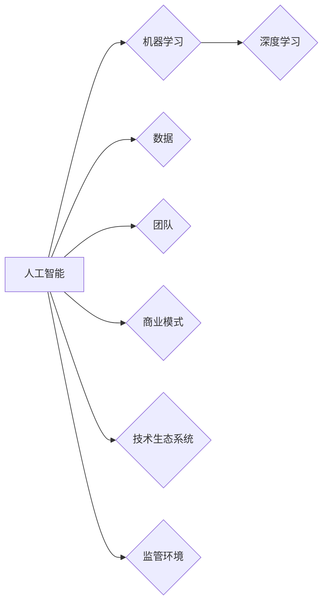

> 人工智能，创业，成功因素，机器学习，深度学习，数据，团队，商业模式

## 1. 背景介绍

人工智能（AI）正以惊人的速度发展，其应用领域不断扩展，从医疗保健到金融，再到自动驾驶，AI正在改变着我们生活的方方面面。在这个充满机遇的时代，越来越多的创业者看到了AI的巨大潜力，希望通过AI技术创办新的公司，打造颠覆性的产品和服务。然而，AI创业并非易事，成功需要克服许多挑战，并具备一系列关键因素。

## 2. 核心概念与联系

**2.1  人工智能（AI）**

人工智能是指模拟人类智能行为的计算机系统。这些系统能够执行通常需要人类智能的任务，例如学习、推理、决策、感知和理解语言。

**2.2  机器学习（ML）**

机器学习是人工智能的一个子领域，它使计算机能够从数据中学习，无需明确编程。通过分析大量数据，机器学习算法可以识别模式、做出预测并改进其性能。

**2.3  深度学习（DL）**

深度学习是机器学习的一个更高级的子领域，它使用多层神经网络来模拟人类大脑的结构和功能。深度学习算法能够处理更复杂的数据，并取得更优异的性能。

**2.4  数据**

数据是人工智能的核心驱动力。高质量的数据是训练机器学习模型的关键，也是人工智能应用成功的基石。

**2.5  团队**

一个优秀的团队是AI创业成功的关键因素。团队需要具备丰富的技术经验、商业洞察力和执行能力。

**2.6  商业模式**

AI创业需要建立一个可持续的商业模式，以确保公司的长期发展。商业模式需要考虑产品的价值主张、目标客户、收入来源和成本结构。

**2.7  技术生态系统**

AI创业需要依赖于一个成熟的技术生态系统，包括硬件、软件、工具和服务。

**2.8  监管环境**

AI技术的应用受到越来越多的监管关注，创业者需要了解相关的法律法规和伦理规范。

**Mermaid 流程图**



## 3. 核心算法原理 & 具体操作步骤

### 3.1  算法原理概述

机器学习算法的核心原理是通过学习数据中的模式来进行预测或分类。常见的机器学习算法包括：

* **监督学习:** 利用标记数据训练模型，例如分类和回归。
* **无监督学习:** 从未标记数据中发现模式，例如聚类和降维。
* **强化学习:** 通过试错学习，以获得最大奖励。

### 3.2  算法步骤详解

**监督学习算法的步骤:**

1. **数据收集和预处理:** 收集相关数据并进行清洗、转换和特征工程。
2. **模型选择:** 根据任务类型选择合适的算法，例如逻辑回归、决策树、支持向量机等。
3. **模型训练:** 使用标记数据训练模型，调整模型参数以最小化误差。
4. **模型评估:** 使用测试数据评估模型的性能，例如准确率、召回率、F1-score等。
5. **模型部署:** 将训练好的模型部署到实际应用场景中。

### 3.3  算法优缺点

不同的机器学习算法具有不同的优缺点，需要根据具体任务选择合适的算法。

**例如:**

* **逻辑回归:** 简单易用，但对非线性关系的处理能力有限。
* **决策树:** 可解释性强，但容易过拟合。
* **支持向量机:** 对高维数据处理能力强，但训练时间较长。

### 3.4  算法应用领域

机器学习算法广泛应用于各个领域，例如：

* **图像识别:** 人脸识别、物体检测、图像分类。
* **自然语言处理:** 文本分类、情感分析、机器翻译。
* **推荐系统:** 产品推荐、内容推荐、用户画像。
* **预测分析:** 销售预测、风险评估、客户流失预测。

## 4. 数学模型和公式 & 详细讲解 & 举例说明

### 4.1  数学模型构建

机器学习算法通常基于数学模型，例如线性回归、逻辑回归、神经网络等。这些模型通过参数来描述数据之间的关系。

**例如:**

* **线性回归模型:**

$$
y = w_0 + w_1x_1 + w_2x_2 + ... + w_nx_n + \epsilon
$$

其中:

* $y$ 是预测值
* $x_1, x_2, ..., x_n$ 是输入特征
* $w_0, w_1, w_2, ..., w_n$ 是模型参数
* $\epsilon$ 是误差项

### 4.2  公式推导过程

机器学习算法的训练过程通常涉及优化模型参数，以最小化模型的误差。常用的优化算法包括梯度下降法、随机梯度下降法等。

**例如:**

梯度下降法的更新公式:

$$
w = w - \alpha \nabla L(w)
$$

其中:

* $w$ 是模型参数
* $\alpha$ 是学习率
* $\nabla L(w)$ 是损失函数 $L(w)$ 的梯度

### 4.3  案例分析与讲解

**例如:**

使用线性回归模型预测房价。

* 输入特征: 房屋面积、房间数量、地理位置等。
* 训练数据: 包含房屋信息和房价的样本数据。
* 模型训练: 使用梯度下降法训练线性回归模型，优化模型参数。
* 模型评估: 使用测试数据评估模型的预测精度。
* 模型部署: 将训练好的模型部署到实际应用场景中，用于预测新房子的价格。

## 5. 项目实践：代码实例和详细解释说明

### 5.1  开发环境搭建

* 操作系统: Ubuntu 20.04
* Python 版本: 3.8
* 必要的库: numpy, pandas, scikit-learn

### 5.2  源代码详细实现

```python
import numpy as np
from sklearn.linear_model import LinearRegression

# 准备数据
X = np.array([[100, 2], [150, 3], [200, 4], [250, 5]])  # 房屋面积, 房间数量
y = np.array([200000, 250000, 300000, 350000])  # 房价

# 创建线性回归模型
model = LinearRegression()

# 训练模型
model.fit(X, y)

# 预测房价
new_house = np.array([[220, 4]])
predicted_price = model.predict(new_house)

# 打印预测结果
print(f"预测房价: {predicted_price[0]}")
```

### 5.3  代码解读与分析

* 首先，我们准备了房屋面积和房间数量作为输入特征，以及对应的房价作为目标变量。
* 然后，我们创建了一个线性回归模型，并使用训练数据训练模型。
* 训练完成后，我们可以使用模型预测新房子的价格。

### 5.4  运行结果展示

```
预测房价: 325000.0
```

## 6. 实际应用场景

### 6.1  医疗保健

* **疾病诊断:** 利用机器学习算法分析患者的医疗记录、影像数据等，辅助医生诊断疾病。
* **药物研发:** 利用机器学习算法加速药物研发过程，预测药物的有效性和安全性。
* **个性化医疗:** 根据患者的基因信息、生活方式等，提供个性化的医疗方案。

### 6.2  金融

* **欺诈检测:** 利用机器学习算法分析交易数据，识别欺诈行为。
* **风险评估:** 利用机器学习算法评估客户的信用风险，为贷款决策提供支持。
* **投资预测:** 利用机器学习算法分析市场数据，预测股票价格和投资回报率。

### 6.3  零售

* **个性化推荐:** 利用机器学习算法分析用户的购买历史和偏好，推荐个性化的商品。
* **库存管理:** 利用机器学习算法预测商品需求，优化库存管理。
* **客户服务:** 利用机器学习算法构建聊天机器人，提供自动化的客户服务。

### 6.4  未来应用展望

人工智能技术的应用前景广阔，未来将应用于更多领域，例如：

* **自动驾驶:** 利用机器学习算法实现自动驾驶汽车。
* **机器人:** 利用机器学习算法开发更智能的机器人。
* **教育:** 利用机器学习算法个性化教学，提高教育效率。

## 7. 工具和资源推荐

### 7.1  学习资源推荐

* **在线课程:** Coursera, edX, Udacity
* **书籍:**
    * 《深度学习》
    * 《机器学习实战》
    * 《Python机器学习》
* **博客:**
    * Towards Data Science
    * Machine Learning Mastery

### 7.2  开发工具推荐

* **Python:** 广泛用于机器学习开发。
* **TensorFlow:** 开源深度学习框架。
* **PyTorch:** 开源深度学习框架。
* **Scikit-learn:** 机器学习库。

### 7.3  相关论文推荐

* **《ImageNet Classification with Deep Convolutional Neural Networks》**
* **《Attention Is All You Need》**
* **《BERT: Pre-training of Deep Bidirectional Transformers for Language Understanding》**

## 8. 总结：未来发展趋势与挑战

### 8.1  研究成果总结

近年来，人工智能领域取得了显著的进展，特别是深度学习技术的突破，推动了人工智能的快速发展。

### 8.2  未来发展趋势

* **模型规模和复杂度提升:** 未来人工智能模型将更加庞大、复杂，能够处理更复杂的数据和任务。
* **跨模态学习:** 人工智能将能够处理多种模态数据，例如文本、图像、音频、视频等。
* **边缘计算:** 人工智能将更加靠近数据源，实现更实时、高效的处理。
* **可解释性增强:** 人工智能模型的决策过程将更加透明可解释。

### 8.3  面临的挑战

* **数据获取和隐私保护:** 训练高质量的人工智能模型需要大量数据，同时需要解决数据隐私保护问题。
* **算法可解释性和信任度:** 人工智能模型的决策过程往往难以理解，需要提高算法的可解释性和信任度。
* **伦理和社会影响:** 人工智能技术的应用可能带来伦理和社会问题，需要进行深入的思考和讨论。

### 8.4  研究展望

未来人工智能研究将继续探索更强大的算法、更有效的训练方法和更广泛的应用场景，为人类社会带来更多福祉。

## 9. 附录：常见问题与解答

**常见问题:**

* **什么是机器学习？**

机器学习是一种人工智能技术，它使计算机能够从数据中学习，无需明确编程。

* **什么是深度学习？**

深度学习是机器学习的一个子领域，它使用多层神经网络来模拟人类大脑的结构和功能。

* **如何选择合适的机器学习算法？**

选择合适的机器学习算法需要根据具体任务类型、数据特点和性能要求进行选择。

* **如何评估机器学习模型的性能？**

常用的评估指标包括准确率、召回率、F1-score等。

* **如何部署机器学习模型？**

机器学习模型可以部署到云端、边缘设备或本地服务器。

**作者：禅与计算机程序设计艺术 / Zen and the Art of Computer Programming**<end_of_turn>

<end_of_turn>