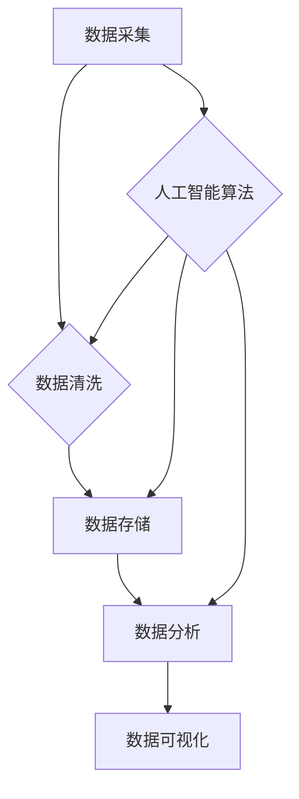

> 人工智能，数据管理，创业，数据治理，数据安全，数据分析，数据可视化

## 1. 背景介绍

在当今数据爆炸的时代，数据已成为企业最重要的资产之一。人工智能（AI）技术的快速发展，为数据管理带来了新的机遇和挑战。AI技术能够帮助企业从海量数据中挖掘价值，提高决策效率，提升运营水平。然而，数据管理的复杂性和挑战性也日益凸显。

对于创业公司来说，数据管理尤为重要。创业公司通常资源有限，需要高效利用数据资源来推动业务发展。然而，创业公司往往缺乏成熟的数据管理体系和经验，难以有效地收集、存储、处理和分析数据。

## 2. 核心概念与联系

**数据管理**是指企业对数据进行规划、收集、存储、处理、分析、保护和利用的整个过程。它涉及到数据生命周期的各个阶段，包括数据采集、数据清洗、数据存储、数据分析、数据可视化等环节。

**人工智能（AI）**是指模拟人类智能行为的计算机系统。AI技术涵盖了机器学习、深度学习、自然语言处理、计算机视觉等多个领域。

**数据管理与人工智能**之间的关系密切。AI技术可以帮助企业实现数据管理的自动化、智能化和高效化。例如，AI算法可以自动识别和分类数据，自动清洗和处理数据，自动分析数据并生成报告。

**数据管理与创业**之间的关系也十分重要。数据管理可以帮助创业公司更好地了解用户需求，优化产品和服务，提高运营效率，最终实现商业成功。

**数据管理与创业的结合**，可以帮助创业公司在数据时代获得竞争优势。



## 3. 核心算法原理 & 具体操作步骤

### 3.1  算法原理概述

在数据管理领域，人工智能算法广泛应用于数据清洗、数据分类、数据聚类、数据预测等环节。其中，机器学习算法是人工智能的核心技术之一。机器学习算法通过学习数据中的模式和规律，能够自动完成数据分析和预测任务。

常见的机器学习算法包括：

* **监督学习:** 通过标记数据训练模型，用于预测新的数据。例如，分类算法（如逻辑回归、支持向量机、决策树）和回归算法（如线性回归、支持向量回归）。
* **无监督学习:** 通过未标记数据训练模型，用于发现数据中的隐藏模式和结构。例如，聚类算法（如k-means聚类、层次聚类）和降维算法（如主成分分析、奇异值分解）。
* **强化学习:** 通过奖励和惩罚机制训练模型，使其在特定环境中学习最佳策略。例如，游戏AI、机器人控制等。

### 3.2  算法步骤详解

以监督学习中的分类算法为例，其基本步骤如下：

1. **数据收集和预处理:** 收集相关数据，并进行清洗、转换、特征工程等预处理操作。
2. **模型选择:** 根据具体任务选择合适的分类算法模型。
3. **模型训练:** 使用标记数据训练模型，调整模型参数，使其能够准确地分类数据。
4. **模型评估:** 使用测试数据评估模型的性能，例如准确率、召回率、F1-score等指标。
5. **模型部署:** 将训练好的模型部署到实际应用场景中，用于对新数据进行分类预测。

### 3.3  算法优缺点

不同的机器学习算法具有不同的优缺点，需要根据具体任务选择合适的算法。

* **逻辑回归:** 优点：简单易懂，训练速度快；缺点：只能处理线性关系，对高维数据效果较差。
* **支持向量机:** 优点：能够处理非线性关系，具有较好的泛化能力；缺点：训练时间较长，对参数选择敏感。
* **决策树:** 优点：易于理解和解释，可以处理混合类型数据；缺点：容易过拟合，对数据特征的顺序敏感。

### 3.4  算法应用领域

机器学习算法在数据管理领域有着广泛的应用，例如：

* **数据清洗:** 自动识别和修复数据中的错误和异常值。
* **数据分类:** 将数据按照预定义的类别进行分类，例如客户画像、产品推荐等。
* **数据聚类:** 将数据按照相似性进行分组，例如用户群分析、市场细分等。
* **数据预测:** 根据历史数据预测未来的趋势，例如销售预测、风险评估等。

## 4. 数学模型和公式 & 详细讲解 & 举例说明

### 4.1  数学模型构建

机器学习算法通常基于数学模型进行构建。例如，线性回归模型的数学表达式为：

$$y = w_0 + w_1x_1 + w_2x_2 + ... + w_nx_n + \epsilon$$

其中：

* $y$ 是预测值
* $w_0, w_1, w_2, ..., w_n$ 是模型参数
* $x_1, x_2, ..., x_n$ 是输入特征
* $\epsilon$ 是误差项

### 4.2  公式推导过程

机器学习算法的训练过程通常是通过优化模型参数来最小化误差。例如，线性回归模型的损失函数为：

$$J(w) = \frac{1}{2n}\sum_{i=1}^{n}(y_i - \hat{y}_i)^2$$

其中：

* $J(w)$ 是损失函数
* $w$ 是模型参数
* $n$ 是样本数量
* $y_i$ 是真实值
* $\hat{y}_i$ 是预测值

通过梯度下降算法等优化算法，可以迭代更新模型参数，使得损失函数最小化。

### 4.3  案例分析与讲解

例如，假设我们想要预测房价，输入特征包括房屋面积、房间数量、地理位置等。我们可以使用线性回归模型进行预测。通过训练模型，我们可以得到房价预测公式，例如：

$$房价 = 10000 + 500 * 面积 + 10000 * 房间数量 + 2000 * 地理位置$$

## 5. 项目实践：代码实例和详细解释说明

### 5.1  开发环境搭建

可以使用Python语言和相关的机器学习库（如scikit-learn）进行项目开发。

### 5.2  源代码详细实现

```python
from sklearn.linear_model import LinearRegression
from sklearn.model_selection import train_test_split
import pandas as pd

# 加载数据
data = pd.read_csv('house_data.csv')

# 划分训练集和测试集
X = data[['面积', '房间数量', '地理位置']]
y = data['房价']
X_train, X_test, y_train, y_test = train_test_split(X, y, test_size=0.2, random_state=42)

# 创建线性回归模型
model = LinearRegression()

# 训练模型
model.fit(X_train, y_train)

# 预测测试集数据
y_pred = model.predict(X_test)

# 评估模型性能
from sklearn.metrics import mean_squared_error
mse = mean_squared_error(y_test, y_pred)
print(f'均方误差: {mse}')
```

### 5.3  代码解读与分析

* 首先，加载数据并划分训练集和测试集。
* 然后，创建线性回归模型并训练模型。
* 最后，使用训练好的模型预测测试集数据，并评估模型性能。

### 5.4  运行结果展示

运行代码后，会输出模型的均方误差值，该值越小，模型的预测精度越高。

## 6. 实际应用场景

### 6.1  客户画像分析

利用机器学习算法对客户数据进行分析，可以构建客户画像，了解客户的特征、行为和偏好，从而为精准营销提供支持。

### 6.2  产品推荐

根据用户的历史购买记录、浏览记录等数据，使用协同过滤算法或内容过滤算法进行产品推荐，提高用户体验和转化率。

### 6.3  风险评估

利用机器学习算法对客户的信用风险、欺诈风险等进行评估，帮助企业降低风险损失。

### 6.4  未来应用展望

随着人工智能技术的不断发展，数据管理领域将迎来更多新的应用场景，例如：

* **自动数据分析:** 利用AI算法自动分析数据，发现隐藏的模式和趋势，为企业决策提供支持。
* **智能数据可视化:** 利用AI算法生成更直观、更易理解的数据可视化图表，帮助用户快速理解数据信息。
* **数据安全保障:** 利用AI算法加强数据安全防护，防止数据泄露和恶意攻击。

## 7. 工具和资源推荐

### 7.1  学习资源推荐

* **在线课程:** Coursera、edX、Udacity等平台提供丰富的机器学习课程。
* **书籍:** 《机器学习》 (周志华)、《深入理解机器学习》 (李航) 等书籍。
* **博客和论坛:** Kaggle、Towards Data Science 等平台提供大量的机器学习博客和论坛。

### 7.2  开发工具推荐

* **Python:** 机器学习开发的常用语言。
* **scikit-learn:** Python机器学习库。
* **TensorFlow:** 深度学习框架。
* **PyTorch:** 深度学习框架。

### 7.3  相关论文推荐

* **《机器学习》 (周志华)**
* **《深入理解机器学习》 (李航)**
* **《Pattern Recognition and Machine Learning》 (Christopher M. Bishop)**

## 8. 总结：未来发展趋势与挑战

### 8.1  研究成果总结

人工智能技术在数据管理领域取得了显著的成果，例如：

* **数据清洗:** 自动识别和修复数据中的错误和异常值。
* **数据分类:** 将数据按照预定义的类别进行分类，例如客户画像、产品推荐等。
* **数据聚类:** 将数据按照相似性进行分组，例如用户群分析、市场细分等。
* **数据预测:** 根据历史数据预测未来的趋势，例如销售预测、风险评估等。

### 8.2  未来发展趋势

未来，人工智能技术在数据管理领域将继续发展，主要趋势包括：

* **更智能的数据管理:** 利用更先进的AI算法，实现更智能的数据分析、数据可视化和数据安全保障。
* **更自动化的数据管理:** 利用AI技术自动化数据管理流程，提高效率和降低成本。
* **更个性化的数据管理:** 利用AI技术根据用户的需求，提供个性化的数据管理服务。

### 8.3  面临的挑战

人工智能技术在数据管理领域也面临一些挑战，例如：

* **数据质量问题:** AI算法对数据质量要求较高，数据质量问题会影响算法的性能。
* **算法解释性问题:** 一些AI算法的决策过程难以解释，这可能会导致信任问题。
* **数据隐私问题:** AI算法的应用可能会涉及到用户隐私数据，需要妥善保护用户隐私。

### 8.4  研究展望

未来，需要进一步研究以下问题：

* 如何提高AI算法对数据质量的鲁棒性。
* 如何提高AI算法的解释性，增强用户信任。
* 如何在保证数据安全的前提下，更好地利用AI技术进行数据管理。

## 9. 附录：常见问题与解答

### 9.1  常见问题

* **什么是机器学习？**

机器学习是一种人工智能技术，通过学习数据中的模式和规律，能够自动完成数据分析和预测任务。

* **如何选择合适的机器学习算法？**

选择合适的机器学习算法需要根据具体任务和数据特点进行选择。

* **如何评估机器学习模型的性能？**

可以使用准确率、召回率、F1-score等指标评估机器学习模型的性能。

### 9.2  解答

* **机器学习算法的应用