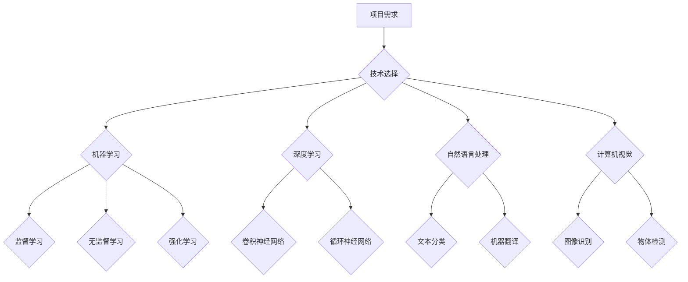

> 人工智能，创业，项目技术选择，机器学习，深度学习，自然语言处理，计算机视觉，云计算，大数据

## 1. 背景介绍

人工智能（AI）正以惊人的速度发展，并深刻地改变着我们生活的方方面面。从自动驾驶汽车到智能家居，从医疗诊断到金融交易，AI技术的应用场景日益广泛。对于创业者来说，AI技术带来了前所未有的机遇，但也带来了新的挑战。如何选择合适的AI技术，构建成功的AI项目，是创业者需要认真思考的问题。

## 2. 核心概念与联系

**2.1  人工智能（AI）**

人工智能是指模拟人类智能行为的计算机系统。它涵盖了广泛的领域，包括机器学习、深度学习、自然语言处理、计算机视觉等。

**2.2  机器学习（ML）**

机器学习是人工智能的一个重要分支，它使计算机能够从数据中学习，并根据学习到的知识进行预测或决策。机器学习算法可以分为监督学习、无监督学习和强化学习三大类。

**2.3  深度学习（DL）**

深度学习是机器学习的一个子领域，它使用多层神经网络来模拟人类大脑的学习过程。深度学习算法在图像识别、语音识别、自然语言处理等领域取得了突破性的进展。

**2.4  自然语言处理（NLP）**

自然语言处理是指使计算机能够理解、处理和生成人类语言的技术。NLP应用广泛，例如机器翻译、文本摘要、情感分析等。

**2.5  计算机视觉（CV）**

计算机视觉是指使计算机能够“看”和理解图像的技术。计算机视觉应用于图像识别、物体检测、图像分割等领域。

**2.6  云计算**

云计算是指使用互联网提供计算资源、存储资源和软件服务的模式。云计算为AI项目提供了强大的计算能力和数据存储能力。

**2.7  大数据**

大数据是指海量、高速度、高多样性的数据。大数据是AI算法训练和优化的重要基础。

**2.8  项目技术选择**

选择合适的AI技术取决于项目的具体需求和目标。例如，如果项目需要识别图像，则可以选择计算机视觉技术；如果项目需要分析文本，则可以选择自然语言处理技术。

**Mermaid 流程图**



## 3. 核心算法原理 & 具体操作步骤

### 3.1  算法原理概述

**3.1.1  监督学习**

监督学习是指利用标记数据训练模型，使模型能够根据输入数据预测输出结果。监督学习算法包括线性回归、逻辑回归、支持向量机、决策树、随机森林等。

**3.1.2  无监督学习**

无监督学习是指利用未标记数据训练模型，使模型能够发现数据中的隐藏模式或结构。无监督学习算法包括聚类、降维、异常检测等。

**3.1.3  强化学习**

强化学习是指训练智能体在环境中采取行动，以最大化累积奖励。强化学习算法包括Q学习、SARSA等。

### 3.2  算法步骤详解

**3.2.1  监督学习算法步骤**

1.  **数据收集和预处理:** 收集相关数据，并进行清洗、转换、特征工程等预处理操作。
2.  **模型选择:** 根据任务需求选择合适的监督学习算法。
3.  **模型训练:** 使用标记数据训练模型，调整模型参数。
4.  **模型评估:** 使用测试数据评估模型性能，例如准确率、召回率、F1-score等。
5.  **模型调优:** 根据评估结果调整模型参数或选择其他算法，提高模型性能。
6.  **模型部署:** 将训练好的模型部署到实际应用场景中。

**3.2.2  无监督学习算法步骤**

1.  **数据收集和预处理:** 收集相关数据，并进行清洗、转换等预处理操作。
2.  **模型选择:** 根据任务需求选择合适的无监督学习算法。
3.  **模型训练:** 使用未标记数据训练模型，发现数据中的隐藏模式或结构。
4.  **结果分析:** 分析模型输出结果，例如聚类结果、降维结果等。

**3.2.3  强化学习算法步骤**

1.  **环境定义:** 定义强化学习环境，包括状态空间、动作空间、奖励函数等。
2.  **智能体设计:** 设计智能体，使其能够感知环境状态并采取行动。
3.  **训练过程:** 智能体在环境中进行交互，根据奖励信号更新策略，以最大化累积奖励。
4.  **策略评估:** 评估训练后的策略性能，例如平均奖励、成功率等。

### 3.3  算法优缺点

**3.3.1  监督学习**

*   **优点:** 准确率高，能够处理各种类型的数据。
*   **缺点:** 需要大量的标记数据，数据标注成本高。

**3.3.2  无监督学习**

*   **优点:** 不需要标记数据，能够发现数据中的隐藏模式。
*   **缺点:** 难以评估模型性能，结果解释性较差。

**3.3.3  强化学习**

*   **优点:** 能够学习复杂的行为，适应动态环境。
*   **缺点:** 训练过程复杂，需要大量的试错和奖励信号。

### 3.4  算法应用领域

**3.4.1  监督学习**

*   图像识别
*   语音识别
*   文本分类
*   欺诈检测
*   医疗诊断

**3.4.2  无监督学习**

*   客户画像
*   异常检测
*   推荐系统
*   数据聚类

**3.4.3  强化学习**

*   自动驾驶
*   机器人控制
*   游戏AI
*   个性化推荐

## 4. 数学模型和公式 & 详细讲解 & 举例说明

### 4.1  数学模型构建

**4.1.1  线性回归模型**

线性回归模型假设目标变量与输入变量之间存在线性关系。模型公式如下：

$$
y = w_0 + w_1x_1 + w_2x_2 + ... + w_nx_n + \epsilon
$$

其中：

*   $y$ 是目标变量
*   $x_1, x_2, ..., x_n$ 是输入变量
*   $w_0, w_1, w_2, ..., w_n$ 是模型参数
*   $\epsilon$ 是误差项

**4.1.2  逻辑回归模型**

逻辑回归模型用于二分类问题，它将线性回归模型的输出映射到0到1之间的概率值。模型公式如下：

$$
p(y=1|x) = \frac{1}{1 + e^{-(w_0 + w_1x_1 + w_2x_2 + ... + w_nx_n)}}
$$

其中：

*   $p(y=1|x)$ 是给定输入$x$时目标变量$y$等于1的概率
*   $w_0, w_1, w_2, ..., w_n$ 是模型参数

### 4.2  公式推导过程

**4.2.1  线性回归模型参数估计**

线性回归模型的参数估计可以使用最小二乘法。最小二乘法旨在找到模型参数，使模型预测值与实际值之间的误差平方和最小。

**4.2.2  逻辑回归模型参数估计**

逻辑回归模型的参数估计可以使用最大似然估计法。最大似然估计法旨在找到模型参数，使模型能够最大化观测数据的似然概率。

### 4.3  案例分析与讲解

**4.3.1  线性回归模型案例**

假设我们想要预测房屋价格，输入变量包括房屋面积、房间数、地理位置等。我们可以使用线性回归模型建立房屋价格预测模型。

**4.3.2  逻辑回归模型案例**

假设我们想要预测客户是否会点击广告，输入变量包括客户年龄、性别、兴趣爱好等。我们可以使用逻辑回归模型建立客户点击广告预测模型。

## 5. 项目实践：代码实例和详细解释说明

### 5.1  开发环境搭建

*   操作系统：Windows/macOS/Linux
*   编程语言：Python
*   深度学习框架：TensorFlow/PyTorch
*   数据处理库：Pandas/NumPy
*   可视化库：Matplotlib/Seaborn

### 5.2  源代码详细实现

```python
# 导入必要的库
import pandas as pd
from sklearn.linear_model import LinearRegression

# 加载数据
data = pd.read_csv('house_price.csv')

# 选择特征和目标变量
features = ['area', 'rooms', 'location']
target = 'price'

# 训练模型
model = LinearRegression()
model.fit(data[features], data[target])

# 预测新房价
new_house = pd.DataFrame({'area': [150], 'rooms': [3], 'location': ['city center']})
predicted_price = model.predict(new_house)

# 打印预测结果
print(f'Predicted price: {predicted_price[0]}')
```

### 5.3  代码解读与分析

*   代码首先导入必要的库。
*   然后加载数据，并选择特征和目标变量。
*   接下来使用线性回归模型训练模型，并使用训练好的模型预测新房价。
*   最后打印预测结果。

### 5.4  运行结果展示

运行代码后，会输出预测的新房价。

## 6. 实际应用场景

**6.1  医疗诊断**

AI技术可以帮助医生诊断疾病，例如癌症、心血管疾病等。

**6.2  金融交易**

AI技术可以帮助金融机构进行风险管理、欺诈检测、投资决策等。

**6.3  自动驾驶**

AI技术是自动驾驶汽车的核心技术，可以帮助汽车感知环境、做出决策、控制车辆。

**6.4  未来应用展望**

AI技术将在未来广泛应用于各个领域，例如教育、娱乐、制造业等。

## 7. 工具和资源推荐

### 7.1  学习资源推荐

*   **在线课程:** Coursera、edX、Udacity
*   **书籍:** 《深度学习》、《机器学习实战》
*   **博客:** Towards Data Science、Machine Learning Mastery

### 7.2  开发工具推荐

*   **深度学习框架:** TensorFlow、PyTorch
*   **数据处理库:** Pandas、NumPy
*   **可视化库:** Matplotlib、Seaborn

### 7.3  相关论文推荐

*   《ImageNet Classification with Deep Convolutional Neural Networks》
*   《Attention Is All You Need》
*   《Deep Reinforcement Learning》

## 8. 总结：未来发展趋势与挑战

### 8.1  研究成果总结

近年来，AI技术取得了长足的进步，在图像识别、语音识别、自然语言处理等领域取得了突破性的进展。

### 8.2  未来发展趋势

*   **模型规模和复杂度提升:** 未来AI模型将更加庞大、复杂，能够处理更复杂的任务。
*   **跨模态学习:** AI模型将能够处理多种模态数据，例如文本、图像、音频等。
*   **边缘计算:** AI模型将部署到边缘设备，实现更快速的响应和更低的延迟。

### 8.3  面临的挑战

*   **数据隐私和安全:** AI模型训练需要大量数据，如何保护数据隐私和安全是一个重要挑战。
*   **算法可