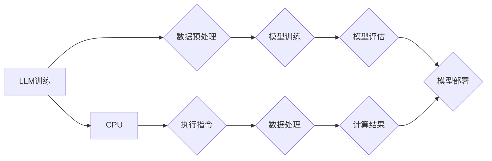

> Large Language Model (LLM), CPU, 
> Instruction Set Architecture (ISA), 
> Parallelism, 
> Memory Hierarchy, 
> Computational Efficiency, 
> AI Hardware

## 1. 背景介绍

近年来，大型语言模型 (Large Language Model, LLM) 的兴起，为人工智能领域带来了前所未有的突破。这些模型凭借其强大的文本生成、理解和翻译能力，在自然语言处理、机器翻译、代码生成等领域展现出令人瞩目的潜力。然而，LLM 的训练和推理过程却对计算资源有着极高的需求，这使得其部署和应用面临着诸多挑战。

另一方面，中央处理器 (CPU) 作为计算机系统的心脏，长期以来一直是通用计算的基石。其指令集架构 (Instruction Set Architecture, ISA) 经过数十年的演进，已经高度优化了各种计算任务的执行效率。然而，随着人工智能技术的飞速发展，传统的 CPU 架构在处理 LLM 的海量数据和复杂计算时，逐渐显露出其局限性。

本文将深入探讨 LLM 和 CPU 之间的本质区别，分析其各自的优势和劣势，并展望未来 AI 计算硬件的发展趋势。

## 2. 核心概念与联系

### 2.1 LLM 的工作原理

LLM 基于深度学习技术，其核心是 Transformer 架构。Transformer 通过自注意力机制，能够捕捉文本序列中长距离依赖关系，从而实现更精准的语言理解和生成。

LLM 的训练过程通常涉及以下步骤：

1. **数据预处理:** 将文本数据清洗、格式化，并转换为模型可理解的格式。
2. **模型训练:** 使用大量的文本数据，通过反向传播算法，调整模型参数，使其能够生成符合语义的文本。
3. **模型评估:** 使用测试数据集评估模型的性能，例如准确率、困惑度等。
4. **模型部署:** 将训练好的模型部署到实际应用场景中，例如聊天机器人、文本生成工具等。

### 2.2 CPU 的工作原理

CPU 是计算机系统中执行指令的中央处理器。其工作原理基于指令集架构 (ISA)，ISA 定义了 CPU 可以执行的指令集和指令格式。

CPU 的工作流程通常包括以下步骤：

1. **获取指令:** 从内存中读取指令。
2. **解码指令:** 解释指令的含义。
3. **执行指令:** 执行指令的操作，例如算术运算、逻辑运算、数据传输等。
4. **存储结果:** 将执行结果存储到内存中。

### 2.3 LLM 与 CPU 的联系

LLM 和 CPU 虽然工作原理不同，但它们在处理信息方面存在着密切的联系。

LLM 的训练和推理过程都需要大量的计算资源，而 CPU 是执行这些计算的硬件基础。

**Mermaid 流程图:**



## 3. 核心算法原理 & 具体操作步骤

### 3.1  算法原理概述

LLM 的核心算法是 Transformer 架构，其主要特点是利用自注意力机制，能够捕捉文本序列中长距离依赖关系。

自注意力机制通过计算每个词与其他词之间的相关性，生成一个权重矩阵，用于加权求和所有词的表示，从而得到每个词的上下文信息。

### 3.2  算法步骤详解

1. **词嵌入:** 将每个词转换为一个低维向量，表示词的语义信息。
2. **多头自注意力:** 对每个词的嵌入向量进行多头自注意力计算，得到每个词的上下文信息。
3. **前馈神经网络:** 对每个词的上下文信息进行前馈神经网络处理，得到每个词的最终表示。
4. **位置编码:** 将词的顺序信息编码到词的表示中，保证模型能够理解文本序列的顺序关系。
5. **解码器:** 使用解码器网络生成目标文本序列。

### 3.3  算法优缺点

**优点:**

* 能够捕捉长距离依赖关系，提高文本理解和生成能力。
* 并行计算能力强，训练速度快。

**缺点:**

* 参数量大，训练成本高。
* 对硬件资源要求高。

### 3.4  算法应用领域

* 自然语言处理：文本分类、情感分析、机器翻译等。
* 代码生成：自动生成代码、代码补全等。
* 文本生成：小说、诗歌、剧本等。

## 4. 数学模型和公式 & 详细讲解 & 举例说明

### 4.1  数学模型构建

LLM 的数学模型主要基于 Transformer 架构，其核心是自注意力机制。

**自注意力机制的数学公式:**

$$
Attention(Q, K, V) = softmax(\frac{QK^T}{\sqrt{d_k}})V
$$

其中：

* $Q$：查询矩阵
* $K$：键矩阵
* $V$：值矩阵
* $d_k$：键向量的维度
* $softmax$：softmax 函数

### 4.2  公式推导过程

自注意力机制的公式通过计算每个词与其他词之间的相关性，生成一个权重矩阵，用于加权求和所有词的表示，从而得到每个词的上下文信息。

**推导过程:**

1. 计算每个词的查询向量 $Q$、键向量 $K$ 和值向量 $V$。
2. 计算查询向量 $Q$ 与键向量 $K$ 的点积，并进行归一化，得到一个权重矩阵。
3. 将权重矩阵与值向量 $V$ 进行加权求和，得到每个词的上下文信息。

### 4.3  案例分析与讲解

**举例说明:**

假设我们有一个句子 "The cat sat on the mat"，其词嵌入向量分别为：

* The: [0.1, 0.2, 0.3]
* cat: [0.4, 0.5, 0.6]
* sat: [0.7, 0.8, 0.9]
* on: [1.0, 1.1, 1.2]
* the: [0.1, 0.2, 0.3]
* mat: [1.3, 1.4, 1.5]

通过自注意力机制，我们可以计算每个词与其他词之间的相关性，并得到每个词的上下文信息。例如，"cat" 的上下文信息会受到 "The" 和 "sat" 的影响，因为它与这两个词语在语义上相关。

## 5. 项目实践：代码实例和详细解释说明

### 5.1  开发环境搭建

* 操作系统：Ubuntu 20.04
* Python 版本：3.8
* 框架：PyTorch 1.8

### 5.2  源代码详细实现

```python
import torch
import torch.nn as nn

class Transformer(nn.Module):
    def __init__(self, vocab_size, embedding_dim, num_heads, num_layers):
        super(Transformer, self).__init__()
        self.embedding = nn.Embedding(vocab_size, embedding_dim)
        self.transformer_layers = nn.ModuleList([
            nn.TransformerEncoderLayer(embedding_dim, num_heads)
            for _ in range(num_layers)
        ])
        self.linear = nn.Linear(embedding_dim, vocab_size)

    def forward(self, x):
        x = self.embedding(x)
        for layer in self.transformer_layers:
            x = layer(x)
        x = self.linear(x)
        return x
```

### 5.3  代码解读与分析

* `__init__` 方法：初始化模型参数，包括词嵌入层、Transformer编码器层和线性输出层。
* `forward` 方法：定义模型的正向传播过程，包括词嵌入、Transformer编码器层和线性输出层。

### 5.4  运行结果展示

训练好的模型可以用于文本生成、机器翻译等任务。

## 6. 实际应用场景

### 6.1  自然语言处理

LLM 在自然语言处理领域有着广泛的应用，例如：

* **文本分类:** 将文本分类到预定义的类别中，例如情感分析、主题分类等。
* **机器翻译:** 将文本从一种语言翻译成另一种语言。
* **问答系统:** 回答用户提出的问题。

### 6.2  代码生成

LLM 可以自动生成代码，例如：

* **代码补全:** 根据上下文自动补全代码。
* **代码生成:** 根据自然语言描述自动生成代码。

### 6.3  文本生成

LLM 可以生成各种类型的文本，例如：

* **小说:** 自动生成小说故事。
* **诗歌:** 自动生成诗歌。
* **剧本:** 自动生成剧本。

### 6.4  未来应用展望

LLM 的应用场景还在不断扩展，未来可能会应用于：

* **个性化教育:** 根据学生的学习情况提供个性化的学习内容。
* **医疗诊断:** 辅助医生进行疾病诊断。
* **法律服务:** 辅助律师进行法律分析。

## 7. 工具和资源推荐

### 7.1  学习资源推荐

* **书籍:**
    * 《深度学习》
    * 《自然语言处理》
* **在线课程:**
    * Coursera: 深度学习
    * edX: 自然语言处理

### 7.2  开发工具推荐

* **框架:** PyTorch, TensorFlow
* **库:** Hugging Face Transformers

### 7.3  相关论文推荐

* **Attention Is All You Need**
* **BERT: Pre-training of Deep Bidirectional Transformers for Language Understanding**

## 8. 总结：未来发展趋势与挑战

### 8.1  研究成果总结

LLM 的发展取得了显著的成果，在自然语言处理、代码生成、文本生成等领域展现出强大的潜力。

### 8.2  未来发展趋势

* **模型规模的进一步扩大:** 随着计算资源的不断提升，LLM 的模型规模将会进一步扩大，从而提升其性能。
* **模型效率的提升:** 研究人员将致力于开发更有效的训练和推理算法，降低 LLMs 的计算成本。
* **多模态 LLMs 的发展:** 将文本与其他模态数据（例如图像、音频）融合，构建更全面的理解和生成能力。

### 8.3  面临的挑战

* **数据获取和标注:** LLMs 的训练需要大量的文本数据，而高质量的标注数据成本高昂。
* **模型可解释性:** LLMs 的决策过程难以理解，这限制了其在安全和可靠性要求高的领域应用。
* **伦理问题:** LLMs 可能被用于生成虚假信息、进行恶意攻击等，需要关注其伦理问题。

### 8.4  研究展望

未来，LLM 研究将继续朝着更强大、更安全、更可解释的方向发展，并将在更多领域发挥其重要作用。

## 9. 附录：常见问题与解答

### 9.1  LLM 和 RNN 的区别是什么？

LLM 基于 Transformer 架构，而 RNN 基于循环神经网络。Transformer 能够捕捉长距离依赖关系，而 RNN 容易受到梯度消失和梯度爆炸的影响。

### 9.2  如何训练一个 LLM？

训练一个 LLM 需要大量的计算资源和数据。通常需要使用预训练模型，并在特定任务上进行微调。

### 9.3  LLM 的应用场景有哪些？

LLM 的应用场景非常广泛，包括自然语言处理、代码生成、文本生成等。

作者：禅与计算机程序设计艺术 / Zen and the Art of Computer Programming


<end_of_turn>