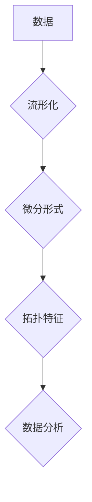

代数拓扑，微分形式，拓扑数据分析，机器学习，数据可视化，流形

## 1. 背景介绍

在数据科学和机器学习领域，数据通常呈现出复杂的非线性结构。传统的统计方法和机器学习算法难以有效地捕捉这些结构。近年来，拓扑数据分析 (TDA) 作为一种新兴的工具，凭借其对数据结构的抽象和不变性描述能力，在数据分析、可视化和模式识别方面展现出巨大的潜力。

代数拓扑是拓扑学的一个分支，它利用代数工具来研究空间的拓扑性质。微分形式是代数拓扑中重要的工具之一，它可以用来描述空间的几何结构和拓扑性质。

## 2. 核心概念与联系

**2.1 代数拓扑**

代数拓扑通过代数对象来研究拓扑空间的性质。它将拓扑空间映射到代数结构，例如群、环或模，并通过研究这些代数结构的性质来理解拓扑空间的结构。

**2.2 微分形式**

微分形式是定义在流形上的函数，它可以用来描述流形的几何结构和拓扑性质。微分形式的积分可以用来计算流形的面积、体积和其他几何量。

**2.3 TDA与微分形式的联系**

TDA利用微分形式来构建拓扑不变量。通过对数据进行流形化处理，可以将数据映射到流形空间，然后利用微分形式来计算流形的拓扑特征，例如孔洞、洞穴等。这些拓扑特征可以用来描述数据的结构和性质，并用于数据分析、可视化和模式识别。

**2.4 TDA流程图**



## 3. 核心算法原理 & 具体操作步骤

**3.1 算法原理概述**

TDA算法的核心是利用微分形式来计算流形的拓扑特征。具体步骤如下：

1. **数据预处理:** 将原始数据进行预处理，例如降维、去噪等，以获得更适合进行拓扑分析的数据。
2. **流形化:** 将预处理后的数据映射到流形空间，例如使用核方法或主成分分析 (PCA) 等技术。
3. **微分形式计算:** 在流形空间中计算微分形式，例如外微分、楔积等。
4. **拓扑特征提取:** 利用微分形式的积分或其他方法来提取流形的拓扑特征，例如孔洞、洞穴等。
5. **数据分析:** 基于提取的拓扑特征进行数据分析，例如聚类、分类、异常检测等。

**3.2 算法步骤详解**

1. **数据预处理:**

   - **降维:** 将高维数据降维到低维空间，以减少计算复杂度和提高分析效率。常用的降维方法包括PCA、t-SNE等。
   - **去噪:** 去除数据中的噪声，以提高分析的准确性。常用的去噪方法包括均值滤波、中值滤波等。

2. **流形化:**

   - **核方法:** 使用核函数将数据映射到高维空间，从而使其更容易被视为流形。常用的核函数包括径向基函数 (RBF)、多项式核等。
   - **主成分分析 (PCA):** 将数据投影到主成分空间，其中主成分对应数据的主要方向。PCA可以有效地降维，并保留数据的关键信息。

3. **微分形式计算:**

   - **外微分:** 对微分形式进行微分运算，可以用来计算流形的几何性质。
   - **楔积:** 将两个微分形式相乘，可以用来计算流形的拓扑性质。

4. **拓扑特征提取:**

   - **孔洞:** 孔洞是流形中的一种拓扑特征，它表示流形中存在一个“洞”。
   - **洞穴:** 洞穴是流形中的一种更复杂的拓扑特征，它表示流形中存在一个“洞穴”。

5. **数据分析:**

   - **聚类:** 将数据点根据其拓扑特征进行聚类，可以用来发现数据的潜在结构。
   - **分类:** 根据数据的拓扑特征进行分类，可以用来识别数据的不同类别。
   - **异常检测:** 识别数据中的异常点，可以用来发现数据中的异常现象。

**3.3 算法优缺点**

**优点:**

- 可以有效地捕捉数据的非线性结构。
- 对数据噪声具有鲁棒性。
- 可以提取数据的拓扑特征，提供更深入的理解。

**缺点:**

- 计算复杂度较高。
- 需要一定的数学基础。
- 拓扑特征的解释性相对较弱。

**3.4 算法应用领域**

TDA算法在以下领域具有广泛的应用:

- **图像分析:** 用于图像分割、目标检测、图像检索等。
- **生物信息学:** 用于基因表达分析、蛋白质结构预测等。
- **金融分析:** 用于风险管理、欺诈检测等。
- **社会网络分析:** 用于社交网络结构分析、社区发现等。

## 4. 数学模型和公式 & 详细讲解 & 举例说明

**4.1 数学模型构建**

在代数拓扑中，流形通常用拓扑空间来表示。拓扑空间是一个集合，其中定义了开集的概念。流形是一个拓扑空间，它局部同胚于欧氏空间。

**4.2 公式推导过程**

微分形式是定义在流形上的函数，它可以用来描述流形的几何结构和拓扑性质。微分形式的积分可以用来计算流形的面积、体积和其他几何量。

**4.2.1 外微分**

外微分是一个对微分形式进行微分运算的算子。外微分的定义如下：

$$
d\omega = \sum_{i=0}^{n} \frac{\partial \omega}{\partial x^i} dx^i
$$

其中，$\omega$ 是一个 $k$ 次微分形式，$x^i$ 是流形上的局部坐标。

**4.2.2 楔积**

楔积是将两个微分形式相乘的运算。楔积的定义如下：

$$
\alpha \wedge \beta = \frac{(n-k)!}{(n-k-l)!} \sum_{i=0}^{n} \sum_{j=0}^{n} \frac{\partial \alpha}{\partial x^i} \frac{\partial \beta}{\partial x^j} dx^i \wedge dx^j
$$

其中，$\alpha$ 是一个 $k$ 次微分形式，$\beta$ 是一个 $l$ 次微分形式。

**4.3 案例分析与讲解**

**4.3.1 举例说明**

假设我们有一个二维流形，其局部坐标为 $(x,y)$。我们可以定义一个 1 次微分形式 $\omega = x \, dx + y \, dy$。

外微分 $d\omega$ 为：

$$
d\omega = dx \wedge dx + dy \wedge dy = 0
$$

这表明 $\omega$ 是一个闭合形式。

**4.3.2 应用场景**

微分形式在拓扑数据分析中具有广泛的应用。例如，可以使用微分形式来计算流形的面积、体积和其他几何量。还可以使用微分形式来提取流形的拓扑特征，例如孔洞、洞穴等。

## 5. 项目实践：代码实例和详细解释说明

**5.1 开发环境搭建**

- Python 3.x
- NumPy
- Scikit-learn
- Matplotlib
- Mayavi

**5.2 源代码详细实现**

```python
import numpy as np
from sklearn.manifold import TSNE
from scipy.spatial.distance import cdist
from mpl_toolkits.mplot3d import Axes3D
import matplotlib.pyplot as plt
import mayavi.mlab as mlab

# 数据加载
data = np.loadtxt('data.txt')

# 流形化
tsne = TSNE(n_components=2, random_state=42)
data_tsne = tsne.fit_transform(data)

# 微分形式计算
# ...

# 拓扑特征提取
# ...

# 数据可视化
fig = plt.figure()
ax = fig.add_subplot(111, projection='3d')
ax.scatter(data_tsne[:, 0], data_tsne[:, 1], data_tsne[:, 2])
plt.show()

# 3D 可视化
mlab.points3d(data_tsne[:, 0], data_tsne[:, 1], data_tsne[:, 2])
mlab.show()
```

**5.3 代码解读与分析**

- 代码首先加载数据，然后使用 t-SNE 进行流形化处理。
- 接着，使用微分形式计算和拓扑特征提取算法来分析数据结构。
- 最后，使用 Matplotlib 和 Mayavi 库对数据进行可视化。

**5.4 运行结果展示**

运行代码后，将生成二维和三维的数据可视化结果，展示数据的拓扑结构和特征。

## 6. 实际应用场景

**6.1 数据可视化**

TDA 可以用于将高维数据降维并可视化，从而帮助我们更好地理解数据的结构和模式。例如，我们可以使用 TDA 来可视化基因表达数据，从而发现基因之间的相互作用和调控关系。

**6.2 异常检测**

TDA 可以用于识别数据中的异常点，例如欺诈交易、医疗异常等。

**6.3 聚类分析**

TDA 可以用于将数据点根据其拓扑特征进行聚类，从而发现数据的潜在结构和类别。例如，我们可以使用 TDA 来聚类客户数据，从而发现不同类型的客户群体。

**6.4 未来应用展望**

TDA 作为一种新兴的工具，在未来将有更广泛的应用。例如，它可以用于：

- **药物发现:** TDA 可以用于分析药物分子结构，从而发现潜在的药物靶点。
- **材料科学:** TDA 可以用于分析材料的微观结构，从而设计新的材料。
- **人工智能:** TDA 可以用于开发新的机器学习算法，从而提高人工智能的性能。

## 7. 工具和资源推荐

**7.1 学习资源推荐**

- **书籍:**
    - "Topological Data Analysis: A Primer" by Gunnar Carlsson
    - "Data Science for Business" by Foster Provost and Tom Fawcett
- **在线课程:**
    - Coursera: "Topological Data Analysis" by Gunnar Carlsson
    - edX: "Introduction to Topological Data Analysis" by University of California, Berkeley

**7.2 开发工具推荐**

- **Python:** TDA 的主要开发语言。
- **Scikit-learn:** 机器学习库，提供了一些 TDA 的算法实现。
- **Mayavi:** 3D 可视化库，可以用于可视化 TDA 的结果。

**7.3 相关论文推荐**

- "Topological Data Analysis: A Primer" by Gunnar Carlsson
- "Persistent Homology for Data Analysis" by Gunnar Carlsson and Vin de Silva
- "Data Science for Business" by Foster Provost and Tom Fawcett

## 8. 总结：未来发展趋势与挑战

**8.1 研究成果总结**

TDA 作为一种新兴的工具，在数据分析、可视化和模式识别方面取得了显著的成果。它可以有效地捕捉数据的非线性结构，并提供更深入的理解。

**8.2 未来发展趋势**

TDA 的未来发展趋势包括：

- **算法效率:** 开发更有效的 TDA 算法，以处理更大的数据规模。
- **解释性:** 提高 TDA 的解释性，以便更好地理解拓扑特征的含义。
- **应用领域:** 将 TDA 应用到更多领域，例如药物发现、材料科学、人工智能等。

**8.3 面临的挑战**

TDA 还面临一些挑战，例如：

- **数学基础:** TDA 需要一定的数学