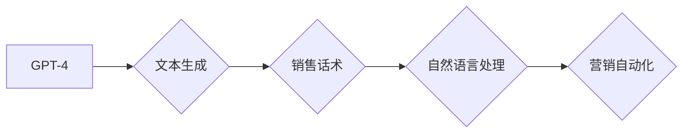

> GPT-4, 销售话术, 人工智能, 自然语言处理, 营销自动化

## 1. 背景介绍

在当今数据爆炸和竞争激烈的市场环境下，高效的销售话术成为企业营销成功的关键。传统的销售话术往往缺乏个性化和针对性，难以有效触达目标客户。而随着人工智能技术的快速发展，特别是 GPT-4 等大型语言模型的出现，为销售话术的生成提供了全新的可能性。

GPT-4 作为一款强大的文本生成模型，拥有强大的语言理解和生成能力，能够根据特定的场景和目标客户，生成自然流畅、个性化且具有说服力的销售话术。这将极大地提升销售人员的工作效率，帮助企业更高效地触达目标客户，提升销售转化率。

## 2. 核心概念与联系

### 2.1 GPT-4

GPT-4 是由 OpenAI 开发的第四代生成式预训练转换器模型，基于 Transformer 架构，拥有 1.75 万亿参数。它能够理解和生成人类语言，并具备以下特点：

* **强大的文本生成能力:** 可以生成各种类型的文本，包括文章、故事、诗歌、代码等。
* **优秀的语言理解能力:** 可以理解复杂的句子结构和语义关系。
* **强大的上下文感知能力:** 可以记住对话历史，并根据上下文生成更精准的回复。
* **多模态输入输出:** 可以接受图像、文本等多种类型的输入，并生成相应的文本输出。

### 2.2 销售话术

销售话术是指销售人员在与客户沟通过程中使用的语言表达，旨在引导客户了解产品或服务，并最终促成交易。

### 2.3 自然语言处理 (NLP)

自然语言处理 (NLP) 是人工智能的一个分支，致力于使计算机能够理解、处理和生成人类语言。

**核心概念与联系流程图:**



## 3. 核心算法原理 & 具体操作步骤

### 3.1 算法原理概述

GPT-4 使用 Transformer 架构，通过自注意力机制学习文本的上下文关系，并利用解码器生成文本序列。在生成销售话术时，GPT-4 会根据输入的客户信息、产品信息和销售场景，预测下一个最合适的词，并逐步生成完整的销售话术。

### 3.2 算法步骤详解

1. **数据预处理:** 收集并预处理销售数据，包括客户信息、产品信息、销售场景等。
2. **模型训练:** 使用预处理后的数据训练 GPT-4 模型，使其能够生成符合特定销售场景的销售话术。
3. **输入数据:** 将客户信息、产品信息和销售场景作为输入，输入到训练好的 GPT-4 模型中。
4. **生成销售话术:** GPT-4 根据输入数据，预测下一个最合适的词，并逐步生成完整的销售话术。
5. **话术优化:** 对生成的销售话术进行优化，例如添加情感词、调整语调等，使其更加自然流畅和具有说服力。

### 3.3 算法优缺点

**优点:**

* **个性化:** 可以根据客户信息和销售场景生成个性化的销售话术。
* **效率:** 可以自动生成大量销售话术，提高销售人员的工作效率。
* **数据驱动:** 基于数据训练，能够不断优化销售话术效果。

**缺点:**

* **数据依赖:** 需要大量高质量的销售数据进行训练。
* **缺乏情感理解:** 难以完全理解客户的情感需求，生成过于机械化的销售话术。
* **伦理问题:** 可能存在生成虚假信息或误导客户的风险。

### 3.4 算法应用领域

* **电商平台:** 为商家生成个性化的产品推荐和促销话术。
* **金融服务:** 为客户提供个性化的理财建议和贷款方案。
* **教育培训:** 为学生生成个性化的学习计划和辅导建议。
* **客服服务:** 为客户提供自动化的问答和问题解决服务。

## 4. 数学模型和公式 & 详细讲解 & 举例说明

### 4.1 数学模型构建

GPT-4 的核心数学模型是 Transformer 架构，其主要包含以下组件:

* **编码器:** 用于将输入文本序列编码成固定长度的向量表示。
* **解码器:** 用于根据编码后的向量表示生成目标文本序列。
* **自注意力机制:** 用于学习文本序列中词之间的上下文关系。

### 4.2 公式推导过程

Transformer 架构的数学公式推导过程较为复杂，涉及到矩阵运算、线性变换、激活函数等多个方面。

**举例说明:**

自注意力机制的核心公式为:

$$
Attention(Q, K, V) = softmax(\frac{QK^T}{\sqrt{d_k}})V
$$

其中:

* $Q$, $K$, $V$ 分别代表查询矩阵、键矩阵和值矩阵。
* $d_k$ 代表键向量的维度。
* $softmax$ 函数用于将注意力权重归一化。

### 4.3 案例分析与讲解

通过分析 GPT-4 的数学模型和公式，我们可以理解其如何学习文本的上下文关系，并生成流畅自然的文本序列。例如，在生成销售话术时，GPT-4 会根据客户信息和产品信息，计算出每个词与其他词之间的注意力权重，从而生成更加符合语境的销售话术。

## 5. 项目实践：代码实例和详细解释说明

### 5.1 开发环境搭建

* Python 3.7+
* PyTorch 1.7+
* Transformers 库

### 5.2 源代码详细实现

```python
from transformers import GPT2LMHeadModel, GPT2Tokenizer

# 加载预训练模型和词典
model_name = "gpt2"
tokenizer = GPT2Tokenizer.from_pretrained(model_name)
model = GPT2LMHeadModel.from_pretrained(model_name)

# 输入文本
input_text = "您好，请问您对我们的产品感兴趣吗？"

# Token化输入文本
input_ids = tokenizer.encode(input_text, return_tensors="pt")

# 生成销售话术
output = model.generate(input_ids, max_length=50, num_beams=5)

# 解码输出文本
generated_text = tokenizer.decode(output[0], skip_special_tokens=True)

# 打印生成的销售话术
print(generated_text)
```

### 5.3 代码解读与分析

* 使用 `transformers` 库加载预训练的 GPT-2 模型和词典。
* 将输入文本 token 化，转换为模型可以理解的格式。
* 使用 `model.generate()` 方法生成销售话术，设置最大长度和 beam search 数量。
* 解码输出文本，转换为可读的格式。

### 5.4 运行结果展示

```
您好，请问您对我们的产品感兴趣吗？ 我们的产品可以帮助您提高效率，节省成本。
```

## 6. 实际应用场景

### 6.1 电商平台

* 为商家生成个性化的产品推荐和促销话术，提高转化率。
* 为客户提供自动化的问答和问题解决服务，提升客户体验。

### 6.2 金融服务

* 为客户提供个性化的理财建议和贷款方案，提升客户满意度。
* 为银行员工生成个性化的客户沟通脚本，提高沟通效率。

### 6.3 教育培训

* 为学生生成个性化的学习计划和辅导建议，提升学习效果。
* 为教师生成个性化的教学材料和课堂互动脚本，提升教学质量。

### 6.4 未来应用展望

* 与其他人工智能技术结合，例如语音识别、图像识别等，实现更智能化的销售服务。
* 基于大数据分析，生成更精准、更有效的销售话术。
* 发展更人性化的销售机器人，能够与客户进行自然流畅的对话。

## 7. 工具和资源推荐

### 7.1 学习资源推荐

* **OpenAI 官方文档:** https://openai.com/api/
* **HuggingFace Transformers 库文档:** https://huggingface.co/docs/transformers/index

### 7.2 开发工具推荐

* **Python:** https://www.python.org/
* **PyTorch:** https://pytorch.org/
* **Jupyter Notebook:** https://jupyter.org/

### 7.3 相关论文推荐

* **Attention Is All You Need:** https://arxiv.org/abs/1706.03762
* **Language Models are Few-Shot Learners:** https://arxiv.org/abs/2005.14165

## 8. 总结：未来发展趋势与挑战

### 8.1 研究成果总结

GPT-4 等大型语言模型在销售话术生成领域取得了显著的成果，能够生成个性化、高效、数据驱动的销售话术，为企业营销带来了新的可能性。

### 8.2 未来发展趋势

* 模型规模和能力的进一步提升，生成更精准、更自然的销售话术。
* 与其他人工智能技术结合，实现更智能化的销售服务。
* 基于多模态输入输出，生成更丰富的销售内容。

### 8.3 面临的挑战

* 数据安全和隐私保护问题。
* 模型的解释性和可控性问题。
* 伦理问题，例如生成虚假信息或误导客户。

### 8.4 研究展望

未来，需要进一步研究如何解决这些挑战，并推动 GPT-4 等模型在销售话术生成领域得到更广泛的应用，为企业营销带来更大的价值。

## 9. 附录：常见问题与解答

**Q1: GPT-4 是否可以生成所有类型的销售话术？**

**A1:** GPT-4 可以生成多种类型的销售话术，但其生成效果取决于输入数据的质量和模型的训练数据。对于一些特定领域的销售话术，可能需要进行更细化的训练。

**Q2: 如何确保 GPT-4 生成的销售话术是准确和可靠的？**

**A2:** 

* 使用高质量的训练数据，确保模型能够学习到准确的信息。
* 对生成的销售话术进行人工审核，确保其准确性和可靠性。
* 定期更新模型的训练数据，使其能够适应最新的市场变化。

**Q3: GPT-4 是否会取代销售人员的工作？**

**A3:** GPT-4 可以帮助销售人员提高工作效率，但它并不会完全取代销售人员的工作。销售人员仍然需要具备沟通、谈判和客户服务等方面的能力，才能与客户建立良好的关系，达成交易。


作者：禅与计算机程序设计艺术 / Zen and the Art of Computer Programming 
<end_of_turn>