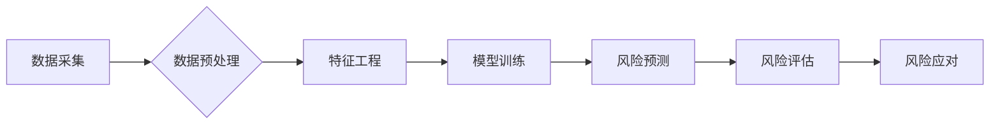

> 供应链风险管理, AI预测, 机器学习, 深度学习, 自然语言处理, 时间序列分析, 风险评估

## 1. 背景介绍

在当今全球化经济体系中，供应链风险已成为企业面临的重大挑战。供应链的复杂性和不可预测性使得企业更容易受到各种风险的影响，例如自然灾害、政治动荡、经济波动、疫情爆发等。这些风险可能导致供应中断、成本增加、交付延迟，甚至损害企业声誉。

传统供应链风险管理方法主要依赖于经验和专家判断，缺乏数据驱动和预测能力。随着人工智能（AI）技术的快速发展，AI为供应链风险管理提供了新的机遇。AI算法能够从海量数据中识别模式和趋势，并预测潜在的风险，从而帮助企业提前预警、制定应对措施，降低风险损失。

## 2. 核心概念与联系

**2.1 供应链风险**

供应链风险是指在供应链中可能发生的任何事件或情况，这些事件或情况可能会对供应链的正常运行造成负面影响。供应链风险可以分为以下几类：

* **自然灾害风险:** 地震、洪水、火灾等自然灾害可能导致供应链中断。
* **政治风险:** 政治动荡、战争、贸易摩擦等政治事件可能影响供应链的稳定性。
* **经济风险:** 经济衰退、通货膨胀、汇率波动等经济因素可能导致供应链成本增加。
* **运营风险:** 供应商倒闭、生产故障、物流延误等运营问题可能导致供应链中断。
* **安全风险:** 数据泄露、网络攻击、产品安全问题等安全风险可能损害企业声誉。

**2.2 AI预测**

AI预测是指利用人工智能算法从历史数据中学习模式和趋势，并预测未来事件或情况的发生概率。AI预测技术广泛应用于各个领域，例如金融、医疗、交通等。

**2.3 供应链风险管理与AI预测的联系**

AI预测技术可以帮助企业识别和预测供应链风险，从而提高风险管理的效率和准确性。

**2.4 核心架构**



## 3. 核心算法原理 & 具体操作步骤

**3.1 算法原理概述**

AI预测供应链风险主要依赖于机器学习算法。机器学习算法可以从历史数据中学习模式和趋势，并预测未来事件或情况的发生概率。常用的机器学习算法包括：

* **线性回归:** 用于预测连续变量，例如供应链成本、交货时间等。
* **逻辑回归:** 用于预测分类变量，例如供应链风险等级、产品质量问题等。
* **决策树:** 用于构建决策规则，例如根据供应商信用等级判断风险等级。
* **支持向量机:** 用于分类和回归，能够处理高维数据。
* **神经网络:** 用于处理复杂数据模式，例如预测供应链中断的概率。

**3.2 算法步骤详解**

1. **数据采集:** 收集相关供应链数据，例如供应商信息、订单数据、物流数据、市场数据等。
2. **数据预处理:** 清洗、转换和格式化数据，例如处理缺失值、异常值、数据类型转换等。
3. **特征工程:** 从原始数据中提取特征，例如供应商信用等级、订单数量、运输距离等，这些特征可以用于训练机器学习模型。
4. **模型训练:** 选择合适的机器学习算法，并使用训练数据训练模型，调整模型参数，使模型能够准确预测风险。
5. **模型评估:** 使用测试数据评估模型的性能，例如准确率、召回率、F1-score等指标。
6. **模型部署:** 将训练好的模型部署到生产环境中，用于实时预测供应链风险。

**3.3 算法优缺点**

* **优点:**

    * 数据驱动: 基于历史数据进行预测，更客观准确。
    * 预测能力强: 可以预测未来风险的发生概率。
    * 自动化程度高: 可以自动化预测风险，减少人工成本。

* **缺点:**

    * 数据依赖: 需要大量高质量的数据进行训练。
    * 黑盒效应: 某些算法难以解释预测结果，缺乏可解释性。
    * 算法更新: 需要定期更新模型，以适应变化的风险环境。

**3.4 算法应用领域**

* **风险识别:** 识别潜在的供应链风险，例如供应商风险、物流风险、市场风险等。
* **风险评估:** 评估风险的严重程度和可能性，制定相应的风险应对措施。
* **风险监控:** 实时监控供应链风险，及时发现和应对风险事件。
* **风险控制:** 建立风险控制机制，降低供应链风险的发生概率。

## 4. 数学模型和公式 & 详细讲解 & 举例说明

**4.1 数学模型构建**

供应链风险预测模型通常采用回归模型或分类模型。回归模型用于预测连续变量，例如供应链成本、交货时间等。分类模型用于预测分类变量，例如供应链风险等级、产品质量问题等。

**4.2 公式推导过程**

例如，使用线性回归模型预测供应链成本，模型公式如下：

$$
Cost = \beta_0 + \beta_1 * Supplier_Credit + \beta_2 * Order_Quantity + \beta_3 * Transport_Distance + \epsilon
$$

其中：

* $Cost$ 是供应链成本
* $Supplier\_Credit$ 是供应商信用等级
* $Order\_Quantity$ 是订单数量
* $Transport\_Distance$ 是运输距离
* $\beta_0$, $\beta_1$, $\beta_2$, $\beta_3$ 是模型参数
* $\epsilon$ 是误差项

模型参数可以通过最小二乘法估计。

**4.3 案例分析与讲解**

假设我们收集了以下数据：

| Supplier_Credit | Order_Quantity | Transport_Distance | Cost |
|---|---|---|---|
| 1 | 100 | 100 | 1000 |
| 2 | 200 | 200 | 2000 |
| 3 | 150 | 150 | 1500 |

我们可以使用线性回归模型训练模型，并预测新的供应链成本。例如，如果供应商信用等级为 2，订单数量为 100，运输距离为 100，则预测的供应链成本为：

$$
Cost = \beta_0 + \beta_1 * 2 + \beta_2 * 100 + \beta_3 * 100 + \epsilon
$$

## 5. 项目实践：代码实例和详细解释说明

**5.1 开发环境搭建**

* Python 3.x
* Jupyter Notebook
* scikit-learn

**5.2 源代码详细实现**

```python
import pandas as pd
from sklearn.linear_model import LinearRegression
from sklearn.model_selection import train_test_split

# 加载数据
data = pd.read_csv('supply_chain_data.csv')

# 划分训练集和测试集
X = data[['Supplier_Credit', 'Order_Quantity', 'Transport_Distance']]
y = data['Cost']
X_train, X_test, y_train, y_test = train_test_split(X, y, test_size=0.2, random_state=42)

# 创建线性回归模型
model = LinearRegression()

# 训练模型
model.fit(X_train, y_train)

# 预测测试集数据
y_pred = model.predict(X_test)

# 评估模型性能
from sklearn.metrics import mean_squared_error
mse = mean_squared_error(y_test, y_pred)
print(f'Mean Squared Error: {mse}')
```

**5.3 代码解读与分析**

1. 导入必要的库，例如 pandas 用于数据处理，scikit-learn 用于机器学习。
2. 加载数据，并划分训练集和测试集。
3. 创建线性回归模型，并使用训练集训练模型。
4. 使用训练好的模型预测测试集数据。
5. 评估模型性能，例如使用均方误差 (MSE) 作为评价指标。

**5.4 运行结果展示**

运行代码后，会输出模型的均方误差值。MSE 值越小，模型的预测精度越高。

## 6. 实际应用场景

**6.1 供应商风险评估**

AI可以分析供应商的财务状况、信用记录、生产能力等信息，评估供应商的风险等级，帮助企业选择可靠的供应商。

**6.2 物流风险预测**

AI可以分析物流数据，例如运输时间、天气状况、交通拥堵等信息，预测物流风险，例如运输延误、货物丢失等。

**6.3 市场风险监控**

AI可以分析市场数据，例如价格波动、需求变化、竞争对手动态等信息，监控市场风险，例如产品价格下跌、市场需求下降等。

**6.4 未来应用展望**

随着人工智能技术的不断发展，AI在供应链风险管理领域的应用将更加广泛和深入。例如：

* **更精准的风险预测:** 利用更先进的机器学习算法和数据分析技术，提高风险预测的准确性和时效性。
* **更全面的风险管理:** 将AI与其他技术，例如区块链、物联网等结合，实现更全面的供应链风险管理。
* **更智能的风险应对:** 利用AI自动生成风险应对方案，并根据实际情况进行调整，提高风险应对的效率和效果。

## 7. 工具和资源推荐

**7.1 学习资源推荐**

* **书籍:**
    * "Deep Learning" by Ian Goodfellow, Yoshua Bengio, and Aaron Courville
    * "Hands-On Machine Learning with Scikit-Learn, Keras & TensorFlow" by Aurélien Géron
* **在线课程:**
    * Coursera: Machine Learning by Andrew Ng
    * edX: Artificial Intelligence by Columbia University

**7.2 开发工具推荐**

* **Python:** 广泛使用的编程语言，用于机器学习和数据分析。
* **scikit-learn:** Python机器学习库，提供各种机器学习算法和工具。
* **TensorFlow:** 开源深度学习框架，用于构建和训练深度学习模型。
* **Keras:** 高级深度学习API，易于使用，可以运行在TensorFlow、Theano或CNTK后端。

**7.3 相关论文推荐**

* "Supply Chain Risk Management Using Machine Learning" by A. Kumar et al.
* "Predicting Supply Chain Disruptions Using Machine Learning" by S. Lee et al.

## 8. 总结：未来发展趋势与挑战

**8.1 研究成果总结**

AI技术在供应链风险管理领域取得了显著的成果，能够提高风险预测的准确性和时效性，帮助企业更好地应对供应链风险。

**8.2 未来发展趋势**

* **更精准的风险预测:** 利用更先进的机器学习算法和数据分析技术，提高风险预测的准确性和时效性。
* **更全面的风险管理:** 将AI与其他技术，例如区块链、物联网等结合，实现更全面的供应链风险管理。
* **更智能的风险应对:** 利用AI自动生成风险应对方案，并根据实际情况进行调整，提高风险应对的效率和效果。

**8.3 面临的挑战**

* **数据质量:** AI模型的性能依赖于数据质量，需要确保数据准确、完整、及时。
* **算法解释性:** 某些AI算法难以解释预测结果，缺乏可解释性，难以获得用户的信任。
* **技术伦理:** AI技术应用需要考虑伦理问题，例如数据隐私、算法偏见等。

**8.4 研究展望**

未来研究方向包括：

* 开发更精准、更鲁棒的AI风险预测模型。
* 提高AI算法的可解释性，增强用户信任。
* 研究AI技术在供应链风险管理中的伦理问题，确保技术