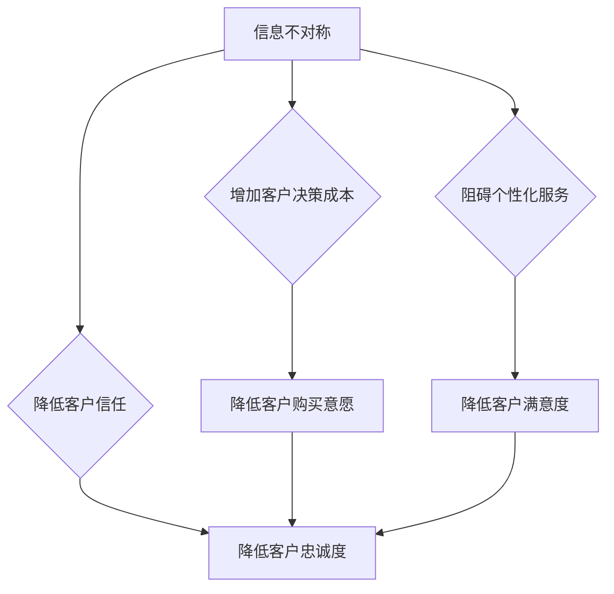

> 信息差、信息不对称、客户忠诚度、数据分析、个性化推荐、用户体验、商业模式

## 1. 背景介绍

在当今信息爆炸的时代，信息已经成为企业竞争的核心资源。然而，信息并非总是平等地分布，信息不对称现象普遍存在。信息差是指不同主体之间对同一事物或信息的认知水平、掌握程度和利用方式存在差异。在商业领域，信息差往往体现在企业对客户需求、市场趋势和竞争对手动向的了解程度上。

客户忠诚度是指客户对特定品牌或产品的持续购买和推荐意愿。它不仅是企业长期发展的基石，也是衡量企业品牌价值的重要指标。然而，信息差的存在会对客户忠诚度的形成和维持产生重大影响。

## 2. 核心概念与联系

**2.1 信息不对称的类型**

信息不对称可以分为以下几种类型：

* **生产者-消费者不对称:** 企业对消费者需求的了解程度高于消费者对产品信息的了解程度。
* **消费者-消费者不对称:** 不同消费者之间对产品信息的掌握程度和认知水平存在差异。
* **企业内部不对称:** 不同部门或人员之间对企业战略、市场信息和产品开发等方面的了解程度存在差异。

**2.2 信息差与客户忠诚度的关系**

信息差会对客户忠诚度产生以下影响：

* **降低客户信任:** 当客户对企业信息缺乏了解或存在信息偏差时，会降低对企业的信任度，从而影响忠诚度。
* **增加客户决策成本:** 信息不对称会增加客户获取信息和做出决策的成本，从而降低客户的购买意愿和忠诚度。
* **阻碍个性化服务:** 信息差会阻碍企业对客户需求的精准把握，难以提供个性化服务，从而降低客户的满意度和忠诚度。

**2.3 信息差的弥补与客户忠诚度提升**

企业可以通过以下方式弥补信息差，提升客户忠诚度：

* **加强数据分析:** 利用数据分析技术，深入了解客户需求、行为模式和偏好，提供更精准的个性化服务。
* **构建透明的沟通机制:** 建立开放透明的沟通机制，及时向客户提供产品信息、服务更新和企业动态，增强客户的信任感。
* **提供多元化的信息渠道:** 通过网站、社交媒体、邮件营销等多元化的信息渠道，满足客户获取信息的多样化需求。

**2.4 Mermaid 流程图**



## 3. 核心算法原理 & 具体操作步骤

**3.1 算法原理概述**

为了弥补信息差，提升客户忠诚度，企业可以采用一些算法和技术，例如：

* **协同过滤算法:** 通过分析用户历史行为数据，预测用户对特定产品的喜好，推荐相关产品。
* **内容过滤算法:** 根据用户对产品的评价和反馈，推荐与用户兴趣相符的内容。
* **混合推荐算法:** 结合协同过滤和内容过滤算法，提高推荐的准确性和个性化程度。

**3.2 算法步骤详解**

以协同过滤算法为例，其具体操作步骤如下：

1. **数据收集:** 收集用户对产品的评分、评价、购买记录等数据。
2. **数据预处理:** 对数据进行清洗、转换和格式化，去除噪声数据和缺失值。
3. **相似度计算:** 计算用户之间或商品之间的相似度，例如使用余弦相似度或皮尔逊相关系数。
4. **推荐生成:** 根据用户与商品的相似度，推荐用户可能感兴趣的商品。

**3.3 算法优缺点**

**优点:**

* **个性化推荐:** 能够根据用户的兴趣和偏好，提供个性化的产品推荐。
* **数据驱动:** 基于用户行为数据，推荐结果更加准确和可靠。

**缺点:**

* **冷启动问题:** 对新用户或新商品的推荐效果较差。
* **数据稀疏性:** 当用户数据量较少时，算法效果会受到影响。

**3.4 算法应用领域**

协同过滤算法广泛应用于以下领域：

* **电子商务:** 商品推荐、用户画像
* **社交媒体:** 内容推荐、用户匹配
* **音乐流媒体:** 歌曲推荐、用户发现
* **电影推荐:** 电影推荐、用户兴趣分析

## 4. 数学模型和公式 & 详细讲解 & 举例说明

**4.1 数学模型构建**

协同过滤算法的核心是计算用户或商品之间的相似度。常用的相似度度量方法包括余弦相似度和皮尔逊相关系数。

**4.2 公式推导过程**

* **余弦相似度:**

$$
\text{相似度} = \frac{\mathbf{u} \cdot \mathbf{v}}{\|\mathbf{u}\| \|\mathbf{v}\|}
$$

其中，$\mathbf{u}$ 和 $\mathbf{v}$ 分别表示两个用户的向量表示，$\cdot$ 表示点积，$\|\mathbf{u}\|$ 和 $\|\mathbf{v}\|$ 分别表示两个向量的模长。

* **皮尔逊相关系数:**

$$
\text{相似度} = \frac{\sum_{i=1}^{n}(u_i - \bar{u})(v_i - \bar{v})}{\sqrt{\sum_{i=1}^{n}(u_i - \bar{u})^2} \sqrt{\sum_{i=1}^{n}(v_i - \bar{v})^2}}
$$

其中，$u_i$ 和 $v_i$ 分别表示两个用户对第 $i$ 个商品的评分，$\bar{u}$ 和 $\bar{v}$ 分别表示两个用户的平均评分。

**4.3 案例分析与讲解**

假设有两个用户 A 和 B，他们对三个商品的评分如下：

| 商品 | 用户 A | 用户 B |
|---|---|---|
| 商品 1 | 5 | 4 |
| 商品 2 | 3 | 2 |
| 商品 3 | 4 | 5 |

我们可以使用余弦相似度或皮尔逊相关系数计算用户 A 和 B 之间的相似度。例如，使用余弦相似度计算结果为 0.6，表明用户 A 和 B 的兴趣偏好有一定的相似性。

## 5. 项目实践：代码实例和详细解释说明

**5.1 开发环境搭建**

* Python 3.x
* Pandas
* Scikit-learn

**5.2 源代码详细实现**

```python
import pandas as pd
from sklearn.metrics.pairwise import cosine_similarity

# 数据加载
data = pd.read_csv('ratings.csv')

# 数据预处理
user_item_matrix = data.pivot_table(index='user_id', columns='item_id', values='rating')

# 余弦相似度计算
user_similarity = cosine_similarity(user_item_matrix)

# 推荐算法
def recommend_items(user_id, top_n=5):
    similar_users = user_similarity[user_id].argsort()[:-top_n-1:-1]
    recommended_items = user_item_matrix.iloc[similar_users].mean().sort_values(ascending=False).index
    return recommended_items

# 推荐结果展示
user_id = 1
recommendations = recommend_items(user_id)
print(f'推荐给用户 {user_id} 的 {len(recommendations)} 个商品：')
print(recommendations)
```

**5.3 代码解读与分析**

* 数据加载：使用 Pandas 读取评分数据。
* 数据预处理：将评分数据转换为用户-商品矩阵。
* 余弦相似度计算：使用 Scikit-learn 的 `cosine_similarity` 函数计算用户之间的相似度。
* 推荐算法：根据用户相似度，推荐用户可能感兴趣的商品。
* 推荐结果展示：打印推荐结果。

**5.4 运行结果展示**

运行代码后，将输出推荐给指定用户 ID 的商品列表。

## 6. 实际应用场景

**6.1 电子商务平台**

电商平台可以利用协同过滤算法推荐商品，提高用户购买意愿和复购率。例如，亚马逊、淘宝等平台都采用协同过滤算法进行商品推荐。

**6.2 音乐流媒体平台**

音乐流媒体平台可以利用协同过滤算法推荐歌曲，帮助用户发现新的音乐和艺术家。例如，Spotify、Apple Music 等平台都采用协同过滤算法进行歌曲推荐。

**6.3 社交媒体平台**

社交媒体平台可以利用协同过滤算法推荐用户关注的人和内容，提高用户活跃度和粘性。例如，Facebook、Twitter 等平台都采用协同过滤算法进行用户匹配和内容推荐。

**6.4 未来应用展望**

随着人工智能技术的不断发展，协同过滤算法将在更多领域得到应用，例如：

* **个性化教育:** 根据学生的学习情况和兴趣，推荐个性化的学习资源。
* **医疗保健:** 根据患者的病史和症状，推荐合适的医疗方案。
* **金融服务:** 根据用户的投资偏好和风险承受能力，推荐个性化的投资产品。

## 7. 工具和资源推荐

**7.1 学习资源推荐**

* **书籍:**
    * 《推荐系统》
    * 《机器学习》
* **在线课程:**
    * Coursera: Recommender Systems
    * edX: Machine Learning

**7.2 开发工具推荐**

* **Python:** 
    * Pandas
    * Scikit-learn
    * TensorFlow
* **Spark:** 
    * MLlib

**7.3 相关论文推荐**

* **协同过滤算法的经典论文:**
    * "Collaborative Filtering: A User-Based Approach"
    * "Memory-Based Collaborative Filtering"
* **最新推荐系统研究论文:**
    * 可以在 ACL, KDD, SIGIR 等顶会论文集上查找

## 8. 总结：未来发展趋势与挑战

**8.1 研究成果总结**

协同过滤算法在推荐系统领域取得了显著的成果，能够有效地推荐用户感兴趣的内容。

**8.2 未来发展趋势**

* **深度学习:** 将深度学习技术应用于协同过滤算法，提高推荐的准确性和个性化程度。
* **多模态推荐:** 将文本、图像、音频等多模态数据融合到协同过滤算法中，提供更丰富的推荐结果。
* **联邦学习:** 利用联邦学习技术，在保护用户隐私的前提下进行协同过滤算法训练。

**8.3 面临的挑战**

* **冷启动问题:** 对新用户或新商品的推荐效果较差。
* **数据稀疏性:** 当用户数据量较少时，算法效果会受到影响。
* **数据质量:** 数据的准确性和完整性会影响算法的性能。

**8.4 研究展望**

未来研究将重点关注解决协同过滤算法面临的挑战，提高算法的鲁棒性和泛化能力，并将其应用于更多领域。

## 9. 附录：常见问题与解答

**9.1 如何解决冷启动问题？**

* 利用用户画像和商品特征进行初始化推荐。
* 采用基于内容过滤的推荐算法。
* 利用其他数据源，例如社交网络数据，进行补充信息获取。

**9.2 如何处理数据稀疏性问题？**

* 使用矩阵分解技术，将用户-商品矩阵分解成低维空间。
* 使用聚类算法，将用户和商品进行分组，提高数据密度。
* 使用迁移学习技术，将已训练好的模型迁移到新的数据集上。


作者：禅与计算机程序设计艺术 / Zen and the Art of Computer Programming 
<end_of_turn>