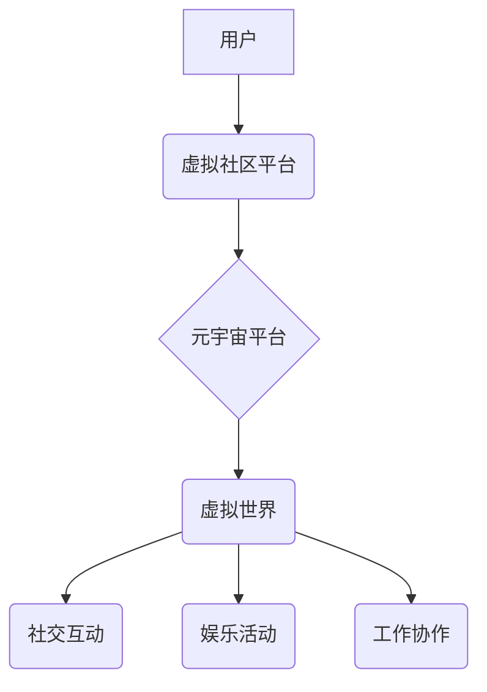

> 元宇宙、虚拟社区、社交网络、沉浸式体验、Web3.0、区块链、去中心化

## 1. 背景介绍

互联网的发展经历了从静态网页到动态网页、社交网络、移动互联网的演变，如今，我们正站在一个新的技术浪潮的边缘——元宇宙。元宇宙的概念最早出现在科幻小说中，指的是一个由虚拟现实、增强现实和互联网技术融合而成的虚拟世界，用户可以在其中进行社交、娱乐、工作等活动。

虚拟社区作为元宇宙的重要组成部分，将为人们提供一个全新的社交体验。传统的社交网络平台存在着中心化、数据隐私泄露、内容审核等问题，而虚拟社区则可以利用区块链技术实现去中心化，保障用户数据安全和隐私，同时，更丰富的交互方式和沉浸式体验将为用户带来更深层的社交连接。

## 2. 核心概念与联系

**2.1 虚拟社区的概念**

虚拟社区是指在网络空间中，基于共同兴趣、目标或身份认同而形成的群体。成员通过网络平台进行交流、互动，构建虚拟的社交关系和共同体。

**2.2 元宇宙的概念**

元宇宙是一个由虚拟现实、增强现实和互联网技术融合而成的虚拟世界，用户可以在其中进行社交、娱乐、工作等活动。

**2.3 核心概念联系**

虚拟社区是元宇宙的重要组成部分，它为元宇宙提供了社交和互动功能，丰富了元宇宙的体验。

**2.4 架构图**



## 3. 核心算法原理 & 具体操作步骤

**3.1 算法原理概述**

虚拟社区的构建需要涉及到多种算法，例如：

* **社区发现算法:** 用于识别用户之间的潜在关系，将用户分组到不同的社区中。
* **推荐算法:** 根据用户的兴趣和行为，推荐相关的内容和用户。
* **内容过滤算法:** 过滤掉不合适的或有害的内容，保障社区的健康发展。

**3.2 算法步骤详解**

以社区发现算法为例，其步骤可以概括为以下几个方面：

1. **构建用户关系图:** 将用户之间的关系表示为图结构，其中用户为节点，关系为边。
2. **选择社区发现算法:** 根据实际需求选择合适的算法，例如 Louvain算法、Girvan-Newman算法等。
3. **执行算法:** 将用户关系图输入到算法中，得到社区划分结果。
4. **评估结果:** 评估社区划分结果的质量，例如模块度、密度等指标。

**3.3 算法优缺点**

不同的社区发现算法具有不同的优缺点，需要根据实际情况选择合适的算法。

* **Louvain算法:** 效率高，但容易陷入局部最优解。
* **Girvan-Newman算法:** 能够找到全局最优解，但效率较低。

**3.4 算法应用领域**

社区发现算法广泛应用于社交网络分析、推荐系统、信息检索等领域。

## 4. 数学模型和公式 & 详细讲解 & 举例说明

**4.1 数学模型构建**

社区发现算法通常基于图论模型，将用户关系表示为图结构。

* **节点:** 用户
* **边:** 用户之间的关系

**4.2 公式推导过程**

Louvain算法的核心思想是迭代地调整节点的社区归属，以最大化社区的模块度。模块度是一个衡量社区结构的指标，其公式如下：

$$
Q = \frac{1}{2m} \sum_{i,j} A_{ij} \left( \frac{k_i}{m} - \frac{c_i c_j}{m} \right)
$$

其中：

* $m$ 是图的总边数
* $A_{ij}$ 是图中节点 $i$ 和节点 $j$ 之间的边权
* $k_i$ 是节点 $i$ 的度数
* $c_i$ 是节点 $i$ 所属的社区的标识

**4.3 案例分析与讲解**

假设有一个社交网络，其中用户之间通过点赞、评论等行为建立关系。我们可以将用户关系表示为图结构，然后使用Louvain算法进行社区发现。算法会迭代地调整节点的社区归属，最终得到一个模块度最高的社区划分结果。

## 5. 项目实践：代码实例和详细解释说明

**5.1 开发环境搭建**

* Python 3.x
* NetworkX 库

**5.2 源代码详细实现**

```python
import networkx as nx

# 创建用户关系图
graph = nx.Graph()
graph.add_edges_from([(1, 2), (1, 3), (2, 3), (2, 4), (3, 5)])

# 使用Louvain算法进行社区发现
communities = nx.community.greedy_modularity_communities(graph)

# 打印社区划分结果
print(communities)
```

**5.3 代码解读与分析**

* `networkx` 库提供了丰富的图论算法和工具。
* `greedy_modularity_communities()` 函数使用 Louvain算法进行社区发现。
* `communities` 变量存储了社区划分结果，每个社区是一个包含用户ID的列表。

**5.4 运行结果展示**

```
[{1, 2, 3}, {4, 5}]
```

结果表明，用户1、2、3构成一个社区，用户4、5构成另一个社区。

## 6. 实际应用场景

**6.1 社交网络平台**

虚拟社区可以帮助社交网络平台实现更精准的用户推荐、兴趣小组的建立和管理，以及更丰富的社交互动体验。

**6.2 游戏平台**

虚拟社区可以为游戏玩家提供一个交流、合作和竞争的平台，增强游戏体验和用户粘性。

**6.3 教育平台**

虚拟社区可以为学生提供一个学习、交流和合作的平台，促进学习效果和知识共享。

**6.4 未来应用展望**

随着元宇宙的发展，虚拟社区将发挥越来越重要的作用，例如：

* **虚拟办公空间:** 用户可以在虚拟社区中进行远程办公、协作和交流。
* **虚拟商业平台:** 用户可以在虚拟社区中进行购物、交易和投资。
* **虚拟文化活动:** 用户可以在虚拟社区中参加音乐会、展览、演出等文化活动。

## 7. 工具和资源推荐

**7.1 学习资源推荐**

* **书籍:** 《元宇宙：下一代互联网》
* **网站:** Meta, Decentraland, Sandbox

**7.2 开发工具推荐**

* **Unity:** 游戏引擎
* **Unreal Engine:** 游戏引擎
* **Web3.js:** 区块链开发工具

**7.3 相关论文推荐**

* **The Metaverse: A New Paradigm for Social Interaction**
* **Decentralized Social Networks: A Survey**

## 8. 总结：未来发展趋势与挑战

**8.1 研究成果总结**

本文介绍了元宇宙中的虚拟社区的概念、核心算法原理、项目实践以及实际应用场景。

**8.2 未来发展趋势**

虚拟社区将朝着更加沉浸式、交互式、去中心化的方向发展。

* **沉浸式体验:** 利用VR/AR技术，为用户提供更加真实的虚拟体验。
* **交互式体验:** 提供更加丰富的交互方式，例如语音、表情、肢体动作等。
* **去中心化平台:** 利用区块链技术，构建更加透明、安全、可控的虚拟社区平台。

**8.3 面临的挑战**

虚拟社区的发展也面临着一些挑战，例如：

* **技术挑战:** 如何构建更加沉浸式、交互式、安全可靠的虚拟环境。
* **社会挑战:** 如何解决虚拟社区中的隐私保护、内容监管、虚拟身份等问题。
* **经济挑战:** 如何构建虚拟社区的经济模式，实现可持续发展。

**8.4 研究展望**

未来，我们将继续深入研究虚拟社区的构建、管理和应用，探索虚拟社区在社会、经济、文化等领域的潜在价值。

## 9. 附录：常见问题与解答

**9.1 如何加入虚拟社区？**

可以通过虚拟社区平台的注册入口加入虚拟社区。

**9.2 如何保护虚拟社区中的隐私？**

虚拟社区平台通常会采用加密技术和隐私保护机制，保障用户的隐私安全。

**9.3 如何举报虚拟社区中的违规行为？**

虚拟社区平台通常会提供举报机制，用户可以举报违规行为。

作者：禅与计算机程序设计艺术 / Zen and the Art of Computer Programming


<end_of_turn>