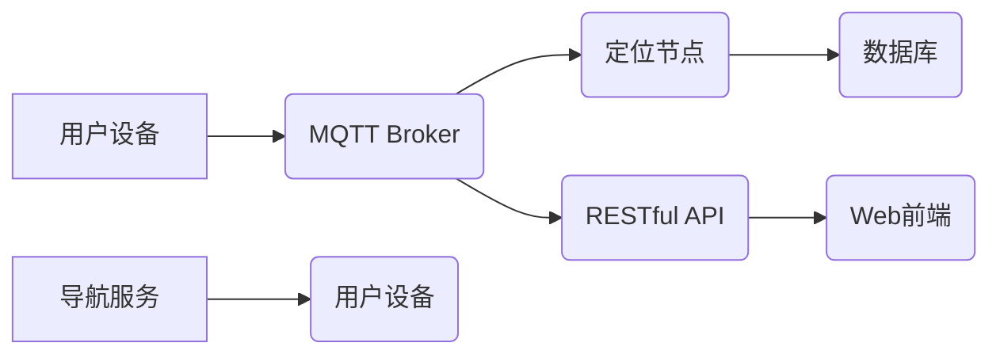

> MQTT, RESTful API, 室内定位, 导航系统,  蓝牙, Wi-Fi,  传感器,  物联网

## 1. 背景介绍

随着物联网技术的快速发展，室内定位与导航系统已成为智能家居、智慧医院、智慧商场等领域的重要应用场景。传统的室内定位技术，如GPS、超声波等，在室内环境中受限于信号遮挡、精度低等问题。近年来，基于蓝牙、Wi-Fi等无线技术的室内定位技术逐渐成为主流，并取得了显著的进展。

MQTT协议作为一种轻量级、低功耗的物联网通信协议，在室内定位系统中具有以下优势：

* **低功耗:** MQTT协议采用发布/订阅模式，减少了数据传输量，降低了设备的功耗。
* **实时性:** MQTT协议支持消息的实时传输，能够满足室内定位系统的实时定位需求。
* **可靠性:** MQTT协议支持消息确认机制，确保消息的可靠传输。

RESTful API作为一种轻量级、灵活的Web服务架构，能够方便地实现室内定位系统的接口调用和数据交互。

## 2. 核心概念与联系

### 2.1 MQTT协议

MQTT协议是一种基于TCP/IP协议的轻量级消息传输协议，主要用于物联网设备之间的通信。它采用发布/订阅模式，消息发布者将消息发布到特定的主题，订阅者可以根据自己的兴趣订阅特定的主题，接收相关消息。

### 2.2 RESTful API

RESTful API是一种基于HTTP协议的Web服务架构，它遵循一系列的约束，例如使用标准HTTP方法（GET、POST、PUT、DELETE等）、使用资源标识符（URI）来标识资源、使用状态码来表示请求结果等。RESTful API能够方便地实现资源的创建、读取、更新和删除操作。

### 2.3 室内定位与导航系统架构

基于MQTT协议和RESTful API的室内定位与导航系统架构如图所示：



**架构说明：**

* 用户设备通过MQTT协议与MQTT Broker通信，订阅定位节点发布的定位信息。
* 定位节点通过蓝牙、Wi-Fi等传感器收集室内环境信息，并将其发布到MQTT Broker。
* 数据库存储定位节点收集的室内环境信息和用户设备的定位信息。
* 导航服务根据用户设备的定位信息和目标位置，计算出导航路径并发送给用户设备。
* RESTful API提供用户设备和Web前端访问数据库和导航服务的接口。
* Web前端通过RESTful API获取定位信息和导航路径，并将其显示给用户。

## 3. 核心算法原理 & 具体操作步骤

### 3.1  算法原理概述

室内定位算法主要分为以下几种类型：

* **基于信号强度定位算法:** 这种算法利用设备接收到的信号强度来估计设备的位置。
* **基于时间差定位算法:** 这种算法利用多个定位节点发送信号到设备，并根据信号到达时间差来估计设备的位置。
* **基于机器学习定位算法:** 这种算法利用机器学习模型对室内环境信息进行建模，并根据设备的特征信息来估计设备的位置。

### 3.2  算法步骤详解

以基于信号强度定位算法为例，其具体操作步骤如下：

1. **信号强度测量:** 设备接收来自多个定位节点的信号强度。
2. **信号强度映射:** 将信号强度映射到距离，可以使用已知距离和信号强度的关系进行建模。
3. **位置估计:** 利用设备接收到的多个定位节点的距离信息，通过三角定位或其他算法来估计设备的位置。

### 3.3  算法优缺点

**优点:**

* 算法简单易实现。
* 硬件成本较低。

**缺点:**

* 精度较低，受环境因素影响较大。
* 容易受到信号遮挡的影响。

### 3.4  算法应用领域

基于信号强度定位算法广泛应用于室内定位系统，例如：

* 智能家居
* 智慧医院
* 智慧商场

## 4. 数学模型和公式 & 详细讲解 & 举例说明

### 4.1  数学模型构建

假设设备接收到的第i个定位节点的信号强度为Si，第i个定位节点与设备之间的距离为Di，则可以建立以下数学模型：

$$
Si = a * Di^b + c
$$

其中，a、b、c为常数，可以通过实验数据进行拟合。

### 4.2  公式推导过程

根据三角定位原理，可以推导出设备的位置坐标(x,y)。

假设设备接收到的三个定位节点的坐标分别为(x1,y1)、(x2,y2)、(x3,y3)，则可以根据距离公式推导出设备与每个定位节点之间的距离：

$$
Di = \sqrt{(x - xi)^2 + (y - yi)^2}
$$

将上述距离公式代入到信号强度模型中，可以得到三个方程，通过解方程组可以求出设备的位置坐标(x,y)。

### 4.3  案例分析与讲解

假设设备接收到的三个定位节点的信号强度分别为-60dBm、-70dBm、-80dBm，对应的距离分别为10米、15米、20米。

通过上述公式，可以求出设备的位置坐标。

## 5. 项目实践：代码实例和详细解释说明

### 5.1  开发环境搭建

* 操作系统：Ubuntu 20.04
* 编程语言：Python 3.8
* 开发工具：Eclipse IDE

### 5.2  源代码详细实现

```python
# 定位节点代码
import paho.mqtt.client as mqtt

# MQTT Broker地址
MQTT_BROKER_ADDRESS = "mqtt.example.com"

# 定位节点主题
LOCATE_TOPIC = "locate/data"

# 定位节点传感器数据
sensor_data = {
    "latitude": 39.9042,
    "longitude": 116.4074,
    "rssi": -60
}

def on_connect(client, userdata, flags, rc):
    if rc == 0:
        print("Connected to MQTT Broker!")
        client.subscribe(LOCATE_TOPIC)
    else:
        print("Connection failed!")

def on_message(client, userdata, msg):
    print("Received message:", msg.payload.decode())

client = mqtt.Client()
client.on_connect = on_connect
client.on_message = on_message
client.connect(MQTT_BROKER_ADDRESS)
client.loop_forever()

# 用户设备代码
import requests

# RESTful API地址
API_ADDRESS = "http://api.example.com/locate"

def get_location():
    response = requests.get(API_ADDRESS)
    data = response.json()
    return data["latitude"], data["longitude"]

latitude, longitude = get_location()
print("User location:", latitude, longitude)
```

### 5.3  代码解读与分析

* 定位节点代码：
    * 使用paho-mqtt库连接MQTT Broker。
    * 订阅LOCATE_TOPIC主题，接收用户设备的定位请求。
    * 将传感器数据发布到LOCATE_TOPIC主题。
* 用户设备代码：
    * 使用requests库访问RESTful API。
    * 获取定位信息并打印到控制台。

### 5.4  运行结果展示

* 定位节点运行后，会连接到MQTT Broker并订阅LOCATE_TOPIC主题。
* 用户设备运行后，会发送定位请求到RESTful API，并获取定位信息。

## 6. 实际应用场景

### 6.1  智能家居

室内定位系统可以帮助用户控制智能家居设备，例如：

* 根据用户的定位信息，自动调节灯光、温度等。
* 提醒用户家中未关的电器。
* 帮助用户找到家中丢失的物品。

### 6.2  智慧医院

室内定位系统可以帮助医院提高医疗效率，例如：

* 帮助医生快速定位患者。
* 帮助患者找到相应的医疗服务。
* 帮助医院管理医疗资源。

### 6.3  智慧商场

室内定位系统可以帮助商场提升购物体验，例如：

* 为顾客提供个性化的商品推荐。
* 帮助顾客找到商品的具体位置。
* 帮助商场进行客流分析。

### 6.4  未来应用展望

随着物联网技术的不断发展，室内定位与导航系统将有更广泛的应用场景，例如：

* **智慧城市:** 用于公共交通、紧急救援、城市管理等领域。
* **工业自动化:** 用于工厂生产线、仓库管理等领域。
* **教育培训:** 用于校园安全、学生定位等领域。

## 7. 工具和资源推荐

### 7.1  学习资源推荐

* **MQTT协议:** https://mqtt.org/
* **RESTful API:** https://restfulapi.net/
* **室内定位算法:** https://en.wikipedia.org/wiki/Indoor_positioning

### 7.2  开发工具推荐

* **MQTT Broker:** Mosquitto, HiveMQ
* **RESTful API框架:** Flask, Django
* **室内定位SDK:** Estimote, Kontakt.io

### 7.3  相关论文推荐

* **基于蓝牙技术的室内定位算法研究**
* **基于Wi-Fi信号强度的室内定位算法**
* **室内定位与导航系统综述**

## 8. 总结：未来发展趋势与挑战

### 8.1  研究成果总结

基于MQTT协议和RESTful API的室内定位与导航系统具有以下优势：

* **低功耗:** MQTT协议的轻量级特性降低了设备的功耗。
* **实时性:** MQTT协议的实时传输特性满足了室内定位系统的实时定位需求。
* **可靠性:** MQTT协议的可靠传输机制确保了消息的可靠传输。
* **灵活性和扩展性:** RESTful API提供了灵活的接口，方便地扩展系统功能。

### 8.2  未来发展趋势

未来室内定位与导航系统的发展趋势包括：

* **更高精度:** 利用更先进的定位算法和传感器技术，提高定位精度。
* **更智能化:** 利用人工智能技术，实现更智能的定位和导航功能。
* **更广泛的应用场景:** 将室内定位与导航技术应用于更多领域，例如智慧城市、工业自动化等。

### 8.3  面临的挑战

室内定位与导航系统还面临以下挑战：

* **环境复杂性:** 室内环境复杂，信号遮挡严重，影响定位精度。
* **数据安全:** 室内定位系统收集大量用户位置数据，需要保障数据安全。
* **标准化问题:** 目前室内定位技术缺乏统一的标准，需要加强标准化工作。

### 8.4  研究展望

未来，我们将继续致力于室内定位与导航系统的研究，探索更先进的定位算法、传感器技术和应用场景，为用户提供更精准、更智能、更便捷的室内定位与导航服务。

## 9. 附录：常见问题与解答

### 9.1  Q1: 室内定位系统精度如何？

**A1:** 室内定位系统的精度取决于多种因素，例如定位算法、传感器技术、环境复杂度等。一般来说，室内定位系统的精度在1-5米之间。

### 9.2  Q2: 室内定位系统有哪些应用场景？

**A2:** 室内定位系统广泛应用于智能家居、智慧医院、智慧商场等领域，例如：

* **智能家居:** 控制智能设备、提醒用户家中未关的电器、帮助用户找到丢失的物品。
* **智慧医院:** 帮助医生快速定位患者、帮助患者找到相应的医疗服务、帮助医院管理医疗资源。
* **智慧商场:** 为顾客提供个性化的商品推荐、帮助顾客找到商品的具体位置、帮助商场进行客流分析。

### 9.3  