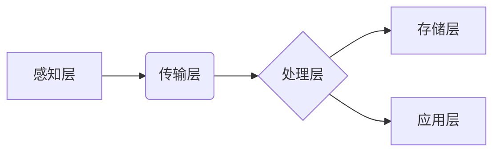

> 大数据、井盖监控、物联网、计算机视觉、机器学习、深度学习

## 1. 背景介绍

随着城市化进程的不断加速，城市基础设施建设日益完善，井盖作为城市道路的重要组成部分，承担着排水、供水、电缆等重要功能。然而，井盖的丢失、损坏、盗窃等问题频发，给城市安全和正常运行带来严重威胁。传统的井盖管理方式主要依靠人工巡查，效率低下，难以及时发现问题。

近年来，随着物联网、计算机视觉、机器学习等技术的快速发展，基于大数据的井盖监控系统应运而生。该系统利用传感器、摄像头等设备采集井盖状态信息，并通过大数据分析和机器学习算法，实现对井盖的实时监控、异常检测和智能管理，有效提高井盖管理效率，保障城市安全。

## 2. 核心概念与联系

### 2.1  井盖监控系统架构

井盖监控系统主要由以下几个模块组成：

* **感知层:** 负责采集井盖状态信息，主要包括摄像头、传感器等设备。
* **传输层:** 将感知层采集到的数据传输到云端平台。
* **处理层:** 对接收到的数据进行预处理、特征提取、异常检测等操作。
* **存储层:** 将处理后的数据存储到数据库中。
* **应用层:** 提供用户界面，展示井盖状态信息，并提供相关管理功能。



### 2.2  大数据技术应用

大数据技术在井盖监控系统中发挥着重要作用，主要体现在以下几个方面：

* **海量数据处理:** 井盖监控系统需要处理大量的图像、视频、传感器数据，大数据技术能够高效地存储、处理和分析这些数据。
* **实时分析:** 大数据技术能够实现对井盖状态信息的实时分析，及时发现异常情况。
* **数据挖掘:** 通过对历史数据进行挖掘，可以发现井盖损坏、丢失等问题的规律，为预防和管理提供依据。

## 3. 核心算法原理 & 具体操作步骤

### 3.1  算法原理概述

井盖监控系统中常用的算法包括：

* **图像识别:** 利用计算机视觉技术识别井盖的形状、颜色等特征，判断井盖是否正常。
* **异常检测:** 利用机器学习算法分析井盖状态信息，识别异常情况，例如井盖丢失、损坏、盗窃等。
* **预测分析:** 利用机器学习算法分析历史数据，预测井盖的损坏风险，提前进行维护。

### 3.2  算法步骤详解

**图像识别算法步骤:**

1. **图像预处理:** 对采集到的图像进行预处理，例如灰度化、去噪、边缘检测等，提高图像质量。
2. **特征提取:** 从预处理后的图像中提取井盖的特征，例如形状、颜色、纹理等。
3. **分类识别:** 利用机器学习算法对提取的特征进行分类识别，判断井盖是否正常。

**异常检测算法步骤:**

1. **数据收集:** 收集井盖状态信息，例如位置、时间、温度、振动等。
2. **数据预处理:** 对收集到的数据进行预处理，例如归一化、降维等，提高算法的精度。
3. **模型训练:** 利用机器学习算法对预处理后的数据进行训练，建立异常检测模型。
4. **异常检测:** 将新的井盖状态信息输入到训练好的模型中，判断是否属于异常情况。

### 3.3  算法优缺点

**图像识别算法:**

* **优点:** 识别准确率高，能够识别不同类型的井盖。
* **缺点:** 对图像质量要求高，环境光线变化较大时识别效果会下降。

**异常检测算法:**

* **优点:** 对图像质量要求低，能够实时检测异常情况。
* **缺点:** 识别精度相对较低，容易产生误报。

### 3.4  算法应用领域

井盖监控系统中的算法不仅可以应用于井盖管理，还可以应用于其他领域，例如：

* **交通监控:** 检测交通违规行为，例如闯红灯、超速行驶等。
* **安防监控:** 检测入侵行为，例如盗窃、破坏等。
* **环境监控:** 检测环境污染，例如空气质量、水质等。

## 4. 数学模型和公式 & 详细讲解 & 举例说明

### 4.1  数学模型构建

井盖监控系统中，可以使用数学模型来描述井盖状态的演变过程，例如：

* **状态转移模型:** 描述井盖状态在不同时间段的转移概率。
* **故障预测模型:** 利用历史数据预测井盖的损坏概率。

### 4.2  公式推导过程

**状态转移模型:**

假设井盖有三种状态：正常、损坏、丢失。状态转移概率矩阵为：

```latex
P = \begin{bmatrix}
p_{11} & p_{12} & p_{13} \\
p_{21} & p_{22} & p_{23} \\
p_{31} & p_{32} & p_{33}
\end{bmatrix}
```

其中，$p_{ij}$表示井盖从状态 $i$ 转移到状态 $j$ 的概率。

**故障预测模型:**

可以使用Logistic回归模型来预测井盖的损坏概率，模型公式为：

```latex
P(故障) = \frac{1}{1 + e^{-(w_0 + w_1x_1 + w_2x_2 + ... + w_nx_n)}}
```

其中，$x_1, x_2, ..., x_n$为井盖的特征变量，$w_0, w_1, w_2, ..., w_n$为模型参数。

### 4.3  案例分析与讲解

**案例:**

假设井盖状态转移概率矩阵为：

```latex
P = \begin{bmatrix}
0.9 & 0.05 & 0.05 \\
0.1 & 0.8 & 0.1 \\
0.01 & 0.05 & 0.94
\end{bmatrix}
```

则表示：

* 正常状态井盖在下一个时间段保持正常状态的概率为0.9。
* 正常状态井盖损坏的概率为0.05，丢失的概率为0.05。
* 损坏状态井盖恢复正常状态的概率为0.1，保持损坏状态的概率为0.8，丢失的概率为0.1。
* 丢失状态井盖恢复正常状态的概率为0.01，损坏的概率为0.05，保持丢失状态的概率为0.94。

## 5. 项目实践：代码实例和详细解释说明

### 5.1  开发环境搭建

* 操作系统: Ubuntu 20.04
* 编程语言: Python 3.8
* 框架: TensorFlow 2.0
* 库: OpenCV, NumPy, Pandas

### 5.2  源代码详细实现

```python
# 导入必要的库
import tensorflow as tf
from tensorflow.keras.models import Sequential
from tensorflow.keras.layers import Conv2D, MaxPooling2D, Flatten, Dense

# 定义模型结构
model = Sequential()
model.add(Conv2D(32, (3, 3), activation='relu', input_shape=(64, 64, 3)))
model.add(MaxPooling2D((2, 2)))
model.add(Conv2D(64, (3, 3), activation='relu'))
model.add(MaxPooling2D((2, 2)))
model.add(Flatten())
model.add(Dense(10, activation='softmax'))

# 编译模型
model.compile(optimizer='adam',
              loss='sparse_categorical_crossentropy',
              metrics=['accuracy'])

# 训练模型
model.fit(x_train, y_train, epochs=10)

# 评估模型
loss, accuracy = model.evaluate(x_test, y_test)
print('Loss:', loss)
print('Accuracy:', accuracy)
```

### 5.3  代码解读与分析

* **模型结构:** 该模型是一个简单的卷积神经网络，包含两个卷积层、两个池化层、一个全连接层和一个输出层。
* **激活函数:** 使用ReLU激活函数，可以提高模型的表达能力。
* **损失函数:** 使用sparse_categorical_crossentropy损失函数，适合多分类问题。
* **优化器:** 使用Adam优化器，可以快速收敛。

### 5.4  运行结果展示

训练完成后，可以将模型应用于新的井盖图像，进行识别和分类。

## 6. 实际应用场景

### 6.1  城市管理

井盖监控系统可以帮助城市管理部门及时发现井盖的损坏、丢失等问题，提高城市基础设施的安全性和可靠性。

### 6.2  道路维护

井盖监控系统可以帮助道路维护部门及时发现道路上的井盖问题，避免车辆事故发生。

### 6.3  安防监控

井盖监控系统可以作为城市安防监控的一部分，帮助警方及时发现犯罪行为。

### 6.4  未来应用展望

随着物联网、人工智能等技术的不断发展，井盖监控系统将更加智能化、自动化，能够实现对井盖状态的实时监控、预测分析和智能管理，为城市安全和发展提供更加有效的保障。

## 7. 工具和资源推荐

### 7.1  学习资源推荐

* **书籍:**
    * 深度学习
    * 人工智能
* **在线课程:**
    * Coursera
    * edX
* **博客:**
    * TensorFlow Blog
    * PyTorch Blog

### 7.2  开发工具推荐

* **IDE:** PyCharm, VS Code
* **框架:** TensorFlow, PyTorch
* **库:** OpenCV, NumPy, Pandas

### 7.3  相关论文推荐

* **基于深度学习的井盖图像识别方法**
* **井盖状态预测模型研究**
* **基于物联网的井盖监控系统设计与实现**

## 8. 总结：未来发展趋势与挑战

### 8.1  研究成果总结

基于大数据的井盖监控系统已经取得了一定的研究成果，例如：

* 实现了井盖图像识别、异常检测、故障预测等功能。
* 建立了井盖状态转移模型和故障预测模型。
* 开发了基于物联网的井盖监控系统。

### 8.2  未来发展趋势

未来，井盖监控系统将朝着以下方向发展：

* **更加智能化:** 利用人工智能技术，实现对井盖状态的更精准的预测和分析。
* **更加自动化:** 利用自动化技术，实现对井盖的自动巡检和维护。
* **更加协同化:** 与其他城市管理系统进行整合，实现数据共享和协同管理。

### 8.3  面临的挑战

井盖监控系统的发展还面临着一些挑战：

* **数据质量:** 井盖监控系统需要大量的数据进行训练和分析，数据质量直接影响系统的性能。
* **算法精度:** 现有的算法在识别和预测方面仍存在一定的局限性，需要不断改进和优化。
* **成本问题:** 构建和维护井盖监控系统需要一定的成本投入，需要探索更加经济的解决方案。

### 8.4  研究展望

未来，我们将继续致力于井盖监控系统的研究和开发，努力解决上述挑战，为城市安全和发展做出更大的贡献。

## 9. 附录：常见问题与解答

### 9.1  井盖监控系统如何实现实时监控？

井盖监控系统利用传感器和摄像头等设备实时采集井盖状态信息，并通过网络传输到云端平台，实现对井盖状态的实时监控。

### 9.2  井盖监控系统如何识别井盖的损坏情况？

井盖监控系统利用计算机视觉技术，对采集