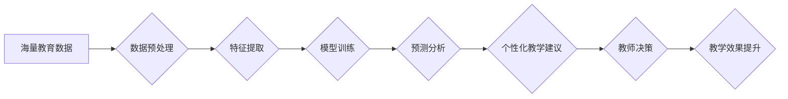

> 数据挖掘, 教学监控, 机器学习, 学生行为分析, 个性化学习

## 1. 背景介绍

随着教育信息化进程的不断加速，海量教育数据正在被生成和积累。这些数据蕴含着丰富的教学信息，能够为教学过程的优化和个性化学习提供宝贵的支持。然而，传统的教学监控系统往往局限于简单的学生成绩和课堂参与度统计，难以挖掘数据背后的深层规律和学生个体差异。

基于数据挖掘技术的教学监控系统，能够从海量教育数据中提取有价值的信息，对学生学习行为进行深入分析，为教师提供个性化教学建议，并促进学生自主学习和个性化发展。

## 2. 核心概念与联系

### 2.1 数据挖掘

数据挖掘是指从大量数据中发现模式、规律和知识的过程。它利用统计学、机器学习、数据库技术等多种方法，对数据进行分析和处理，以发现隐藏的价值和洞察力。

### 2.2 教学监控

教学监控是指对教学过程进行实时或离线观察、记录和分析，以评估教学效果、改进教学方法和促进学生学习成长的过程。

### 2.3 数据挖掘在教学监控中的应用

数据挖掘技术可以应用于教学监控系统，从学生成绩、课堂参与度、作业提交情况、学习时间等多方面数据中挖掘出学生学习行为的规律和特点，为教师提供个性化教学建议和学生学习策略指导。

**数据挖掘在教学监控中的应用流程图:**



## 3. 核心算法原理 & 具体操作步骤

### 3.1 算法原理概述

在基于数据挖掘的教学监控系统中，常用的算法包括：

* **聚类算法:** 将学生根据学习行为特征进行分组，识别不同学习类型的学生。
* **分类算法:** 根据学生的历史学习数据预测学生的未来学习表现，例如考试成绩或课程通过率。
* **关联规则挖掘算法:** 发现学生学习行为之间的关联关系，例如哪些学生在学习特定课程时表现良好，哪些学生在完成作业时存在困难。

### 3.2 算法步骤详解

以聚类算法为例，其具体操作步骤如下：

1. **数据收集:** 收集学生学习行为数据，例如成绩、课堂参与度、作业提交情况、学习时间等。
2. **数据预处理:** 对收集到的数据进行清洗、转换和标准化，例如处理缺失值、转换数据类型、归一化数据范围。
3. **特征提取:** 从原始数据中提取具有代表性的特征，例如学习效率、学习习惯、知识掌握程度等。
4. **聚类算法选择:** 根据实际需求选择合适的聚类算法，例如K-means聚类、层次聚类等。
5. **聚类模型训练:** 使用选定的聚类算法对学生数据进行聚类，将学生划分为不同的学习类型。
6. **聚类结果分析:** 分析聚类结果，识别不同学习类型的学生特点，并为教师提供个性化教学建议。

### 3.3 算法优缺点

**聚类算法的优点:**

* 可以发现数据中的隐含结构和模式。
* 不需要预先定义类别标签，适用于未知类别的情况。
* 可以对数据进行降维，简化数据分析。

**聚类算法的缺点:**

* 聚类结果的稳定性较差，容易受到初始参数的影响。
* 难以确定最佳聚类数目。
* 对数据质量要求较高，数据噪声和异常值会影响聚类结果。

### 3.4 算法应用领域

聚类算法在教学监控系统中的应用领域包括：

* **学生学习类型识别:** 将学生根据学习行为特征进行分组，识别不同学习类型的学生，例如视觉学习型、听觉学习型、动觉学习型等。
* **学习策略推荐:** 根据学生的学习类型，推荐相应的学习策略和学习资源，帮助学生提高学习效率。
* **教学资源个性化:** 根据学生的学习需求和兴趣，个性化推荐学习资源，例如视频、音频、文本等。

## 4. 数学模型和公式 & 详细讲解 & 举例说明

### 4.1 数学模型构建

在基于数据挖掘的教学监控系统中，常用的数学模型包括：

* **K-means聚类模型:**

该模型的目标是将数据点划分为K个簇，使得每个数据点到其所属簇中心的距离最小。

* **决策树模型:**

该模型通过构建决策树来预测学生的学习表现，例如考试成绩或课程通过率。

* **支持向量机模型:**

该模型通过寻找数据中最佳的分隔超平面来分类学生，例如将学生分为高分和低分两类。

### 4.2 公式推导过程

以K-means聚类模型为例，其目标函数为：

$$
J(C) = \sum_{i=1}^{K} \sum_{x_j \in C_i} ||x_j - \mu_i||^2
$$

其中：

* $J(C)$ 是目标函数，表示所有数据点到其所属簇中心的距离平方和。
* $K$ 是簇的个数。
* $C_i$ 是第i个簇。
* $x_j$ 是第j个数据点。
* $\mu_i$ 是第i个簇的中心点。

### 4.3 案例分析与讲解

假设我们有一组学生成绩数据，我们想使用K-means聚类算法将学生分为两类：高分学生和低分学生。

1. 选择合适的K值，例如K=2。
2. 随机初始化两个簇中心点。
3. 将每个学生分配到距离其最近的簇中心点。
4. 计算每个簇的中心点。
5. 重复步骤3和4，直到簇中心点不再变化。

最终，我们将得到两个簇，分别代表高分学生和低分学生。

## 5. 项目实践：代码实例和详细解释说明

### 5.1 开发环境搭建

* 操作系统：Windows/macOS/Linux
* Python版本：3.6+
* 必要的库：pandas, scikit-learn, matplotlib, seaborn

### 5.2 源代码详细实现

```python
import pandas as pd
from sklearn.cluster import KMeans
import matplotlib.pyplot as plt

# 加载学生成绩数据
data = pd.read_csv('student_scores.csv')

# 选择特征变量，例如数学成绩和语文成绩
features = data[['数学成绩', '语文成绩']]

# 使用K-means聚类算法进行聚类
kmeans = KMeans(n_clusters=2, random_state=0)
kmeans.fit(features)

# 获取聚类结果
labels = kmeans.labels_

# 将聚类结果添加到数据框中
data['聚类'] = labels

# 绘制散点图，展示聚类结果
plt.scatter(data['数学成绩'], data['语文成绩'], c=data['聚类'], cmap='viridis')
plt.xlabel('数学成绩')
plt.ylabel('语文成绩')
plt.title('学生成绩聚类')
plt.show()
```

### 5.3 代码解读与分析

* 首先，我们加载学生成绩数据，并选择需要进行聚类的特征变量。
* 然后，我们使用K-means聚类算法进行聚类，并设置聚类数目为2。
* 接着，我们获取聚类结果，并将结果添加到数据框中。
* 最后，我们绘制散点图，展示聚类结果。

### 5.4 运行结果展示

运行上述代码后，我们将得到一个散点图，其中每个数据点代表一个学生，颜色代表其所属的聚类。

## 6. 实际应用场景

### 6.1 学生学习行为分析

基于数据挖掘的教学监控系统可以分析学生的学习行为，例如学习时间、学习效率、作业提交情况等，识别学生的学习习惯和学习模式，为教师提供个性化教学建议。

### 6.2 个性化学习推荐

根据学生的学习行为和学习需求，系统可以推荐个性化的学习资源，例如视频、音频、文本等，帮助学生提高学习效率和学习兴趣。

### 6.3 教师教学决策支持

系统可以为教师提供数据驱动的教学决策支持，例如：

* 识别学习困难的学生，及时进行干预和帮助。
* 发现教学效果不佳的环节，及时调整教学方法。
* 优化教学资源分配，提高教学效率。

### 6.4 未来应用展望

未来，基于数据挖掘的教学监控系统将更加智能化和个性化，例如：

* 利用人工智能技术，实现更精准的学习行为分析和个性化学习推荐。
* 与其他教育平台和工具进行整合，构建更加完善的教育生态系统。
* 扩展到更多教育场景，例如远程教育、职业教育等。

## 7. 工具和资源推荐

### 7.1 学习资源推荐

* **数据挖掘书籍:**
    * 《数据挖掘：概念与技术》
    * 《数据挖掘实战》
* **机器学习书籍:**
    * 《机器学习》
    * 《Python机器学习》
* **在线课程:**
    * Coursera上的数据挖掘和机器学习课程
    * edX上的数据科学课程

### 7.2 开发工具推荐

* **Python:** 
    * 数据分析和机器学习的常用语言
* **pandas:** 
    * 数据处理和分析库
* **scikit-learn:** 
    * 机器学习库
* **matplotlib:** 
    * 数据可视化库
* **seaborn:** 
    * 数据可视化库

### 7.3 相关论文推荐

* **数据挖掘在教育领域的应用:**
    * [Data Mining in Education: A Survey](https://ieeexplore.ieee.org/document/6807747)
* **基于机器学习的教学监控系统:**
    * [A Survey of Machine Learning-Based Educational Data Mining](https://www.researchgate.net/publication/329973334_A_Survey_of_Machine_Learning-Based_Educational_Data_Mining)

## 8. 总结：未来发展趋势与挑战

### 8.1 研究成果总结

基于数据挖掘的教学监控系统已经取得了一定的成果，能够有效地分析学生的学习行为，提供个性化教学建议，促进学生学习成长的。

### 8.2 未来发展趋势

未来，基于数据挖掘的教学监控系统将朝着以下方向发展：

* **更加智能化:** 利用人工智能技术，实现更精准的学习行为分析和个性化学习推荐。
* **更加个性化:** 针对不同学生的学习特点和需求，提供更加个性化的学习方案和支持。
* **更加协作性:** 将教师、学生、家长等多方参与到教学监控系统中，形成更加协作的学习生态系统。

### 8.3 面临的挑战

尽管基于数据挖掘的教学监控系统具有巨大的潜力，但也面临着一些挑战：

* **数据质量问题:** 教育数据往往存在不完整、不准确、格式不统一等问题，需要进行有效的数据清洗和预处理。
* **隐私保护问题:** 学生数据涉及到个人隐私，需要采取有效的措施保障数据安全和隐私。
* **算法解释性问题:** 一些机器学习算法的决策过程难以解释，需要开发更易于理解的算法模型。

### 8.4 研究展望

未来，我们需要继续加强对基于数据挖掘的教学监控系统的研究，解决上述挑战，推动其更加广泛地应用于教育领域，为学生提供更加个性化、高效的学习体验。

## 9. 附录：常见问题与解答

### 9.1 如何选择合适的聚类算法？

选择合适的聚类算法需要根据实际数据特点和需求进行选择。

* 如果数据分布较为均匀，可以使用K-means聚类算法。
* 如果数据分布不均匀，可以使用层次聚类算法。
* 如果数据具有层次结构，可以使用树