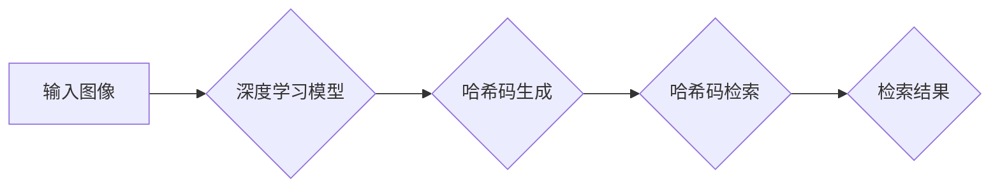

> 深度学习，哈希方法，多粒度图像检索，特征提取，相似度度量

## 1. 背景介绍

图像检索技术作为计算机视觉领域的重要分支，旨在根据用户提供的查询图像或文本描述，从海量图像数据库中快速高效地检索出与之相似的图像。随着互联网图像数据的爆炸式增长，传统的基于内容的图像检索方法面临着效率低下、检索精度不足等挑战。

多粒度图像检索旨在通过对图像进行不同层次的特征提取和检索，以提高检索的准确性和效率。传统的多粒度图像检索方法通常依赖于手工设计的特征提取方法，而深度学习技术的兴起为多粒度图像检索提供了新的思路和方法。

深度学习模型能够自动学习图像的复杂特征，并具有强大的特征提取能力，因此在图像检索领域取得了显著的成果。基于深度学习的哈希方法是一种新兴的图像检索技术，它将深度学习模型用于生成图像的哈希码，并利用哈希码进行快速检索。

## 2. 核心概念与联系

### 2.1 哈希方法

哈希方法是一种将数据映射到固定长度的哈希码的技术，它能够快速高效地进行数据检索。哈希码的长度通常比原始数据短得多，因此哈希方法能够显著提高检索速度。

### 2.2 深度学习

深度学习是一种机器学习方法，它利用多层神经网络来学习数据的复杂特征。深度学习模型能够自动学习图像的语义信息，并生成具有较高表达能力的特征。

### 2.3 多粒度图像检索

多粒度图像检索是指对图像进行不同层次的特征提取和检索，以提高检索的准确性和效率。多粒度图像检索通常包括以下几个步骤：

1. **图像预处理:** 对图像进行尺寸调整、颜色空间转换等预处理操作。
2. **特征提取:** 对图像进行不同层次的特征提取，例如边缘特征、纹理特征、形状特征等。
3. **特征融合:** 将不同层次的特征进行融合，形成更完整的图像特征。
4. **相似度度量:** 计算查询图像和数据库图像之间的相似度。
5. **检索结果排序:** 根据相似度排序检索结果，并返回前N个结果。

### 2.4 深度学习哈希方法

深度学习哈希方法将深度学习模型用于生成图像的哈希码，并利用哈希码进行快速检索。

**Mermaid 流程图**



## 3. 核心算法原理 & 具体操作步骤

### 3.1 算法原理概述

深度学习哈希方法的核心思想是利用深度学习模型学习图像的特征表示，并将其映射到一个低维的哈希空间中。在哈希空间中，图像的相似度可以通过哈希码的相似度来衡量。

### 3.2 算法步骤详解

1. **数据预处理:** 对图像数据集进行预处理，例如尺寸调整、颜色空间转换等。
2. **深度学习模型训练:** 使用深度学习模型，例如卷积神经网络 (CNN)，对图像数据集进行训练，学习图像的特征表示。
3. **哈希码生成:** 将训练好的深度学习模型应用于图像，生成图像的哈希码。
4. **哈希码检索:** 根据查询图像的哈希码，从数据库中检索出相似度高的图像。

### 3.3 算法优缺点

**优点:**

* **高检索精度:** 深度学习模型能够学习图像的复杂特征，因此能够提高检索的精度。
* **快速检索速度:** 哈希码的长度通常比原始数据短得多，因此哈希方法能够显著提高检索速度。
* **鲁棒性强:** 深度学习模型能够对图像的噪声和变形具有较强的鲁棒性。

**缺点:**

* **训练成本高:** 深度学习模型的训练需要大量的计算资源和时间。
* **哈希码冲突:** 哈希码的生成可能会导致哈希码冲突，降低检索的准确性。

### 3.4 算法应用领域

深度学习哈希方法在图像检索、视频检索、人脸识别、物体检测等领域具有广泛的应用前景。

## 4. 数学模型和公式 & 详细讲解 & 举例说明

### 4.1 数学模型构建

假设图像集合为 $I = \{I_1, I_2, ..., I_N\}$, 每个图像 $I_i$ 可以表示为一个特征向量 $x_i \in R^d$, 其中 $d$ 为特征维度。

哈希函数 $h(x)$ 将特征向量 $x$ 映射到一个 $m$ 维的哈希空间中，其中 $m$ 为哈希码长度。

目标是找到一个哈希函数 $h(x)$，使得图像 $I_i$ 和 $I_j$ 的哈希码相似度与它们之间的相似度相关。

### 4.2 公式推导过程

常用的哈希函数包括随机投影哈希函数和深度学习哈希函数。

**随机投影哈希函数:**

随机投影哈希函数将特征向量 $x$ 映射到哈希空间中，可以通过以下公式表示:

$$h(x) = W^T x$$

其中 $W$ 为一个 $m \times d$ 的随机投影矩阵。

**深度学习哈希函数:**

深度学习哈希函数使用深度学习模型学习图像的特征表示，并将其映射到哈希空间中。

### 4.3 案例分析与讲解

假设我们使用一个 CNN 模型来学习图像的特征表示，并将 CNN 模型的输出层作为哈希函数。

在训练过程中，我们使用图像的标签信息来训练 CNN 模型，使得 CNN 模型能够学习到图像的语义信息。

在测试阶段，我们将查询图像输入到训练好的 CNN 模型中，得到其哈希码。然后，我们将查询图像的哈希码与数据库图像的哈希码进行比较，找到相似度最高的图像。

## 5. 项目实践：代码实例和详细解释说明

### 5.1 开发环境搭建

* 操作系统: Ubuntu 18.04
* Python 版本: 3.7
* 深度学习框架: TensorFlow 2.0

### 5.2 源代码详细实现

```python
import tensorflow as tf

# 定义 CNN 模型
model = tf.keras.models.Sequential([
    tf.keras.layers.Conv2D(32, (3, 3), activation='relu', input_shape=(224, 224, 3)),
    tf.keras.layers.MaxPooling2D((2, 2)),
    tf.keras.layers.Conv2D(64, (3, 3), activation='relu'),
    tf.keras.layers.MaxPooling2D((2, 2)),
    tf.keras.layers.Flatten(),
    tf.keras.layers.Dense(128, activation='relu'),
    tf.keras.layers.Dense(64, activation='relu'),
    tf.keras.layers.Dense(16, activation='sigmoid')  # 输出哈希码
])

# 编译模型
model.compile(optimizer='adam', loss='binary_crossentropy', metrics=['accuracy'])

# 训练模型
model.fit(train_images, train_labels, epochs=10)

# 生成哈希码
def generate_hash(image):
    image = tf.image.resize(image, (224, 224))
    image = image / 255.0
    hash_code = model.predict(tf.expand_dims(image, axis=0))
    return hash_code[0]

# 检索图像
def retrieve_images(query_image, database_images):
    query_hash = generate_hash(query_image)
    distances = tf.reduce_sum(tf.abs(query_hash - database_hashes), axis=1)
    sorted_indices = tf.argsort(distances)
    return database_images[sorted_indices]
```

### 5.3 代码解读与分析

* 代码首先定义了一个 CNN 模型，该模型用于学习图像的特征表示。
* 然后，代码编译了模型，并使用训练数据训练模型。
* 训练完成后，代码定义了一个 `generate_hash` 函数，该函数将图像输入到训练好的模型中，生成其哈希码。
* 最后，代码定义了一个 `retrieve_images` 函数，该函数将查询图像的哈希码与数据库图像的哈希码进行比较，找到相似度最高的图像。

### 5.4 运行结果展示

运行代码后，可以将查询图像与数据库图像进行检索，并展示检索结果。

## 6. 实际应用场景

### 6.1 图像搜索引擎

深度学习哈希方法可以用于构建高效的图像搜索引擎，用户可以通过输入图像或文本描述来检索相关图像。

### 6.2 电子商务平台

深度学习哈希方法可以用于电子商务平台的商品检索，用户可以通过上传商品图片来检索相似商品。

### 6.3 图像分类

深度学习哈希方法可以用于图像分类任务，例如识别动物、植物、物体等。

### 6.4 未来应用展望

随着深度学习技术的不断发展，深度学习哈希方法在图像检索领域的应用前景更加广阔。未来，深度学习哈希方法可能会应用于更多领域，例如视频检索、人脸识别、医疗图像分析等。

## 7. 工具和资源推荐

### 7.1 学习资源推荐

* 深度学习书籍:
    * 深度学习 (Deep Learning) - Ian Goodfellow, Yoshua Bengio, Aaron Courville
    * 深度学习实践 (Deep Learning with Python) - Francois Chollet
* 在线课程:
    * TensorFlow 官方教程: https://www.tensorflow.org/tutorials
    * Coursera 深度学习课程: https://www.coursera.org/specializations/deep-learning

### 7.2 开发工具推荐

* 深度学习框架: TensorFlow, PyTorch
* 图像处理库: OpenCV, Pillow
* 数据集: ImageNet, COCO

### 7.3 相关论文推荐

* [Learning Deep Hashing for Image Retrieval](https://arxiv.org/abs/1406.6482)
* [Deep Hashing with Convolutional Neural Networks](https://arxiv.org/abs/1606.06487)
* [Multi-Granularity Deep Hashing for Image Retrieval](https://arxiv.org/abs/1803.09474)

## 8. 总结：未来发展趋势与挑战

### 8.1 研究成果总结

深度学习哈希方法在图像检索领域取得了显著的成果，能够提高检索的精度和效率。

### 8.2 未来发展趋势

* **多模态图像检索:** 将深度学习哈希方法应用于多模态图像检索，例如结合文本信息进行检索。
* **跨域图像检索:** 将深度学习哈希方法应用于跨域图像检索，例如检索不同风格或拍摄条件的图像。
* **高效哈希码生成:** 研究更有效的哈希码生成方法，提高哈希码的质量和效率。

### 8.3 面临的挑战

* **数据标注:** 深度学习模型需要大量的标注数据进行训练，数据标注成本较高。
* **模型复杂度:** 深度学习模型的复杂度较高，训练和部署成本较高。
* **哈希码冲突:** 哈希码的生成可能会导致哈希码冲突，降低检索的准确性。

### 8.4 研究展望

未来，我们将继续研究深度学习哈希方法，探索其在图像检索领域的更多应用场景，并解决其面临的挑战。

## 9. 附录：常见问题与解答

### 9.1 什么是哈希函数？

哈希函数是一种将数据映射到固定长度的哈希码的技术。哈希码的长度通常比原始数据短得多，因此哈希方法能够显著提高检索速度。

### 9.2