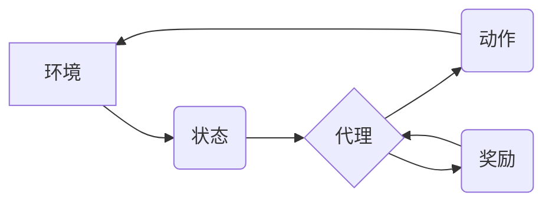

> 基础模型、强化学习、预训练、微调、应用场景、挑战

## 1. 背景介绍

近年来，深度学习在计算机视觉、自然语言处理等领域取得了显著成就，其中基础模型扮演着越来越重要的角色。基础模型是指在海量数据上预训练的大规模神经网络模型，具有强大的泛化能力和可迁移性。

强化学习（Reinforcement Learning，RL）是一种机器学习方法，通过在环境中与环境交互，学习最优策略来最大化奖励。RL在机器人控制、游戏 AI、推荐系统等领域展现出巨大的潜力。

将基础模型与强化学习相结合，可以充分利用基础模型的预训练知识，加速强化学习算法的训练，并提升模型的性能。

## 2. 核心概念与联系

**2.1 基础模型**

基础模型通常采用 Transformer 架构，例如 GPT-3、BERT、DALL-E 等。它们在海量文本、图像或其他数据上进行预训练，学习到丰富的语义表示和知识。

**2.2 强化学习**

强化学习的核心概念包括：

* **环境 (Environment):** RL 算法与环境交互，环境提供状态和奖励信息。
* **代理 (Agent):** RL 算法的执行者，根据环境状态采取行动。
* **状态 (State):** 环境的当前状态，代理根据状态做出决策。
* **动作 (Action):** 代理在环境中执行的操作。
* **奖励 (Reward):** 环境对代理动作的反馈，奖励信号指导代理学习最优策略。
* **策略 (Policy):** 映射状态到动作的函数，决定代理在特定状态下采取的动作。

**2.3 基础模型与强化学习的结合**

将基础模型与强化学习相结合，可以将基础模型的预训练知识融入到强化学习算法中，从而提升模型的性能。

**2.3.1 预训练基础模型**

使用预训练的基础模型作为强化学习算法的初始模型，可以加速训练过程，并提升模型的性能。

**2.3.2 知识蒸馏**

将基础模型的知识蒸馏到强化学习模型中，可以进一步提升模型的性能。

**2.3.3 混合架构**

将基础模型和强化学习算法结合成混合架构，可以充分利用两种方法的优势。

**Mermaid 流程图**



## 3. 核心算法原理 & 具体操作步骤

### 3.1 算法原理概述

将基础模型与强化学习相结合的算法主要包括：

* **基于预训练的强化学习 (RL with Pre-trained Models)**：使用预训练的基础模型作为强化学习算法的初始模型，例如使用 BERT 预训练模型进行文本对话任务的强化学习。
* **知识蒸馏强化学习 (KD-RL)**：将基础模型的知识蒸馏到强化学习模型中，例如将 DALL-E 的图像生成能力蒸馏到强化学习模型中进行图像编辑任务。
* **混合架构强化学习 (Hybrid RL)**：将基础模型和强化学习算法结合成混合架构，例如将 Transformer 模型与强化学习算法结合进行机器翻译任务。

### 3.2 算法步骤详解

以基于预训练的强化学习为例，其具体操作步骤如下：

1. **预训练基础模型**: 在海量数据上预训练基础模型，例如使用 GPT-3 在文本数据上进行预训练。
2. **微调基础模型**: 根据强化学习任务，微调预训练的基础模型，例如将 GPT-3 微调到文本对话任务。
3. **构建强化学习环境**: 定义强化学习环境，包括状态空间、动作空间、奖励函数等。
4. **设计强化学习算法**: 选择合适的强化学习算法，例如 Q-learning、Deep Q-Network (DQN) 等。
5. **训练强化学习模型**: 使用微调后的基础模型作为强化学习模型的初始模型，在强化学习环境中训练强化学习模型。
6. **评估强化学习模型**: 在测试集上评估强化学习模型的性能，例如计算对话系统的准确率、游戏 AI 的胜率等。

### 3.3 算法优缺点

**优点**:

* **加速训练**: 利用预训练的基础模型可以加速强化学习算法的训练过程。
* **提升性能**: 预训练知识可以提升强化学习模型的性能。
* **可迁移性**: 预训练的基础模型具有可迁移性，可以应用于不同的强化学习任务。

**缺点**:

* **数据依赖**: 预训练的基础模型需要大量的训练数据。
* **计算资源**: 预训练和微调基础模型需要大量的计算资源。
* **任务适应性**: 预训练的基础模型可能需要针对不同的强化学习任务进行微调。

### 3.4 算法应用领域

* **机器人控制**: 使用基础模型和强化学习算法训练机器人进行复杂的任务，例如导航、抓取等。
* **游戏 AI**: 使用基础模型和强化学习算法训练游戏 AI，例如 AlphaGo、AlphaStar 等。
* **推荐系统**: 使用基础模型和强化学习算法训练推荐系统，例如个性化推荐、广告推荐等。
* **医疗保健**: 使用基础模型和强化学习算法辅助医生诊断疾病、制定治疗方案等。

## 4. 数学模型和公式 & 详细讲解 & 举例说明

### 4.1 数学模型构建

强化学习的核心数学模型是状态-动作-奖励 (SARSA) 模型。

**状态 (State):** 环境的当前状态，用 S 表示。

**动作 (Action):** 代理在环境中执行的操作，用 A 表示。

**奖励 (Reward):** 环境对代理动作的反馈，用 R 表示。

**价值函数 (Value Function):** 评估状态或状态-动作对的价值，用 V(S) 或 Q(S, A) 表示。

**策略 (Policy):** 映射状态到动作的函数，用 π(A|S) 表示。

### 4.2 公式推导过程

SARSA 算法的目标是学习一个最优策略 π*，使得代理在环境中获得最大的累积奖励。

SARSA 算法的更新规则如下：

$$Q(S_t, A_t) \leftarrow Q(S_t, A_t) + \alpha [R_{t+1} + \gamma \cdot Q(S_{t+1}, A_{t+1}) - Q(S_t, A_t)]$$

其中：

* $Q(S_t, A_t)$ 是在时间步 t 处状态 S_t 下执行动作 A_t 的价值函数。
* $\alpha$ 是学习率。
* $R_{t+1}$ 是在时间步 t+1 处获得的奖励。
* $\gamma$ 是折扣因子，控制未来奖励的权重。
* $S_{t+1}$ 是时间步 t+1 处的状态。
* $A_{t+1}$ 是时间步 t+1 处执行的动作。

### 4.3 案例分析与讲解

例如，在玩游戏时，代理可以根据当前游戏状态选择动作，例如向上、向下、向左、向右移动。

* $S_t$ 可以表示游戏中的当前地图状态，例如玩家的位置、敌人的位置等。
* $A_t$ 可以表示玩家在当前状态下执行的动作，例如向上移动。
* $R_{t+1}$ 可以表示玩家在执行动作后获得的奖励，例如获得金币、击杀敌人等。
* $S_{t+1}$ 可以表示玩家执行动作后进入的新游戏状态。

SARSA 算法通过不断地更新价值函数 $Q(S_t, A_t)$，学习到在不同状态下执行不同动作的最佳策略，从而帮助玩家获得更高的游戏分数。

## 5. 项目实践：代码实例和详细解释说明

### 5.1 开发环境搭建

* Python 3.7+
* TensorFlow 2.x 或 PyTorch 1.x
* OpenAI Gym

### 5.2 源代码详细实现

```python
import gym
import tensorflow as tf

# 定义强化学习环境
env = gym.make('CartPole-v1')

# 定义神经网络模型
model = tf.keras.Sequential([
    tf.keras.layers.Dense(128, activation='relu', input_shape=(4,)),
    tf.keras.layers.Dense(64, activation='relu'),
    tf.keras.layers.Dense(2, activation='softmax')
])

# 定义损失函数和优化器
loss_fn = tf.keras.losses.CategoricalCrossentropy()
optimizer = tf.keras.optimizers.Adam(learning_rate=0.001)

# 定义训练循环
def train_step(state, action, reward, next_state, done):
    with tf.GradientTape() as tape:
        prediction = model(state)
        loss = loss_fn(action, prediction)
    gradients = tape.gradient(loss, model.trainable_variables)
    optimizer.apply_gradients(zip(gradients, model.trainable_variables))

# 训练模型
for episode in range(1000):
    state = env.reset()
    done = False
    while not done:
        action = tf.argmax(model(state)).numpy()
        next_state, reward, done, _ = env.step(action)
        train_step(state, action, reward, next_state, done)
        state = next_state

# 测试模型
state = env.reset()
while True:
    action = tf.argmax(model(state)).numpy()
    next_state, reward, done, _ = env.step(action)
    env.render()
    if done:
        break
    state = next_state
```

### 5.3 代码解读与分析

* 代码首先定义强化学习环境，例如 CartPole-v1 环境。
* 然后定义神经网络模型，例如一个简单的多层感知机。
* 定义损失函数和优化器，例如交叉熵损失函数和 Adam 优化器。
* 训练循环中，代理根据当前状态选择动作，执行动作后获得奖励和下一个状态，并更新模型参数。
* 测试模型时，代理根据当前状态选择动作，并渲染环境，直到游戏结束。

### 5.4 运行结果展示

运行代码后，可以观察到代理在 CartPole 环境中学习并控制杆子，使杆子保持平衡。

## 6. 实际应用场景

### 6.1 游戏 AI

强化学习可以训练游戏 AI，例如 AlphaGo、AlphaStar 等，在复杂的游戏中取得优异的成绩。

### 6.2 机器人控制

强化学习可以训练机器人进行复杂的任务，例如导航、抓取等。

### 6.3 推荐系统

强化学习可以训练推荐系统，例如个性化推荐、广告推荐等。

### 6.4 自动驾驶

强化学习可以训练自动驾驶系统，例如控制车辆行驶、避开障碍物等。

### 6.5 其他应用场景

* 医疗保健
* 金融
* 农业

## 7. 工具和资源推荐

### 7.1 学习资源推荐

* **书籍**:
    * Reinforcement Learning: An Introduction by Richard S. Sutton and Andrew G. Barto
    * Deep Reinforcement Learning Hands-On by Maxim Lapan
* **在线课程**:
    * Deep Reinforcement Learning Specialization by DeepLearning.AI
    * Reinforcement Learning by David Silver (University of DeepMind)

### 7.2 开发工具推荐

* **OpenAI Gym**: 强化学习环境库
* **TensorFlow**: 深度学习框架
* **PyTorch**: 深度学习框架

### 7.3 相关论文推荐

* **Deep Q-Network**: Mnih et al., 2015
* **Proximal Policy Optimization**: Schulman et al., 2017
* **Trust Region Policy Optimization**: Schulman et al., 2015

## 8. 总结：未来发展趋势与挑战

### 8.1 研究成果总结

近年来，基础模型与强化学习的结合取得了显著成果，在游戏 AI、机器人控制、推荐系统等领域取得了突破。

### 8.2 未来发展趋势

* **更强大的