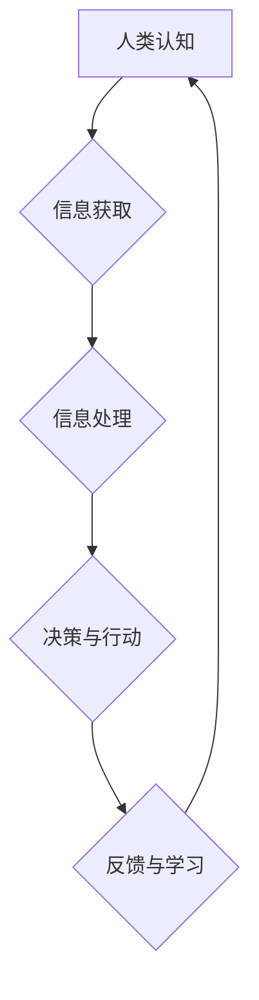

> 人类计算、人工智能、数字时代、计算模型、算法原理、数学模型、项目实践、未来趋势

## 1. 背景介绍

数字时代正在以惊人的速度发展，人工智能、大数据、云计算等技术蓬勃兴起，深刻地改变着我们的生活方式和社会结构。在这个数字浪潮中，人类计算扮演着至关重要的角色。

人类计算是指人类利用自身的认知能力、创造力、判断力和经验，对信息进行处理、分析和决策的过程。它与传统的计算机计算不同，后者主要依靠算法和逻辑运算来处理数据。人类计算更注重对信息的理解、解释和应用，能够处理复杂、模糊和不确定性信息，并做出基于情境和价值判断的决策。

## 2. 核心概念与联系

**2.1 人类计算与人工智能**

人工智能（AI）旨在模拟和增强人类智能，包括学习、推理、决策和创造等能力。人工智能技术的发展离不开人类计算的指导和推动。人类设计和训练人工智能算法，并为其提供数据和反馈，使其能够学习和改进。

**2.2 人类计算与数字时代**

数字时代的信息爆炸和数据化趋势，为人类计算提供了丰富的资源和平台。互联网、社交媒体、移动设备等数字工具，使得人类能够更便捷地获取信息、交流互动和协作工作。

**2.3 人类计算与计算模型**

计算模型是描述和实现计算过程的框架。传统的计算模型主要基于逻辑运算和算法，而人类计算则需要更灵活、更具适应性的计算模型。例如，神经网络模型能够模拟人类大脑的学习和推理过程，更好地处理复杂和模糊的信息。

**Mermaid 流程图**



## 3. 核心算法原理 & 具体操作步骤

**3.1 算法原理概述**

人类计算的核心算法原理是基于人类认知过程的模拟和抽象。这些算法通常具有以下特点：

* **迭代学习:** 通过不断地学习和反馈，算法能够不断地改进和优化。
* **启发式搜索:** 算法利用启发式规则和经验，在搜索空间中找到最优或近似最优的解。
* **模糊逻辑:** 算法能够处理模糊和不确定的信息，并做出基于概率和可能性判断的决策。

**3.2 算法步骤详解**

1. **数据收集和预处理:** 收集相关数据，并进行清洗、转换和格式化等预处理操作。
2. **特征提取:** 从数据中提取关键特征，用于算法的训练和预测。
3. **模型训练:** 利用训练数据，训练算法模型，使其能够学习数据中的模式和规律。
4. **模型评估:** 使用测试数据评估模型的性能，并进行调整和优化。
5. **预测和决策:** 将训练好的模型应用于新的数据，进行预测和决策。

**3.3 算法优缺点**

**优点:**

* 能够处理复杂、模糊和不确定性信息。
* 具有较强的适应性和泛化能力。
* 可以结合人类经验和知识进行决策。

**缺点:**

* 训练数据量大，训练时间长。
* 模型解释性较差，难以理解算法的决策过程。
* 算法的性能受数据质量和特征选择的影响较大。

**3.4 算法应用领域**

* **自然语言处理:** 语义理解、机器翻译、文本生成等。
* **计算机视觉:** 图像识别、物体检测、场景理解等。
* **推荐系统:** 商品推荐、内容推荐、用户画像等。
* **医疗诊断:** 病症诊断、疾病预测、药物研发等。

## 4. 数学模型和公式 & 详细讲解 & 举例说明

**4.1 数学模型构建**

人类计算可以抽象为一个数学模型，其中包括输入、输出、状态和转换规则。

* **输入:**  人类获取的信息，例如文本、图像、音频等。
* **输出:**  人类的决策和行动，例如文本生成、图像识别、语音合成等。
* **状态:**  人类的认知状态，例如知识、信念、情感等。
* **转换规则:**  描述人类认知过程的规则，例如逻辑推理、情感判断、决策策略等。

**4.2 公式推导过程**

人类计算的数学模型可以基于概率论、信息论和决策论等理论进行构建。例如，可以使用贝叶斯定理来描述人类对信息的更新和推理过程。

$$P(A|B) = \frac{P(B|A)P(A)}{P(B)}$$

其中：

* $P(A|B)$ 是在已知事件 B 发生的情况下，事件 A 发生的概率。
* $P(B|A)$ 是在已知事件 A 发生的情况下，事件 B 发生的概率。
* $P(A)$ 是事件 A 发生的概率。
* $P(B)$ 是事件 B 发生的概率。

**4.3 案例分析与讲解**

例如，假设一个人在阅读一篇新闻文章时，会根据文章内容和自身的知识背景，对文章的真实性进行判断。

* $A$: 文章真实
* $B$: 文章内容与个人知识背景相符

根据贝叶斯定理，我们可以计算出在已知文章内容与个人知识背景相符的情况下，文章真实发生的概率。

## 5. 项目实践：代码实例和详细解释说明

**5.1 开发环境搭建**

* 操作系统: Ubuntu 20.04
* 编程语言: Python 3.8
* 库依赖: TensorFlow, NumPy, Pandas

**5.2 源代码详细实现**

```python
import tensorflow as tf
from tensorflow.keras.models import Sequential
from tensorflow.keras.layers import Dense

# 构建模型
model = Sequential()
model.add(Dense(64, activation='relu', input_shape=(10,)))
model.add(Dense(32, activation='relu'))
model.add(Dense(1, activation='sigmoid'))

# 编译模型
model.compile(optimizer='adam', loss='binary_crossentropy', metrics=['accuracy'])

# 训练模型
model.fit(X_train, y_train, epochs=10, batch_size=32)

# 评估模型
loss, accuracy = model.evaluate(X_test, y_test)
print('Loss:', loss)
print('Accuracy:', accuracy)
```

**5.3 代码解读与分析**

这段代码实现了基于神经网络的二分类模型。

* `Sequential()` 创建了一个顺序模型，即层级结构。
* `Dense()` 创建了一个全连接层，每个神经元都连接到上一层的每个神经元。
* `activation='relu'` 使用ReLU激活函数，可以提高模型的表达能力。
* `input_shape=(10,)` 指定输入数据的形状为10维向量。
* `optimizer='adam'` 使用Adam优化器，可以加速模型训练。
* `loss='binary_crossentropy'` 使用二分类交叉熵损失函数，用于衡量模型的预测结果与真实标签之间的差异。
* `metrics=['accuracy']` 使用准确率作为评估指标。

**5.4 运行结果展示**

训练完成后，模型可以用于预测新的数据。例如，如果输入一个新的数据点，模型会输出一个概率值，表示该数据点属于正类的概率。

## 6. 实际应用场景

**6.1 自然语言处理**

* **机器翻译:** 利用神经网络模型，将一种语言翻译成另一种语言。
* **文本摘要:** 自动生成文本的简短摘要，例如新闻文章的标题和要点。
* **情感分析:** 分析文本中的情感倾向，例如判断用户对产品的评价是正面还是负面。

**6.2 计算机视觉**

* **图像识别:** 将图像分类到不同的类别，例如识别动物、物体、场景等。
* **物体检测:** 在图像中检测到特定物体的位置和大小，例如检测人脸、车辆、交通标志等。
* **图像分割:** 将图像分割成不同的区域，例如分割图像中的前景和背景。

**6.3 其他领域**

* **医疗诊断:** 利用机器学习模型，辅助医生诊断疾病，例如识别病灶、预测疾病风险等。
* **金融风险管理:** 利用机器学习模型，识别金融风险，例如预测股票价格波动、识别欺诈交易等。
* **个性化推荐:** 利用机器学习模型，根据用户的兴趣和行为，推荐个性化的商品、内容和服务。

**6.4 未来应用展望**

随着人工智能技术的不断发展，人类计算将在更多领域得到应用，例如：

* **智能家居:** 利用人工智能技术，实现家居设备的智能化控制和自动化。
* **自动驾驶:** 利用人工智能技术，实现车辆的自动驾驶功能。
* **虚拟现实:** 利用人工智能技术，创造更加逼真的虚拟现实体验。

## 7. 工具和资源推荐

**7.1 学习资源推荐**

* **书籍:**
    * 《深度学习》
    * 《人工智能：一种现代方法》
    * 《机器学习》
* **在线课程:**
    * Coursera: 深度学习
    * edX: 人工智能
    * Udacity: 机器学习工程师

**7.2 开发工具推荐**

* **编程语言:** Python
* **机器学习库:** TensorFlow, PyTorch, scikit-learn
* **数据处理工具:** Pandas, NumPy

**7.3 相关论文推荐**

* **AlphaGo论文:** https://arxiv.org/abs/1607.02886
* **BERT论文:** https://arxiv.org/abs/1810.04805
* **GPT-3论文:** https://arxiv.org/abs/2005.14165

## 8. 总结：未来发展趋势与挑战

**8.1 研究成果总结**

近年来，人工智能领域取得了显著的进展，例如在游戏、图像识别、自然语言处理等领域取得了突破性成果。人类计算的研究也取得了重要进展，例如开发了新的算法和模型，并将其应用于多个领域。

**8.2 未来发展趋势**

* **更强大的计算能力:** 随着硬件技术的进步，人工智能模型将变得更加强大，能够处理更复杂的任务。
* **更广泛的应用场景:** 人工智能将应用于更多领域，例如医疗、教育、金融等。
* **更注重伦理和社会影响:** 人工智能的发展需要考虑其伦理和社会影响，确保其安全、公平和可持续发展。

**8.3 面临的挑战**

* **数据获取和隐私保护:** 人工智能模型需要大量数据进行训练，如何获取高质量数据并保护用户隐私是一个挑战。
* **算法解释性和可信度:** 许多人工智能模型的决策过程难以解释，如何提高算法的透明度和可信度是一个重要问题。
* **公平性和偏见:** 人工智能模型可能存在公平性和偏见问题，需要采取措施确保其公平公正。

**8.4 研究展望**

未来，人类计算的研究将继续深入，探索更有效的算法和模型，并将其应用于更广泛的领域。同时，还需要关注人工智能的伦理和社会影响，确保其安全、公平和可持续发展。

## 9. 附录：常见问题与解答

**9.1 如何选择合适的机器学习算法？**

选择合适的机器学习算法取决于具体的应用场景和数据特点。例如，对于分类问题，可以考虑使用决策树、支持向量机或神经网络等算法。对于回归问题，可以考虑使用线性回归、逻辑回归或支持向量回归等算法。

**9.2 如何评估机器学习模型的性能？**

常用的机器学习模型性能评估指标包括准确率、召回率、F1-score、AUC等。选择合适的评估指标取决于具体的应用场景和任务目标。

**9.3 如何处理机器学习模型中的过拟合问题？**

过拟合是指机器学习模型在训练数据上表现良好，但在测试数据上表现较差。处理过拟合问题的方法包括：

* 减少模型复杂度
* 增加训练数据量
* 使用正则化技术
* 使用交叉验证技术


作者：