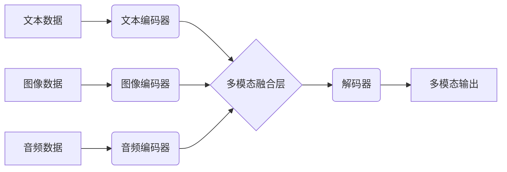

> 多模态大模型、自然语言处理、计算机视觉、语音识别、知识图谱、AI助理、深度学习、Transformer

## 1. 背景介绍

近年来，人工智能技术取得了飞速发展，特别是深度学习的兴起，为人工智能的突破性进展提供了强大的技术支撑。其中，多模态大模型作为人工智能领域的新兴研究方向，展现出巨大的潜力和应用前景。

多模态大模型是指能够处理多种模态数据（如文本、图像、音频、视频等）的深度学习模型。与单模态模型相比，多模态大模型能够更好地理解和交互于真实世界，从而实现更智能、更自然的交互体验。

## 2. 核心概念与联系

多模态大模型的核心概念包括：

* **模态数据:** 指不同形式的信息表示，例如文本、图像、音频、视频等。
* **多模态融合:** 指将不同模态数据进行有效融合，以获得更丰富的语义信息。
* **跨模态理解:** 指模型能够理解不同模态数据之间的关系，并进行跨模态推理。
* **多模态生成:** 指模型能够根据输入的多模态数据生成新的多模态内容。

**多模态大模型架构**



## 3. 核心算法原理 & 具体操作步骤

### 3.1  算法原理概述

多模态大模型的训练主要基于深度学习算法，其中Transformer模型在多模态领域取得了显著的成果。Transformer模型利用自注意力机制，能够捕捉不同模态数据之间的长距离依赖关系，从而实现更有效的融合和理解。

### 3.2  算法步骤详解

1. **数据预处理:** 将多模态数据进行清洗、格式化和编码，例如将文本数据转换为词向量，将图像数据转换为特征图等。
2. **模态编码:** 使用不同的编码器对每个模态数据进行编码，例如使用BERT模型对文本数据进行编码，使用ResNet模型对图像数据进行编码等。
3. **多模态融合:** 将不同模态的编码结果进行融合，例如使用注意力机制或拼接操作将文本、图像和音频的编码结果融合在一起。
4. **解码:** 使用解码器将融合后的多模态表示转换为最终输出，例如生成文本、图像或语音等。
5. **模型训练:** 使用交叉熵损失函数对模型进行训练，优化模型参数，使其能够准确地理解和生成多模态数据。

### 3.3  算法优缺点

**优点:**

* 能够处理多种模态数据，理解和交互于真实世界更自然。
* 利用自注意力机制，能够捕捉长距离依赖关系，实现更有效的融合和理解。
* 在多模态任务中取得了显著的成果，例如图像字幕生成、视频问答等。

**缺点:**

* 训练数据量大，计算资源消耗高。
* 模型复杂度高，推理速度相对较慢。
* 跨模态理解能力仍有提升空间。

### 3.4  算法应用领域

多模态大模型在多个领域具有广泛的应用前景，例如：

* **人机交互:** 开发更智能、更自然的AI助手，例如能够理解语音、图像和文本的虚拟助手。
* **内容创作:** 自动生成多模态内容，例如根据文本生成图像或视频。
* **教育培训:** 提供个性化学习体验，例如根据学生的学习情况生成个性化的学习内容。
* **医疗诊断:** 辅助医生进行诊断，例如根据患者的图像和病历进行诊断。

## 4. 数学模型和公式 & 详细讲解 & 举例说明

### 4.1  数学模型构建

多模态大模型的数学模型通常基于深度神经网络，其结构可以分为编码器和解码器两部分。

* **编码器:** 用于将不同模态数据编码为特征向量。
* **解码器:** 用于根据编码后的特征向量生成最终输出。

### 4.2  公式推导过程

Transformer模型的核心是自注意力机制，其计算公式如下：

$$
Attention(Q, K, V) = \frac{exp(Q \cdot K^T / \sqrt{d_k})}{exp(Q \cdot K^T / \sqrt{d_k})} \cdot V
$$

其中：

* $Q$：查询矩阵
* $K$：键矩阵
* $V$：值矩阵
* $d_k$：键向量的维度

### 4.3  案例分析与讲解

例如，在图像字幕生成任务中，编码器可以将图像编码为图像特征向量，解码器可以根据图像特征向量生成相应的文本字幕。

## 5. 项目实践：代码实例和详细解释说明

### 5.1  开发环境搭建

* Python 3.7+
* PyTorch 1.7+
* CUDA 10.2+

### 5.2  源代码详细实现

```python
import torch
import torch.nn as nn

class MultiModalEncoder(nn.Module):
    def __init__(self, text_embedding_dim, image_embedding_dim):
        super(MultiModalEncoder, self).__init__()
        self.text_encoder = nn.TransformerEncoder(nn.TransformerEncoderLayer(d_model=text_embedding_dim, nhead=8), num_layers=6)
        self.image_encoder = nn.Sequential(
            nn.Conv2d(3, 64, kernel_size=3, padding=1),
            nn.ReLU(),
            nn.MaxPool2d(kernel_size=2, stride=2),
            nn.Flatten()
        )

    def forward(self, text_input, image_input):
        text_output = self.text_encoder(text_input)
        image_output = self.image_encoder(image_input)
        return text_output, image_output

class MultiModalDecoder(nn.Module):
    def __init__(self, embedding_dim, vocab_size):
        super(MultiModalDecoder, self).__init__()
        self.decoder = nn.TransformerDecoder(nn.TransformerDecoderLayer(d_model=embedding_dim, nhead=8), num_layers=6)
        self.linear = nn.Linear(embedding_dim, vocab_size)

    def forward(self, text_output, image_output):
        # Concatenate text and image outputs
        combined_output = torch.cat((text_output, image_output), dim=-1)
        # Decode to generate text
        output = self.decoder(combined_output)
        output = self.linear(output)
        return output
```

### 5.3  代码解读与分析

* `MultiModalEncoder` 类负责对文本和图像数据进行编码。
* `MultiModalDecoder` 类负责根据编码后的特征向量生成文本输出。
* 代码中使用了 Transformer 模型作为编码器和解码器，并利用注意力机制进行多模态融合。

### 5.4  运行结果展示

运行代码后，模型能够根据输入的图像和文本数据生成相应的字幕。

## 6. 实际应用场景

### 6.1  AI 助理

多模态大模型可以构建更智能的AI助理，例如能够理解语音、图像和文本的虚拟助手，能够帮助用户完成各种任务，例如：

* 设置提醒
* 预订酒店
* 查找信息
* 控制智能家居设备

### 6.2  内容创作

多模态大模型可以辅助内容创作，例如：

* 根据文本生成图像或视频
* 根据图像生成文本描述
* 生成多模态故事

### 6.3  教育培训

多模态大模型可以提供个性化学习体验，例如：

* 根据学生的学习情况生成个性化的学习内容
* 提供多模态的学习资源，例如文本、图像、视频等
* 进行智能化的学习评估

### 6.4  未来应用展望

多模态大模型在未来将有更广泛的应用场景，例如：

* **医疗诊断:** 辅助医生进行诊断，例如根据患者的图像和病历进行诊断。
* **自动驾驶:** 帮助自动驾驶汽车理解周围环境，例如识别道路标志、行人、车辆等。
* **机器人交互:** 增强机器人与人类的交互能力，例如能够理解人类的语音和肢体语言。

## 7. 工具和资源推荐

### 7.1  学习资源推荐

* **书籍:**
    * 《深度学习》
    * 《Transformer 详解》
* **在线课程:**
    * Coursera: 深度学习
    * Udacity: 自然语言处理
* **博客:**
    * Jay Alammar's Blog
    * The Gradient

### 7.2  开发工具推荐

* **框架:**
    * PyTorch
    * TensorFlow
* **库:**
    * Hugging Face Transformers
    * OpenAI API

### 7.3  相关论文推荐

* **Attention Is All You Need**
* **BERT: Pre-training of Deep Bidirectional Transformers for Language Understanding**
* **Vision Transformer**

## 8. 总结：未来发展趋势与挑战

### 8.1  研究成果总结

多模态大模型在近年来取得了显著的进展，在多个领域展现出巨大的潜力。

### 8.2  未来发展趋势

* **模型规模和能力的提升:** 未来多模态大模型将更加庞大，能够处理更多模态数据，并实现更复杂的推理能力。
* **跨模态理解能力的增强:** 研究者将致力于提升模型的跨模态理解能力，使其能够更好地理解不同模态数据之间的关系。
* **应用场景的拓展:** 多模态大模型将应用于更多领域，例如医疗、教育、自动驾驶等。

### 8.3  面临的挑战

* **数据获取和标注:** 多模态数据的获取和标注成本高，是模型训练的瓶颈。
* **模型训练和推理效率:** 多模态大模型的训练和推理效率仍然较低，需要进一步优化。
* **伦理和安全问题:** 多模态大模型的应用可能带来伦理和安全问题，需要谨慎考虑。

### 8.4  研究展望

未来，多模态大模型的研究将更加深入，将朝着更智能、更安全、更普惠的方向发展。

## 9. 附录：常见问题与解答

* **Q: 多模态大模型的训练数据量有多大？**
* **A:** 多模态大模型的训练数据量通常非常大，可能包含数百万甚至数十亿个样本。

* **Q: 多模态大模型的训练时间有多长？**
* **A:** 多模态大模型的训练时间取决于模型规模、数据量和硬件资源等因素，可能需要数天甚至数周的时间。

* **Q: 多模态大模型的应用场景有哪些？**
* **A:** 多模态大模型的应用场景非常广泛，例如AI助理、内容创作、教育培训、医疗诊断等。


作者：禅与计算机程序设计艺术 / Zen and the Art of Computer Programming 
<end_of_turn>