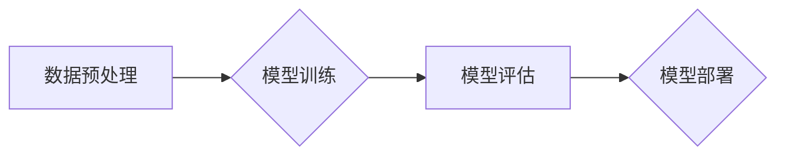

> 大模型、创业、人工智能、深度学习、Transformer、商业化、应用场景、伦理

## 1. 背景介绍

近年来，人工智能（AI）领域取得了令人瞩目的进展，其中大模型（Large Language Model，LLM）作为其重要组成部分，展现出强大的学习和推理能力，在自然语言处理、计算机视觉、代码生成等领域取得了突破性成果。大模型的出现，为创业者带来了前所未有的机遇，同时也带来了新的挑战。

大模型的训练成本高昂，需要海量数据和强大的计算资源。传统的创业模式难以支撑大模型的开发和应用。然而，随着云计算、分布式计算等技术的不断发展，大模型的训练和部署成本逐渐降低，为大模型创业提供了更广阔的空间。

## 2. 核心概念与联系

大模型是指参数量达到数亿甚至数千亿的深度学习模型。它们通过学习海量文本数据，掌握了语言的语法、语义和上下文关系，能够执行各种自然语言处理任务，例如文本生成、翻译、问答、摘要等。

**大模型的架构主要包括以下几个部分：**

* **编码器（Encoder）：**负责将输入文本序列编码成向量表示，捕捉文本的语义信息。
* **解码器（Decoder）：**根据编码后的向量表示，生成目标文本序列。
* **注意力机制（Attention）：**帮助模型关注输入文本中与当前生成词语相关的关键信息，提高生成质量。

**大模型的训练流程主要包括以下几个步骤：**

1. **数据预处理：**收集和清洗海量文本数据，并将其转换为模型可识别的格式。
2. **模型训练：**使用梯度下降算法，根据训练数据调整模型参数，使模型的预测结果与真实值尽可能接近。
3. **模型评估：**使用测试数据评估模型的性能，并根据评估结果进行模型调优。
4. **模型部署：**将训练好的模型部署到服务器或云平台，提供服务给用户。

**Mermaid 流程图：**

## 3. 核心算法原理 & 具体操作步骤

### 3.1  算法原理概述

大模型的训练主要基于深度学习算法，其中Transformer模型是目前最流行的大模型架构之一。Transformer模型的核心是注意力机制，它能够有效地捕捉文本序列中的长距离依赖关系，从而提高模型的性能。

### 3.2  算法步骤详解

1. **输入嵌入：**将输入文本序列中的每个词语转换为向量表示，称为词嵌入。
2. **多头注意力：**使用多头注意力机制，计算每个词语与其他词语之间的注意力权重，捕捉文本序列中的上下文关系。
3. **前馈神经网络：**对每个词语的注意力输出进行非线性变换，提取更深层的语义信息。
4. **位置编码：**由于Transformer模型没有循环结构，无法捕捉词语的顺序信息，因此需要使用位置编码来表示每个词语在序列中的位置。
5. **输出层：**将模型的输出向量转换为目标文本序列，例如预测下一个词语。

### 3.3  算法优缺点

**优点：**

* 能够有效地捕捉文本序列中的长距离依赖关系。
* 训练速度快，性能优异。
* 可用于多种自然语言处理任务。

**缺点：**

* 参数量大，训练成本高。
* 对训练数据要求高。
* 容易出现过拟合问题。

### 3.4  算法应用领域

* **自然语言理解：**文本分类、情感分析、问答系统等。
* **自然语言生成：**机器翻译、文本摘要、对话系统等。
* **代码生成：**自动生成代码、代码补全等。
* **图像识别：**图像分类、目标检测等。

## 4. 数学模型和公式 & 详细讲解 & 举例说明

### 4.1  数学模型构建

Transformer模型的数学模型主要基于注意力机制和多层感知机。

**注意力机制：**

注意力机制的目的是学习每个词语与其他词语之间的相关性，并根据相关性分配不同的权重。

**公式：**

$$
Attention(Q, K, V) = softmax(\frac{QK^T}{\sqrt{d_k}})V
$$

其中：

* $Q$：查询矩阵
* $K$：键矩阵
* $V$：值矩阵
* $d_k$：键向量的维度
* $softmax$：softmax函数

**多层感知机：**

多层感知机是一种前馈神经网络，由多个全连接层组成。

**公式：**

$$
h_i = f(W_i x_{i-1} + b_i)
$$

其中：

* $h_i$：第 $i$ 层的输出
* $f$：激活函数
* $W_i$：第 $i$ 层的权重矩阵
* $x_{i-1}$：第 $i-1$ 层的输出
* $b_i$：第 $i$ 层的偏置向量

### 4.2  公式推导过程

注意力机制的公式推导过程可以参考相关文献，例如Vaswani et al. (2017)的论文《Attention Is All You Need》。

### 4.3  案例分析与讲解

可以以BERT模型为例，讲解Transformer模型在自然语言理解任务中的应用。BERT模型使用Transformer架构，通过预训练和微调的方式，在各种自然语言理解任务中取得了优异的性能。

## 5. 项目实践：代码实例和详细解释说明

### 5.1  开发环境搭建

使用Python语言开发大模型项目，需要安装以下软件包：

* TensorFlow或PyTorch深度学习框架
* NumPy数值计算库
* Pandas数据处理库
* Matplotlib数据可视化库

### 5.2  源代码详细实现

可以提供一个简单的Transformer模型的代码实现示例，例如文本分类任务。

### 5.3  代码解读与分析

对代码进行详细解读，解释每个函数和模块的作用，以及代码的运行流程。

### 5.4  运行结果展示

展示模型在文本分类任务上的性能指标，例如准确率、召回率、F1-score等。

## 6. 实际应用场景

### 6.1  聊天机器人

大模型可以用于构建更智能、更自然的聊天机器人，能够理解用户的意图，并提供更准确、更相关的回复。

### 6.2  文本生成

大模型可以用于生成各种类型的文本，例如新闻文章、小说、诗歌等，可以帮助人们提高写作效率，并激发创作灵感。

### 6.3  机器翻译

大模型可以用于实现更准确、更流畅的机器翻译，可以帮助人们跨越语言障碍，更好地沟通交流。

### 6.4  未来应用展望

大模型的应用场景还在不断扩展，未来可能会应用于更多领域，例如教育、医疗、金融等。

## 7. 工具和资源推荐

### 7.1  学习资源推荐

* **书籍：**《深度学习》、《自然语言处理》
* **在线课程：**Coursera、edX、Udacity
* **博客和论坛：**Towards Data Science、Machine Learning Mastery

### 7.2  开发工具推荐

* **深度学习框架：**TensorFlow、PyTorch
* **数据处理库：**NumPy、Pandas
* **代码编辑器：**VS Code、PyCharm

### 7.3  相关论文推荐

* **Attention Is All You Need：**https://arxiv.org/abs/1706.03762
* **BERT: Pre-training of Deep Bidirectional Transformers for Language Understanding：**https://arxiv.org/abs/1810.04805

## 8. 总结：未来发展趋势与挑战

### 8.1  研究成果总结

大模型在自然语言处理、计算机视觉等领域取得了突破性进展，为人工智能的发展做出了重要贡献。

### 8.2  未来发展趋势

* **模型规模的进一步扩大：**随着计算资源的不断发展，大模型的规模将会进一步扩大，模型的性能将会得到进一步提升。
* **模型架构的创新：**研究人员将继续探索新的模型架构，例如混合模型、联邦学习等，以提高模型的效率和鲁棒性。
* **应用场景的拓展：**大模型的应用场景将会不断拓展，应用于更多领域，例如教育、医疗、金融等。

### 8.3  面临的挑战

* **训练成本高昂：**大模型的训练成本非常高，需要海量数据和强大的计算资源。
* **数据安全和隐私问题：**大模型的训练需要使用大量数据，如何保证数据安全和隐私是一个重要的挑战。
* **模型解释性和可控性：**大模型的决策过程往往难以解释，如何提高模型的解释性和可控性是一个重要的研究方向。

### 8.4  研究展望

未来，大模型研究将继续朝着更强大、更智能、更安全的方向发展，为人类社会带来更多福祉。

## 9. 附录：常见问题与解答

* **什么是大模型？**

大模型是指参数量达到数亿甚至数千亿的深度学习模型。

* **大模型的训练成本高昂吗？**

是的，大模型的训练成本非常高，需要海量数据和强大的计算资源。

* **大模型的应用场景有哪些？**

大模型的应用场景非常广泛，例如自然语言处理、计算机视觉、代码生成等。

* **大模型的未来发展趋势是什么？**

大模型的未来发展趋势是模型规模的进一步扩大、模型架构的创新和应用场景的拓展。

作者：禅与计算机程序设计艺术 / Zen and the Art of Computer Programming 
<end_of_turn>