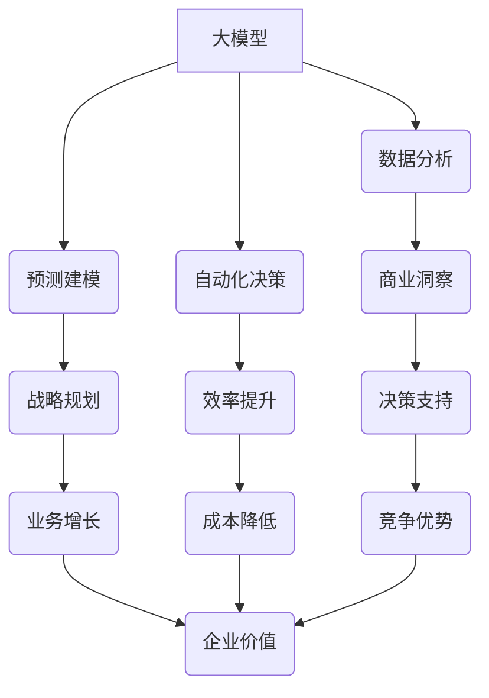

> 大模型、商业智能、深度学习、自然语言处理、计算机视觉、数据分析、预测建模、自动化决策

## 1. 背景介绍

商业智能 (BI) 作为一种利用数据驱动决策的战略，在现代企业中扮演着越来越重要的角色。随着数据量的爆炸式增长和人工智能技术的快速发展，大模型技术为商业智能领域带来了前所未有的机遇。大模型，是指参数规模庞大、训练数据海量的人工智能模型，其强大的学习能力和泛化能力使其能够处理复杂的数据模式，并提供更精准、更深入的商业洞察。

传统的商业智能系统主要依赖于规则引擎和统计模型，其分析能力有限，难以应对海量数据和复杂业务场景。而大模型则能够突破这些限制，通过深度学习等先进算法，从海量数据中挖掘出隐藏的模式和趋势，为企业提供更全面的商业智能支持。

## 2. 核心概念与联系

大模型在商业智能领域的应用主要体现在以下几个方面：

* **数据分析与洞察:** 大模型能够对海量数据进行快速、高效的分析，识别出潜在的商业机会和风险，帮助企业做出更明智的决策。
* **预测建模:** 大模型可以根据历史数据预测未来的趋势，例如销售额、客户流失率等，为企业制定更有效的战略计划。
* **自动化决策:** 大模型可以根据预设的规则和策略，自动完成一些决策任务，例如客户服务、营销推广等，提高效率并降低成本。

**大模型与商业智能的联系**



## 3. 核心算法原理 & 具体操作步骤

### 3.1  算法原理概述

大模型的核心算法主要包括深度学习、自然语言处理 (NLP) 和计算机视觉 (CV)。

* **深度学习:** 深度学习是一种机器学习的子领域，它利用多层神经网络来模拟人类大脑的学习过程。深度学习算法能够从海量数据中自动学习特征，并进行复杂的模式识别和预测。
* **自然语言处理 (NLP):** NLP 旨在使计算机能够理解和处理人类语言。大模型在 NLP 领域取得了突破性进展，例如机器翻译、文本摘要、情感分析等。
* **计算机视觉 (CV):** CV 旨在使计算机能够“看”和理解图像和视频。大模型在 CV 领域也取得了显著成果，例如图像识别、物体检测、场景理解等。

### 3.2  算法步骤详解

大模型的训练过程通常包括以下步骤：

1. **数据收集和预处理:** 收集大量相关数据，并进行清洗、格式化和转换等预处理操作。
2. **模型构建:** 根据具体任务选择合适的深度学习模型架构，例如 Transformer、BERT 等。
3. **模型训练:** 使用训练数据对模型进行训练，调整模型参数，使其能够准确地完成目标任务。
4. **模型评估:** 使用测试数据评估模型的性能，例如准确率、召回率、F1-score 等。
5. **模型部署:** 将训练好的模型部署到生产环境中，用于实际应用。

### 3.3  算法优缺点

**优点:**

* **强大的学习能力:** 大模型能够从海量数据中自动学习特征，并进行复杂的模式识别和预测。
* **泛化能力强:** 大模型在训练完成后能够应用于不同的数据和任务，具有较强的泛化能力。
* **持续学习:** 大模型可以通过不断更新数据和模型参数，不断提升其性能。

**缺点:**

* **训练成本高:** 大模型的训练需要大量的计算资源和时间，成本较高。
* **数据依赖性强:** 大模型的性能取决于训练数据的质量和数量，数据不足或质量低劣会导致模型性能下降。
* **可解释性差:** 大模型的决策过程较为复杂，难以解释其背后的逻辑，这可能会导致模型的信任度降低。

### 3.4  算法应用领域

大模型在商业智能领域有着广泛的应用场景，例如：

* **客户关系管理 (CRM):** 分析客户行为数据，预测客户流失率，提供个性化服务。
* **市场营销:** 分析市场趋势，预测产品需求，优化营销策略。
* **财务分析:** 分析财务数据，预测财务风险，辅助财务决策。
* **运营管理:** 分析运营数据，优化生产流程，提高运营效率。

## 4. 数学模型和公式 & 详细讲解 & 举例说明

### 4.1  数学模型构建

大模型的训练过程本质上是一个优化问题，目标是找到模型参数，使得模型在训练数据上的损失函数最小。常用的损失函数包括均方误差 (MSE)、交叉熵损失 (Cross-Entropy Loss) 等。

**均方误差 (MSE):**

$$MSE = \frac{1}{n} \sum_{i=1}^{n} (y_i - \hat{y}_i)^2$$

其中：

* $y_i$ 是真实值
* $\hat{y}_i$ 是模型预测值
* $n$ 是样本数量

**交叉熵损失 (Cross-Entropy Loss):**

$$Cross-Entropy Loss = -\sum_{i=1}^{n} y_i \log(\hat{y}_i)$$

其中：

* $y_i$ 是真实标签 (one-hot编码)
* $\hat{y}_i$ 是模型预测概率

### 4.2  公式推导过程

损失函数的最小化可以通过梯度下降算法实现。梯度下降算法的基本思想是迭代更新模型参数，使得损失函数不断减小。

**梯度下降算法:**

$$\theta_{t+1} = \theta_t - \alpha \nabla L(\theta_t)$$

其中：

* $\theta$ 是模型参数
* $t$ 是迭代次数
* $\alpha$ 是学习率
* $\nabla L(\theta_t)$ 是损失函数在当前参数下的梯度

### 4.3  案例分析与讲解

例如，在文本分类任务中，可以使用交叉熵损失函数来衡量模型的性能。假设模型预测文本属于某个类别的概率为 0.8，而真实标签为该类别，则交叉熵损失为：

$$Cross-Entropy Loss = -0.8 \log(0.8) \approx 0.22$$

## 5. 项目实践：代码实例和详细解释说明

### 5.1  开发环境搭建

大模型的开发环境通常需要强大的计算资源，例如 GPU。可以使用云计算平台，例如 AWS、Google Cloud、Azure 等，搭建大模型的开发环境。

### 5.2  源代码详细实现

以下是一个使用 TensorFlow 库训练一个简单的文本分类模型的代码示例：

```python
import tensorflow as tf

# 定义模型架构
model = tf.keras.models.Sequential([
    tf.keras.layers.Embedding(input_dim=10000, output_dim=128),
    tf.keras.layers.LSTM(units=128),
    tf.keras.layers.Dense(units=1, activation='sigmoid')
])

# 编译模型
model.compile(optimizer='adam', loss='binary_crossentropy', metrics=['accuracy'])

# 训练模型
model.fit(x_train, y_train, epochs=10)

# 评估模型
loss, accuracy = model.evaluate(x_test, y_test)
print('Loss:', loss)
print('Accuracy:', accuracy)
```

### 5.3  代码解读与分析

* **Embedding 层:** 将文本单词映射到低维向量空间。
* **LSTM 层:** 用于处理文本序列数据，捕捉文本中的长距离依赖关系。
* **Dense 层:** 全连接层，用于将 LSTM 层的输出映射到分类结果。
* **Adam 优化器:** 用于更新模型参数。
* **Binary Cross-Entropy 损失函数:** 用于二分类任务。

### 5.4  运行结果展示

训练完成后，可以评估模型的性能，例如准确率、召回率等。

## 6. 实际应用场景

### 6.1  客户关系管理 (CRM)

大模型可以分析客户行为数据，识别出潜在的客户流失风险，并提供个性化的服务建议，例如推荐产品、发送促销信息等。

### 6.2  市场营销

大模型可以分析市场趋势，预测产品需求，优化营销策略，例如目标客户群体的精准定位、广告投放的优化等。

### 6.3  财务分析

大模型可以分析财务数据，预测财务风险，辅助财务决策，例如风险评估、投资决策等。

### 6.4  未来应用展望

随着大模型技术的不断发展，其在商业智能领域的应用场景将更加广泛，例如：

* **智能客服:** 利用大模型构建智能客服系统，能够自动回答客户问题，提供更快速、更便捷的客户服务。
* **个性化推荐:** 利用大模型分析用户行为数据，提供更精准的个性化推荐，例如商品推荐、内容推荐等。
* **自动决策:** 利用大模型构建自动决策系统，例如自动审批、自动交易等，提高效率并降低成本。

## 7. 工具和资源推荐

### 7.1  学习资源推荐

* **书籍:**
    * 《深度学习》
    * 《自然语言处理》
    * 《计算机视觉》
* **在线课程:**
    * Coursera
    * edX
    * Udacity

### 7.2  开发工具推荐

* **TensorFlow:** 开源深度学习框架
* **PyTorch:** 开源深度学习框架
* **Hugging Face:** 提供预训练的大模型和工具

### 7.3  相关论文推荐

* **Attention Is All You Need:** https://arxiv.org/abs/1706.03762
* **BERT: Pre-training of Deep Bidirectional Transformers for Language Understanding:** https://arxiv.org/abs/1810.04805

## 8. 总结：未来发展趋势与挑战

### 8.1  研究成果总结

大模型技术在商业智能领域取得了显著成果，例如在数据分析、预测建模、自动化决策等方面展现出强大的能力。

### 8.2  未来发展趋势

* **模型规模的进一步扩大:** 随着计算资源的不断提升，大模型的规模将继续扩大，模型的性能将进一步提升。
* **模型的泛化能力增强:** 研究人员将致力于开发更通用的大模型，使其能够应用于更广泛的领域和任务。
* **模型的可解释性提升:** 研究人员将致力于提高大模型的可解释性，使其决策过程更加透明，增强用户对模型的信任度。

### 8.3  面临的挑战

* **训练成本高:** 大模型的训练需要大量的计算资源和时间，成本较高。
* **数据依赖性强:** 大模型的性能取决于训练数据的质量和数量，数据不足或质量低劣会导致模型性能下降。
* **伦理问题:** 大模型的应用可能会带来一些伦理问题，例如数据隐私、算法偏见等，需要引起重视并进行相应的规制。

### 8.4  研究展望

未来，大模型技术将继续发展，并在商业智能领域发挥越来越重要的作用。研究人员将继续致力于解决大模型面临的挑战，并探索其在更多领域的应用。

## 9. 附录：常见问题与解答

**Q1: 大模型的训练需要多少计算资源？**

A1: 大模型的训练需要大量的计算资源，例如 GPU 和内存。具体需要的资源取决于模型的规模和训练数据的大小。

**Q2: 如何评估大模型的性能？**

A2: 大模型的性能可以通过多种指标来评估，例如准确率、召回率、F1-score 等。具体的评估指标取决于具体的任务。

**Q3: 大模型的训练时间有多长？**