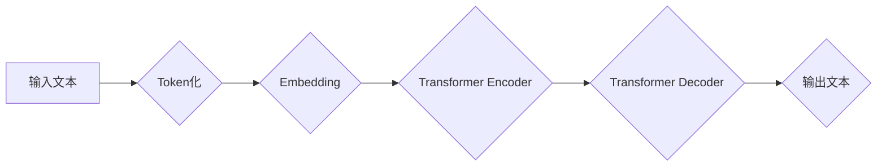

> 大语言模型、Transformer、BERT、GPT、LLM、自然语言处理、深度学习、文本生成

## 1. 背景介绍

近年来，深度学习技术取得了飞速发展，特别是Transformer模型的出现，为自然语言处理（NLP）领域带来了革命性的变革。大语言模型（LLM）作为Transformer模型的升级版，拥有强大的文本理解和生成能力，在文本分类、机器翻译、问答系统、代码生成等领域展现出巨大的应用潜力。

传统的NLP模型通常依赖于手工设计的特征工程，而LLM则通过学习海量文本数据，自动提取文本中的语义特征，从而实现更精准、更自然的语言理解和生成。

## 2. 核心概念与联系

大语言模型的核心概念包括：

* **Transformer模型:** Transformer是一种基于注意力机制的深度学习模型，能够有效捕捉文本序列中的长距离依赖关系，是LLM的基础架构。
* **自回归语言模型:** 自回归语言模型是一种预测下一个词的概率分布的模型，通过学习文本序列的统计规律，能够生成流畅、连贯的文本。
* **预训练与微调:** 预训练是指在大量文本数据上训练模型，学习通用语言表示；微调是指在特定任务数据上对预训练模型进行调整，使其能够完成特定任务。

**Mermaid 流程图:**



## 3. 核心算法原理 & 具体操作步骤

### 3.1  算法原理概述

Transformer模型的核心是注意力机制，它能够学习文本序列中不同词之间的关系，并赋予每个词不同的权重。

注意力机制可以分为三种类型：

* **自注意力 (Self-Attention):** 计算每个词与所有其他词之间的关系，用于捕捉文本序列中的长距离依赖关系。
* **多头注意力 (Multi-Head Attention):** 使用多个注意力头并行计算，可以学习到不同层次的语义信息。
* **交叉注意力 (Cross-Attention):** 计算两个序列之间的关系，例如在机器翻译中，计算源语言和目标语言之间的关系。

### 3.2  算法步骤详解

1. **Token化:** 将输入文本分割成一个个独立的词或子词。
2. **Embedding:** 将每个词转换为一个低维向量，称为词嵌入。
3. **自注意力层:** 使用自注意力机制计算每个词与所有其他词之间的关系，并生成注意力权重。
4. **多头注意力层:** 使用多个注意力头并行计算，学习到不同层次的语义信息。
5. **前馈神经网络层:** 对每个词的输出进行非线性变换，进一步提取语义特征。
6. **输出层:** 将模型的输出转换为目标语言的词概率分布。

### 3.3  算法优缺点

**优点:**

* 能够有效捕捉文本序列中的长距离依赖关系。
* 具有强大的文本理解和生成能力。
* 可以通过预训练和微调实现高效的模型训练。

**缺点:**

* 计算量大，训练成本高。
* 对训练数据质量要求高。
* 容易出现过拟合问题。

### 3.4  算法应用领域

* 文本分类
* 机器翻译
* 问答系统
* 代码生成
* 文本摘要
* 情感分析

## 4. 数学模型和公式 & 详细讲解 & 举例说明

### 4.1  数学模型构建

Transformer模型的数学模型主要包括以下几个部分：

* **词嵌入层:** 将每个词转换为一个低维向量，可以使用Word2Vec或GloVe等预训练词嵌入模型。
* **自注意力层:** 计算每个词与所有其他词之间的关系，可以使用以下公式计算注意力权重：

$$
\text{Attention}(Q, K, V) = \text{softmax}\left(\frac{Q K^T}{\sqrt{d_k}}\right) V
$$

其中，Q、K、V分别代表查询矩阵、键矩阵和值矩阵，$d_k$代表键向量的维度。

* **多头注意力层:** 使用多个注意力头并行计算，可以学习到不同层次的语义信息。
* **前馈神经网络层:** 对每个词的输出进行非线性变换，可以使用多层感知机 (MLP) 或卷积神经网络 (CNN)。

### 4.2  公式推导过程

注意力机制的公式推导过程可以参考相关文献，例如Vaswani et al. (2017)的论文《Attention Is All You Need》。

### 4.3  案例分析与讲解

例如，在机器翻译任务中，Transformer模型可以将源语言文本转换为目标语言文本。

在编码器部分，Transformer模型会将源语言文本编码成一个隐藏状态向量，该向量包含了源语言文本的语义信息。

在解码器部分，Transformer模型会使用源语言文本的隐藏状态向量以及目标语言的先前生成的词作为输入，并生成目标语言的下一个词。

## 5. 项目实践：代码实例和详细解释说明

### 5.1  开发环境搭建

* Python 3.6+
* TensorFlow 或 PyTorch
* CUDA 和 cuDNN

### 5.2  源代码详细实现

```python
# 使用 TensorFlow 实现一个简单的 Transformer 模型

import tensorflow as tf

# 定义词嵌入层
embedding_layer = tf.keras.layers.Embedding(vocab_size, embedding_dim)

# 定义自注意力层
attention_layer = tf.keras.layers.MultiHeadAttention(num_heads=8)

# 定义前馈神经网络层
ffn_layer = tf.keras.layers.Dense(units=hidden_dim, activation='relu')

# 定义 Transformer 模型
class Transformer(tf.keras.Model):
    def __init__(self, vocab_size, embedding_dim, hidden_dim, num_heads):
        super(Transformer, self).__init__()
        self.embedding_layer = embedding_layer
        self.attention_layer = attention_layer
        self.ffn_layer = ffn_layer

    def call(self, inputs):
        # 将输入文本转换为词嵌入
        embedded_inputs = self.embedding_layer(inputs)
        # 使用自注意力层计算词之间的关系
        attended_outputs = self.attention_layer(embedded_inputs, embedded_inputs, embedded_inputs)
        # 使用前馈神经网络层进一步提取语义特征
        output = self.ffn_layer(attended_outputs)
        return output

# 实例化 Transformer 模型
model = Transformer(vocab_size=10000, embedding_dim=128, hidden_dim=512, num_heads=8)

# 训练模型
model.compile(optimizer='adam', loss='mse')
model.fit(x_train, y_train, epochs=10)
```

### 5.3  代码解读与分析

* 代码首先定义了词嵌入层、自注意力层和前馈神经网络层。
* 然后定义了 Transformer 模型类，该类包含了上述三个层的实例。
* 在 `call` 方法中，模型会将输入文本转换为词嵌入，使用自注意力层计算词之间的关系，并使用前馈神经网络层进一步提取语义特征。
* 最后，实例化 Transformer 模型并使用 Adam 优化器和均方误差损失函数进行训练。

### 5.4  运行结果展示

训练完成后，可以将模型应用于文本分类、机器翻译等任务，并评估模型的性能。

## 6. 实际应用场景

### 6.1  文本分类

LLM可以用于分类文本，例如判断邮件是否为垃圾邮件、识别新闻文章的主题等。

### 6.2  机器翻译

LLM可以用于将文本从一种语言翻译成另一种语言，例如将英文翻译成中文。

### 6.3  问答系统

LLM可以用于构建问答系统，例如回答用户提出的问题，提供相关信息。

### 6.4  未来应用展望

LLM在未来将有更广泛的应用场景，例如：

* **个性化教育:** 根据学生的学习情况，提供个性化的学习内容和辅导。
* **智能客服:** 提供24小时在线客服，解答用户的疑问。
* **创意写作:** 帮助用户生成创意内容，例如诗歌、小说、剧本等。

## 7. 工具和资源推荐

### 7.1  学习资源推荐

* **论文:**
    * Attention Is All You Need (Vaswani et al., 2017)
    * BERT: Pre-training of Deep Bidirectional Transformers for Language Understanding (Devlin et al., 2018)
    * GPT-3: Language Models are Few-Shot Learners (Brown et al., 2020)
* **书籍:**
    * Deep Learning (Goodfellow et al., 2016)
    * Natural Language Processing with Python (Bird et al., 2009)

### 7.2  开发工具推荐

* **TensorFlow:** https://www.tensorflow.org/
* **PyTorch:** https://pytorch.org/
* **Hugging Face Transformers:** https://huggingface.co/transformers/

### 7.3  相关论文推荐

* **BERT:** https://arxiv.org/abs/1810.04805
* **GPT-3:** https://arxiv.org/abs/2005.14165
* **T5:** https://arxiv.org/abs/1910.10683

## 8. 总结：未来发展趋势与挑战

### 8.1  研究成果总结

近年来，LLM取得了显著的进展，在文本理解和生成方面展现出强大的能力。

### 8.2  未来发展趋势

* **模型规模的进一步扩大:** 随着计算资源的不断提升，LLM的规模将继续扩大，从而提升模型的性能。
* **多模态LLM的开发:** 将文本与其他模态信息（例如图像、音频）融合，开发更智能的LLM。
* **可解释性研究:** 研究LLM的决策过程，提高模型的可解释性。

### 8.3  面临的挑战

* **训练成本高:** 训练大型LLM需要大量的计算资源和时间。
* **数据质量问题:** LLM的性能依赖于训练数据的质量，而高质量的文本数据往往难以获取。
* **伦理问题:** LLM可能被用于生成虚假信息、进行恶意攻击等，需要关注其伦理问题。

### 8.4  研究展望

未来，LLM的研究将继续朝着更强大、更智能、更安全的方向发展。

## 9. 附录：常见问题与解答

* **什么是LLM？**

LLM是指大语言模型，是一种能够理解和生成人类语言的深度学习模型。

* **LLM有哪些应用场景？**

LLM在文本分类、机器翻译、问答系统、代码生成等领域都有广泛的应用。

* **如何训练LLM？**

训练LLM需要大量的文本数据和强大的计算资源。

* **LLM有哪些挑战？**

LLM面临着训练成本高、数据质量问题、伦理问题等挑战。


作者：禅与计算机程序设计艺术 / Zen and the Art of Computer Programming 
<end_of_turn>