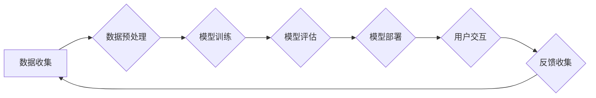

> 大语言模型，LLM，Transformer，深度学习，能耗，碳排放，可持续发展，优化算法

## 1. 背景介绍

大语言模型（Large Language Model，LLM）近年来在自然语言处理领域取得了突破性的进展，展现出强大的文本生成、翻译、摘要、问答等能力。这些模型通常由数十亿甚至数万亿个参数组成，需要大量的计算资源进行训练。然而，LLM的训练和部署过程消耗大量的能源，并产生大量的温室气体排放，引发了人们对其环境影响的关注。

随着全球对可持续发展的重视，LLM的能耗和碳排放问题日益突出。研究表明，训练大型语言模型可能消耗相当于数百个家庭年用电量，并产生大量的二氧化碳排放。这不仅对环境造成负面影响，也与全球减排目标相冲突。

因此，探讨LLM的能耗和碳排放问题，并寻求相应的解决方案，对于推动LLM的可持续发展至关重要。

## 2. 核心概念与联系

**2.1 大语言模型 (LLM)**

大语言模型是一种基于深度学习的统计模型，能够理解和生成人类语言。它们通常由 Transformer 架构组成，并通过大量的文本数据进行训练。

**2.2 Transformer 架构**

Transformer 架构是一种专门用于处理序列数据的网络结构，其核心是注意力机制。注意力机制能够学习文本中不同词语之间的关系，从而更好地理解上下文信息。

**2.3 训练过程**

LLM的训练过程是一个复杂的优化过程，目标是通过调整模型参数，使模型能够生成与真实文本相似的输出。训练过程通常需要大量的计算资源和时间。

**2.4 能耗和碳排放**

LLM的训练和部署过程消耗大量的能源，主要集中在以下几个方面：

* **计算资源:** 训练大型语言模型需要大量的计算资源，例如GPU和TPU。这些设备的运行会消耗大量的电力。
* **数据传输:** 训练数据通常需要从多个数据中心传输到训练服务器，这也会消耗大量的能源。
* **模型存储:** 大型语言模型的参数量巨大，需要大量的存储空间，存储过程也会消耗能源。

**2.5 Mermaid 流程图**



## 3. 核心算法原理 & 具体操作步骤

### 3.1  算法原理概述

LLM的核心算法是Transformer架构，它通过注意力机制学习文本中的上下文关系，并利用多层编码器和解码器结构进行文本生成。

**3.1.1 注意力机制**

注意力机制允许模型关注输入序列中与当前任务相关的部分，从而提高模型的理解能力。

**3.1.2 多层编码器-解码器结构**

编码器负责将输入文本编码成一个固定长度的向量表示，解码器则根据编码后的向量生成输出文本。

### 3.2  算法步骤详解

1. **数据预处理:** 将原始文本数据进行清洗、分词、标记等预处理操作，使其能够被模型理解。
2. **模型训练:** 使用训练数据训练Transformer模型，通过反向传播算法调整模型参数，使模型能够生成与真实文本相似的输出。
3. **模型评估:** 使用测试数据评估模型的性能，例如准确率、困惑度等指标。
4. **模型部署:** 将训练好的模型部署到服务器上，以便用户进行交互。

### 3.3  算法优缺点

**优点:**

* 能够处理长文本序列，并理解上下文关系。
* 表现出强大的文本生成、翻译、摘要等能力。

**缺点:**

* 训练过程需要大量的计算资源和时间。
* 模型参数量巨大，存储和部署成本高。
* 容易受到训练数据偏差的影响。

### 3.4  算法应用领域

* 自然语言处理：文本生成、翻译、摘要、问答、对话系统等。
* 人工智能：机器学习、深度学习、计算机视觉等。
* 其他领域：教育、医疗、金融、法律等。

## 4. 数学模型和公式 & 详细讲解 & 举例说明

### 4.1  数学模型构建

LLM的数学模型通常基于概率论和统计学，目标是学习文本数据的概率分布。

**4.1.1 语言模型**

语言模型的目标是预测下一个词语出现的概率，给定前文词语的上下文。

**4.1.2 条件概率分布**

LLM学习的是条件概率分布，即给定前文词语的条件下，下一个词语出现的概率。

### 4.2  公式推导过程

**4.2.1 语言模型概率**

$$P(w_t|w_{1:t-1})$$

其中，$w_t$ 是第 $t$ 个词语，$w_{1:t-1}$ 是前 $t-1$ 个词语。

**4.2.2 条件概率分布**

$$P(w_t|w_{1:t-1}) = \frac{P(w_{1:t})}{P(w_{1:t-1})}$$

其中，$P(w_{1:t})$ 是前 $t$ 个词语出现的概率，$P(w_{1:t-1})$ 是前 $t-1$ 个词语出现的概率。

### 4.3  案例分析与讲解

**4.3.1 例子**

假设我们有一个句子：“The cat sat on the mat”。

**4.3.2 计算**

我们可以使用语言模型计算每个词语出现的概率，例如：

* $P($cat$|The) = \frac{P(The \ cat)}{P(The)}$

**4.3.3 解释**

通过计算条件概率分布，我们可以了解每个词语在特定上下文中的出现概率。

## 5. 项目实践：代码实例和详细解释说明

### 5.1  开发环境搭建

* 操作系统：Linux
* Python 版本：3.7+
* 框架：TensorFlow 或 PyTorch
* GPU：NVIDIA GeForce RTX 3090 或更高

### 5.2  源代码详细实现

```python
import tensorflow as tf

# 定义模型结构
model = tf.keras.Sequential([
    tf.keras.layers.Embedding(input_dim=vocab_size, output_dim=embedding_dim),
    tf.keras.layers.LSTM(units=hidden_size),
    tf.keras.layers.Dense(units=vocab_size, activation='softmax')
])

# 编译模型
model.compile(optimizer='adam', loss='sparse_categorical_crossentropy', metrics=['accuracy'])

# 训练模型
model.fit(x_train, y_train, epochs=epochs, batch_size=batch_size)

# 保存模型
model.save('language_model.h5')
```

### 5.3  代码解读与分析

* **Embedding 层:** 将词语映射到低维向量空间。
* **LSTM 层:** 学习文本序列中的上下文关系。
* **Dense 层:** 将 LSTM 输出映射到词语概率分布。
* **编译模型:** 设置优化器、损失函数和评价指标。
* **训练模型:** 使用训练数据训练模型。
* **保存模型:** 将训练好的模型保存为文件。

### 5.4  运行结果展示

训练完成后，可以使用测试数据评估模型的性能，例如准确率、困惑度等指标。

## 6. 实际应用场景

LLM在各个领域都有广泛的应用场景，例如：

* **自然语言理解:** 文本分类、情感分析、问答系统等。
* **自然语言生成:** 文本摘要、机器翻译、对话系统等。
* **代码生成:** 自动生成代码片段、代码补全等。

### 6.4  未来应用展望

随着LLM技术的不断发展，其应用场景将更加广泛，例如：

* **个性化教育:** 根据学生的学习情况提供个性化的学习内容和辅导。
* **医疗诊断:** 辅助医生进行疾病诊断和治疗方案制定。
* **科学研究:** 帮助科学家进行数据分析和模型构建。

## 7. 工具和资源推荐

### 7.1  学习资源推荐

* **书籍:**
    * 《深度学习》
    * 《自然语言处理》
* **在线课程:**
    * Coursera: 自然语言处理
    * edX: 深度学习
* **博客:**
    * The Gradient
    * Towards Data Science

### 7.2  开发工具推荐

* **框架:** TensorFlow, PyTorch
* **库:** NLTK, SpaCy
* **平台:** Google Colab, Kaggle

### 7.3  相关论文推荐

* **Attention Is All You Need**
* **BERT: Pre-training of Deep Bidirectional Transformers for Language Understanding**
* **GPT-3: Language Models are Few-Shot Learners**

## 8. 总结：未来发展趋势与挑战

### 8.1  研究成果总结

LLM在自然语言处理领域取得了显著的进展，展现出强大的文本理解和生成能力。

### 8.2  未来发展趋势

* **模型规模和性能提升:** 随着计算资源的不断发展，LLM的规模和性能将继续提升。
* **多模态学习:** LLM将与其他模态数据（例如图像、音频）融合，实现多模态理解和生成。
* **可解释性增强:** 研究如何提高LLM的透明度和可解释性，使其更易于理解和信任。

### 8.3  面临的挑战

* **能耗和碳排放:** LLM的训练和部署过程消耗大量的能源，需要寻找更环保的训练方法。
* **数据偏见:** LLM容易受到训练数据偏见的影響，需要开发方法来缓解数据偏见问题。
* **安全性和伦理问题:** LLM可能被用于生成虚假信息或进行恶意攻击，需要加强安全性和伦理方面的研究。

### 8.4  研究展望

未来，LLM研究将继续朝着更强大、更安全、更可持续的方向发展。

## 9. 附录：常见问题与解答

**9.1  LLM的训练需要多少计算资源？**

LLM的训练需要大量的计算资源，例如GPU和TPU。训练大型语言模型可能需要数千甚至数万个GPU。

**9.2  LLM的训练时间有多长？**

LLM的训练时间取决于模型规模、训练数据量和计算资源等因素。训练大型语言模型可能需要数周甚至数月的时间。

**9.3  如何降低LLM的能耗和碳排放？**

* 使用更有效的训练算法。
* 优化模型架构，减少模型参数量。
* 利用可再生能源进行训练。
* 共享计算资源，减少重复训练。

**9.4  LLM的安全性如何保证？**

* 开发安全训练方法，防止模型被恶意攻击。
* 评估模型的潜在风险，并采取相应的措施。
* 建立伦理规范，指导LLM的开发和应用。


作者：禅与计算机程序设计艺术 / Zen and the Art of Computer Programming 
<end_of_turn>