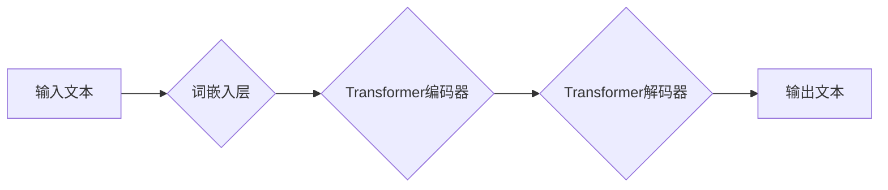

> 大语言模型、LLM、自然语言处理、NLP、文本生成、对话系统、机器学习、深度学习、Transformer

## 1. 背景介绍

近年来，人工智能领域取得了令人瞩目的进展，其中大语言模型（Large Language Model，LLM）作为一种强大的工具，在自然语言处理（Natural Language Processing，NLP）领域展现出巨大的潜力。LLM 能够理解和生成人类语言，并完成各种复杂的任务，例如文本摘要、机器翻译、问答系统、代码生成等。

随着技术的不断发展，LLM 的规模和能力不断提升，其应用场景也越来越广泛。从聊天机器人到智能写作助手，从代码生成到科学研究，LLM 都在各个领域发挥着重要作用。

## 2. 核心概念与联系

大语言模型的核心概念是利用深度学习算法训练一个庞大的神经网络模型，使其能够理解和生成人类语言。

**2.1  核心概念**

* **自然语言处理 (NLP):**  致力于使计算机能够理解、处理和生成人类语言。
* **深度学习 (Deep Learning):**  一种机器学习的子领域，利用多层神经网络模拟人类大脑的学习过程。
* **Transformer:**  一种新型的深度学习架构，能够有效处理序列数据，例如文本。

**2.2  架构图**



**2.3  联系**

LLM 的核心是将深度学习技术，特别是 Transformer 架构，应用于 NLP 领域。通过训练大量的文本数据，LLM 可以学习到语言的语法、语义和上下文关系，从而能够理解和生成人类语言。

## 3. 核心算法原理 & 具体操作步骤

**3.1  算法原理概述**

LLM 的训练主要基于自回归语言模型 (Autoregressive Language Model) 的原理。

自回归语言模型通过预测下一个词来学习语言的概率分布。训练过程是通过输入一个文本序列，然后预测下一个词，并根据预测结果更新模型参数。

**3.2  算法步骤详解**

1. **数据预处理:** 将文本数据进行清洗、分词、词嵌入等预处理操作。
2. **模型训练:** 使用 Transformer 架构的深度学习模型，训练模型参数以预测下一个词。
3. **模型评估:** 使用测试数据评估模型的性能，例如困惑度 (Perplexity) 和 BLEU 分数。
4. **模型部署:** 将训练好的模型部署到实际应用场景中。

**3.3  算法优缺点**

* **优点:**

    * 能够生成流畅、自然的文本。
    * 能够理解和处理复杂的语言结构。
    * 能够进行多种 NLP 任务，例如文本摘要、机器翻译、问答系统等。

* **缺点:**

    * 训练成本高，需要大量的计算资源和数据。
    * 容易受到训练数据的影响，可能生成带有偏见或错误的信息。
    * 缺乏对真实世界知识的理解，难以处理一些需要逻辑推理的任务。

**3.4  算法应用领域**

* **聊天机器人:**  构建能够与人类进行自然对话的聊天机器人。
* **智能写作助手:**  帮助用户撰写文章、邮件、代码等文本。
* **机器翻译:**  将一种语言翻译成另一种语言。
* **问答系统:**  回答用户提出的问题。
* **代码生成:**  根据自然语言描述生成代码。

## 4. 数学模型和公式 & 详细讲解 & 举例说明

**4.1  数学模型构建**

LLM 的数学模型通常基于 Transformer 架构，其核心是注意力机制 (Attention Mechanism)。注意力机制能够学习到文本中不同词之间的关系，并赋予重要词更高的权重。

**4.2  公式推导过程**

注意力机制的计算公式如下：

$$
Attention(Q, K, V) = softmax(\frac{QK^T}{\sqrt{d_k}})V
$$

其中：

* $Q$：查询矩阵
* $K$：键矩阵
* $V$：值矩阵
* $d_k$：键向量的维度
* $softmax$：softmax 函数

**4.3  案例分析与讲解**

假设我们有一个句子 "The cat sat on the mat"，我们想要计算 "cat" 和 "mat" 之间的注意力权重。

1. 将句子中的每个词转换为词向量。
2. 计算查询矩阵 $Q$、键矩阵 $K$ 和值矩阵 $V$。
3. 使用注意力机制公式计算 "cat" 和 "mat" 之间的注意力权重。

结果表明，"cat" 和 "mat" 之间的注意力权重较高，说明这两个词在语义上相关。

## 5. 项目实践：代码实例和详细解释说明

**5.1  开发环境搭建**

* Python 3.7+
* PyTorch 或 TensorFlow
* CUDA 和 cuDNN

**5.2  源代码详细实现**

```python
import torch
import torch.nn as nn

class Transformer(nn.Module):
    def __init__(self, vocab_size, embedding_dim, num_heads, num_layers):
        super(Transformer, self).__init__()
        self.embedding = nn.Embedding(vocab_size, embedding_dim)
        self.transformer_layers = nn.ModuleList([
            nn.TransformerEncoderLayer(embedding_dim, num_heads)
            for _ in range(num_layers)
        ])

    def forward(self, x):
        x = self.embedding(x)
        for layer in self.transformer_layers:
            x = layer(x)
        return x
```

**5.3  代码解读与分析**

* `Transformer` 类定义了一个 Transformer 模型。
* `embedding` 层将词索引转换为词向量。
* `transformer_layers` 是一个列表，包含多个 Transformer 编码器层。
* `forward` 方法定义了模型的正向传播过程。

**5.4  运行结果展示**

训练好的模型可以用于各种 NLP 任务，例如文本生成、机器翻译等。

## 6. 实际应用场景

**6.1  聊天机器人**

LLM 可以用于构建能够与人类进行自然对话的聊天机器人。例如，Google 的 LaMDA 和 OpenAI 的 ChatGPT 都是基于 LLM 的聊天机器人。

**6.2  智能写作助手**

LLM 可以帮助用户撰写文章、邮件、代码等文本。例如，Grammarly 和 Jasper 都是基于 LLM 的智能写作助手。

**6.3  机器翻译**

LLM 可以用于将一种语言翻译成另一种语言。例如，Google Translate 和 DeepL 都是基于 LLM 的机器翻译系统。

**6.4  未来应用展望**

LLM 的应用场景还在不断扩展，未来可能会应用于以下领域：

* **教育:** 个性化学习、智能辅导
* **医疗:** 疾病诊断、药物研发
* **法律:** 法律文本分析、合同审查
* **金融:** 风险评估、欺诈检测

## 7. 工具和资源推荐

**7.1  学习资源推荐**

* **书籍:**
    * 《深度学习》
    * 《自然语言处理》
* **在线课程:**
    * Coursera: 自然语言处理
    * Udacity: 深度学习

**7.2  开发工具推荐**

* **PyTorch:** 深度学习框架
* **TensorFlow:** 深度学习框架
* **Hugging Face Transformers:** 预训练 LLM 模型库

**7.3  相关论文推荐**

* 《Attention Is All You Need》
* 《BERT: Pre-training of Deep Bidirectional Transformers for Language Understanding》
* 《GPT-3: Language Models are Few-Shot Learners》

## 8. 总结：未来发展趋势与挑战

**8.1  研究成果总结**

近年来，LLM 在 NLP 领域取得了显著进展，能够完成各种复杂的任务，并展现出巨大的应用潜力。

**8.2  未来发展趋势**

* **模型规模和能力的进一步提升:** 随着计算资源的不断发展，LLM 的规模和能力将会进一步提升。
* **多模态 LLMs 的发展:** 将文本、图像、音频等多种模态信息融合到 LLM 中，构建更强大的多模态模型。
* **可解释性和安全性:** 研究 LLMs 的工作机制，提高模型的可解释性和安全性。

**8.3  面临的挑战**

* **训练成本高:** 训练大型 LLM 需要大量的计算资源和数据。
* **数据偏见:** LLM 的训练数据可能存在偏见，导致模型生成带有偏见的信息。
* **伦理问题:** LLM 的应用可能引发一些伦理问题，例如虚假信息传播、隐私泄露等。

**8.4  研究展望**

未来，LLM 研究将继续朝着更强大、更安全、更可解释的方向发展。


## 9. 附录：常见问题与解答

**9.1  什么是 LLMs 的困惑度？**

困惑度 (Perplexity) 是衡量语言模型预测能力的指标。困惑度越低，表示模型预测能力越强。

**9.2  如何训练一个 LLMs 模型？**

训练一个 LLMs 模型需要大量的计算资源和数据。通常使用自回归语言模型的训练方法，通过预测下一个词来学习语言的概率分布。

**9.3  LLMs 的应用有哪些？**

LLMs 的应用场景非常广泛，例如聊天机器人、智能写作助手、机器翻译、代码生成等。


作者：禅与计算机程序设计艺术 / Zen and the Art of Computer Programming 
<end_of_turn>