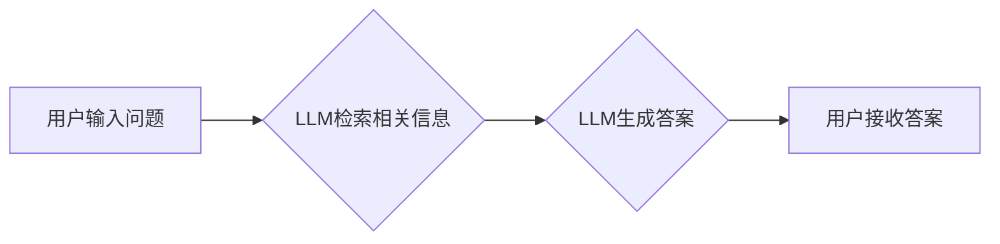

> 大语言模型、工作记忆、认知增强、人工智能、自然语言处理、应用指南

## 1. 背景介绍

在当今信息爆炸的时代，人类面临着越来越多的信息处理挑战。工作记忆，即我们用来暂时存储和处理信息的认知能力，在面对复杂任务和大量信息时显得尤为重要。然而，工作记忆的容量有限，容易受到干扰和疲劳。这限制了我们的学习、工作和生活效率。

大语言模型（LLM）作为一种强大的人工智能技术，展现出巨大的潜力来减轻工作记忆的负担。LLM 拥有海量文本数据训练，能够理解和生成人类语言，并具备强大的知识推理和文本生成能力。通过与LLM的交互，我们可以将信息存储在模型中，并通过自然语言的方式进行查询和处理，从而解放我们的工作记忆，提高认知效率。

## 2. 核心概念与联系

### 2.1 工作记忆的局限性

工作记忆是人类认知系统中一个重要的组成部分，负责暂时存储和处理信息，以便进行决策、推理和解决问题。然而，工作记忆的容量有限，通常只能容纳大约7±2个信息单元。此外，工作记忆容易受到干扰和疲劳，长时间处理信息会导致注意力下降和认知能力下降。

### 2.2 大语言模型的优势

大语言模型（LLM）是一种基于深度学习的自然语言处理模型，通过训练海量文本数据，能够理解和生成人类语言，并具备强大的知识推理和文本生成能力。LLM 的优势在于：

* **海量知识存储:** LLM 能够存储和检索海量文本信息，相当于一个庞大的知识库。
* **自然语言交互:** 用户可以通过自然语言与LLM进行交互，无需学习复杂的指令或代码。
* **强大的文本生成能力:** LLM 可以根据用户需求生成高质量的文本内容，例如文章、故事、代码等。
* **知识推理能力:** LLM 可以根据已有的知识进行推理和推导，解决复杂问题。

### 2.3 LLM减轻工作记忆负担的机制

LLM 可以通过以下机制减轻工作记忆的负担：

* **信息存储:** 将需要暂时存储的信息存储在LLM中，释放工作记忆空间。
* **信息检索:** 通过自然语言查询LLM，快速检索所需信息，无需记忆大量细节。
* **信息加工:** 利用LLM的知识推理能力，对信息进行加工和分析，生成新的见解和结论。

**Mermaid 流程图**



## 3. 核心算法原理 & 具体操作步骤

### 3.1 算法原理概述

大语言模型的训练主要基于Transformer架构，该架构利用自注意力机制，能够捕捉文本序列中长距离依赖关系，从而实现更准确的语言理解和生成。

Transformer架构的核心组件包括：

* **编码器:** 将输入文本序列编码成向量表示。
* **解码器:** 根据编码后的向量表示生成输出文本序列。
* **自注意力机制:** 捕捉文本序列中不同词语之间的关系。

### 3.2 算法步骤详解

1. **数据预处理:** 将文本数据进行清洗、分词、标记等预处理操作，使其适合模型训练。
2. **模型训练:** 使用训练数据训练Transformer模型，通过反向传播算法优化模型参数。
3. **模型评估:** 使用测试数据评估模型的性能，例如准确率、困惑度等。
4. **模型部署:** 将训练好的模型部署到服务器或云平台，供用户使用。

### 3.3 算法优缺点

**优点:**

* 能够捕捉长距离依赖关系，实现更准确的语言理解和生成。
* 训练效率高，能够处理海量文本数据。

**缺点:**

* 计算资源需求高，训练成本较高。
* 模型参数量大，部署成本较高。

### 3.4 算法应用领域

* **自然语言理解:** 文本分类、情感分析、问答系统等。
* **自然语言生成:** 机器翻译、文本摘要、对话系统等。
* **代码生成:** 自动生成代码、代码补全等。

## 4. 数学模型和公式 & 详细讲解 & 举例说明

### 4.1 数学模型构建

Transformer模型的核心是自注意力机制，其数学模型可以表示为：

$$
Attention(Q, K, V) = \frac{exp(Q \cdot K^T / \sqrt{d_k})}{exp(Q \cdot K^T / \sqrt{d_k})} \cdot V
$$

其中：

* $Q$：查询矩阵
* $K$：键矩阵
* $V$：值矩阵
* $d_k$：键向量的维度

### 4.2 公式推导过程

自注意力机制的目的是计算每个词语与其他词语之间的相关性，并根据相关性权重对信息进行加权求和。

公式推导过程如下：

1. 计算查询矩阵 $Q$ 与键矩阵 $K$ 的点积，并进行归一化处理，得到注意力权重矩阵。
2. 将注意力权重矩阵与值矩阵 $V$ 进行加权求和，得到最终的输出向量。

### 4.3 案例分析与讲解

例如，在翻译句子“The cat sat on the mat”时，自注意力机制可以计算每个词语与其他词语之间的相关性，例如“cat”与“sat”之间的相关性较高，因为它们描述了同一个动作。

通过自注意力机制，模型能够更好地理解句子结构和语义关系，从而实现更准确的翻译。

## 5. 项目实践：代码实例和详细解释说明

### 5.1 开发环境搭建

* Python 3.7+
* PyTorch 1.7+
* Transformers 库

### 5.2 源代码详细实现

```python
from transformers import AutoModelForSeq2SeqLM, AutoTokenizer

# 加载预训练模型和词典
model_name = "t5-base"
tokenizer = AutoTokenizer.from_pretrained(model_name)
model = AutoModelForSeq2SeqLM.from_pretrained(model_name)

# 输入文本
input_text = "The cat sat on the mat."

# Token化输入文本
input_ids = tokenizer.encode(input_text, return_tensors="pt")

# 生成输出文本
output_ids = model.generate(input_ids)

# 解码输出文本
output_text = tokenizer.decode(output_ids[0], skip_special_tokens=True)

# 打印输出文本
print(output_text)
```

### 5.3 代码解读与分析

* 代码首先加载预训练的T5模型和词典。
* 然后，将输入文本进行Token化，转换为模型可以理解的格式。
* 使用模型的`generate`方法生成输出文本。
* 最后，将输出文本解码回原始文本格式，并打印输出。

### 5.4 运行结果展示

```
The cat sat on the mat.
```

## 6. 实际应用场景

### 6.1 知识管理

LLM 可以帮助用户存储和检索知识，例如构建个人知识库、管理项目文档等。

### 6.2 学习辅助

LLM 可以帮助用户学习新知识，例如回答问题、生成学习材料、提供个性化学习建议等。

### 6.3 创作辅助

LLM 可以帮助用户进行创作，例如生成故事、诗歌、剧本等。

### 6.4 未来应用展望

LLM 的应用场景还在不断扩展，未来可能应用于：

* **个性化教育:** 根据学生的学习情况提供个性化学习方案。
* **医疗诊断:** 辅助医生进行疾病诊断和治疗方案制定。
* **法律服务:** 帮助律师进行法律研究和案件分析。

## 7. 工具和资源推荐

### 7.1 学习资源推荐

* **Hugging Face:** https://huggingface.co/
* **OpenAI:** https://openai.com/
* **Stanford NLP Group:** https://nlp.stanford.edu/

### 7.2 开发工具推荐

* **PyTorch:** https://pytorch.org/
* **TensorFlow:** https://www.tensorflow.org/

### 7.3 相关论文推荐

* **Attention Is All You Need:** https://arxiv.org/abs/1706.03762
* **BERT: Pre-training of Deep Bidirectional Transformers for Language Understanding:** https://arxiv.org/abs/1810.04805

## 8. 总结：未来发展趋势与挑战

### 8.1 研究成果总结

LLM 在自然语言处理领域取得了显著的成果，展现出强大的语言理解和生成能力。

### 8.2 未来发展趋势

* **模型规模和性能提升:** 随着计算资源的不断发展，LLM 的规模和性能将继续提升。
* **多模态理解:** LLM 将与其他模态数据（例如图像、音频）融合，实现多模态理解。
* **可解释性增强:** 研究如何提高LLM的透明度和可解释性，使其更易于理解和信任。

### 8.3 面临的挑战

* **数据偏见:** LLM 的训练数据可能存在偏见，导致模型输出存在偏差。
* **安全风险:** LLM 可能被用于生成虚假信息、进行恶意攻击等。
* **伦理问题:** LLM 的应用引发了伦理问题，例如数据隐私、算法公平性等。

### 8.4 研究展望

未来研究将重点关注解决LLM面临的挑战，使其更安全、更可靠、更公平地服务于人类。

## 9. 附录：常见问题与解答

### 9.1 如何选择合适的LLM模型？

选择合适的LLM模型取决于具体的应用场景和需求。例如，对于需要高准确率的文本分类任务，可以选择BERT等预训练模型；对于需要生成高质量文本的创作任务，可以选择GPT-3等生成式模型。

### 9.2 如何处理LLM模型的输出结果？

LLM模型的输出结果可能存在不准确、不完整或不相关的现象。因此，需要对输出结果进行评估和处理，例如进行事实验证、进行逻辑推理、进行人类干预等。

### 9.3 如何避免LLM模型的输出结果存在偏见？

可以采取以下措施来避免LLM模型的输出结果存在偏见：

* 使用更加多样化和代表性的训练数据。
* 在模型训练过程中加入公平性约束。
* 对模型输出结果进行评估和监控，及时发现和修正偏见。


作者：禅与计算机程序设计艺术 / Zen and the Art of Computer Programming 
<end_of_turn>