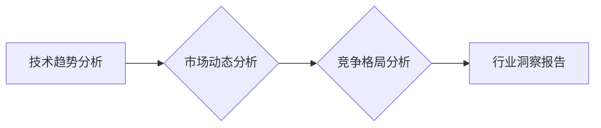

>  人工智能、机器学习、深度学习、自然语言处理、计算机视觉、行业洞察、技术趋势、专业度

## 1. 背景介绍

在瞬息万变的科技时代，技术发展日新月异，新兴技术层出不穷。对于技术从业者而言，保持对行业动态的敏锐感知和深入理解至关重要。定期发布行业洞察报告，不仅可以展示你的专业度和洞察力，更可以帮助你建立权威形象，拓展人脉资源，并为你的职业发展提供助力。

## 2. 核心概念与联系

行业洞察报告的核心在于对特定领域的技术趋势、市场动态、竞争格局等进行分析和总结，并提出有价值的见解和建议。

**2.1  技术趋势分析**

*   **人工智能 (AI)**：AI技术正在各个领域快速发展，包括机器学习、深度学习、自然语言处理、计算机视觉等。
*   **云计算**：云计算平台正在成为企业数字化转型的重要基础设施。
*   **大数据**：海量数据的产生和分析正在推动数据驱动决策的趋势。
*   **区块链**：区块链技术正在改变数据存储、交易和安全等方面的传统模式。

**2.2  市场动态分析**

*   **市场规模和增长率**：分析特定领域的市场规模和增长率，了解市场发展潜力。
*   **竞争格局**：分析市场中的主要参与者，了解他们的市场份额、竞争策略和优势劣势。
*   **用户需求**：分析用户的需求和痛点，了解市场对哪些产品和服务的渴求。

**2.3  竞争格局分析**

*   **主要竞争对手**：分析主要竞争对手的业务模式、产品特点、市场定位等。
*   **竞争策略**：分析竞争对手的市场营销策略、产品创新策略、价格策略等。
*   **竞争优势**：分析自身在竞争中的优势和劣势，制定相应的竞争策略。

**Mermaid 流程图**



## 3. 核心算法原理 & 具体操作步骤

**3.1  算法原理概述**

行业洞察报告的撰写并非单纯的总结和描述，而是需要运用一定的算法和模型进行数据分析和趋势预测。例如，可以使用机器学习算法对海量数据进行分析，识别出潜在的趋势和模式。

**3.2  算法步骤详解**

1.  **数据收集**: 收集相关领域的各种数据，包括技术文档、市场报告、新闻资讯、用户评论等。
2.  **数据清洗**: 对收集到的数据进行清洗和预处理，去除噪声和异常值，确保数据质量。
3.  **特征提取**: 从数据中提取有价值的特征，例如技术关键词、市场指标、竞争对手信息等。
4.  **模型训练**: 使用机器学习算法对提取的特征进行训练，建立预测模型。
5.  **趋势预测**: 利用训练好的模型对未来趋势进行预测，并生成行业洞察报告。

**3.3  算法优缺点**

*   **优点**: 可以自动化分析海量数据，识别出潜在的趋势和模式，提高分析效率和准确性。
*   **缺点**: 需要专业的技术知识和数据处理能力，模型的准确性依赖于数据质量和算法选择。

**3.4  算法应用领域**

*   **科技行业**: 分析技术趋势、预测市场需求、评估竞争对手。
*   **金融行业**: 识别投资机会、预测市场风险、评估客户信用。
*   **医疗行业**: 分析疾病趋势、预测患者需求、评估医疗方案效果。

## 4. 数学模型和公式 & 详细讲解 & 举例说明

**4.1  数学模型构建**

行业洞察报告中可以使用数学模型来量化分析和预测趋势。例如，可以使用回归模型来预测市场规模的增长率，可以使用分类模型来预测用户行为。

**4.2  公式推导过程**

回归模型的公式如下：

$$y = mx + c$$

其中：

*   $y$ 是预测值
*   $x$ 是自变量
*   $m$ 是回归系数
*   $c$ 是截距

**4.3  案例分析与讲解**

假设我们想要预测某个技术的市场规模增长率。我们可以收集历史数据，例如技术发布日期、市场规模、用户数量等。然后，使用回归模型对这些数据进行拟合，得到回归系数和截距。最后，我们可以使用这个模型预测未来某个时间段的市场规模增长率。

## 5. 项目实践：代码实例和详细解释说明

**5.1  开发环境搭建**

*   操作系统：Windows、macOS、Linux
*   编程语言：Python
*   数据分析库：Pandas、NumPy
*   机器学习库：Scikit-learn

**5.2  源代码详细实现**

```python
import pandas as pd
from sklearn.linear_model import LinearRegression

# 加载数据
data = pd.read_csv('market_data.csv')

# 提取特征和目标变量
X = data[['技术发布日期', '用户数量']]
y = data['市场规模']

# 创建回归模型
model = LinearRegression()

# 训练模型
model.fit(X, y)

# 预测未来市场规模
future_data = pd.DataFrame({'技术发布日期': [2024, 2025], '用户数量': [100000, 200000]})
future_market_size = model.predict(future_data)

# 打印预测结果
print(future_market_size)
```

**5.3  代码解读与分析**

*   代码首先加载数据，提取特征和目标变量。
*   然后，创建线性回归模型，并使用训练数据训练模型。
*   最后，使用训练好的模型预测未来市场规模，并打印预测结果。

**5.4  运行结果展示**

运行代码后，会输出未来市场规模的预测值。

## 6. 实际应用场景

行业洞察报告可以应用于各种场景，例如：

*   **技术决策**: 帮助企业了解最新的技术趋势，做出更明智的技术决策。
*   **市场营销**: 帮助企业了解用户的需求和痛点，制定更有效的市场营销策略。
*   **投资决策**: 帮助投资者识别潜在的投资机会，降低投资风险。

**6.4  未来应用展望**

随着人工智能技术的不断发展，行业洞察报告将更加智能化和个性化。未来，我们可以期待：

*   **更精准的预测**: 利用更先进的机器学习算法，对未来趋势进行更精准的预测。
*   **更个性化的报告**: 根据用户的需求和兴趣，生成个性化的行业洞察报告。
*   **更丰富的交互**: 通过数据可视化和交互式界面，让用户更直观地理解行业洞察报告的内容。

## 7. 工具和资源推荐

**7.1  学习资源推荐**

*   **书籍**: 《数据科学实战》、《机器学习实战》
*   **在线课程**: Coursera、edX、Udacity

**7.2  开发工具推荐**

*   **数据分析工具**: Jupyter Notebook、RStudio
*   **机器学习库**: Scikit-learn、TensorFlow、PyTorch

**7.3  相关论文推荐**

*   《Attention Is All You Need》
*   《BERT: Pre-training of Deep Bidirectional Transformers for Language Understanding》

## 8. 总结：未来发展趋势与挑战

**8.1  研究成果总结**

行业洞察报告的撰写需要结合技术趋势、市场动态和竞争格局等多方面因素进行分析。利用机器学习算法可以自动化分析海量数据，提高分析效率和准确性。

**8.2  未来发展趋势**

未来，行业洞察报告将更加智能化、个性化和交互式。

**8.3  面临的挑战**

*   数据质量问题
*   算法模型的准确性
*   行业洞察报告的可解释性

**8.4  研究展望**

未来研究方向包括：

*   开发更精准的机器学习算法
*   提高行业洞察报告的可解释性
*   探索新的行业洞察报告应用场景

## 9. 附录：常见问题与解答

**9.1  如何收集高质量的数据？**

*   利用公开数据源，例如政府网站、行业协会网站、学术数据库等。
*   进行用户调研，收集用户需求和反馈。
*   与行业专家进行访谈，获取行业洞察。

**9.2  如何选择合适的机器学习算法？**

*   根据数据的类型和分析目标选择合适的算法。
*   使用交叉验证等方法评估算法的性能。

**9.3  如何提高行业洞察报告的可解释性？**

*   使用数据可视化工具，直观地展示数据分析结果。
*   使用清晰简洁的语言，解释算法模型的原理和结果。


作者：禅与计算机程序设计艺术 / Zen and the Art of Computer Programming 
<end_of_turn>