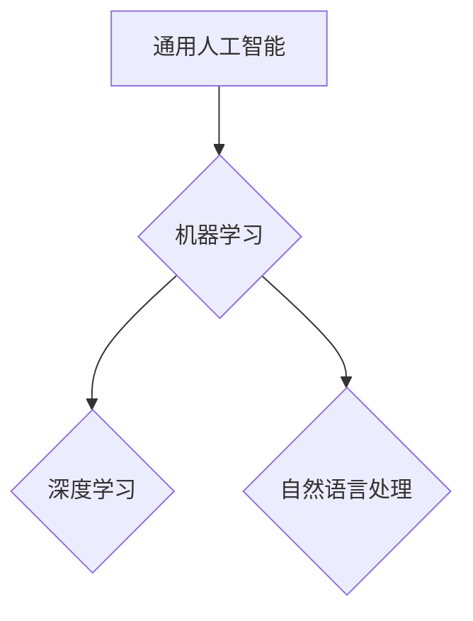

> 人工智能，达特茅斯会议，通用人工智能，机器学习，深度学习，自然语言处理，计算机科学

## 1. 背景介绍

1956年，一群来自美国各地的科学家和工程师聚集在达特茅斯学院，参加了一次名为“人工智能研究夏季工作坊”的会议。这个会议被认为是人工智能（AI）诞生之始，它标志着人工智能研究从一个学术概念发展成为一个正式的学科领域。

会议的组织者包括约翰·麦卡锡（John McCarthy）、马文·明斯基（Marvin Minsky）、克莱夫·肖（Claude Shannon）和Nathaniel Rochester。他们邀请了当时在计算理论、逻辑学、心理学和神经科学等领域做出重要贡献的学者，共同探讨人工智能的可能性和挑战。

## 2. 核心概念与联系

达特茅斯会议的宣言明确提出了人工智能的核心概念：

* **通用人工智能 (AGI)：** 指的是能够像人类一样学习、推理和解决问题的智能系统。
* **机器学习 (ML)：** 指的是使机器能够从数据中学习并改进其性能的能力。
* **深度学习 (DL)：** 指的是一种机器学习的子集，它使用多层神经网络来模拟人类大脑的学习过程。
* **自然语言处理 (NLP)：** 指的是使机器能够理解和生成人类语言的能力。

这些概念相互关联，共同构成了人工智能研究的基石。

**Mermaid 流程图：**



## 3. 核心算法原理 & 具体操作步骤

### 3.1  算法原理概述

人工智能算法的核心是学习和推理。常见的算法包括：

* **监督学习：** 利用标记数据训练模型，预测未知数据。
* **无监督学习：** 从未标记数据中发现模式和结构。
* **强化学习：** 通过试错学习，最大化奖励。

### 3.2  算法步骤详解

以监督学习为例，其步骤如下：

1. **数据收集和预处理：** 收集相关数据，并进行清洗、转换和特征工程。
2. **模型选择：** 根据任务选择合适的模型，例如线性回归、决策树、支持向量机等。
3. **模型训练：** 利用标记数据训练模型，调整模型参数。
4. **模型评估：** 使用测试数据评估模型性能，例如准确率、召回率、F1-score等。
5. **模型部署：** 将训练好的模型部署到实际应用场景中。

### 3.3  算法优缺点

每个算法都有其优缺点，需要根据具体任务选择合适的算法。

### 3.4  算法应用领域

人工智能算法广泛应用于各个领域，例如：

* **图像识别：** 自动识别图像中的物体、场景和人脸。
* **语音识别：** 将语音转换为文本。
* **自然语言处理：** 理解和生成人类语言，例如机器翻译、文本摘要、聊天机器人等。
* **推荐系统：** 根据用户喜好推荐商品、电影、音乐等。

## 4. 数学模型和公式 & 详细讲解 & 举例说明

### 4.1  数学模型构建

人工智能算法通常基于数学模型，例如线性回归模型：

$$
y = w_0 + w_1x_1 + w_2x_2 + ... + w_nx_n + \epsilon
$$

其中：

* $y$ 是预测值
* $w_0, w_1, ..., w_n$ 是模型参数
* $x_1, x_2, ..., x_n$ 是输入特征
* $\epsilon$ 是误差项

### 4.2  公式推导过程

模型参数可以通过最小化误差函数来求解，例如均方误差：

$$
MSE = \frac{1}{n} \sum_{i=1}^{n} (y_i - \hat{y}_i)^2
$$

其中：

* $y_i$ 是真实值
* $\hat{y}_i$ 是预测值

通过梯度下降算法，可以迭代更新模型参数，最终得到最优模型。

### 4.3  案例分析与讲解

例如，预测房价问题，可以利用线性回归模型，将房屋面积、房间数等特征作为输入，预测房价。

## 5. 项目实践：代码实例和详细解释说明

### 5.1  开发环境搭建

使用Python语言和相关库，例如Scikit-learn、TensorFlow等，搭建开发环境。

### 5.2  源代码详细实现

```python
from sklearn.linear_model import LinearRegression

# 数据加载和预处理
# ...

# 模型训练
model = LinearRegression()
model.fit(X_train, y_train)

# 模型评估
# ...

# 模型部署
# ...
```

### 5.3  代码解读与分析

代码首先加载数据并进行预处理，然后实例化线性回归模型，并使用训练数据进行模型训练。最后，使用测试数据评估模型性能，并部署到实际应用场景中。

### 5.4  运行结果展示

展示模型预测结果，例如预测房价的准确率、平均误差等。

## 6. 实际应用场景

人工智能技术已广泛应用于各个领域，例如：

* **医疗保健：** 疾病诊断、药物研发、个性化治疗。
* **金融服务：** 风险管理、欺诈检测、投资决策。
* **制造业：** 自动化生产、质量控制、预测维护。
* **交通运输：** 自动驾驶、交通流量优化、物流管理。

### 6.4  未来应用展望

人工智能技术将继续发展，并应用于更多领域，例如：

* **教育：** 个性化学习、智能辅导。
* **娱乐：** 虚拟现实、增强现实、游戏。
* **科学研究：** 数据分析、模型模拟、新材料发现。

## 7. 工具和资源推荐

### 7.1  学习资源推荐

* **在线课程：** Coursera、edX、Udacity等平台提供丰富的AI课程。
* **书籍：** 《深度学习》、《人工智能：现代方法》等经典书籍。
* **开源项目：** TensorFlow、PyTorch等开源框架。

### 7.2  开发工具推荐

* **Python：** 广泛用于AI开发的编程语言。
* **Jupyter Notebook：** 用于代码编写、数据分析和可视化。
* **Git：** 用于代码版本控制。

### 7.3  相关论文推荐

* **《人工智能：一种新方法》**
* **《深度学习》**
* **《强化学习：原理与算法》**

## 8. 总结：未来发展趋势与挑战

### 8.1  研究成果总结

达特茅斯会议的宣言标志着人工智能研究的开始，经过多年的发展，人工智能技术取得了显著的成果，例如图像识别、语音识别、自然语言处理等领域取得了突破性进展。

### 8.2  未来发展趋势

人工智能技术将继续发展，朝着更智能、更通用、更安全的方向发展。

* **更智能：** 发展更强大的算法，使人工智能系统能够更好地理解和处理复杂信息。
* **更通用：** 突破单一任务的局限，使人工智能系统能够适应更多不同的任务。
* **更安全：** 确保人工智能系统的安全性和可靠性，防止其被恶意利用。

### 8.3  面临的挑战

人工智能技术的发展也面临着一些挑战，例如：

* **数据获取和隐私问题：** 训练人工智能模型需要大量数据，如何获取高质量数据并保护用户隐私是一个重要问题。
* **算法解释性和可信度：** 许多人工智能算法是黑箱模型，难以解释其决策过程，这会影响其可信度。
* **伦理和社会影响：** 人工智能技术的发展可能带来一些伦理和社会问题，例如就业替代、算法偏见等，需要认真思考和解决。

### 8.4  研究展望

未来，人工智能研究将继续深入，探索人工智能的本质，并将其应用于更多领域，为人类社会带来更多福祉。

## 9. 附录：常见问题与解答

* **什么是人工智能？**
* **人工智能有哪些应用场景？**
* **如何学习人工智能？**
* **人工智能的未来发展趋势是什么？**

作者：禅与计算机程序设计艺术 / Zen and the Art of Computer Programming


<end_of_turn>