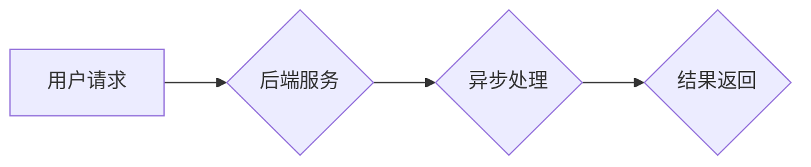

> 后端服务，延迟满足，盈利模式，微服务，API，云计算，异步处理

## 1. 背景介绍

在当今数字化时代，用户对应用程序的期望越来越高，他们希望体验流畅、快速、个性化的服务。然而，传统的单体架构应用程序难以满足这些需求，因为它们通常是庞大而复杂的，难以扩展和维护。为了应对这些挑战，后端服务架构应运而生。

后端服务架构是一种将应用程序拆分成多个独立的服务的模式，每个服务负责特定的业务逻辑。这些服务通过轻量级的通信协议，例如 RESTful API，相互通信。这种架构模式具有许多优点，例如：

* **可扩展性:** 可以根据需求水平动态增加或减少服务的实例数。
* **可维护性:** 由于服务独立性，可以更容易地修改或更新单个服务，而不会影响其他服务。
* **可复用性:** 服务可以被多个应用程序共享，提高代码复用率。
* **技术多样性:** 可以根据不同服务的业务需求选择不同的技术栈。

## 2. 核心概念与联系

**延迟满足** 是后端服务架构中一个重要的概念，它指的是将用户请求的处理推迟到后台异步执行。这种模式可以显著提高应用程序的响应速度和用户体验。

**后端服务架构** 和 **延迟满足** 的关系可以概括为：后端服务架构为延迟满足提供了基础，而延迟满足则是后端服务架构的一种典型应用场景。

**Mermaid 流程图:**



## 3. 核心算法原理 & 具体操作步骤

### 3.1  算法原理概述

延迟满足的核心算法原理是将用户请求放入一个消息队列，然后由后台服务异步处理这些消息。

消息队列是一种用于存储和传递消息的中间件，它可以确保消息的可靠传递和顺序处理。

### 3.2  算法步骤详解

1. **用户请求:** 用户向应用程序发送请求。
2. **请求处理:** 应用程序接收请求并将其转换为消息，然后将消息放入消息队列。
3. **消息消费:** 后端服务从消息队列中消费消息，并执行相应的业务逻辑。
4. **结果返回:** 后端服务处理完成后，将结果返回给应用程序，应用程序再将结果返回给用户。

### 3.3  算法优缺点

**优点:**

* **提高响应速度:** 用户请求可以立即返回，而无需等待后台处理完成。
* **提高并发处理能力:** 后端服务可以并行处理多个消息，提高处理效率。
* **提高系统可靠性:** 消息队列可以确保消息的可靠传递，即使后端服务出现故障，消息也不会丢失。

**缺点:**

* **增加系统复杂度:** 需要引入消息队列和异步处理机制，增加系统复杂度。
* **消息处理延迟:** 消息处理需要一定的时间，可能会导致用户体验延迟。

### 3.4  算法应用领域

延迟满足算法广泛应用于各种领域，例如：

* **电商平台:** 处理订单、支付、发货等异步任务。
* **社交媒体:** 处理消息推送、评论点赞等异步操作。
* **金融系统:** 处理交易、转账等敏感操作。

## 4. 数学模型和公式 & 详细讲解 & 举例说明

### 4.1  数学模型构建

假设一个系统有 N 个用户，每个用户平均每分钟发送 M 个请求。系统有 K 个后端服务，每个服务可以处理 P 个请求每秒。

我们可以用以下公式来描述系统处理请求的吞吐量：

$$
吞吐量 = \frac{N * M}{K * P}
$$

### 4.2  公式推导过程

吞吐量是指系统在单位时间内能够处理的请求数量。

* N * M 代表系统总的请求量。
* K * P 代表系统处理请求的能力。

因此，吞吐量等于总请求量除以处理请求的能力。

### 4.3  案例分析与讲解

假设一个电商平台有 1000 万用户，每个用户平均每分钟发送 10 个请求。平台有 100 个后端服务，每个服务可以处理 1000 个请求每秒。

根据公式，系统的吞吐量为：

$$
吞吐量 = \frac{10000000 * 10}{100 * 1000} = 100
$$

这意味着系统每秒可以处理 100 个请求。

## 5. 项目实践：代码实例和详细解释说明

### 5.1  开发环境搭建

* 操作系统: Ubuntu 20.04
* 编程语言: Python 3.8
* 框架: Flask
* 消息队列: RabbitMQ

### 5.2  源代码详细实现

```python
from flask import Flask, request, jsonify
import pika

app = Flask(__name__)

# RabbitMQ 连接参数
rabbitmq_host = 'localhost'
rabbitmq_port = 5672
rabbitmq_user = 'guest'
rabbitmq_password = 'guest'

# 创建 RabbitMQ 连接
connection = pika.BlockingConnection(pika.ConnectionParameters(
    host=rabbitmq_host, port=rabbitmq_port,
    credentials=pika.PlainCredentials(rabbitmq_user, rabbitmq_password)
))
channel = connection.channel()

# 声明队列
channel.queue_declare(queue='task_queue')

@app.route('/task', methods=['POST'])
def task():
    data = request.get_json()
    # 将任务数据发送到消息队列
    channel.basic_publish(exchange='', routing_key='task_queue', body=str(data))
    return jsonify({'message': 'Task received'}), 200

if __name__ == '__main__':
    app.run(debug=True)
```

### 5.3  代码解读与分析

* 代码首先定义了 Flask 应用和 RabbitMQ 连接参数。
* 然后创建 RabbitMQ 连接并声明一个名为 `task_queue` 的队列。
* `/task` 路由处理 POST 请求，接收任务数据并将其发送到消息队列。
* 最后启动 Flask 应用。

### 5.4  运行结果展示

当用户向 `/task` 路由发送 POST 请求时，应用程序会将任务数据发送到消息队列。

后端服务可以从消息队列中消费任务数据并执行相应的业务逻辑。

## 6. 实际应用场景

### 6.1  电商平台

* 处理订单、支付、发货等异步任务。
* 发送商品推荐、促销信息等消息推送。

### 6.2  社交媒体

* 处理消息推送、评论点赞等异步操作。
* 实时更新用户动态、好友列表等信息。

### 6.3  金融系统

* 处理交易、转账等敏感操作。
* 发送交易提醒、风险预警等消息通知。

### 6.4  未来应用展望

随着云计算、大数据、人工智能等技术的快速发展，延迟满足模式将得到更广泛的应用。

例如，可以利用人工智能技术对用户行为进行分析，并根据分析结果动态调整延迟满足策略，以提高用户体验。

## 7. 工具和资源推荐

### 7.1  学习资源推荐

* **书籍:**
    * 《Designing Data-Intensive Applications》
    * 《Building Microservices》
* **在线课程:**
    * Coursera: Distributed Systems
    * Udemy: Microservices Architecture

### 7.2  开发工具推荐

* **消息队列:** RabbitMQ, Kafka, Redis
* **框架:** Flask, Django, Spring Boot
* **监控工具:** Prometheus, Grafana

### 7.3  相关论文推荐

* **论文:**
    * "The Case for Asynchronous Programming"
    * "Microservices: Patterns and Principles"

## 8. 总结：未来发展趋势与挑战

### 8.1  研究成果总结

延迟满足模式是一种有效的提高应用程序性能和用户体验的架构模式。

它可以显著提高应用程序的响应速度和并发处理能力，并提高系统可靠性。

### 8.2  未来发展趋势

* **更智能的延迟满足策略:** 利用人工智能技术对用户行为进行分析，并根据分析结果动态调整延迟满足策略。
* **更强大的消息队列:** 支持更复杂的业务逻辑和更丰富的消息类型。
* **更完善的监控和管理工具:** 方便地监控和管理延迟满足系统。

### 8.3  面临的挑战

* **系统复杂度:** 延迟满足模式需要引入消息队列和异步处理机制，增加系统复杂度。
* **消息处理延迟:** 消息处理需要一定的时间，可能会导致用户体验延迟。
* **数据一致性:** 异步处理可能会导致数据一致性问题，需要采取相应的措施保证数据一致性。

### 8.4  研究展望

未来，延迟满足模式将继续发展和完善，并应用于更多领域。

研究人员将继续探索更智能、更高效的延迟满足策略，以及解决延迟满足模式面临的挑战。

## 9. 附录：常见问题与解答

### 9.1  常见问题

* **延迟满足会影响用户体验吗？**

延迟满足可能会导致用户体验延迟，但可以通过合理的策略和技术手段来最小化延迟的影响。

* **如何保证数据一致性？**

需要采取相应的措施保证数据一致性，例如使用事务机制或分布式锁。

* **如何监控和管理延迟满足系统？**

可以使用 Prometheus 和 Grafana 等工具监控和管理延迟满足系统。

### 9.2  解答

* **延迟满足会影响用户体验吗？**

延迟满足可能会导致用户体验延迟，但可以通过合理的策略和技术手段来最小化延迟的影响。例如，可以将非关键任务延迟处理，或者使用缓存机制来减少数据访问时间。

* **如何保证数据一致性？**

需要采取相应的措施保证数据一致性，例如使用事务机制或分布式锁。事务机制可以保证数据在同一事务内的一致性，而分布式锁可以防止多个服务同时访问同一数据，从而保证数据的一致性。

* **如何监控和管理延迟满足系统？**

可以使用 Prometheus 和 Grafana 等工具监控和管理延迟满足系统。Prometheus 可以收集延迟满足系统的各种指标，例如消息队列的吞吐量、处理时间等，而 Grafana 可以将这些指标可视化，方便地进行监控和分析。


作者：禅与计算机程序设计艺术 / Zen and the Art of Computer Programming 
<end_of_turn>