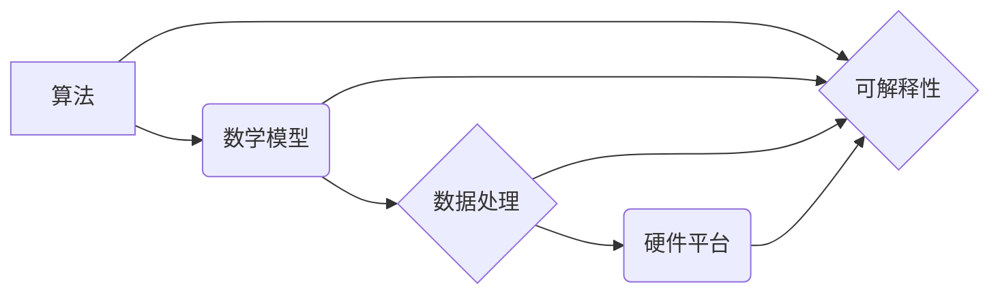

> 人工智能、底层创新、算法、数学模型、项目实践、应用场景、未来趋势

## 1. 背景介绍

人工智能（AI）作为一项前沿科技，近年来取得了飞速发展，并在各个领域展现出巨大的应用潜力。从语音识别、图像识别到自然语言处理、自动驾驶，AI技术正在深刻地改变着我们的生活方式和生产模式。然而，当前的AI发展现状仍然面临着一些挑战，例如算法效率低下、数据孤岛、可解释性差等。为了推动AI技术的持续发展和创新，建立一个完整的人工智能底层创新体系至关重要。

## 2. 核心概念与联系

**2.1  人工智能底层创新体系**

人工智能底层创新体系是指支撑人工智能技术发展和应用的完整技术体系，涵盖算法、数学模型、数据处理、硬件平台等多个方面。其核心目标是通过底层技术的创新，提升AI技术的效率、可靠性和可解释性，从而推动AI技术的广泛应用和产业化发展。

**2.2  核心概念关系图**



**2.3  核心概念原理**

* **算法**: 算法是人工智能的核心，它指解决特定问题的步骤或规则。不同的算法适用于不同的任务，例如深度学习算法适用于图像识别，强化学习算法适用于游戏决策。
* **数学模型**: 数学模型是描述人工智能系统行为和功能的数学表达式，它为算法提供理论基础和计算框架。常见的数学模型包括神经网络、支持向量机、决策树等。
* **数据处理**: 数据是人工智能的燃料，高质量的数据是训练和优化算法的关键。数据处理包括数据采集、清洗、预处理、特征提取等环节。
* **硬件平台**: 硬件平台是人工智能系统运行的基础，高性能的CPU、GPU和专用芯片可以加速人工智能算法的计算。
* **可解释性**: 可解释性是指人工智能系统的决策过程能够被人类理解和解释的能力。提高可解释性可以增强用户对AI系统的信任和理解。

## 3. 核心算法原理 & 具体操作步骤

**3.1  算法原理概述**

深度学习算法是一种基于多层神经网络的机器学习算法，它能够自动学习数据中的特征和模式，从而实现对复杂问题的建模和预测。深度学习算法的优势在于其强大的学习能力和泛化能力，能够处理海量数据和复杂任务。

**3.2  算法步骤详解**

1. **数据预处理**: 对原始数据进行清洗、转换和特征提取，使其适合深度学习算法的训练。
2. **网络结构设计**: 根据任务需求设计深度神经网络的结构，包括层数、节点数、激活函数等参数。
3. **参数初始化**: 为神经网络中的参数进行随机初始化，为训练过程提供初始值。
4. **前向传播**: 将输入数据通过神经网络层层传递，最终得到输出结果。
5. **损失函数计算**: 计算模型输出与真实值的差异，即损失函数值。
6. **反向传播**: 根据损失函数值，反向传播误差信号，更新神经网络参数。
7. **迭代训练**: 重复前向传播、损失函数计算和反向传播的过程，直到模型性能达到预设目标。
8. **模型评估**: 使用测试数据评估模型的性能，例如准确率、召回率、F1-score等指标。

**3.3  算法优缺点**

**优点**:

* 学习能力强，能够自动学习数据中的特征和模式。
* 泛化能力强，能够应用于不同的任务和数据集。
* 表现力强，能够处理复杂的任务，例如图像识别、自然语言处理等。

**缺点**:

* 训练成本高，需要大量的计算资源和训练数据。
* 可解释性差，难以理解模型的决策过程。
* 容易过拟合，模型在训练数据上表现良好，但在测试数据上表现较差。

**3.4  算法应用领域**

深度学习算法广泛应用于各个领域，例如：

* **计算机视觉**: 图像识别、物体检测、图像分割、人脸识别等。
* **自然语言处理**: 文本分类、情感分析、机器翻译、对话系统等。
* **语音识别**: 语音转文本、语音助手等。
* **自动驾驶**: 路线规划、物体检测、决策控制等。
* **医疗诊断**: 影像分析、疾病预测、药物研发等。

## 4. 数学模型和公式 & 详细讲解 & 举例说明

**4.1  数学模型构建**

深度学习算法的核心是神经网络模型，它由多个层级的神经元组成。每个神经元接收来自上一层的输入信号，经过激活函数处理后，输出到下一层。神经网络的结构和参数决定了模型的学习能力和性能。

**4.2  公式推导过程**

深度学习算法的训练过程基于梯度下降优化算法。目标函数是模型输出与真实值的差异，梯度下降算法通过迭代更新神经网络参数，最小化目标函数值。

* **损失函数**: $L(y, \hat{y}) = \frac{1}{n} \sum_{i=1}^{n} loss(y_i, \hat{y}_i)$

* **梯度**: $\nabla_{\theta} L(y, \hat{y}) = \frac{\partial L(y, \hat{y})}{\partial \theta}$

* **参数更新**: $\theta = \theta - \eta \nabla_{\theta} L(y, \hat{y})$

其中：

* $y$ 是真实值
* $\hat{y}$ 是模型输出
* $n$ 是样本数量
* $loss(y_i, \hat{y}_i)$ 是单个样本的损失函数
* $\theta$ 是神经网络参数
* $\eta$ 是学习率

**4.3  案例分析与讲解**

例如，在图像分类任务中，损失函数通常使用交叉熵损失函数，它衡量模型输出与真实标签之间的差异。梯度下降算法会计算损失函数对参数的梯度，并根据梯度更新参数，从而调整模型的权重和偏置，最终实现对图像的分类。

## 5. 项目实践：代码实例和详细解释说明

**5.1  开发环境搭建**

* 操作系统: Ubuntu 20.04
* Python 版本: 3.8
* 深度学习框架: TensorFlow 2.0

**5.2  源代码详细实现**

```python
import tensorflow as tf

# 定义模型结构
model = tf.keras.models.Sequential([
    tf.keras.layers.Conv2D(32, (3, 3), activation='relu', input_shape=(28, 28, 1)),
    tf.keras.layers.MaxPooling2D((2, 2)),
    tf.keras.layers.Conv2D(64, (3, 3), activation='relu'),
    tf.keras.layers.MaxPooling2D((2, 2)),
    tf.keras.layers.Flatten(),
    tf.keras.layers.Dense(10, activation='softmax')
])

# 编译模型
model.compile(optimizer='adam',
              loss='sparse_categorical_crossentropy',
              metrics=['accuracy'])

# 加载数据集
(x_train, y_train), (x_test, y_test) = tf.keras.datasets.mnist.load_data()

# 数据预处理
x_train = x_train.astype('float32') / 255.0
x_test = x_test.astype('float32') / 255.0
x_train = x_train.reshape((x_train.shape[0], 28, 28, 1))
x_test = x_test.reshape((x_test.shape[0], 28, 28, 1))

# 训练模型
model.fit(x_train, y_train, epochs=5)

# 评估模型
loss, accuracy = model.evaluate(x_test, y_test)
print('Test loss:', loss)
print('Test accuracy:', accuracy)
```

**5.3  代码解读与分析**

这段代码实现了使用TensorFlow框架训练一个简单的图像分类模型。

* 首先定义了模型结构，包括卷积层、池化层和全连接层。
* 然后编译模型，指定优化器、损失函数和评价指标。
* 加载MNIST数据集，并对数据进行预处理，例如归一化和reshape。
* 训练模型，指定训练轮数和批处理大小。
* 最后评估模型的性能，打印测试集上的损失和准确率。

**5.4  运行结果展示**

运行这段代码后，会输出模型在测试集上的损失和准确率。通常情况下，经过训练的模型能够达到较高的准确率，例如在MNIST数据集上，准确率可以达到98%以上。

## 6. 实际应用场景

**6.1  医疗诊断**

深度学习算法可以用于分析医学影像，例如X光片、CT扫描和MRI扫描，辅助医生诊断疾病。例如，深度学习算法可以用于检测肺癌、脑肿瘤和心脏病等疾病。

**6.2  金融风险控制**

深度学习算法可以用于分析金融数据，例如交易记录、客户信息和市场数据，识别潜在的金融风险。例如，深度学习算法可以用于检测欺诈交易、预测股票价格和评估信用风险。

**6.3  智能客服**

深度学习算法可以用于构建智能客服系统，例如聊天机器人和语音助手，为客户提供24小时的在线服务。例如，深度学习算法可以用于回答客户常见问题、处理订单和提供个性化推荐。

**6.4  未来应用展望**

随着人工智能技术的不断发展，深度学习算法将在更多领域得到应用，例如自动驾驶、机器人、个性化教育和科学研究等。

## 7. 工具和资源推荐

**7.1  学习资源推荐**

* **书籍**:
    * 深度学习 (Deep Learning) - Ian Goodfellow, Yoshua Bengio, Aaron Courville
    * 构建深度学习模型 (Hands-On Machine Learning with Scikit-Learn, Keras & TensorFlow) - Aurélien Géron
* **在线课程**:
    * 深度学习 Specialization - Andrew Ng (Coursera)
    * fast.ai - Practical Deep Learning for Coders
* **博客和网站**:
    * TensorFlow Blog
    * PyTorch Blog
    * Towards Data Science

**7.2  开发工具推荐**

* **深度学习框架**: TensorFlow, PyTorch, Keras
* **编程语言**: Python
* **数据处理工具**: Pandas, NumPy
* **可视化工具**: Matplotlib, Seaborn

**7.3  相关论文推荐**

* AlexNet: ImageNet Classification with Deep Convolutional Neural Networks (Krizhevsky et al., 2012)
* VGGNet: Very Deep Convolutional Networks for Large-Scale Image Recognition (Simonyan & Zisserman, 2014)
* ResNet: Deep Residual Learning for Image Recognition (He et al., 2015)
* BERT: Pre-training of Deep Bidirectional Transformers for Language Understanding (Devlin et al., 2018)

## 8. 总结：未来发展趋势与挑战

**8.1  研究成果总结**

近年来，人工智能领域取得了显著的进展，深度学习算法在图像识别、自然语言处理、语音识别等领域取得了突破性成果。

**8.2  未来发展趋势**

* **模型规模和复杂度提升**: 随着计算资源的不断发展，深度学习模型的规模和复杂度将进一步提升，从而提升模型的性能和泛化能力。
* **算法效率和可解释性提升**: 研究人员将继续探索更有效的深度学习算法，提高模型的训练效率和推理速度，并提高模型的可解释性，增强用户对AI系统的信任。
* **跨模态学习**: 深度学习算法将跨越不同模态的数据，例如文本、图像、音频和视频，实现更全