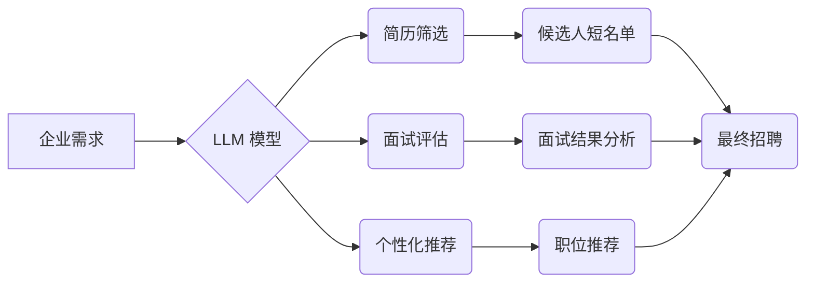

> 人工智能，LLM，招聘，人才筛选，技术评估，面试技巧，未来趋势

## 1. 背景介绍

在当今科技飞速发展的时代，人工智能（AI）正以惊人的速度改变着我们生活的方方面面。其中，大型语言模型（LLM）作为AI领域的一颗璀璨明珠，凭借其强大的文本生成、理解和翻译能力，在各个领域展现出巨大的应用潜力。从自动生成代码到撰写创意文案，从提供个性化客服到辅助科研研究，LLM正在逐步渗透到我们的日常生活。

然而，随着LLM技术的快速发展，也带来了新的挑战，其中之一就是如何找到合适的人才来开发、应用和管理这些复杂的模型。传统的招聘方式已经难以满足LLM领域对人才的需求，我们需要探索新的方法和工具来识别和评估潜在候选人的技能和潜力。

## 2. 核心概念与联系

**2.1 LLM 的核心概念**

LLM 是指训练数据量巨大、参数数量庞大的深度学习模型，能够理解和生成人类语言。它们通过学习海量文本数据，掌握了语言的语法、语义和上下文关系，从而能够执行各种自然语言处理任务。

**2.2 招聘与 LLM 的联系**

LLM 可以为招聘流程提供强大的支持，帮助企业更有效地筛选和评估候选人。

* **简历筛选:** LLM 可以自动分析简历内容，识别关键技能和经验，并根据企业需求进行筛选，提高招聘效率。
* **面试评估:** LLM 可以通过分析候选人的语言表达、逻辑思维和沟通能力，为面试提供客观的数据支持，帮助招聘人员做出更准确的判断。
* **个性化推荐:** LLM 可以根据候选人的技能和兴趣，推荐合适的职位和公司，提高匹配度。

**2.3  LLM 在招聘流程中的应用架构**



## 3. 核心算法原理 & 具体操作步骤

**3.1 算法原理概述**

LLM 的核心算法是基于 Transformer 架构的深度神经网络。Transformer 模型通过自注意力机制，能够捕捉文本序列中长距离依赖关系，从而实现更准确的语言理解和生成。

**3.2 算法步骤详解**

1. **数据预处理:** 将文本数据进行清洗、分词、标记等预处理操作，使其能够被模型理解。
2. **模型训练:** 使用大量的文本数据训练 Transformer 模型，通过反向传播算法不断调整模型参数，使其能够生成更准确的文本。
3. **模型评估:** 使用测试数据评估模型的性能，例如准确率、困惑度等指标。
4. **模型部署:** 将训练好的模型部署到服务器上，使其能够接受用户请求并进行文本处理。

**3.3 算法优缺点**

* **优点:** 能够处理长文本序列，捕捉长距离依赖关系，生成更流畅、更自然的文本。
* **缺点:** 训练成本高，需要大量的计算资源和数据。

**3.4 算法应用领域**

* 文本生成：自动写作、机器翻译、对话系统等。
* 文本理解：文本分类、情感分析、问答系统等。
* 代码生成：自动生成代码片段、代码注释等。

## 4. 数学模型和公式 & 详细讲解 & 举例说明

**4.1 数学模型构建**

Transformer 模型的核心是自注意力机制，其数学模型可以表示为：

$$
Attention(Q, K, V) = softmax(\frac{QK^T}{\sqrt{d_k}})V
$$

其中：

* $Q$：查询矩阵
* $K$：键矩阵
* $V$：值矩阵
* $d_k$：键向量的维度
* $softmax$：softmax 函数

**4.2 公式推导过程**

自注意力机制通过计算查询向量与键向量的点积，并使用 softmax 函数进行归一化，得到每个键向量的重要性权重。然后，将这些权重与值向量相乘，得到最终的注意力输出。

**4.3 案例分析与讲解**

假设我们有一个句子 "我爱吃苹果"，将其转换为词向量表示，则 Q、K、V 矩阵分别为：

$$
Q = \begin{bmatrix}
q_1 \\
q_2 \\
q_3 \\
q_4
\end{bmatrix},
K = \begin{bmatrix}
k_1 \\
k_2 \\
k_3 \\
k_4
\end{bmatrix},
V = \begin{bmatrix}
v_1 \\
v_2 \\
v_3 \\
v_4
\end{bmatrix}
$$

其中 $q_i$、$k_i$、$v_i$ 分别表示每个词的查询向量、键向量和值向量。

通过计算 $QK^T$，并使用 softmax 函数进行归一化，可以得到每个词对其他词的注意力权重。例如，"我" 对 "苹果" 的注意力权重可能较高，因为它们在语义上相关。

## 5. 项目实践：代码实例和详细解释说明

**5.1 开发环境搭建**

* Python 3.7+
* PyTorch 或 TensorFlow
* CUDA 和 cuDNN (可选，用于 GPU 加速)

**5.2 源代码详细实现**

```python
import torch
import torch.nn as nn

class Transformer(nn.Module):
    def __init__(self, vocab_size, embedding_dim, num_heads, num_layers):
        super(Transformer, self).__init__()
        self.embedding = nn.Embedding(vocab_size, embedding_dim)
        self.transformer_layers = nn.ModuleList([
            nn.TransformerEncoderLayer(embedding_dim, num_heads)
            for _ in range(num_layers)
        ])
        self.linear = nn.Linear(embedding_dim, vocab_size)

    def forward(self, x):
        x = self.embedding(x)
        for layer in self.transformer_layers:
            x = layer(x)
        x = self.linear(x)
        return x
```

**5.3 代码解读与分析**

* `embedding`: 将词索引转换为词向量。
* `transformer_layers`: 多个 Transformer Encoder Layer，用于处理文本序列。
* `linear`: 将输出向量映射到词汇表大小。

**5.4 运行结果展示**

训练好的 Transformer 模型可以用于各种自然语言处理任务，例如文本生成、机器翻译等。

## 6. 实际应用场景

**6.1 招聘流程优化**

* **简历筛选:** LLM 可以自动分析简历内容，识别关键技能和经验，并根据企业需求进行筛选，提高招聘效率。
* **面试评估:** LLM 可以通过分析候选人的语言表达、逻辑思维和沟通能力，为面试提供客观的数据支持，帮助招聘人员做出更准确的判断。
* **个性化推荐:** LLM 可以根据候选人的技能和兴趣，推荐合适的职位和公司，提高匹配度。

**6.2 人才评估与发展**

* **技能评估:** LLM 可以评估候选人的编程能力、写作能力、沟通能力等，为人才评估提供更客观的数据支持。
* **培训推荐:** LLM 可以根据候选人的技能缺口，推荐合适的培训课程，帮助他们提升技能水平。

**6.3 员工体验提升**

* **智能客服:** LLM 可以为员工提供智能客服，解答常见问题，提高员工工作效率。
* **个性化学习:** LLM 可以根据员工的学习风格和需求，提供个性化的学习资源，提升员工学习体验。

**6.4 未来应用展望**

随着LLM技术的不断发展，其在招聘领域的应用将更加广泛和深入。未来，LLM可能能够：

* 更准确地识别候选人的潜能和发展潜力。
* 提供更个性化的招聘体验。
* 自动化更多招聘流程，提高效率和降低成本。

## 7. 工具和资源推荐

**7.1 学习资源推荐**

* **书籍:**
    * 《深度学习》
    * 《自然语言处理》
* **在线课程:**
    * Coursera: 自然语言处理
    * Udacity: 深度学习
* **开源项目:**
    * Hugging Face Transformers

**7.2 开发工具推荐**

* **Python:** 
* **PyTorch:** 深度学习框架
* **TensorFlow:** 深度学习框架
* **Jupyter Notebook:** 数据分析和可视化工具

**7.3 相关论文推荐**

* 《Attention Is All You Need》
* 《BERT: Pre-training of Deep Bidirectional Transformers for Language Understanding》
* 《GPT-3: Language Models are Few-Shot Learners》

## 8. 总结：未来发展趋势与挑战

**8.1 研究成果总结**

LLM 在招聘领域的应用取得了显著进展，能够有效地提高招聘效率、降低成本，并为企业提供更精准的人才匹配。

**8.2 未来发展趋势**

* **模型规模和性能的提升:** 未来LLM模型将更加强大，能够处理更复杂的任务，并提供更准确的预测结果。
* **多模态LLM的开发:** 将文本、图像、音频等多种模态信息融合到LLM中，实现更全面的人才评估。
* **伦理和公平性问题:** 需要关注LLM在招聘领域的伦理和公平性问题，确保其应用不会带来歧视或偏见。

**8.3 面临的挑战**

* **数据获取和隐私保护:** LLM的训练需要大量数据，如何获取高质量数据并保护用户隐私是一个挑战。
* **模型解释性和可解释性:** LLM的决策过程往往是复杂的，如何解释模型的决策结果，提高其可解释性是一个重要问题。
* **模型安全性和鲁棒性:** LLM可能受到攻击或恶意利用，需要加强模型的安全性和鲁棒性。

**8.4 研究展望**

未来，LLM在招聘领域的应用将更加广泛和深入，需要进一步研究和探索其潜力，并解决其面临的挑战，以确保其安全、有效和公平地应用于招聘领域。

## 9. 附录：常见问题与解答

**9.1 如何评估LLM的招聘性能？**

可以使用准确率、召回率、F1-score等指标来评估LLM的招聘性能。

**9.2 如何解决LLM在招聘中可能带来的歧视问题？**

可以通过以下方式来解决LLM在招聘中可能带来的歧视问题：

* 使用多样化的训练数据，避免模型学习到偏见。
* 对模型进行公平性评估，识别和修正潜在的歧视行为。
* 设置透明的决策规则，确保模型的决策过程可解释和可控。

**9.3 如何确保LLM的安全性？**

可以通过以下方式来确保LLM的安全性：

* 使用安全的训练数据，避免模型学习到敏感信息。
* 对模型进行攻击性测试，识别和修复潜在的漏洞。
* 设置访问控制机制，限制模型的使用范围。


作者：禅与计算机程序设计艺术 / Zen and the Art of Computer Programming 
<end_of_turn>