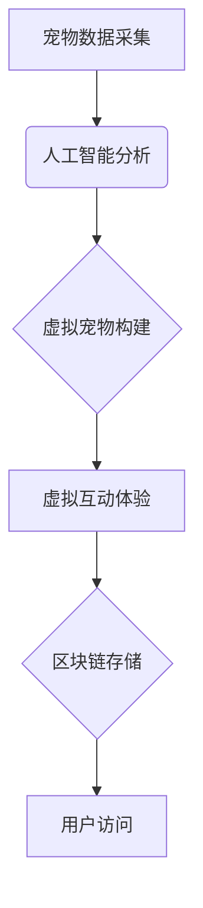

> 数字化宠物纪念馆，虚拟宠物，人工智能，深度学习，计算机视觉，区块链，云计算，宠物情感，用户体验

## 1. 背景介绍

宠物陪伴着我们，成为家庭成员，为我们的生活增添了欢乐和温暖。然而，宠物的生命短暂，它们的离世常常给主人带来巨大的悲伤和痛苦。传统的宠物纪念方式，如照片、骨灰盒等，虽然能保留宠物的记忆，但无法真正地让宠物“活”起来。

近年来，随着人工智能、计算机视觉、区块链等技术的快速发展，数字化宠物纪念馆应运而生。它利用先进技术，将宠物的影像、声音、行为等信息数字化保存，并通过虚拟现实、增强现实等技术，构建一个虚拟的宠物世界，让用户可以与虚拟宠物互动，重温与宠物的美好时光。

## 2. 核心概念与联系

数字化宠物纪念馆的核心概念包括：

* **宠物数据采集与分析:** 利用摄像头、麦克风等设备，采集宠物的影像、声音、行为等数据。
* **人工智能技术:** 利用深度学习等人工智能技术，对宠物数据进行分析，识别宠物的特征、行为模式等。
* **虚拟宠物构建:** 基于人工智能技术，构建虚拟宠物模型，使其具有与真实宠物相似的外观、行为和个性。
* **虚拟互动体验:** 利用虚拟现实、增强现实等技术，提供用户与虚拟宠物互动的体验，例如虚拟抚摸、虚拟喂食、虚拟玩耍等。
* **区块链技术:** 利用区块链技术，确保宠物数据的安全性和不可篡改性，并实现宠物数据的可交易性。

**核心概念架构图:**



## 3. 核心算法原理 & 具体操作步骤

### 3.1  算法原理概述

数字化宠物纪念馆的核心算法包括：

* **宠物特征识别:** 利用深度学习算法，识别宠物的品种、年龄、性别等特征。
* **行为模式识别:** 利用机器学习算法，识别宠物的日常行为模式，例如吃饭、睡觉、玩耍等。
* **虚拟宠物生成:** 利用3D建模技术和人工智能算法，生成虚拟宠物模型，使其具有与真实宠物相似的外观和行为。

### 3.2  算法步骤详解

**宠物特征识别算法步骤:**

1. **数据预处理:** 对宠物图像进行预处理，例如裁剪、缩放、增强等。
2. **特征提取:** 利用卷积神经网络（CNN）等深度学习算法，提取宠物图像的特征。
3. **分类识别:** 利用支持向量机（SVM）等机器学习算法，对提取的特征进行分类识别，识别宠物的品种、年龄、性别等特征。

**行为模式识别算法步骤:**

1. **数据采集:** 利用摄像头和传感器，采集宠物的行为数据，例如运动轨迹、声音、心跳等。
2. **数据预处理:** 对行为数据进行预处理，例如去噪、降维等。
3. **行为模式建模:** 利用隐马尔可夫模型（HMM）等机器学习算法，建模宠物的行为模式。
4. **行为识别:** 利用训练好的行为模式模型，识别宠物的行为类型，例如吃饭、睡觉、玩耍等。

**虚拟宠物生成算法步骤:**

1. **3D建模:** 利用3D建模软件，创建宠物的3D模型。
2. **纹理贴图:** 利用图像处理技术，为宠物模型添加纹理贴图，使其更加逼真。
3. **动画制作:** 利用动画软件，为宠物模型制作动画，使其具有与真实宠物相似的行为。
4. **人工智能赋能:** 利用人工智能算法，赋予虚拟宠物智能行为，使其能够与用户互动。

### 3.3  算法优缺点

**优点:**

* **高精度识别:** 深度学习算法能够实现高精度的宠物特征识别和行为模式识别。
* **逼真的虚拟宠物:** 3D建模技术和人工智能算法能够生成逼真的虚拟宠物模型。
* **丰富的互动体验:** 虚拟现实、增强现实等技术能够提供丰富的虚拟互动体验。

**缺点:**

* **数据依赖:** 算法的性能依赖于训练数据的质量和数量。
* **计算资源消耗:** 深度学习算法的训练和推理需要大量的计算资源。
* **伦理问题:** 虚拟宠物的过度发展可能会引发伦理问题，例如虚拟宠物与真实宠物的关系、虚拟宠物的责任等。

### 3.4  算法应用领域

数字化宠物纪念馆的核心算法在以下领域具有广泛的应用前景：

* **宠物医疗:** 利用宠物特征识别和行为模式识别算法，辅助宠物医生诊断疾病、预测疾病风险。
* **宠物训练:** 利用虚拟宠物和人工智能算法，提供个性化的宠物训练方案。
* **宠物娱乐:** 利用虚拟宠物和互动游戏，为宠物提供娱乐和陪伴。
* **宠物保险:** 利用宠物特征识别和行为模式识别算法，评估宠物的健康风险，为宠物保险提供数据支持。

## 4. 数学模型和公式 & 详细讲解 & 举例说明

### 4.1  数学模型构建

宠物特征识别算法通常采用卷积神经网络（CNN）模型，其数学模型可以概括为以下公式：

$$
y = f(W_L * ReLU(W_{L-1} * ... * ReLU(W_1 * x)) + b_L)
$$

其中：

* $x$ 为输入图像数据
* $W_i$ 为第 $i$ 层卷积核
* $ReLU$ 为ReLU激活函数
* $b_i$ 为第 $i$ 层偏置项
* $f$ 为最终输出层激活函数
* $y$ 为输出结果，即宠物特征分类结果

### 4.2  公式推导过程

CNN模型的训练过程是通过反向传播算法来优化模型参数。反向传播算法的核心思想是通过计算损失函数对模型参数的梯度，并利用梯度下降法更新模型参数，从而使模型的预测结果更加准确。

损失函数通常采用交叉熵损失函数，其公式如下：

$$
L = -\sum_{i=1}^{N} y_i \log(\hat{y}_i)
$$

其中：

* $N$ 为样本数量
* $y_i$ 为真实标签
* $\hat{y}_i$ 为模型预测结果

### 4.3  案例分析与讲解

例如，在识别宠物品种的场景中，CNN模型的输入是宠物的图像数据，输出是宠物品种的分类结果。训练过程中，模型会根据大量的宠物图像数据，学习到不同品种宠物的特征，并将其编码为向量表示。当输入新的宠物图像数据时，模型会将图像数据转换为向量表示，并与已学习到的特征向量进行比较，从而预测宠物的品种。

## 5. 项目实践：代码实例和详细解释说明

### 5.1  开发环境搭建

数字化宠物纪念馆的开发环境通常包括：

* **操作系统:** Linux、Windows、macOS
* **编程语言:** Python、C++
* **深度学习框架:** TensorFlow、PyTorch
* **虚拟现实/增强现实框架:** Unity、Unreal Engine
* **区块链平台:** Ethereum、Hyperledger Fabric

### 5.2  源代码详细实现

以下是一个使用Python和TensorFlow实现宠物特征识别的简单代码示例：

```python
import tensorflow as tf

# 定义模型结构
model = tf.keras.models.Sequential([
    tf.keras.layers.Conv2D(32, (3, 3), activation='relu', input_shape=(128, 128, 3)),
    tf.keras.layers.MaxPooling2D((2, 2)),
    tf.keras.layers.Conv2D(64, (3, 3), activation='relu'),
    tf.keras.layers.MaxPooling2D((2, 2)),
    tf.keras.layers.Flatten(),
    tf.keras.layers.Dense(10, activation='softmax')
])

# 编译模型
model.compile(optimizer='adam',
              loss='sparse_categorical_crossentropy',
              metrics=['accuracy'])

# 训练模型
model.fit(x_train, y_train, epochs=10)

# 评估模型
loss, accuracy = model.evaluate(x_test, y_test)
print('Loss:', loss)
print('Accuracy:', accuracy)
```

### 5.3  代码解读与分析

这段代码定义了一个简单的卷积神经网络模型，用于识别宠物的品种。模型包含两层卷积层、两层最大池化层、一层全连接层和一层输出层。

* **卷积层:** 用于提取图像特征。
* **最大池化层:** 用于降低图像维度，提高模型的鲁棒性。
* **全连接层:** 用于将提取的特征进行分类。
* **输出层:** 用于输出宠物品种的分类结果。

### 5.4  运行结果展示

训练完成后，模型可以用于预测新的宠物图像的品种。

## 6. 实际应用场景

数字化宠物纪念馆的实际应用场景包括：

* **宠物纪念馆:** 用户可以上传宠物的照片、视频等数据，生成虚拟宠物模型，并将其保存到虚拟纪念馆中，与家人朋友分享宠物的记忆。
* **宠物社交平台:** 用户可以创建虚拟宠物账号，与其他用户互动，分享宠物的日常趣事，建立宠物社交圈。
* **宠物教育平台:** 利用虚拟宠物和互动游戏，为宠物主人提供宠物知识学习和训练指导。

### 6.4  未来应用展望

数字化宠物纪念馆的未来应用前景广阔，例如：

* **个性化虚拟宠物:** 根据用户的喜好和宠物的特征，生成个性化的虚拟宠物模型。
* **虚拟宠物陪伴:** 利用人工智能技术，赋予虚拟宠物更智能的行为和情感，为用户提供陪伴和情感支持。
* **宠物医疗辅助:** 利用虚拟宠物模拟真实宠物的行为，为宠物医生提供辅助诊断和治疗方案。

## 7. 工具和资源推荐

### 7.1  学习资源推荐

* **书籍:**
    * 深度学习
    * 人工智能
    * 计算机视觉
* **在线课程:**
    * Coursera
    * edX
    * Udacity

### 7.2  开发工具推荐

* **编程语言:** Python
* **深度学习框架:** TensorFlow、PyTorch
* **虚拟现实/增强现实框架:** Unity、Unreal Engine
* **区块链平台:** Ethereum、Hyperledger Fabric

### 7.3  相关论文推荐

* **深度学习在宠物图像识别中的应用**
* **基于虚拟现实的宠物纪念馆设计与实现**
* **区块链技术在宠物数据安全管理中的应用**

## 8. 总结：未来发展趋势与挑战

### 8.1  研究成果总结

数字化宠物纪念馆的研究成果表明，人工智能、计算机视觉、区块链等技术的融合，能够为宠物主人提供更加便捷、个性化的宠物纪念和互动体验。

### 8.2  未来发展趋势

数字化宠物纪念馆的未来发展趋势包括：

* **更加逼真的虚拟宠物:** 利用更先进的3D建模技术和人工智能算法，生成更加逼真的虚拟宠物模型，使其更加接近真实宠物。
* **更丰富的互动体验:** 利用虚拟现实、增强现实等技术，提供更加丰富的虚拟互动体验，例如虚拟抚摸、虚拟喂食、虚拟玩耍等。
* **更智能的虚拟宠物:** 利用人工智能技术，赋予虚拟宠物更智能的行为和情感，使其能够更好地理解和回应用户的需求。

### 8.3  面临的挑战

数字化宠物纪念馆的发展也面临着一些挑战，例如：

* **数据安全:** 宠物数据的安全性和隐私保护是需要重点关注的问题。
* **伦理问题:** 虚拟宠物的过度发展可能会引发伦理问题，例如虚拟宠物与真实宠物的关系、虚拟宠物的责任等。
* **技术瓶颈:** 构建更加逼真、智能的虚拟宠物模型仍然需要突破一些技术瓶颈。

### 8.4  研究展望

未来，数字化宠物纪念馆的研究将继续深入，探索更加人性化