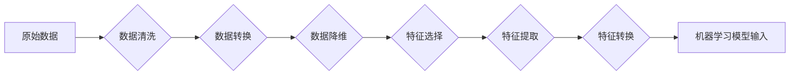

> 数据预处理，特征工程，机器学习，数据清洗，数据转换，数据降维，特征选择，Python，scikit-learn

## 1. 背景介绍

在机器学习领域，数据是至关重要的资源。然而，现实世界中的数据往往是混乱、不完整、不一致的。为了使机器学习模型能够有效地学习和预测，需要对数据进行预处理和特征工程。

数据预处理是指对原始数据进行清洗、转换、降维等操作，使其满足机器学习模型的输入要求。特征工程则是指通过对原始数据进行选择、提取、转换等操作，生成更具学习价值的特征，从而提高机器学习模型的性能。

数据预处理和特征工程是机器学习工作流程中的关键步骤，对模型的最终性能有着至关重要的影响。

## 2. 核心概念与联系

数据预处理和特征工程是相互关联的两个步骤，它们共同构成了数据准备阶段。

**数据预处理**

* 数据清洗：去除数据中的噪声、缺失值和异常值。
* 数据转换：将数据转换为机器学习模型可以理解的格式，例如将类别变量转换为数值型变量。
* 数据降维：减少数据的维度，提高计算效率和模型的泛化能力。

**特征工程**

* 特征选择：从原始数据中选择最相关的特征，去除冗余和无关的特征。
* 特征提取：从原始数据中提取新的特征，例如计算特征之间的组合或统计量。
* 特征转换：对现有特征进行转换，例如对数值特征进行标准化或对类别特征进行编码。

**数据预处理与特征工程的流程图**



## 3. 核心算法原理 & 具体操作步骤

### 3.1  算法原理概述

数据预处理和特征工程涉及到多种算法和技术，以下是一些常用的算法原理：

* **数据清洗:**
    * **缺失值处理:** 
        * 移除缺失值
        * 使用均值、中位数或众数填充缺失值
        * 使用机器学习算法预测缺失值
    * **异常值处理:**
        * 移除异常值
        * 使用箱线图或z-score等方法识别异常值
        * 对异常值进行替换或转换
* **数据转换:**
    * **类别变量编码:**
        * 独热编码
        * 标签编码
    * **数值变量标准化:**
        * 标准化
        * 归一化
* **数据降维:**
    * **主成分分析 (PCA):** 将高维数据投影到低维空间，保留数据的主要信息。
    * **线性判别分析 (LDA):** 在分类问题中，寻找最佳的投影方向，使不同类别的样本在投影空间上尽可能地分离。
* **特征选择:**
    * **过滤方法:** 基于特征本身的统计特性进行选择，例如卡方检验、互信息。
    * **包装方法:** 通过递归地选择特征子集，并评估子集的性能，最终选择最优的特征子集。
    * **嵌入方法:** 在模型训练过程中，自动学习特征重要性，并根据重要性进行特征选择。

### 3.2  算法步骤详解

以下是一些常用算法的具体操作步骤：

* **PCA降维:**
    1. 计算数据的协方差矩阵。
    2. 对协方差矩阵进行特征值分解，得到特征向量和特征值。
    3. 根据特征值的大小，选择前k个特征向量，构成新的特征空间。
    4. 将原始数据投影到新的特征空间。
* **卡方检验特征选择:**
    1. 计算每个特征与目标变量之间的相关性。
    2. 使用卡方检验统计量评估特征与目标变量之间的相关性显著性。
    3. 选择卡方检验统计量大于阈值的特征。

### 3.3  算法优缺点

不同的算法有不同的优缺点，需要根据实际情况选择合适的算法。

* **PCA:**
    * 优点: 计算效率高，能够有效地降低数据维度。
    * 缺点: 只能处理线性关系的数据，可能会丢失一些重要的信息。
* **卡方检验:**
    * 优点: 计算简单，易于理解。
    * 缺点: 只能处理离散型特征，对连续型特征的处理效果较差。

### 3.4  算法应用领域

数据预处理和特征工程在各个领域都有广泛的应用，例如：

* **图像识别:** 对图像进行预处理，例如旋转、缩放、裁剪，并提取图像特征，例如边缘、纹理、颜色。
* **自然语言处理:** 对文本进行预处理，例如分词、去停用词、词向量化，并提取文本特征，例如关键词、主题、情感。
* **金融预测:** 对金融数据进行预处理，例如缺失值处理、异常值处理，并提取金融特征，例如股票价格、交易量、市场指数。

## 4. 数学模型和公式 & 详细讲解 & 举例说明

### 4.1  数学模型构建

数据预处理和特征工程涉及到多种数学模型，例如：

* **线性回归模型:** 用于预测连续型变量，其数学模型为：

$$
y = \beta_0 + \beta_1x_1 + \beta_2x_2 + ... + \beta_nx_n + \epsilon
$$

其中：

* $y$ 是预测变量
* $x_1, x_2, ..., x_n$ 是特征变量
* $\beta_0, \beta_1, ..., \beta_n$ 是模型参数
* $\epsilon$ 是误差项

* **逻辑回归模型:** 用于预测类别型变量，其数学模型为：

$$
p(y=1|x) = \frac{1}{1 + e^{-( \beta_0 + \beta_1x_1 + \beta_2x_2 + ... + \beta_nx_n)}}
$$

其中：

* $p(y=1|x)$ 是预测类别为1的概率
* $x_1, x_2, ..., x_n$ 是特征变量
* $\beta_0, \beta_1, ..., \beta_n$ 是模型参数

### 4.2  公式推导过程

例如，PCA降维的公式推导过程：

1. 计算数据的协方差矩阵：

$$
\Sigma = \frac{1}{n-1}\sum_{i=1}^{n}(x_i - \bar{x})(x_i - \bar{x})^T
$$

其中：

* $x_i$ 是第i个样本
* $\bar{x}$ 是数据的均值

2. 对协方差矩阵进行特征值分解：

$$
\Sigma = U\Lambda U^T
$$

其中：

* $U$ 是特征向量矩阵
* $\Lambda$ 是特征值对角矩阵

3. 选择前k个特征向量，构成新的特征空间：

$$
X' = U_k^T X
$$

其中：

* $X'$ 是降维后的数据
* $U_k$ 是前k个特征向量组成的矩阵

### 4.3  案例分析与讲解

例如，可以使用PCA降维对图像数据进行压缩，减少存储空间和计算量。

## 5. 项目实践：代码实例和详细解释说明

### 5.1  开发环境搭建

* Python 3.x
* scikit-learn

### 5.2  源代码详细实现

```python
import pandas as pd
from sklearn.preprocessing import StandardScaler
from sklearn.decomposition import PCA

# 加载数据
data = pd.read_csv('data.csv')

# 选择特征变量
features = ['feature1', 'feature2', 'feature3']
X = data[features]

# 数据标准化
scaler = StandardScaler()
X_scaled = scaler.fit_transform(X)

# PCA降维
pca = PCA(n_components=2)
X_pca = pca.fit_transform(X_scaled)

# 保存降维后的数据
pd.DataFrame(X_pca, columns=['principal component 1', 'principal component 2']).to_csv('pca_data.csv', index=False)
```

### 5.3  代码解读与分析

* 首先，加载数据并选择特征变量。
* 然后，使用StandardScaler对特征变量进行标准化，使其均值为0，标准差为1。
* 接着，使用PCA降维，将数据降维到2维。
* 最后，保存降维后的数据。

### 5.4  运行结果展示

运行代码后，将生成一个名为`pca_data.csv`的文件，其中包含降维后的数据。

## 6. 实际应用场景

数据预处理和特征工程在各个领域都有广泛的应用，例如：

* **医疗诊断:** 对患者的医疗数据进行预处理和特征工程，可以帮助医生更准确地诊断疾病。
* **金融风险评估:** 对金融数据的预处理和特征工程可以帮助金融机构更好地评估风险。
* **推荐系统:** 对用户的行为数据进行预处理和特征工程，可以帮助推荐系统推荐更符合用户需求的商品或服务。

### 6.4  未来应用展望

随着人工智能技术的不断发展，数据预处理和特征工程将发挥越来越重要的作用。未来，数据预处理和特征工程将更加智能化、自动化，并与其他人工智能技术相结合，例如深度学习，以提高机器学习模型的性能。

## 7. 工具和资源推荐

### 7.1  学习资源推荐

* **书籍:**
    * "Python数据科学手册"
    * "机器学习实战"
* **在线课程:**
    * Coursera: 数据科学
    * edX: 机器学习
* **博客:**
    * Towards Data Science
    * Analytics Vidhya

### 7.2  开发工具推荐

* **Python:** 
    * scikit-learn
    * pandas
    * numpy
* **数据可视化工具:**
    * matplotlib
    * seaborn

### 7.3  相关论文推荐

* "Feature Engineering for Machine Learning"
* "A Survey on Feature Selection Methods"

## 8. 总结：未来发展趋势与挑战

### 8.1  研究成果总结

数据预处理和特征工程已经取得了显著的成果，为机器学习模型的性能提升做出了重要贡献。

### 8.2  未来发展趋势

* **自动化:** 数据预处理和特征工程将更加自动化，使用机器学习算法自动选择和生成特征。
* **个性化:** 数据预处理和特征工程将更加个性化，根据用户的需求和场景进行定制。
* **解释性:** 数据预处理和特征工程将更加解释性，能够解释特征选择和转换的 rationale。

### 8.3  面临的挑战

* **数据质量:** 现实世界中的数据往往是混乱、不完整、不一致的，如何有效地处理这些数据仍然是一个挑战。
* **特征选择:** 如何选择最相关的特征，并去除冗余和无关的特征，仍然是一个难题。
* **可解释性:** 许多数据预处理和特征工程算法是黑箱模型，难以解释其决策过程，这限制了其在一些领域中的应用。

### 8.4  研究展望

未来，数据预处理和特征工程的研究将继续深入，探索更智能、更自动化、更解释性的方法，以更好地服务于人工智能的应用。

## 9. 附录：常见问题与解答

* **Q: 如何处理缺失值？**
    * **A:** 可以使用移除缺失值、使用均值、中位数或众数填充缺失值、使用机器学习算法预测缺失值等方法。
* **Q: 如何选择特征？**
    * **A:** 可以使用过滤方法、包装方法或嵌入方法进行特征选择。
* **Q: