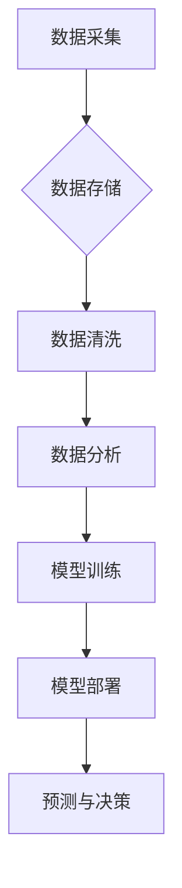

> 数据驱动，人工智能，机器学习，数据分析，数据可视化，数据架构，数据安全

## 1. 背景介绍

在当今数据爆炸的时代，数据已成为企业最重要的资产之一。数据蕴藏着丰富的商业价值，能够帮助企业洞察市场趋势、优化运营效率、提升客户体验等。人工智能（AI）作为一种新兴技术，能够通过对海量数据的分析和学习，自动完成复杂的决策和预测任务，为企业带来巨大的变革。

然而，仅仅拥有海量数据并不能带来价值，需要通过有效的分析和利用才能将其转化为可操作的洞察和决策支持。数据驱动已经成为企业发展的核心趋势，而人工智能则为数据驱动提供了强大的技术支撑。

## 2. 核心概念与联系

**2.1 数据驱动**

数据驱动是指以数据为基础，通过数据分析和挖掘，为企业决策提供依据。数据驱动强调数据质量、数据可访问性和数据分析能力，旨在将数据转化为企业可利用的知识和洞察。

**2.2 人工智能**

人工智能是指模拟人类智能行为的计算机系统。人工智能技术涵盖了机器学习、深度学习、自然语言处理、计算机视觉等多个领域，能够帮助企业自动完成复杂的决策、预测和分析任务。

**2.3 数据与人工智能的联系**

数据是人工智能的核心燃料。人工智能算法需要大量的训练数据才能学习和优化。数据驱动和人工智能相互促进，数据驱动为人工智能提供数据支撑，而人工智能则能够帮助企业更有效地分析和利用数据。

**2.4 数据与人工智能的架构**



## 3. 核心算法原理 & 具体操作步骤

**3.1 算法原理概述**

机器学习算法是一种能够从数据中学习并不断改进的算法。常见的机器学习算法包括监督学习、无监督学习和强化学习。

* **监督学习:** 利用标记数据训练模型，预测新的数据标签。例如，图像分类、文本分类等。
* **无监督学习:** 从未标记数据中发现模式和结构。例如，聚类分析、异常检测等。
* **强化学习:** 通过试错学习，在环境中获得最大奖励。例如，游戏AI、机器人控制等。

**3.2 算法步骤详解**

1. **数据准备:** 收集、清洗、预处理数据，使其适合模型训练。
2. **模型选择:** 根据任务需求选择合适的机器学习算法。
3. **模型训练:** 利用训练数据训练模型，调整模型参数，使其能够准确预测。
4. **模型评估:** 使用测试数据评估模型性能，例如准确率、召回率、F1-score等。
5. **模型部署:** 将训练好的模型部署到生产环境中，用于预测新的数据。

**3.3 算法优缺点**

* **优点:** 能够自动学习数据模式，无需人工特征工程；能够处理复杂数据，发现隐藏的规律；能够不断改进模型性能。
* **缺点:** 需要大量的训练数据；模型训练时间长；模型解释性差，难以理解模型决策过程。

**3.4 算法应用领域**

机器学习算法广泛应用于各个领域，例如：

* **金融:** 欺诈检测、信用评分、风险管理
* **医疗:** 疾病诊断、药物研发、患者画像
* **电商:** 商品推荐、用户画像、精准营销
* **交通:** 自驾车、交通预测、路线规划

## 4. 数学模型和公式 & 详细讲解 & 举例说明

**4.1 数学模型构建**

机器学习算法通常基于数学模型，例如线性回归、逻辑回归、支持向量机等。这些模型通过数学公式来描述数据之间的关系，并利用训练数据来学习模型参数。

**4.2 公式推导过程**

例如，线性回归模型的目标是找到一条直线，能够最佳地拟合数据点。模型的数学公式如下：

$$y = w_0 + w_1x$$

其中：

* $y$ 是预测值
* $x$ 是输入特征
* $w_0$ 和 $w_1$ 是模型参数

模型参数可以通过最小化预测误差来学习。

**4.3 案例分析与讲解**

假设我们有一个数据集，包含房屋面积和房屋价格的信息。我们可以使用线性回归模型来预测房屋价格。

* 训练数据：

| 房屋面积 (平方米) | 房屋价格 (万元) |
|---|---|
| 60 | 100 |
| 80 | 150 |
| 100 | 200 |

* 使用线性回归模型训练，得到模型参数：$w_0 = 50$, $w_1 = 1.5$

* 预测一个面积为 90 平方米的房屋价格：

$$y = 50 + 1.5 * 90 = 185$$

因此，模型预测该房屋价格为 185 万元。

## 5. 项目实践：代码实例和详细解释说明

**5.1 开发环境搭建**

* Python 3.x
* Jupyter Notebook
* scikit-learn

**5.2 源代码详细实现**

```python
import pandas as pd
from sklearn.linear_model import LinearRegression
from sklearn.model_selection import train_test_split

# 加载数据
data = pd.read_csv('house_data.csv')

# 分割数据
X = data[['面积']]
y = data['价格']
X_train, X_test, y_train, y_test = train_test_split(X, y, test_size=0.2, random_state=42)

# 创建线性回归模型
model = LinearRegression()

# 训练模型
model.fit(X_train, y_train)

# 预测测试数据
y_pred = model.predict(X_test)

# 评估模型性能
from sklearn.metrics import mean_squared_error
mse = mean_squared_error(y_test, y_pred)
print(f'均方误差: {mse}')
```

**5.3 代码解读与分析**

* 首先，我们加载数据并将其分割为训练集和测试集。
* 然后，我们创建线性回归模型并使用训练数据进行训练。
* 训练完成后，我们使用测试数据进行预测，并计算模型性能指标，例如均方误差。

**5.4 运行结果展示**

运行代码后，会输出模型的均方误差值，该值越小，模型性能越好。

## 6. 实际应用场景

**6.1 数据分析与可视化**

数据分析和可视化是数据驱动的重要组成部分。通过数据分析，企业可以发现数据中的趋势、模式和异常，并将其转化为可理解的图表和报告。数据可视化可以帮助企业更直观地理解数据，并做出更明智的决策。

**6.2 个性化推荐**

人工智能可以根据用户的行为数据和偏好，提供个性化的产品推荐、内容推荐和服务推荐。例如，电商平台可以根据用户的购买历史和浏览记录，推荐相关的商品；视频网站可以根据用户的观看记录，推荐感兴趣的视频。

**6.3 自动化决策**

人工智能可以自动完成一些重复性的决策任务，例如审批流程、风险评估、客户服务等。这可以提高效率，降低成本，并释放人力资源用于更重要的工作。

**6.4 未来应用展望**

随着人工智能技术的不断发展，其应用场景将更加广泛。例如，在医疗领域，人工智能可以辅助医生诊断疾病、制定治疗方案；在教育领域，人工智能可以提供个性化的学习辅导；在交通领域，人工智能可以实现无人驾驶汽车。

## 7. 工具和资源推荐

**7.1 学习资源推荐**

* **书籍:**
    * 《深度学习》
    * 《机器学习实战》
    * 《Python机器学习》
* **在线课程:**
    * Coursera
    * edX
    * Udacity

**7.2 开发工具推荐**

* **Python:** 
    * scikit-learn
    * TensorFlow
    * PyTorch
* **数据可视化工具:**
    * Matplotlib
    * Seaborn
    * Plotly

**7.3 相关论文推荐**

* 《ImageNet Classification with Deep Convolutional Neural Networks》
* 《Attention Is All You Need》
* 《Generative Adversarial Networks》

## 8. 总结：未来发展趋势与挑战

**8.1 研究成果总结**

近年来，人工智能取得了长足的进步，在各个领域都取得了显著的应用成果。例如，在图像识别、语音识别、自然语言处理等领域，人工智能算法的性能已经超过了人类水平。

**8.2 未来发展趋势**

* **模型更加强大:** 未来人工智能模型将更加强大，能够处理更复杂的数据，并完成更复杂的任务。
* **应用更加广泛:** 人工智能将应用于更多领域，例如医疗、教育、金融、交通等。
* **更加安全可靠:** 人工智能系统将更加安全可靠，能够更好地应对各种挑战。

**8.3 面临的挑战**

* **数据隐私和安全:** 人工智能算法需要大量的训练数据，如何保护数据隐私和安全是一个重要的挑战。
* **算法解释性和可信度:** 许多人工智能算法是黑箱模型，难以解释其决策过程，这降低了算法的可信度。
* **伦理问题:** 人工智能的应用可能会带来一些伦理问题，例如算法偏见、工作岗位替代等。

**8.4 研究展望**

未来，人工智能研究将继续朝着更加安全、可靠、可解释的方向发展。同时，人工智能与其他技术，例如区块链、量子计算等，也将产生新的融合应用，为人类社会带来更多福祉。

## 9. 附录：常见问题与解答

**9.1 如何选择合适的机器学习算法？**

选择合适的机器学习算法取决于具体的任务需求和数据特点。例如，对于分类任务，可以考虑逻辑回归、支持向量机、决策树等算法；对于回归任务，可以考虑线性回归、支持向量回归等算法。

**9.2 如何处理缺失数据？**

缺失数据是机器学习中常见的问题。可以采用多种方法处理缺失数据，例如删除缺失数据、用平均值或中位数填充缺失数据、使用机器学习算法预测缺失数据等。

**9.3 如何评估机器学习模型的性能？**

常用的机器学习模型性能指标包括准确率、召回率、F1-score、AUC等。选择合适的性能指标取决于具体的任务需求。

作者：禅与计算机程序设计艺术 / Zen and the Art of Computer Programming


<end_of_turn>