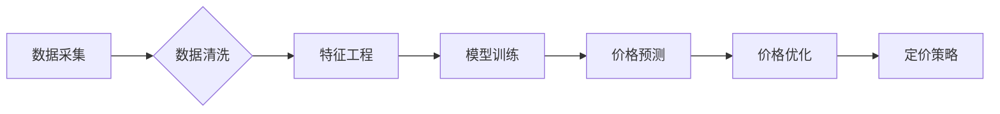

> 智能定价、机器学习、预测模型、价格优化、电商平台、数据分析、算法模型

## 1. 背景介绍

在当今数据爆炸的时代，智能定价技术已成为企业优化利润、提升竞争力的关键驱动力。传统定价方法往往依赖经验和主观判断，难以适应市场瞬息万变的动态。而智能定价技术则通过数据分析和机器学习算法，实现对价格的智能化预测和优化，帮助企业制定更精准、更有效的定价策略。

电商平台作为智能定价技术的应用场景之一，其竞争激烈，商品种类繁多，价格波动频繁。如何制定合理的定价策略，既能保证利润最大化，又能吸引消费者，成为电商平台面临的重大挑战。

## 2. 核心概念与联系

智能定价技术的核心概念包括：

* **数据采集与清洗:** 收集来自各种渠道的商品数据、市场数据、用户行为数据等，并进行清洗和预处理，确保数据质量。
* **特征工程:** 从原始数据中提取具有预测价值的特征，例如商品属性、市场趋势、用户偏好等。
* **模型训练:** 利用机器学习算法，训练预测模型，例如线性回归、决策树、支持向量机等，建立商品价格与相关因素之间的关系。
* **价格预测:** 基于训练好的模型，对未来商品价格进行预测，并根据预测结果制定定价策略。
* **价格优化:** 通过算法优化，调整商品价格，以最大化利润或其他目标函数。

**核心概念架构流程图:**



## 3. 核心算法原理 & 具体操作步骤

### 3.1  算法原理概述

智能定价技术常用的算法包括：

* **线性回归:** 假设价格与相关因素之间存在线性关系，通过最小二乘法求解回归系数，预测价格。
* **决策树:** 通过一系列决策规则，将数据划分为不同的类别，并根据类别预测价格。
* **支持向量机:** 通过寻找最佳超平面，将数据点分类，并根据分类结果预测价格。
* **神经网络:** 采用多层神经元结构，学习数据中的复杂关系，实现更精准的价格预测。

### 3.2  算法步骤详解

以线性回归为例，其具体操作步骤如下：

1. **数据准备:** 收集商品价格、商品属性、市场趋势、用户行为等数据，并进行清洗和预处理。
2. **特征选择:** 选择与价格相关的特征，例如商品类别、品牌、尺寸、颜色、库存量等。
3. **模型训练:** 使用线性回归算法，训练模型，求解回归系数。
4. **模型评估:** 使用测试数据评估模型的预测精度，例如均方误差、R-squared等指标。
5. **价格预测:** 将新商品数据输入模型，预测其价格。

### 3.3  算法优缺点

**线性回归:**

* **优点:** 计算简单，易于理解和实现。
* **缺点:** 假设价格与相关因素之间存在线性关系，难以处理复杂关系。

**决策树:**

* **优点:** 可以处理非线性关系，解释性强。
* **缺点:** 容易过拟合，预测精度可能较低。

**支持向量机:**

* **优点:** 能够处理高维数据，预测精度较高。
* **缺点:** 计算复杂，参数设置较多。

**神经网络:**

* **优点:** 可以学习复杂关系，预测精度最高。
* **缺点:** 计算复杂，训练时间长，参数设置较多。

### 3.4  算法应用领域

智能定价技术广泛应用于以下领域：

* **电商平台:** 商品定价、促销活动优化、库存管理。
* **旅游行业:** 机票、酒店、旅游套餐定价。
* **金融行业:** 贷款利率、保险费率、投资策略。
* **能源行业:** 电力、天然气价格预测和优化。

## 4. 数学模型和公式 & 详细讲解 & 举例说明

### 4.1  数学模型构建

假设商品价格 $p$ 与以下因素相关：

* 商品属性 $x_1$
* 市场趋势 $x_2$
* 用户行为 $x_3$

我们可以构建线性回归模型：

$$p = \beta_0 + \beta_1 x_1 + \beta_2 x_2 + \beta_3 x_3 + \epsilon$$

其中：

* $\beta_0$, $\beta_1$, $\beta_2$, $\beta_3$ 为回归系数，需要通过模型训练求解。
* $\epsilon$ 为随机误差项。

### 4.2  公式推导过程

线性回归模型的目标是找到最佳的回归系数，使得模型预测的商品价格与实际价格之间的误差最小。

可以使用最小二乘法求解回归系数：

$$\hat{\beta} = (X^T X)^{-1} X^T y$$

其中：

* $X$ 为特征矩阵，包含商品属性、市场趋势、用户行为等特征。
* $y$ 为目标变量，即商品价格。
* $\hat{\beta}$ 为估计的回归系数。

### 4.3  案例分析与讲解

假设我们收集了以下数据：

| 商品属性 | 市场趋势 | 用户行为 | 商品价格 |
|---|---|---|---|
| 1 | 0.8 | 0.5 | 10 |
| 2 | 0.9 | 0.7 | 12 |
| 3 | 0.7 | 0.6 | 9 |
| 4 | 0.6 | 0.4 | 8 |

我们可以使用线性回归模型，训练模型并预测新商品的价格。

## 5. 项目实践：代码实例和详细解释说明

### 5.1  开发环境搭建

* Python 3.x
* scikit-learn 库

### 5.2  源代码详细实现

```python
import pandas as pd
from sklearn.linear_model import LinearRegression
from sklearn.model_selection import train_test_split

# 加载数据
data = pd.read_csv('data.csv')

# 选择特征和目标变量
X = data[['商品属性', '市场趋势', '用户行为']]
y = data['商品价格']

# 将数据划分为训练集和测试集
X_train, X_test, y_train, y_test = train_test_split(X, y, test_size=0.2, random_state=42)

# 创建线性回归模型
model = LinearRegression()

# 训练模型
model.fit(X_train, y_train)

# 预测测试集数据
y_pred = model.predict(X_test)

# 评估模型性能
from sklearn.metrics import mean_squared_error
mse = mean_squared_error(y_test, y_pred)
print(f'均方误差: {mse}')
```

### 5.3  代码解读与分析

* 首先，我们使用 pandas 库加载数据，并选择特征和目标变量。
* 然后，我们使用 train_test_split 函数将数据划分为训练集和测试集。
* 接下来，我们创建线性回归模型，并使用 fit 函数训练模型。
* 训练完成后，我们使用 predict 函数预测测试集数据。
* 最后，我们使用 mean_squared_error 函数评估模型性能。

### 5.4  运行结果展示

运行代码后，会输出模型的均方误差值。均方误差值越小，模型的预测精度越高。

## 6. 实际应用场景

智能定价技术在电商平台的应用场景非常广泛：

* **商品定价:** 根据商品属性、市场趋势、用户行为等因素，自动生成商品价格，实现精准定价。
* **促销活动优化:** 根据用户行为数据，预测促销活动的效果，优化促销策略，提高转化率。
* **库存管理:** 通过预测商品需求，优化库存水平，降低库存成本。

### 6.4  未来应用展望

未来，智能定价技术将更加智能化、个性化。例如：

* **个性化定价:** 根据用户的购买历史、浏览记录、偏好等信息，为不同用户提供个性化的价格。
* **动态定价:** 根据实时市场变化，动态调整商品价格，实现更精准的定价策略。
* **协同定价:** 多个平台或商家协同制定定价策略，实现价格的协同优化。

## 7. 工具和资源推荐

### 7.1  学习资源推荐

* **书籍:**
    * 《机器学习》 - 周志华
    * 《Python机器学习实战》 - 塞缪尔·阿布拉姆斯
* **在线课程:**
    * Coursera: 机器学习
    * edX: 数据科学与机器学习

### 7.2  开发工具推荐

* **Python:** 
    * scikit-learn: 机器学习库
    * pandas: 数据分析库
    * matplotlib: 数据可视化库
* **云平台:**
    * AWS: Amazon Machine Learning
    * Azure: Azure Machine Learning
    * GCP: Google Cloud AI Platform

### 7.3  相关论文推荐

* **《基于机器学习的智能定价模型研究》**
* **《电商平台智能定价策略研究》**
* **《智能定价技术在旅游行业的应用》**

## 8. 总结：未来发展趋势与挑战

### 8.1  研究成果总结

智能定价技术已取得了显著的成果，在电商平台、旅游行业、金融行业等领域得到了广泛应用。

### 8.2  未来发展趋势

未来，智能定价技术将更加智能化、个性化、动态化。

### 8.3  面临的挑战

* 数据质量问题: 智能定价技术依赖于高质量的数据，数据质量问题会影响模型的预测精度。
* 模型解释性问题: 一些复杂的机器学习模型难以解释，难以获得用户的信任。
* 伦理问题: 智能定价技术可能会导致价格歧视等伦理问题，需要引起重视。

### 8.4  研究展望

未来，需要进一步研究以下问题:

* 如何提高数据质量，构建更精准的智能定价模型。
* 如何提高模型的解释性，增强用户的信任。
* 如何解决智能定价技术带来的伦理问题，确保其公平公正地应用。

## 9. 附录：常见问题与解答

* **Q1: 智能定价技术是否会取代人工定价？**

A1: 智能定价技术可以辅助人工定价，提高定价效率和准确性，但不会完全取代人工定价。人工定价仍然需要考虑一些无法用数据量化的因素，例如品牌形象、市场竞争等。

* **Q2: 智能定价技术是否会损害消费者利益？**

A2: 智能定价技术如果合理应用，可以帮助企业提供更优惠的价格，提高消费者满意度。但如果企业滥用智能定价技术，例如进行价格歧视，就会损害消费者利益。

* **Q3: 如何评估智能定价技术的效果？**

A3: 可以通过以下指标评估智能定价技术的效果：

* **利润率:** 智能定价技术是否能够提高企业的利润率。
* **转化率:** 智能定价技术是否能够提高商品的转化率。
* **客户满意度:** 智能定价技术是否能够提高客户的满意度。


作者：禅与计算机程序设计艺术 / Zen and the Art of Computer Programming 
<end_of_turn>