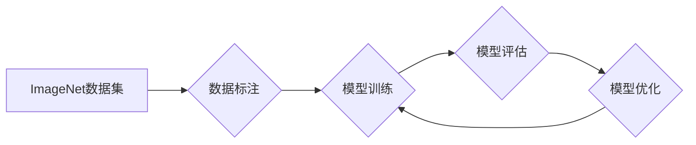

> ImageNet, 大数据, 深度学习, 计算机视觉, 迁移学习, 模型训练, 数据标注

## 1. 背景介绍

20世纪90年代末，随着互联网的蓬勃发展，海量图像数据开始涌现。然而，传统的计算机视觉算法难以有效处理如此庞大的数据量，其识别精度和泛化能力都存在局限。为了突破这一瓶颈，斯坦福大学教授李飞飞于2009年发起了一个名为ImageNet的项目，旨在构建一个包含百万级图像的公开数据集，并举办每年一次的ImageNet图像识别挑战赛。

ImageNet的出现标志着深度学习在计算机视觉领域的兴起。该数据集的规模和多样性为深度学习模型提供了充足的训练数据，促进了算法的快速发展。ImageNet挑战赛也成为了深度学习领域的重要标志性赛事，吸引了全球顶尖的科研机构和企业参与，推动了深度学习技术的不断进步。

## 2. 核心概念与联系

**2.1 ImageNet 数据集**

ImageNet数据集包含超过1400万张图像，涵盖超过2万个类别。这些图像来自互联网、书籍、杂志等多种来源，并经过精心标注，每个图像都对应一个或多个类别标签。

**2.2 深度学习**

深度学习是一种机器学习的子领域，它利用多层神经网络来模拟人类大脑的学习过程。深度学习模型能够从海量数据中自动提取特征，并学习复杂的模式，从而实现更准确的图像识别、分类、检测等任务。

**2.3 迁移学习**

迁移学习是一种利用预训练模型进行新任务学习的技术。由于ImageNet数据集规模庞大，预训练的ImageNet模型已经具备了强大的特征提取能力，可以将其应用于其他计算机视觉任务，例如目标检测、图像分割等，从而提高模型的效率和性能。

**2.4 数据标注**

数据标注是深度学习模型训练的基础。ImageNet数据集的标注工作由大量志愿者和专业标注人员完成，他们对图像进行分类、定位目标等操作，为模型提供准确的训练数据。

**2.5 模型训练**

模型训练是深度学习模型学习的过程。通过将图像数据和对应的标签输入到模型中，并利用反向传播算法进行优化，模型的参数会不断调整，最终达到较高的识别精度。

**2.6 Mermaid 流程图**



## 3. 核心算法原理 & 具体操作步骤

### 3.1 算法原理概述

ImageNet挑战赛中，常用的深度学习算法包括卷积神经网络（CNN）和循环神经网络（RNN）。CNN擅长提取图像特征，而RNN擅长处理序列数据。

**3.1.1 卷积神经网络（CNN）**

CNN由多个卷积层、池化层和全连接层组成。卷积层通过卷积核对图像进行卷积运算，提取图像特征。池化层对卷积层的输出进行降维，减少计算量。全连接层将提取的特征进行分类。

**3.1.2 循环神经网络（RNN）**

RNN具有循环连接，能够处理序列数据。RNN的隐藏层状态会随着时间步长的变化而更新，从而捕捉序列中的依赖关系。

### 3.2 算法步骤详解

**3.2.1 CNN 算法步骤**

1. **输入图像:** 将图像输入到 CNN 的第一层卷积层。
2. **卷积运算:** 卷积层使用卷积核对图像进行卷积运算，提取图像特征。
3. **池化运算:** 池化层对卷积层的输出进行降维，减少计算量。
4. **全连接层:** 全连接层将提取的特征进行分类。
5. **输出结果:** 输出图像的类别标签。

**3.2.2 RNN 算法步骤**

1. **输入序列:** 将序列数据输入到 RNN 的第一层。
2. **循环运算:** RNN 的隐藏层状态会随着时间步长的变化而更新，捕捉序列中的依赖关系。
3. **输出结果:** 输出序列的预测结果。

### 3.3 算法优缺点

**3.3.1 CNN 优点:**

* 能够有效提取图像特征。
* 具有较高的识别精度。
* 适用于图像分类、目标检测等任务。

**3.3.1 CNN 缺点:**

* 计算量较大。
* 难以处理长序列数据。

**3.3.2 RNN 优点:**

* 能够处理序列数据。
* 能够捕捉序列中的依赖关系。
* 适用于自然语言处理、语音识别等任务。

**3.3.2 RNN 缺点:**

* 训练难度较大。
* 难以处理长序列数据。

### 3.4 算法应用领域

CNN 和 RNN 广泛应用于计算机视觉、自然语言处理、语音识别等领域。

* **计算机视觉:** 图像分类、目标检测、图像分割、人脸识别等。
* **自然语言处理:** 文本分类、情感分析、机器翻译、文本生成等。
* **语音识别:** 语音转文本、语音助手等。

## 4. 数学模型和公式 & 详细讲解 & 举例说明

### 4.1 数学模型构建

**4.1.1 CNN 数学模型**

CNN 的数学模型主要包括卷积运算、池化运算和激活函数。

* **卷积运算:**

$$
y_{i,j} = \sum_{m=0}^{M-1} \sum_{n=0}^{N-1} x_{i+m,j+n} * w_{m,n} + b
$$

其中，$x_{i,j}$ 是输入图像的像素值，$w_{m,n}$ 是卷积核的权重，$b$ 是偏置项，$y_{i,j}$ 是卷积层的输出值。

* **池化运算:**

$$
y_{i,j} = \max(x_{i,j}, x_{i+1,j}, x_{i,j+1}, x_{i+1,j+1})
$$

其中，$x_{i,j}$ 是卷积层的输出值，$y_{i,j}$ 是池化层的输出值。

* **激活函数:**

$$
y = f(x)
$$

其中，$x$ 是神经元的输入值，$f(x)$ 是激活函数，例如ReLU函数。

**4.1.2 RNN 数学模型**

RNN 的数学模型主要包括隐藏层状态的更新公式和输出层的计算公式。

* **隐藏层状态更新公式:**

$$
h_t = f(W_{xh}x_t + W_{hh}h_{t-1} + b_h)
$$

其中，$h_t$ 是隐藏层状态，$x_t$ 是输入序列的第 $t$ 个元素，$W_{xh}$ 和 $W_{hh}$ 是权重矩阵，$b_h$ 是偏置项，$f(x)$ 是激活函数。

* **输出层计算公式:**

$$
y_t = g(W_{hy}h_t + b_y)
$$

其中，$y_t$ 是输出序列的第 $t$ 个元素，$W_{hy}$ 是权重矩阵，$b_y$ 是偏置项，$g(x)$ 是激活函数。

### 4.2 公式推导过程

公式推导过程涉及到线性代数、微积分等数学知识，具体推导过程可以参考相关深度学习教材和论文。

### 4.3 案例分析与讲解

**4.3.1 ImageNet 图像分类案例**

使用预训练的 ImageNet 模型进行图像分类，例如识别一张图片中的物体类别。

**4.3.2 自然语言处理案例**

使用 RNN 模型进行文本分类，例如判断一篇新闻文章的主题类别。

## 5. 项目实践：代码实例和详细解释说明

### 5.1 开发环境搭建

使用 Python 语言和深度学习框架 TensorFlow 或 PyTorch 进行开发。

### 5.2 源代码详细实现

```python
# 使用 TensorFlow 框架实现 CNN 模型

import tensorflow as tf

# 定义 CNN 模型结构
model = tf.keras.models.Sequential([
    tf.keras.layers.Conv2D(32, (3, 3), activation='relu', input_shape=(224, 224, 3)),
    tf.keras.layers.MaxPooling2D((2, 2)),
    tf.keras.layers.Conv2D(64, (3, 3), activation='relu'),
    tf.keras.layers.MaxPooling2D((2, 2)),
    tf.keras.layers.Flatten(),
    tf.keras.layers.Dense(10, activation='softmax')
])

# 编译模型
model.compile(optimizer='adam',
              loss='sparse_categorical_crossentropy',
              metrics=['accuracy'])

# 训练模型
model.fit(x_train, y_train, epochs=10)

# 评估模型
loss, accuracy = model.evaluate(x_test, y_test)
print('Test loss:', loss)
print('Test accuracy:', accuracy)
```

### 5.3 代码解读与分析

* **模型结构:** 代码定义了一个简单的 CNN 模型，包含两个卷积层、两个池化层和一个全连接层。
* **激活函数:** 使用 ReLU 函数作为激活函数，可以提高模型的表达能力。
* **损失函数:** 使用 sparse_categorical_crossentropy 作为损失函数，适用于多分类问题。
* **优化器:** 使用 Adam 优化器，可以快速收敛。
* **训练过程:** 使用训练数据训练模型，并设置训练轮数。
* **评估过程:** 使用测试数据评估模型的性能。

### 5.4 运行结果展示

训练完成后，可以输出模型的测试损失和准确率。

## 6. 实际应用场景

### 6.1 图像识别

ImageNet 训练的模型可以用于识别各种物体，例如人脸、车辆、动物等。

### 6.2 图像分类

ImageNet 训练的模型可以用于将图像分类到不同的类别，例如风景、人物、建筑等。

### 6.3 目标检测

ImageNet 训练的模型可以用于检测图像中的目标，并标注目标的边界框。

### 6.4 未来应用展望

ImageNet 以及深度学习技术的不断发展，将推动计算机视觉领域的进一步进步，应用于更多领域，例如自动驾驶、医疗诊断、安防监控等。

## 7. 工具和资源推荐

### 7.1 学习资源推荐

* **书籍:**
    * 深度学习
    * 构建深度学习模型
* **在线课程:**
    * Coursera 深度学习课程
    * Udacity 深度学习工程师 Nanodegree

### 7.2 开发工具推荐

* **深度学习框架:** TensorFlow, PyTorch
* **图像处理库:** OpenCV

### 7.3 相关论文推荐

* ImageNet Classification with Deep Convolutional Neural Networks
* AlexNet

## 8. 总结：未来发展趋势与挑战

### 8.1 研究成果总结

ImageNet 项目和深度学习技术的兴起，为计算机视觉领域带来了革命性的变化，显著提高了图像识别、分类、检测等任务的性能。

### 8.2 未来发展趋势

* **模型规模和复杂度:** 模型规模和复杂度将继续增加，从而提高模型的性能。
* **数据增强:** 数据增强技术将被更加广泛地应用，以提高模型的泛化能力。
* **迁移学习:** 迁移学习技术将被更加广泛地应用，以减少模型训练所需的数据量。
* **解释性 AI:** 研究如何解释深度学习模型的决策过程，提高模型的可解释性。

### 8.3 面临的挑战

* **数据标注:** 数据标注仍然是一个耗时和成本高昂的任务。
* **模型可解释性:** 深度学习模型的决策过程难以解释，这限制了模型在一些