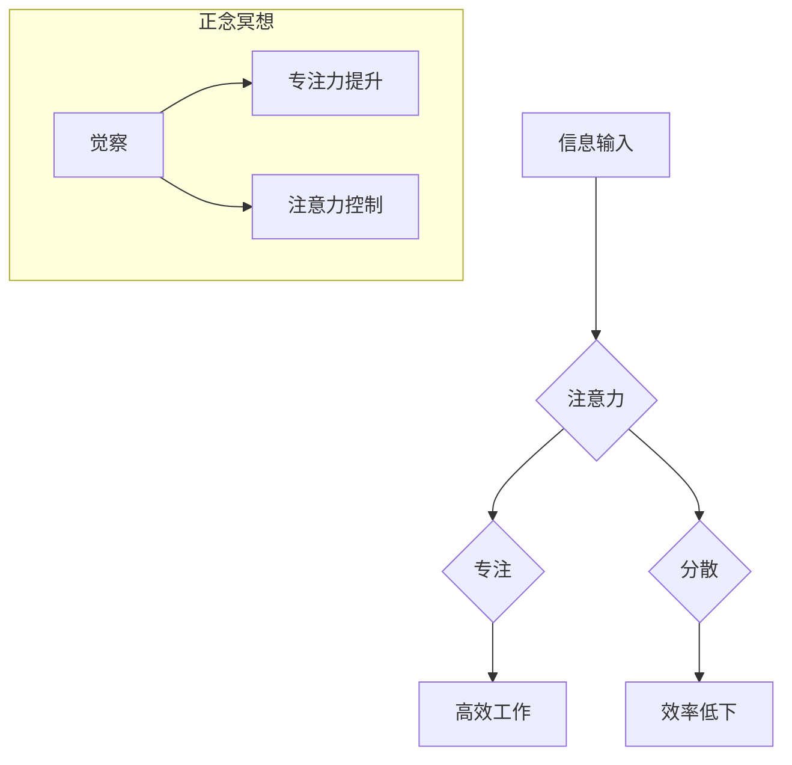

>  注意力管理, 正念冥想, 专注力, 心灵平和, 内省实践, 认知科学, 计算机科学, 禅修

## 1. 背景介绍

在当今信息爆炸的时代，我们被无休止的通知、信息流和任务所包围。这种持续的刺激和干扰严重损害了我们的注意力，导致专注力下降、效率低下、压力增加，甚至影响身心健康。如何有效地管理注意力，提升专注力，获得心灵的平静，成为当今社会面临的共同挑战。

正念冥想作为一种古老而有效的精神修养方法，近年来在西方世界逐渐受到重视。它强调当下体验的觉察，培养对自身思想、情绪和身体状态的敏锐感知，从而帮助人们更好地管理注意力，减轻压力，提升幸福感。

## 2. 核心概念与联系

**2.1 正念冥想**

正念冥想是一种专注于当下体验的冥想练习。它要求我们将注意力集中在呼吸、身体感觉、声音或其他当下感知上，并以一种非评判、接纳的态度观察这些体验。

**2.2 注意力**

注意力是指我们对特定信息或刺激的集中和选择性关注。它是一个有限的资源，容易受到干扰和分散。

**2.3 联系**

正念冥想通过训练我们的注意力，帮助我们更好地控制和管理注意力。它让我们能够更专注于当下，减少对过去和未来的担忧，从而提升专注力，提高工作和学习效率。

**2.4  Mermaid 流程图**



## 3. 核心算法原理 & 具体操作步骤

**3.1 算法原理概述**

正念冥想的核心算法原理是通过训练注意力，增强对当下体验的觉察，从而达到提升专注力和心灵平和的目的。

**3.2 算法步骤详解**

1. **找到一个安静舒适的环境:** 选择一个安静、舒适的环境，尽量减少外界干扰。
2. **采取舒适的坐姿:** 找个舒适的坐姿，保持背部挺直，但不要过于僵硬。
3. **专注于呼吸:** 将注意力集中在呼吸上，感受每一次吸气和呼气。
4. **觉察思绪和感受:** 当思绪出现时，不要评判或抗拒，只是简单地观察它们，然后将注意力重新引导回呼吸上。
5. **持续练习:** 每天坚持练习正念冥想，每次至少10分钟，逐渐增加练习时间。

**3.3 算法优缺点**

**优点:**

* 提升专注力
* 减轻压力
* 改善情绪
* 增强自我意识
* 促进身心健康

**缺点:**

* 需要坚持练习
* 初期可能感到困难
* 效果需要时间积累

**3.4 算法应用领域**

正念冥想已被广泛应用于以下领域:

* 医疗保健
* 教育
* 企业管理
* 个人成长

## 4. 数学模型和公式 & 详细讲解 & 举例说明

**4.1 数学模型构建**

我们可以用一个简单的数学模型来描述注意力机制：

$$
Attention(Q, K, V) = \frac{exp(Q \cdot K^T / \sqrt{d_k})}{exp(Q \cdot K^T / \sqrt{d_k})} \cdot V
$$

其中：

* $Q$：查询向量
* $K$：键向量
* $V$：值向量
* $d_k$：键向量的维度

**4.2 公式推导过程**

该公式的核心是计算查询向量与键向量的点积，并通过softmax函数将其归一化，得到每个键向量的注意力权重。然后，将注意力权重与值向量相乘，得到最终的输出。

**4.3 案例分析与讲解**

例如，在机器翻译任务中，查询向量可以是源语言的词向量，键向量和值向量可以是目标语言的词向量。通过计算注意力权重，模型可以学习到哪些源语言词语对目标语言词语的影响更大，从而提高翻译质量。

## 5. 项目实践：代码实例和详细解释说明

**5.1 开发环境搭建**

* Python 3.x
* TensorFlow 或 PyTorch

**5.2 源代码详细实现**

```python
import tensorflow as tf

# 定义注意力机制
def attention_mechanism(query, key, value):
    # 计算点积
    scores = tf.matmul(query, key, transpose_b=True)
    # 归一化
    attention_weights = tf.nn.softmax(scores, axis=-1)
    # 计算输出
    output = tf.matmul(attention_weights, value)
    return output

# 示例代码
query = tf.random.normal([1, 5, 128])
key = tf.random.normal([1, 5, 128])
value = tf.random.normal([1, 5, 64])
output = attention_mechanism(query, key, value)
print(output.shape)
```

**5.3 代码解读与分析**

该代码实现了基本的注意力机制。首先，计算查询向量与键向量的点积，然后使用softmax函数将其归一化，得到注意力权重。最后，将注意力权重与值向量相乘，得到最终的输出。

**5.4 运行结果展示**

运行该代码后，会输出一个形状为 `(1, 5, 64)` 的张量，表示注意力机制的输出。

## 6. 实际应用场景

正念冥想在以下场景中具有广泛的应用价值：

* **工作压力缓解:** 帮助职场人士缓解工作压力，提高工作效率。
* **学习专注力提升:** 帮助学生提高学习专注力，更好地理解和记忆知识。
* **情绪管理:** 帮助人们更好地管理情绪，减少焦虑和抑郁。
* **身心健康:** 促进身心健康，提高睡眠质量。

**6.4 未来应用展望**

随着科技的发展，正念冥想将与人工智能、虚拟现实等技术相结合，创造出更加沉浸式、个性化的冥想体验，并应用于更广泛的领域，例如医疗保健、教育、企业培训等。

## 7. 工具和资源推荐

**7.1 学习资源推荐**

* **书籍:** 《正念：改变生活的八周冥想计划》
* **网站:** Headspace, Calm
* **应用程序:** Insight Timer, Waking Up

**7.2 开发工具推荐**

* **TensorFlow:** 深度学习框架
* **PyTorch:** 深度学习框架
* **Keras:** 深度学习库

**7.3 相关论文推荐**

* **Attention Is All You Need:** https://arxiv.org/abs/1706.03762
* **BERT: Pre-training of Deep Bidirectional Transformers for Language Understanding:** https://arxiv.org/abs/1810.04805

## 8. 总结：未来发展趋势与挑战

**8.1 研究成果总结**

正念冥想的研究成果表明，它可以有效地提升专注力、减轻压力、改善情绪和促进身心健康。

**8.2 未来发展趋势**

未来，正念冥想研究将更加注重个性化、智能化和跨学科融合。

**8.3 面临的挑战**

* 缺乏统一的标准和评估方法
* 难以量化正念冥想的疗效
* 普及率仍然较低

**8.4 研究展望**

未来，需要进一步探索正念冥想的机制、疗效和应用场景，并将其与其他技术相结合，创造出更加有效的正念冥想体验。

## 9. 附录：常见问题与解答

**9.1 如何开始正念冥想？**

* 选择一个安静舒适的环境
* 采取舒适的坐姿
* 将注意力集中在呼吸上
* 觉察思绪和感受
* 持续练习

**9.2 正念冥想需要多长时间？**

* 最少每天练习10分钟
* 逐渐增加练习时间

**9.3 正念冥想有什么副作用？**

* 一般来说，正念冥想没有副作用
* 但在练习过程中，可能会出现一些情绪波动，这是正常的


作者：禅与计算机程序设计艺术 / Zen and the Art of Computer Programming 
<end_of_turn>