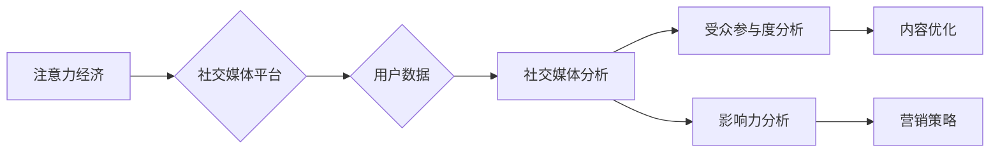

>  注意力经济、社交媒体分析、受众参与度、影响力分析、数据挖掘、机器学习、自然语言处理

## 1. 背景介绍

在当今数字时代，信息爆炸和竞争日益激烈，人们的注意力成为稀缺资源，被誉为“注意力经济”的时代来临。社交媒体作为信息传播和用户互动的重要平台，在“注意力经济”中扮演着举足轻重的角色。 

社交媒体平台上，用户每天接触着海量的资讯和内容，如何有效地吸引和留住用户注意力，并将其转化为商业价值，成为各大平台和企业共同关注的焦点。 

深入了解用户行为、参与度和影响力，是社交媒体营销和内容创作的关键。 

## 2. 核心概念与联系

**2.1 注意力经济**

注意力经济是指在信息过载的时代，人们对信息的筛选和选择能力成为重要的经济资源。 

注意力是有限的，而信息则无限增多，因此，如何有效地获取和利用用户注意力，就成为了企业和个人竞争的关键。

**2.2 社交媒体分析**

社交媒体分析是指利用数据挖掘、机器学习等技术，从社交媒体平台上收集和分析用户数据，以洞察用户行为、兴趣和偏好，从而帮助企业制定更有效的营销策略和内容创作计划。

**2.3 受众参与度**

受众参与度是指用户对社交媒体内容的互动程度，包括点赞、评论、转发、分享等行为。 

参与度越高，表明用户对内容的兴趣和认可度越高，也更容易引发病毒式传播。

**2.4 影响力分析**

影响力分析是指识别和评估社交媒体用户在特定领域或群体中的影响力，通常通过用户粉丝数量、互动率、内容传播范围等指标进行衡量。

**2.5 核心概念联系**

注意力经济、社交媒体分析、受众参与度和影响力分析相互关联，共同构成了社交媒体营销和内容创作的完整生态系统。

**Mermaid 流程图**



## 3. 核心算法原理 & 具体操作步骤

### 3.1 算法原理概述

受众参与度和影响力分析通常依赖于机器学习和自然语言处理等算法。

常见的算法包括：

* **分类算法**: 用于识别用户类型、内容主题等，例如朴素贝叶斯、支持向量机、决策树等。
* **聚类算法**: 用于将用户或内容进行分组，例如K-means聚类、层次聚类等。
* **推荐算法**: 用于推荐用户可能感兴趣的内容或用户，例如协同过滤、内容过滤等。
* **时间序列分析**: 用于分析用户行为的时间趋势，例如ARIMA模型、LSTM模型等。

### 3.2 算法步骤详解

**3.2.1 数据收集与预处理**

首先，需要从社交媒体平台收集用户数据，包括用户个人信息、行为记录、内容发布等。 

然后，对数据进行清洗、转换和格式化，以便于后续算法的训练和应用。

**3.2.2 特征工程**

根据算法需求，提取用户和内容的相关特征，例如用户年龄、性别、兴趣爱好、内容主题、情感倾向等。

**3.2.3 模型训练与评估**

选择合适的算法模型，并利用训练数据进行模型训练。 

训练完成后，需要对模型进行评估，例如使用准确率、召回率、F1-score等指标来衡量模型的性能。

**3.2.4 模型部署与应用**

将训练好的模型部署到生产环境中，用于实时分析用户行为和内容影响力。

### 3.3 算法优缺点

**优点:**

* **自动化分析:** 机器学习算法可以自动化地分析海量数据，发现隐藏的模式和趋势。
* **精准预测:** 通过训练数据，算法可以对用户行为和内容影响力进行精准预测。
* **个性化推荐:** 算法可以根据用户的兴趣和偏好，提供个性化的内容推荐。

**缺点:**

* **数据依赖:** 机器学习算法依赖于高质量的数据，数据质量直接影响算法的性能。
* **算法解释性:** 一些机器学习算法的内部机制难以解释，难以理解算法的决策过程。
* **算法更新:** 随着用户行为和内容形式的变化，算法需要定期更新和改进。

### 3.4 算法应用领域

* **社交媒体营销:** 帮助企业了解目标用户，制定精准的营销策略，提高广告投放效果。
* **内容创作:** 帮助内容创作者了解用户喜好，创作更受欢迎的内容。
* **品牌管理:** 帮助企业监测品牌形象，及时应对负面舆情。
* **市场调研:** 帮助企业了解市场趋势，挖掘新的商机。

## 4. 数学模型和公式 & 详细讲解 & 举例说明

### 4.1 数学模型构建

受众参与度和影响力分析通常使用以下数学模型：

**4.1.1 受众参与度模型**

$$
Engagement = \frac{Likes + Comments + Shares}{Total Reach}
$$

其中：

* Engagement: 受众参与度
* Likes: 点赞数
* Comments: 评论数
* Shares: 分享数
* Total Reach: 内容的总曝光量

**4.1.2 影响力模型**

$$
Influence = \alpha * Followers + \beta * Engagement + \gamma * Reach
$$

其中：

* Influence: 影响力
* Followers: 粉丝数量
* Engagement: 受众参与度
* Reach: 内容传播范围
* α, β, γ: 权重系数

### 4.2 公式推导过程

受众参与度和影响力模型的推导过程基于以下假设：

* 用户对内容的参与度越高，表明其对内容的兴趣和认可度越高。
* 用户的粉丝数量越多，其影响力越大。
* 内容的传播范围越大，其影响力越大。

根据这些假设，我们可以构建上述数学模型，并通过数据分析和模型训练来确定权重系数。

### 4.3 案例分析与讲解

假设有两个社交媒体用户A和B，用户A拥有10000粉丝，平均参与度为0.1，内容传播范围为10000人；用户B拥有5000粉丝，平均参与度为0.2，内容传播范围为5000人。

根据影响力模型，我们可以计算出用户A和B的影响力：

* User A Influence = α * 10000 + β * 0.1 + γ * 10000
* User B Influence = α * 5000 + β * 0.2 + γ * 5000

通过实际数据分析和模型训练，我们可以确定α、β、γ的具体值，从而比较用户A和B的影响力大小。

## 5. 项目实践：代码实例和详细解释说明

### 5.1 开发环境搭建

* 操作系统: Windows/macOS/Linux
* Python 版本: 3.6+
* 必要的库: pandas, numpy, scikit-learn, matplotlib, seaborn

### 5.2 源代码详细实现

```python
import pandas as pd
from sklearn.model_selection import train_test_split
from sklearn.linear_model import LogisticRegression
from sklearn.metrics import accuracy_score

# 数据加载
data = pd.read_csv('social_media_data.csv')

# 数据预处理
# ...

# 特征选择
features = ['followers', 'engagement', 'reach']
target = 'influence'

# 数据分割
X_train, X_test, y_train, y_test = train_test_split(data[features], data[target], test_size=0.2, random_state=42)

# 模型训练
model = LogisticRegression()
model.fit(X_train, y_train)

# 模型评估
y_pred = model.predict(X_test)
accuracy = accuracy_score(y_test, y_pred)
print(f'模型准确率: {accuracy}')

# 模型预测
new_data = pd.DataFrame({'followers': [10000], 'engagement': [0.1], 'reach': [10000]})
predicted_influence = model.predict(new_data)
print(f'预测影响力: {predicted_influence}')
```

### 5.3 代码解读与分析

* 数据加载: 使用pandas库读取社交媒体数据。
* 数据预处理: 对数据进行清洗、转换和格式化。
* 特征选择: 选择与影响力相关的特征。
* 数据分割: 将数据分为训练集和测试集。
* 模型训练: 使用逻辑回归模型训练数据。
* 模型评估: 使用准确率评估模型性能。
* 模型预测: 使用训练好的模型预测新的数据的影响力。

### 5.4 运行结果展示

运行代码后，会输出模型的准确率和预测的影响力结果。

## 6. 实际应用场景

### 6.1 品牌营销

* 识别潜在的品牌大使，与他们合作进行推广。
* 分析用户对品牌产品的评价，及时改进产品和服务。
* 监测品牌形象，及时应对负面舆情。

### 6.2 内容创作

* 了解用户对不同类型内容的偏好，创作更受欢迎的内容。
* 分析内容的传播效果，优化内容策略。
* 识别潜在的合作作者，进行内容联合创作。

### 6.3 市场调研

* 分析用户对特定产品的需求和兴趣，为产品开发提供参考。
* 监测市场趋势，发现新的商机。
* 了解竞争对手的策略和表现，制定相应的应对措施。

### 6.4 未来应用展望

随着人工智能技术的不断发展，社交媒体分析将更加智能化和个性化。

未来，社交媒体分析将能够：

* 更精准地预测用户行为和内容影响力。
* 提供更个性化的内容推荐和营销策略。
* 更深入地洞察用户需求和市场趋势。

## 7. 工具和资源推荐

### 7.1 学习资源推荐

* **书籍:**
    * 《社交媒体分析》
    * 《数据挖掘实战》
    * 《机器学习实战》
* **在线课程:**
    * Coursera: 数据科学、机器学习
    * edX: 数据分析、社交媒体营销
* **博客和网站:**
    * Towards Data Science
    * Analytics Vidhya
    * KDnuggets

### 7.2 开发工具推荐

* **Python:** 数据分析、机器学习、自然语言处理
* **R:** 数据可视化、统计分析
* **Tableau:** 数据可视化
* **Power BI:** 数据可视化

### 7.3 相关论文推荐

* **Social Media Analytics: A Survey**
* **Sentiment Analysis in Social Media**
* **Influence Maximization in Social Networks**

## 8. 总结：未来发展趋势与挑战

### 8.1 研究成果总结

社交媒体分析已经取得了显著的成果，为企业和个人提供了更深入的洞察用户行为和内容影响力。

### 8.2 未来发展趋势

* **更智能化和个性化:** 利用深度学习等先进算法，实现更精准的预测和更个性化的推荐。
* **跨平台分析:** 将不同社交媒体平台的数据进行整合分析，获得更全面的用户画像。
* **实时分析:** 利用流式数据处理技术，实现对用户行为的实时监测和分析。

### 8.3 面临的挑战

* **数据隐私和安全:** 如何保护用户隐私，确保数据安全使用。
* **算法偏见:** 如何避免算法产生偏见，确保结果公平公正。
* **解释性问题:** 如何提高算法的解释性，让用户更容易理解算法的决策过程。

### 8.4 研究展望

未来，社交媒体分析将