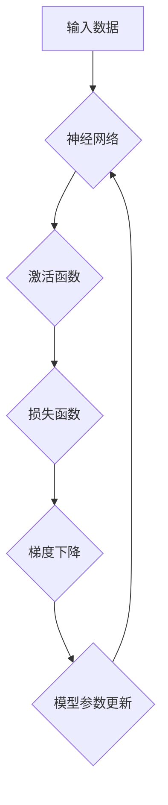

> 深度学习、神经网络、卷积神经网络、循环神经网络、梯度下降、反向传播、TensorFlow、PyTorch

## 1. 背景介绍

深度学习作为机器学习领域的一个重要分支，近年来取得了令人瞩目的成就，在图像识别、自然语言处理、语音识别等领域展现出强大的应用潜力。深度学习的核心在于利用多层神经网络来模拟人类大脑的学习过程，通过对大量数据进行训练，能够自动学习特征并进行复杂的任务处理。

传统的机器学习方法通常需要人工提取特征，而深度学习则能够自动学习特征，这使得其在处理复杂数据时具有更强的优势。随着计算能力的提升和数据量的爆炸式增长，深度学习的研究和应用得到了飞速发展。

## 2. 核心概念与联系

深度学习的核心概念包括神经网络、激活函数、损失函数、梯度下降等。

**神经网络**

神经网络由多个相互连接的神经元组成，每个神经元接收来自其他神经元的输入，并通过权重进行加权求和，然后通过激活函数进行非线性变换，最后输出到下一个神经元。

**激活函数**

激活函数的作用是引入非线性，使神经网络能够学习更复杂的模式。常见的激活函数包括ReLU、Sigmoid、Tanh等。

**损失函数**

损失函数用于衡量模型预测结果与真实值的差距，其目标是通过优化模型参数，最小化损失函数的值。常见的损失函数包括均方误差、交叉熵等。

**梯度下降**

梯度下降是一种优化算法，用于更新模型参数，使其能够最小化损失函数的值。梯度下降算法通过计算损失函数对模型参数的梯度，并根据梯度方向调整参数值，逐步逼近损失函数的最小值。

**Mermaid 流程图**



## 3. 核心算法原理 & 具体操作步骤

### 3.1  算法原理概述

深度学习的核心算法是**反向传播算法**，它用于计算模型参数的梯度，并根据梯度更新模型参数。反向传播算法的基本步骤如下：

1. 将输入数据输入到神经网络中，并计算输出结果。
2. 计算输出结果与真实值的损失函数值。
3. 根据损失函数值，计算每个神经元的梯度。
4. 利用梯度更新每个神经元的权重和偏置。
5. 重复步骤1-4，直到损失函数值达到最小值。

### 3.2  算法步骤详解

1. **前向传播:** 将输入数据逐层传递到神经网络中，计算每个神经元的输出值。
2. **损失函数计算:** 计算模型输出结果与真实值的损失函数值。
3. **反向传播:** 从输出层开始，计算每个神经元的梯度。
4. **参数更新:** 利用梯度更新每个神经元的权重和偏置。

### 3.3  算法优缺点

**优点:**

* 能够自动学习特征，无需人工提取特征。
* 能够处理复杂数据，学习更复杂的模式。
* 在图像识别、自然语言处理等领域取得了显著的成果。

**缺点:**

* 需要大量的训练数据。
* 训练时间较长，计算资源消耗较大。
* 模型解释性较差，难以理解模型的决策过程。

### 3.4  算法应用领域

深度学习算法广泛应用于以下领域：

* **图像识别:** 人脸识别、物体检测、图像分类等。
* **自然语言处理:** 机器翻译、文本摘要、情感分析等。
* **语音识别:** 语音转文本、语音助手等。
* **推荐系统:** 商品推荐、内容推荐等。
* **医疗诊断:** 疾病诊断、影像分析等。

## 4. 数学模型和公式 & 详细讲解 & 举例说明

### 4.1  数学模型构建

深度学习模型通常由多个神经层组成，每个神经层包含多个神经元。每个神经元接收来自上一层的输出作为输入，并通过权重进行加权求和，然后通过激活函数进行非线性变换，最后输出到下一层。

**神经元模型:**

$$
y = f(w^T x + b)
$$

其中：

* $y$ 是神经元的输出值。
* $f$ 是激活函数。
* $w$ 是权重向量。
* $x$ 是输入向量。
* $b$ 是偏置项。

### 4.2  公式推导过程

反向传播算法的核心是计算梯度，并根据梯度更新模型参数。梯度计算过程涉及链式法则和微积分。

**链式法则:**

$$
\frac{d}{dx} f(g(x)) = f'(g(x)) \cdot g'(x)
$$

**梯度更新公式:**

$$
\theta = \theta - \alpha \frac{\partial L}{\partial \theta}
$$

其中：

* $\theta$ 是模型参数。
* $\alpha$ 是学习率。
* $L$ 是损失函数。

### 4.3  案例分析与讲解

以图像分类为例，假设我们有一个深度学习模型用于识别猫和狗的图片。模型的输入是图片像素值，输出是猫和狗的概率。

训练过程中，模型会根据图片标签进行反向传播，计算每个参数的梯度，并根据梯度更新参数值。通过不断训练，模型能够学习到识别猫和狗的特征，最终能够准确地分类图片。

## 5. 项目实践：代码实例和详细解释说明

### 5.1  开发环境搭建

深度学习开发环境通常需要安装Python、深度学习框架（如TensorFlow、PyTorch）以及必要的库。

### 5.2  源代码详细实现

以下是一个简单的深度学习模型代码示例，使用TensorFlow框架实现一个简单的图像分类模型：

```python
import tensorflow as tf

# 定义模型结构
model = tf.keras.models.Sequential([
    tf.keras.layers.Flatten(input_shape=(28, 28)),
    tf.keras.layers.Dense(128, activation='relu'),
    tf.keras.layers.Dense(10, activation='softmax')
])

# 编译模型
model.compile(optimizer='adam',
              loss='sparse_categorical_crossentropy',
              metrics=['accuracy'])

# 训练模型
model.fit(x_train, y_train, epochs=5)

# 评估模型
loss, accuracy = model.evaluate(x_test, y_test)
print('Test loss:', loss)
print('Test accuracy:', accuracy)
```

### 5.3  代码解读与分析

这段代码定义了一个简单的深度学习模型，用于分类手写数字。模型结构包括一个Flatten层、一个全连接层和一个输出层。

* Flatten层将输入图像数据转换为一维向量。
* 全连接层使用ReLU激活函数，用于学习特征。
* 输出层使用softmax激活函数，输出每个数字的概率。

模型使用Adam优化器、交叉熵损失函数和准确率作为评估指标。

### 5.4  运行结果展示

训练完成后，模型能够对测试数据进行分类，并输出测试损失和准确率。

## 6. 实际应用场景

深度学习在各个领域都有广泛的应用场景，例如：

### 6.1  图像识别

* **人脸识别:** 用于解锁手机、验证身份、监控安全等。
* **物体检测:** 用于自动驾驶、安防监控、工业缺陷检测等。
* **图像分类:** 用于医学影像诊断、产品分类、内容推荐等。

### 6.2  自然语言处理

* **机器翻译:** 将一种语言翻译成另一种语言。
* **文本摘要:** 自动生成文本的简短摘要。
* **情感分析:** 分析文本的情感倾向，用于市场调研、客户服务等。

### 6.3  语音识别

* **语音转文本:** 将语音转换为文本，用于语音助手、听写软件等。
* **语音合成:** 将文本转换为语音，用于语音导航、虚拟助手等。

### 6.4  未来应用展望

深度学习技术还在不断发展，未来将有更多新的应用场景出现，例如：

* **个性化推荐:** 基于用户的行为和偏好，提供个性化的产品和服务推荐。
* **自动驾驶:** 深度学习可以帮助自动驾驶汽车感知周围环境、做出决策，实现自动驾驶功能。
* **医疗诊断:** 深度学习可以帮助医生更快、更准确地诊断疾病。

## 7. 工具和资源推荐

### 7.1  学习资源推荐

* **书籍:**
    * 深度学习
    * 深度学习实践
    * 深度学习入门
* **在线课程:**
    * Coursera 深度学习课程
    * Udacity 深度学习课程
    * fast.ai 深度学习课程

### 7.2  开发工具推荐

* **TensorFlow:** 开源深度学习框架，支持多种硬件平台。
* **PyTorch:** 开源深度学习框架，以其灵活性和易用性而闻名。
* **Keras:** 高级深度学习API，可以运行在TensorFlow、Theano或CNTK后端。

### 7.3  相关论文推荐

* **ImageNet Classification with Deep Convolutional Neural Networks**
* **Deep Residual Learning for Image Recognition**
* **Attention Is All You Need**

## 8. 总结：未来发展趋势与挑战

### 8.1  研究成果总结

深度学习取得了令人瞩目的成果，在图像识别、自然语言处理、语音识别等领域取得了突破性的进展。

### 8.2  未来发展趋势

* **模型规模和复杂度提升:** 未来深度学习模型将更加庞大，包含更多层和参数，以学习更复杂的模式。
* **硬件加速:** 随着GPU和TPU等硬件的不断发展，深度学习模型的训练速度将进一步提升。
* **迁移学习:** 利用预训练模型，在新的任务上进行迁移学习，降低训练成本和时间。
* **解释性增强:** 研究更可解释的深度学习模型，以便更好地理解模型的决策过程。

### 8.3  面临的挑战

* **数据获取和标注:** 深度学习模型需要大量的训练数据，数据获取和标注成本较高。
* **模型训练时间:** 训练大型深度学习模型需要很长的时间，需要更高效的训练算法和硬件支持。
* **模型解释性:** 深度学习模型的决策过程难以解释，这限制了其在一些领域应用的推广。

### 8.4  研究展望

未来深度学习研究将继续探索新的算法、模型和应用场景，推动人工智能技术的发展。


## 9. 附录：常见问题与解答

**Q1: 深度学习和机器学习有什么区别？**

**A1:** 深度学习是机器学习的一个子集，它利用多层神经网络来学习特征，而传统的机器学习方法通常需要人工提取特征。

**Q2: 如何选择合适的深度学习框架？**

**A2:** TensorFlow和PyTorch是两个流行的深度学习框架，TensorFlow更适合于生产环境，PyTorch更灵活易用。

**Q3: 如何评估深度学习模型的性能？**

**A3:** 常见的评估指标包括准确率、召回率、F1-score等，选择合适的评估指标取决于具体的应用场景。


作者：禅与计算机程序设计艺术 / Zen and the Art of Computer Programming 
<end_of_turn>