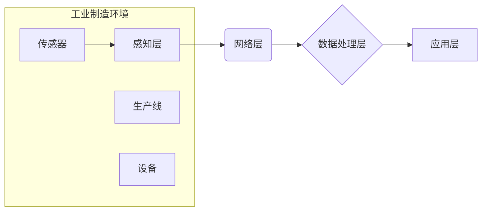

> 物联网(IoT)、传感器设备、工业制造、数据采集、数据分析、机器学习、自动化、智能制造

## 1. 背景介绍

工业制造业正处于数字化转型和智能化升级的关键时期。物联网(IoT)技术作为连接物理世界和数字世界的桥梁，为工业制造业带来了前所未有的机遇。通过将传感器设备与工业控制系统和数据分析平台相集成，物联网可以实现对生产过程的实时监控、数据采集和分析，从而提高生产效率、降低成本、提升产品质量。

近年来，传感器技术的快速发展和成本的下降，使得传感器设备在工业制造中的应用越来越广泛。各种类型的传感器，例如温度传感器、压力传感器、流量传感器、位置传感器等，可以实时采集生产过程中的各种数据，为智能制造提供数据支撑。

## 2. 核心概念与联系

**2.1 物联网(IoT)**

物联网是指通过网络连接各种物理设备、传感器、软件和数据，形成一个互联互通的智能网络。物联网的核心概念包括：

* **感知层:** 负责收集物理世界的各种数据，例如温度、压力、位置等。
* **网络层:** 将感知层的数据传输到云端或其他数据处理中心。
* **数据处理层:** 对收集到的数据进行分析、处理和存储。
* **应用层:** 基于数据分析结果，提供各种应用服务，例如远程监控、设备管理、预测维护等。

**2.2 传感器设备**

传感器设备是物联网的核心组成部分，负责感知物理世界的各种数据。常见的传感器类型包括：

* **温度传感器:** 测量温度变化。
* **压力传感器:** 测量压力变化。
* **流量传感器:** 测量流体流量。
* **位置传感器:** 测量物体的位置变化。
* **图像传感器:** 采集图像数据。

**2.3 工业制造**

工业制造是指将原材料通过加工、组装等一系列工序，生产出最终产品的过程。工业制造业的数字化转型和智能化升级，需要借助物联网技术和传感器设备，实现生产过程的实时监控、数据采集和分析，从而提高生产效率、降低成本、提升产品质量。

**2.4 架构图**



## 3. 核心算法原理 & 具体操作步骤

**3.1 算法原理概述**

在物联网环境下，工业制造过程中的数据采集、传输和分析需要依赖多种算法。常见的算法包括：

* **数据采集算法:** 用于从传感器设备中采集数据，并将其转换为可处理的格式。
* **数据传输算法:** 用于将采集到的数据从感知层传输到数据处理层。
* **数据分析算法:** 用于对采集到的数据进行分析，提取有价值的信息。
* **机器学习算法:** 用于从数据中学习模式，并进行预测或决策。

**3.2 算法步骤详解**

以数据分析算法为例，其具体操作步骤如下：

1. **数据采集:** 从传感器设备中采集生产过程中的各种数据。
2. **数据预处理:** 对采集到的数据进行清洗、转换和格式化，去除噪声和异常值。
3. **数据特征提取:** 从预处理后的数据中提取有价值的特征，例如温度变化趋势、压力波动幅度等。
4. **数据分析:** 使用统计分析、机器学习等方法对特征进行分析，发现生产过程中的异常情况或潜在问题。
5. **结果展示:** 将分析结果以图表、报告等形式展示给用户，以便进行决策和优化。

**3.3 算法优缺点**

不同的算法具有不同的优缺点，需要根据实际应用场景选择合适的算法。例如，统计分析算法简单易用，但对数据质量要求较高；机器学习算法可以学习复杂模式，但需要大量的训练数据。

**3.4 算法应用领域**

数据分析算法在工业制造领域有着广泛的应用，例如：

* **设备故障预测:** 通过分析设备运行数据，预测设备故障的发生时间，以便提前进行维护。
* **生产过程优化:** 通过分析生产过程中的数据，发现瓶颈和浪费，优化生产流程，提高生产效率。
* **产品质量控制:** 通过分析产品生产过程中的数据，识别产品质量问题，提高产品质量。

## 4. 数学模型和公式 & 详细讲解 & 举例说明

**4.1 数学模型构建**

在工业制造领域，可以使用数学模型来描述生产过程中的各种现象，例如：

* **质量控制模型:** 用于描述产品质量的变化趋势，并预测产品质量的未来状态。
* **生产效率模型:** 用于描述生产过程中的效率变化，并预测生产效率的未来状态。
* **成本模型:** 用于描述生产过程中的成本变化，并预测生产成本的未来状态。

**4.2 公式推导过程**

例如，我们可以使用线性回归模型来预测产品质量的变化趋势。线性回归模型的公式如下：

$$y = mx + c$$

其中：

* $y$ 是产品质量
* $x$ 是时间
* $m$ 是斜率，表示产品质量随时间的变化趋势
* $c$ 是截距，表示产品质量在时间为0时的状态

**4.3 案例分析与讲解**

假设我们收集了产品质量随时间的历史数据，可以使用线性回归模型来拟合这些数据，并得到模型参数 $m$ 和 $c$。然后，我们可以使用这个模型来预测未来一段时间内的产品质量变化趋势。

## 5. 项目实践：代码实例和详细解释说明

**5.1 开发环境搭建**

为了实现物联网在工业制造中的应用，需要搭建一个合适的开发环境。常见的开发环境包括：

* **云平台:** 例如阿里云、腾讯云、AWS等，提供物联网平台、数据存储、计算资源等服务。
* **边缘计算平台:** 例如Raspberry Pi、Arduino等，可以部署在工业现场，进行数据采集和处理。

**5.2 源代码详细实现**

以下是一个简单的代码示例，演示了如何使用Python语言从传感器设备采集数据并将其发送到云平台：

```python
import time
import requests

# 设置传感器设备的连接信息
sensor_url = "http://192.168.1.100/data"

# 设置云平台的API接口地址
api_url = "https://api.example.com/data"

while True:
    # 从传感器设备采集数据
    data = get_sensor_data()

    # 将数据发送到云平台
    response = requests.post(api_url, json=data)

    # 打印发送结果
    print(response.text)

    # 等待一段时间再采集数据
    time.sleep(1)
```

**5.3 代码解读与分析**

这段代码首先定义了传感器设备的连接信息和云平台的API接口地址。然后，使用一个无限循环来不断采集数据并发送到云平台。

* `get_sensor_data()` 函数负责从传感器设备采集数据。
* `requests.post()` 函数用于发送数据到云平台的API接口。

**5.4 运行结果展示**

当代码运行成功时，会将采集到的传感器数据发送到云平台，并打印发送结果。

## 6. 实际应用场景

物联网技术和传感器设备在工业制造中的应用场景非常广泛，例如：

* **智能工厂:** 通过物联网技术和传感器设备，实现工厂的自动化、智能化管理，提高生产效率和产品质量。
* **远程监控:** 通过物联网技术，可以远程监控生产设备的运行状态，及时发现问题并进行处理。
* **预测维护:** 通过分析设备运行数据，可以预测设备故障的发生时间，提前进行维护，降低设备故障率。
* **供应链管理:** 通过物联网技术，可以跟踪产品的生产、运输和销售过程，提高供应链的透明度和效率。

**6.4 未来应用展望**

随着物联网技术和传感器设备的不断发展，其在工业制造中的应用场景将会更加广泛和深入。未来，物联网技术将与人工智能、云计算等技术深度融合，形成更加智能化、自动化和协同的工业制造生态系统。

## 7. 工具和资源推荐

**7.1 学习资源推荐**

* **书籍:**
    * 《物联网技术》
    * 《工业物联网》
    * 《传感器技术》
* **在线课程:**
    * Coursera: 物联网课程
    * edX: 工业物联网课程
    * Udemy: 传感器技术课程

**7.2 开发工具推荐**

* **物联网平台:**
    * 阿里云物联网平台
    * 腾讯云物联网平台
    * AWS IoT Core
* **边缘计算平台:**
    * Raspberry Pi
    * Arduino
* **编程语言:**
    * Python
    * C++
    * Java

**7.3 相关论文推荐**

* **物联网在工业制造中的应用:**
    * [论文标题1](论文链接)
    * [论文标题2](论文链接)
* **传感器技术在工业制造中的应用:**
    * [论文标题3](论文链接)
    * [论文标题4](论文链接)

## 8. 总结：未来发展趋势与挑战

**8.1 研究成果总结**

物联网技术和传感器设备在工业制造中的应用取得了显著的成果，例如提高了生产效率、降低了成本、提升了产品质量。

**8.2 未来发展趋势**

未来，物联网技术和传感器设备在工业制造中的应用将朝着以下趋势发展：

* **更加智能化:** 利用人工智能技术，实现对生产过程的智能化控制和优化。
* **更加协同化:** 通过物联网平台，实现不同设备和系统之间的协同工作。
* **更加安全可靠:** 加强数据安全和网络安全防护，确保物联网系统安全可靠运行。

**8.3 面临的挑战**

物联网技术和传感器设备在工业制造中的应用也面临着一些挑战，例如：

* **数据安全和隐私保护:** 工业制造过程中的数据涉及到企业机密和用户隐私，需要采取有效的措施进行保护。
* **网络安全:** 物联网系统容易受到网络攻击，需要加强网络安全防护。
* **技术标准化:** 目前物联网技术缺乏统一的标准，需要加强标准化工作。

**8.4 研究展望**

未来，需要进一步研究和探索物联网技术和传感器设备在工业制造中的应用，解决上述挑战，推动物联网技术在工业制造领域的全面应用。

## 9. 附录：常见问题与解答

**9.1 如何选择合适的传感器设备？**

选择合适的传感器设备需要考虑以下因素：

* **测量范围:** 传感器设备的测量范围是否满足实际应用需求。
* **精度:** 传感器的精度是否能够满足实际应用需求。
* **响应时间:** 传感器的响应时间是否能够满足实际应用需求。
* **成本:** 传感器的成本是否能够满足实际应用需求。

**9.2 如何保证物联网系统的安全可靠？**

保证物联网系统的安全可靠需要采取以下措施：

* **数据加密:** 对传输的数据进行加密，防止数据被窃取。
* **身份认证:** 对设备进行身份认证，防止未授权设备接入系统。
* **访问控制:** 对系统资源进行访问控制，防止未授权用户访问敏感数据。
* **入侵检测:** 对系统进行入侵检测，及时发现和应对安全威胁。

**9.3 如何进行物联网系统的维护和管理？**

物联网系统的维护和管理需要以下步骤：

* **设备监控:** 对设备运行状态进行监控，及时发现问题。
* **数据备份:** 定期备份系统数据，防止数据丢失。
* **软件更新:** 定期更新系统软件，修复漏洞并提升性能。
* **安全审计:** 定期进行安全审计，评估系统安全状况。


作者：禅与计算机程序设计艺术 / Zen and the Art of