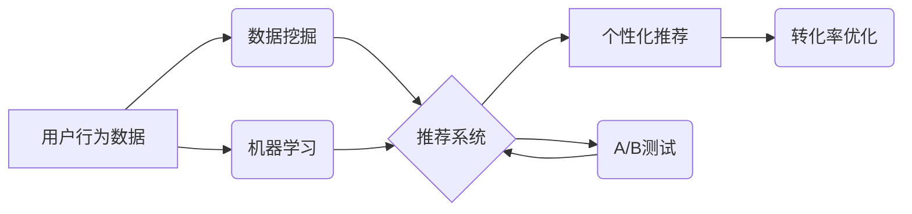

> 电商促销策略，推荐系统，机器学习，数据挖掘，A/B测试，个性化推荐，转化率优化

## 1. 背景介绍

在当今激烈的电商市场竞争中，如何有效地吸引顾客、提高转化率，成为电商平台的重中之重。促销策略作为电商平台的重要营销手段，直接影响着平台的收入和用户体验。传统的促销策略往往依赖于经验和直觉，缺乏数据支撑和精准度。随着大数据和人工智能技术的快速发展，电商促销策略也迎来了新的变革。

数据驱动、个性化、智能化成为电商促销策略的新趋势。通过对用户行为、商品属性、市场趋势等数据的分析，我们可以构建更精准、更有效的促销策略，提升用户体验，最终实现商业目标。

## 2. 核心概念与联系

电商促销策略的核心概念包括：

* **推荐系统:**  根据用户的历史行为、偏好和上下文信息，推荐相关的商品或服务，引导用户购买。
* **数据挖掘:** 从海量电商数据中挖掘出有价值的知识和模式，为促销策略提供数据支撑。
* **机器学习:** 利用算法训练模型，预测用户行为、商品销量等，为促销策略提供智能化决策支持。
* **A/B测试:** 通过对比不同的促销策略效果，选择最优方案，不断优化促销策略。
* **个性化推荐:**  根据用户的不同特征和需求，提供个性化的促销内容和优惠方案。

**核心概念架构图:**



## 3. 核心算法原理 & 具体操作步骤

### 3.1  算法原理概述

电商促销策略的算法原理主要基于以下几个方面：

* **协同过滤:**  根据用户的历史购买行为和商品评分，预测用户对其他商品的兴趣。
* **内容过滤:**  根据商品的属性和描述，推荐与用户兴趣相符的商品。
* **基于模型的推荐:**  利用机器学习算法，构建用户画像和商品特征模型，预测用户对商品的购买可能性。

### 3.2  算法步骤详解

**协同过滤算法步骤:**

1. **数据预处理:**  清洗用户行为数据，去除无效数据，并对数据进行标准化处理。
2. **用户-商品矩阵构建:**  将用户和商品信息表示为一个矩阵，其中每个元素表示用户对商品的评分或购买行为。
3. **相似度计算:**  计算用户之间的相似度或商品之间的相似度，可以使用余弦相似度、皮尔逊相关系数等方法。
4. **推荐生成:**  根据用户与相似用户或商品的相似度，推荐用户可能感兴趣的商品。

**内容过滤算法步骤:**

1. **商品特征提取:**  提取商品的属性、描述、类别等特征信息。
2. **用户兴趣建模:**  根据用户的历史购买行为和浏览记录，构建用户的兴趣模型。
3. **商品推荐:**  根据商品特征和用户兴趣模型，推荐与用户兴趣相符的商品。

**基于模型的推荐算法步骤:**

1. **数据特征工程:**  提取用户和商品的特征信息，例如用户年龄、性别、购买历史、商品价格、类别等。
2. **模型训练:**  使用机器学习算法，例如深度神经网络、支持向量机等，训练推荐模型。
3. **预测和推荐:**  根据用户的特征信息，预测用户对商品的购买可能性，并推荐相应的商品。

### 3.3  算法优缺点

| 算法类型 | 优点 | 缺点 |
|---|---|---|
| 协同过滤 |  能够发现用户之间的隐性关系，推荐个性化商品 | 需要大量用户数据，容易陷入数据稀疏问题 |
| 内容过滤 |  能够根据商品属性进行精准推荐，不受用户数据稀疏的影响 |  容易陷入“同质化推荐”问题，缺乏个性化 |
| 基于模型的推荐 |  能够学习用户和商品的复杂关系，推荐更精准的商品 |  需要大量的训练数据和计算资源 |

### 3.4  算法应用领域

电商促销策略算法广泛应用于以下领域：

* **商品推荐:**  根据用户的兴趣和行为，推荐相关的商品。
* **促销活动推荐:**  根据用户的购买习惯和偏好，推荐合适的促销活动。
* **个性化营销:**  根据用户的不同特征和需求，提供个性化的促销内容和优惠方案。
* **转化率优化:**  通过分析用户行为数据，优化促销策略，提高转化率。

## 4. 数学模型和公式 & 详细讲解 & 举例说明

### 4.1  数学模型构建

协同过滤算法的核心是用户-商品矩阵，我们可以用以下数学模型来表示：

* **用户-商品矩阵:**  $R \in R^{m \times n}$，其中 $m$ 表示用户数量，$n$ 表示商品数量，$R_{ij}$ 表示用户 $i$ 对商品 $j$ 的评分或购买行为。

### 4.2  公式推导过程

**余弦相似度:**  用于计算用户之间的相似度，公式如下:

$$
\text{相似度}(u_i, u_j) = \frac{u_i \cdot u_j}{||u_i|| ||u_j||}
$$

其中:

* $u_i$ 和 $u_j$ 表示用户 $i$ 和 $j$ 的特征向量。
* $u_i \cdot u_j$ 表示用户 $i$ 和 $j$ 的点积。
* $||u_i||$ 和 $||u_j||$ 表示用户 $i$ 和 $j$ 的特征向量的模长。

### 4.3  案例分析与讲解

假设有两个用户 $A$ 和 $B$，他们的购买行为如下:

* 用户 $A$ 购买了商品 $1$、$2$ 和 $3$。
* 用户 $B$ 购买了商品 $2$、$3$ 和 $4$。

我们可以构建用户-商品矩阵:

$$
R = \begin{bmatrix}
1 & 1 & 1 & 0 \\
0 & 1 & 1 & 1
\end{bmatrix}
$$

根据余弦相似度公式，我们可以计算用户 $A$ 和 $B$ 的相似度。

## 5. 项目实践：代码实例和详细解释说明

### 5.1  开发环境搭建

* **操作系统:**  Linux 或 Windows
* **编程语言:**  Python
* **库依赖:**  pandas, numpy, scikit-learn, matplotlib

### 5.2  源代码详细实现

```python
import pandas as pd
from sklearn.metrics.pairwise import cosine_similarity

# 加载用户-商品矩阵数据
data = pd.read_csv('user_item_matrix.csv')

# 计算用户之间的余弦相似度
user_similarity = cosine_similarity(data)

# 打印用户相似度矩阵
print(user_similarity)

# 根据用户相似度推荐商品
def recommend_items(user_id, top_n=5):
    # 获取用户相似用户
    similar_users = user_similarity[user_id].argsort()[:-top_n-1:-1]
    # 获取相似用户喜欢的商品
    recommended_items = data.iloc[similar_users].mean().sort_values(ascending=False).index
    return recommended_items

# 获取用户 ID
user_id = 0
# 推荐商品
recommended_items = recommend_items(user_id)
print(f'推荐给用户 {user_id} 的商品: {recommended_items}')
```

### 5.3  代码解读与分析

* 代码首先加载用户-商品矩阵数据。
* 然后使用 scikit-learn 库的 `cosine_similarity` 函数计算用户之间的余弦相似度。
* `recommend_items` 函数根据用户 ID 和要推荐的商品数量，获取用户相似用户，并推荐相似用户喜欢的商品。

### 5.4  运行结果展示

运行代码后，会输出用户相似度矩阵和推荐给指定用户的商品列表。

## 6. 实际应用场景

电商平台可以将电商促销策略算法应用于以下场景:

* **个性化推荐:**  根据用户的浏览历史、购买记录、兴趣爱好等信息，推荐个性化的商品和促销活动。
* **促销活动优化:**  通过分析用户对不同促销活动的响应情况，优化促销活动的时间、力度和内容。
* **转化率提升:**  根据用户行为数据，优化商品展示顺序、促销文案、支付流程等，提高用户转化率。

### 6.4  未来应用展望

随着人工智能技术的不断发展，电商促销策略将更加智能化、个性化和精准化。未来，我们可以期待以下应用场景:

* **实时个性化推荐:**  根据用户的实时行为和上下文信息，提供更精准的商品推荐。
* **智能化促销活动策划:**  利用机器学习算法，自动策划和优化促销活动，提高活动效果。
* **虚拟试衣间:**  利用虚拟现实技术，为用户提供虚拟试衣间体验，提升用户购物体验。

## 7. 工具和资源推荐

### 7.1  学习资源推荐

* **书籍:**
    * 《推荐系统实践》
    * 《机器学习》
* **在线课程:**
    * Coursera:  机器学习
    * Udacity:  深度学习
* **博客:**
    *  机器学习 Mastery
    *  Towards Data Science

### 7.2  开发工具推荐

* **Python:**  数据分析和机器学习的常用语言
* **scikit-learn:**  机器学习库
* **TensorFlow:**  深度学习框架
* **PyTorch:**  深度学习框架

### 7.3  相关论文推荐

* **Collaborative Filtering for Implicit Feedback Datasets**
* **Deep Learning for Recommender Systems**
* **A Survey on Recommender Systems**

## 8. 总结：未来发展趋势与挑战

### 8.1  研究成果总结

电商促销策略的算法研究取得了显著成果，能够有效地提高用户体验和商业效益。协同过滤、内容过滤和基于模型的推荐算法等方法被广泛应用于电商平台。

### 8.2  未来发展趋势

* **更精准的个性化推荐:**  利用更丰富的用户数据和更先进的算法，提供更精准的个性化推荐。
* **更智能化的促销活动策划:**  利用机器学习算法，自动策划和优化促销活动，提高活动效果。
* **更丰富的交互体验:**  利用虚拟现实、增强现实等技术，为用户提供更丰富的交互体验。

### 8.3  面临的挑战

* **数据隐私保护:**  电商促销策略算法需要处理大量用户数据，如何保护用户隐私是一个重要的挑战。
* **算法公平性:**  算法模型可能存在偏见，导致推荐结果不公平，需要进行算法公平性评估和优化。
* **解释性问题:**  一些深度学习模型的决策过程难以解释，需要开发更可解释的算法模型。

### 8.4  研究展望

未来，电商促销策略研究将更加注重数据隐私保护、算法公平性和可解释性。同时，随着人工智能技术的不断发展，电商促销策略将更加智能化、个性化和精准化。

## 9. 附录：常见问题与解答

**Q1:  协同过滤算法容易陷入数据稀疏问题，如何解决？**

**A1:**  可以采用以下方法解决数据稀疏问题:

* **使用混合推荐算法:**  将协同过滤算法与内容过滤算法相结合，利用商品属性信息进行推荐。
* **使用矩阵分解技术:**  将用户-商品矩阵分解成低维矩阵，降低数据稀疏度。
* **使用冷启动策略:**  对于新用户和新商品，可以使用其他方法进行推荐，例如基于内容过滤或基于规则的推荐。

**Q2:  如何评估电商促销策略的有效性？**

**A2:**  可以使用以下指标评估电商促销策略的有效性:

* **点击率 (CTR):**  用户点击促销广告的比例。
* **转化率 (CVR):**