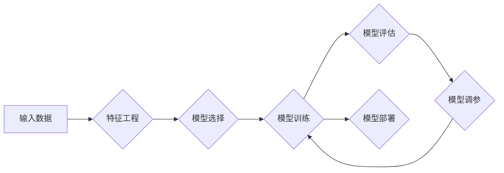

> 监督学习、机器学习、分类、回归、算法原理、代码实现、案例分析

## 1. 背景介绍

在当今数据爆炸的时代，机器学习作为人工智能的核心技术，在各个领域发挥着越来越重要的作用。其中，监督学习作为机器学习最基础也是应用最广泛的算法之一，在图像识别、自然语言处理、预测分析等领域取得了显著的成果。

监督学习的核心思想是通过已标记的数据集，训练模型学习数据的规律，从而能够对新的未标记数据进行预测或分类。简单来说，就是让机器“学习”从已有的数据中找出规律，并根据这些规律对新的数据进行判断。

## 2. 核心概念与联系

**2.1 监督学习的要素**

* **训练数据:** 监督学习的核心是训练数据，它包含了输入特征和对应的输出标签。例如，在图像分类任务中，训练数据包含了图像和对应的类别标签。
* **模型:** 模型是学习数据的映射关系，它通过学习训练数据中的规律，将输入特征映射到输出标签。
* **损失函数:** 损失函数用于衡量模型预测结果与真实标签之间的差异。模型训练的目标是通过调整模型参数，最小化损失函数的值。
* **优化算法:** 优化算法用于更新模型参数，使其能够最小化损失函数。常见的优化算法包括梯度下降法、动量法等。

**2.2 监督学习的类型**

* **分类:** 将数据分为不同的类别。例如，图像识别、垃圾邮件过滤等。
* **回归:** 预测连续的数值输出。例如，房价预测、股票价格预测等。

**2.3 监督学习流程**



## 3. 核心算法原理 & 具体操作步骤

### 3.1  算法原理概述

本节将介绍两种常见的监督学习算法：逻辑回归和线性回归。

**3.1.1 逻辑回归**

逻辑回归是一种用于二分类问题的算法。它将线性回归模型的输出映射到0到1之间的概率值，从而实现对数据的分类。

**3.1.2 线性回归**

线性回归是一种用于回归问题的算法。它试图找到一条直线或超平面，将输入特征与输出标签进行线性映射。

### 3.2  算法步骤详解

**3.2.1 逻辑回归步骤**

1. **特征工程:** 对输入数据进行预处理，例如特征选择、特征缩放等。
2. **模型训练:** 使用训练数据训练逻辑回归模型，通过最大似然估计法求解模型参数。
3. **模型评估:** 使用测试数据评估模型的性能，例如准确率、召回率等。
4. **模型调参:** 根据评估结果，调整模型参数，例如学习率、正则化参数等，以提高模型性能。

**3.2.2 线性回归步骤**

1. **特征工程:** 对输入数据进行预处理，例如特征选择、特征缩放等。
2. **模型训练:** 使用训练数据训练线性回归模型，通过最小二乘法求解模型参数。
3. **模型评估:** 使用测试数据评估模型的性能，例如均方误差、R-squared等。
4. **模型调参:** 根据评估结果，调整模型参数，例如学习率、正则化参数等，以提高模型性能。

### 3.3  算法优缺点

**3.3.1 逻辑回归**

* **优点:** 
    * 算法简单易懂，易于实现。
    * 训练速度快，适合处理大规模数据。
    * 可以输出概率值，方便进行概率分析。
* **缺点:** 
    * 只能处理二分类问题。
    * 对非线性数据拟合能力较差。

**3.3.2 线性回归**

* **优点:** 
    * 算法简单易懂，易于实现。
    * 训练速度快，适合处理大规模数据。
    * 可以处理多分类问题。
* **缺点:** 
    * 对非线性数据拟合能力较差。
    * 容易受到异常值的影响。

### 3.4  算法应用领域

**3.4.1 逻辑回归**

* **图像识别:** 将图像分类为不同的类别，例如人脸识别、物体识别等。
* **自然语言处理:** 进行文本分类，例如情感分析、垃圾邮件过滤等。
* **医疗诊断:** 根据患者的症状和病史，预测疾病的类型。

**3.4.2 线性回归**

* **房价预测:** 根据房屋的面积、位置等特征，预测房价。
* **股票价格预测:** 根据股票的历史价格和市场信息，预测股票价格。
* **销售预测:** 根据历史销售数据和市场趋势，预测未来的销售额。

## 4. 数学模型和公式 & 详细讲解 & 举例说明

### 4.1  数学模型构建

**4.1.1 逻辑回归模型**

逻辑回归模型的输出是一个概率值，它通过sigmoid函数将线性回归模型的输出映射到0到1之间。

$$
p(y=1|x) = \frac{1}{1 + e^{-(w^T x + b)}}
$$

其中：

* $p(y=1|x)$ 是给定输入特征 $x$ 时，预测输出标签为1的概率。
* $w$ 是模型参数，代表特征的权重。
* $b$ 是模型参数，代表偏置项。
* $x$ 是输入特征向量。
* $e$ 是自然常数。

**4.1.2 线性回归模型**

线性回归模型试图找到一条直线或超平面，将输入特征与输出标签进行线性映射。

$$
y = w^T x + b
$$

其中：

* $y$ 是输出标签。
* $w$ 是模型参数，代表特征的权重。
* $b$ 是模型参数，代表偏置项。
* $x$ 是输入特征向量。

### 4.2  公式推导过程

**4.2.1 逻辑回归模型参数求解**

逻辑回归模型的参数 $w$ 和 $b$ 可以通过最大似然估计法求解。最大似然估计法的目标是找到模型参数，使得模型能够最大化预测结果与真实标签的匹配程度。

**4.2.2 线性回归模型参数求解**

线性回归模型的参数 $w$ 和 $b$ 可以通过最小二乘法求解。最小二乘法的目标是找到模型参数，使得模型预测结果与真实标签之间的误差平方和最小。

### 4.3  案例分析与讲解

**4.3.1 逻辑回归案例分析**

假设我们有一个二分类问题，需要判断邮件是否为垃圾邮件。我们可以使用逻辑回归模型进行训练。训练数据包含了邮件的文本内容和对应的标签（垃圾邮件或正常邮件）。通过训练模型，我们可以得到一个能够预测邮件是否为垃圾邮件的模型。

**4.3.2 线性回归案例分析**

假设我们有一个回归问题，需要预测房价。我们可以使用线性回归模型进行训练。训练数据包含了房屋的面积、位置等特征和对应的房价。通过训练模型，我们可以得到一个能够预测房价的模型。

## 5. 项目实践：代码实例和详细解释说明

### 5.1  开发环境搭建

本项目使用Python语言进行开发，需要安装以下软件包：

* NumPy
* Pandas
* Scikit-learn
* Matplotlib

可以使用pip命令安装这些软件包。

### 5.2  源代码详细实现

```python
import numpy as np
from sklearn.linear_model import LogisticRegression
from sklearn.model_selection import train_test_split
from sklearn.metrics import accuracy_score

# 载入数据
data = np.loadtxt('data.csv', delimiter=',')
X = data[:, :-1]
y = data[:, -1]

# 将数据划分为训练集和测试集
X_train, X_test, y_train, y_test = train_test_split(X, y, test_size=0.2, random_state=42)

# 创建逻辑回归模型
model = LogisticRegression()

# 训练模型
model.fit(X_train, y_train)

# 预测测试集结果
y_pred = model.predict(X_test)

# 计算模型准确率
accuracy = accuracy_score(y_test, y_pred)
print('模型准确率:', accuracy)
```

### 5.3  代码解读与分析

* 首先，我们载入数据并将其分为特征和标签。
* 然后，我们将数据划分为训练集和测试集。
* 接下来，我们创建逻辑回归模型并训练模型。
* 训练完成后，我们使用模型预测测试集结果。
* 最后，我们计算模型的准确率。

### 5.4  运行结果展示

运行上述代码后，会输出模型的准确率。

## 6. 实际应用场景

### 6.1  医疗诊断

* 预测疾病风险：根据患者的病史、基因信息等特征，预测患某种疾病的风险。
* 辅助诊断：根据患者的症状和检查结果，辅助医生进行诊断。

### 6.2  金融领域

* 欺诈检测：识别信用卡欺诈交易。
* 风险评估：评估贷款申请者的信用风险。

### 6.3  电商领域

* 商品推荐：根据用户的购买历史和浏览记录，推荐相关的商品。
* 预测销量：根据历史销售数据和市场趋势，预测商品的销量。

### 6.4  未来应用展望

随着人工智能技术的不断发展，监督学习将在更多领域得到应用，例如自动驾驶、机器人控制、个性化教育等。

## 7. 工具和资源推荐

### 7.1  学习资源推荐

* **书籍:**
    * 《机器学习》 - 周志华
    * 《深入理解机器学习》 -  李航
* **在线课程:**
    * Coursera: Machine Learning by Andrew Ng
    * edX: Artificial Intelligence by Columbia University

### 7.2  开发工具推荐

* **Python:** 
    * Scikit-learn: 机器学习库
    * TensorFlow: 深度学习库
    * PyTorch: 深度学习库

### 7.3  相关论文推荐

* **《Support Vector Machines》** - Vapnik, V. N. (1995)
* **《A Probabilistic Approach to Automatic Document Understanding》** - Lafferty, J., McCallum, A., & Pereira, F. (2001)

## 8. 总结：未来发展趋势与挑战

### 8.1  研究成果总结

监督学习在过去几十年取得了显著的成果，在各个领域都有广泛的应用。

### 8.2  未来发展趋势

* **深度学习:** 深度学习算法在图像识别、自然语言处理等领域取得了突破性进展，未来将继续推动监督学习的发展。
* **迁移学习:** 迁移学习可以利用已训练好的模型，在新的任务上进行训练，可以有效降低训练成本和时间。
* **联邦学习:** 联邦学习可以训练模型而无需共享原始数据，可以保护用户隐私，未来将应用于更多需要保护隐私的场景。

### 8.3  面临的挑战

* **数据质量:** 监督学习算法的性能依赖于训练数据的质量，如何获取高质量的训练数据仍然是一个挑战。
* **模型解释性:** 许多深度学习模型的决策过程难以解释，如何提高模型的解释性仍然是一个研究热点。
* **公平性:** 监督学习模型可能存在偏见，如何确保模型的公平性是一个重要的伦理问题。

### 8.4  研究展望

未来，监督学习的研究将继续朝着更智能、更安全、更公平的方向发展。


## 9. 附录：常见问题与解答

**9.1  什么是过拟合？**

过拟合是指模型对训练数据拟合得太好，导致模型无法