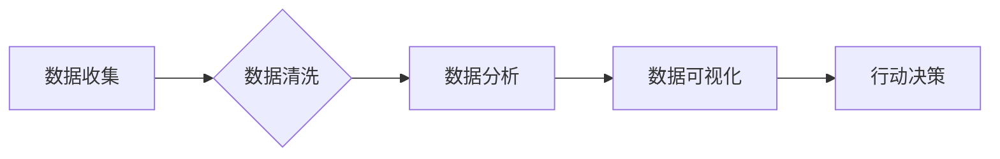

> 数据分析, 知识付费, 用户画像, 课程推荐, 营销策略, 数据可视化, 预测模型

## 1. 背景介绍

知识付费行业近年来发展迅速，从在线课程、直播带货到付费咨询，各种形式的知识付费模式层出不穷。在这个竞争激烈的市场环境下，数据分析已成为知识付费创业者不可或缺的工具。通过对用户行为、课程数据、市场趋势等数据的分析，创业者可以洞察用户需求，优化课程内容，精准营销，最终提升用户转化率和商业效益。

## 2. 核心概念与联系

**2.1 数据分析在知识付费中的应用场景**

数据分析在知识付费行业中应用广泛，主要涵盖以下几个方面：

* **用户画像分析:** 通过分析用户年龄、性别、职业、兴趣爱好、学习习惯等数据，构建用户画像，了解用户群体特征，为课程内容和营销策略提供参考。
* **课程推荐:** 根据用户的学习历史、兴趣偏好、课程评价等数据，推荐个性化课程，提高用户学习体验和课程转化率。
* **营销策略优化:** 分析用户行为数据，例如用户访问路径、点击率、转化率等，优化营销活动，提高广告投放效率，精准触达目标用户。
* **课程内容优化:** 分析用户对课程的评价、反馈、学习进度等数据，了解课程的优缺点，及时调整课程内容，提升课程质量。
* **市场趋势分析:** 分析行业发展趋势、用户需求变化、竞争对手情况等数据，为知识付费创业者提供决策参考，把握市场机遇。

**2.2 数据分析流程**

数据分析流程通常包括以下几个步骤：

1. **数据收集:** 收集来自用户行为、课程数据、市场数据等多个来源的数据。
2. **数据清洗:** 对收集到的数据进行清洗，去除重复数据、错误数据、缺失数据等，保证数据质量。
3. **数据分析:** 使用统计分析、机器学习等方法对数据进行分析，挖掘数据中的潜在价值。
4. **数据可视化:** 将分析结果以图表、报告等形式进行展示，方便用户理解和决策。
5. **行动决策:** 根据数据分析结果，制定相应的行动策略，优化课程内容、营销策略、用户体验等。

**2.3 数据分析工具**

常用的数据分析工具包括：

* **SQL:** 用于数据查询和处理。
* **Python:** 强大的数据分析和机器学习语言。
* **R:** 专注于统计分析和数据可视化的语言。
* **Tableau:** 数据可视化工具，用于创建交互式图表和仪表盘。
* **Power BI:** 微软数据分析和可视化工具。

**2.4 数据安全与隐私保护**

在进行数据分析时，需要特别注意数据安全和用户隐私保护。

* **数据加密:** 对敏感数据进行加密，防止数据泄露。
* **匿名化处理:** 对用户数据进行匿名化处理，保护用户隐私。
* **合规性:** 遵守相关数据安全和隐私保护法律法规。

**2.5 Mermaid 流程图**



## 3. 核心算法原理 & 具体操作步骤

**3.1 算法原理概述**

在知识付费行业中，常用的数据分析算法包括：

* **聚类算法:** 将用户根据相似特征进行分组，构建用户画像。
* **推荐算法:** 根据用户的历史行为和偏好，推荐个性化课程。
* **预测模型:** 利用历史数据预测用户行为，例如用户是否会购买课程、课程的学习完成率等。

**3.2 算法步骤详解**

以用户画像分析为例，详细介绍聚类算法的步骤：

1. **数据准备:** 收集用户数据，例如年龄、性别、职业、兴趣爱好、学习习惯等。
2. **特征选择:** 选择与用户画像相关的特征，例如年龄、性别、职业等。
3. **数据预处理:** 对数据进行清洗、标准化等预处理，保证数据质量。
4. **聚类算法选择:** 选择合适的聚类算法，例如K-means聚类算法。
5. **聚类模型训练:** 使用训练数据训练聚类模型，得到用户群体的划分。
6. **模型评估:** 使用测试数据评估模型的性能，例如聚类准确率、轮廓系数等。
7. **用户画像构建:** 根据聚类结果，构建不同用户群体的画像，例如“年轻职场人”、“学生群体”、“专业人士”等。

**3.3 算法优缺点**

聚类算法的优点：

* 可以发现数据中的潜在结构和模式。
* 可以将用户根据相似特征进行分组，构建用户画像。

聚类算法的缺点：

* 需要预先设定聚类数量，难以确定最佳聚类数量。
* 对数据质量要求较高，数据噪声和异常值会影响聚类结果。

**3.4 算法应用领域**

聚类算法在知识付费行业中广泛应用于：

* 用户画像分析
* 课程推荐
* 营销策略优化

## 4. 数学模型和公式 & 详细讲解 & 举例说明

**4.1 数学模型构建**

用户画像分析可以使用K-means聚类算法，其数学模型可以表示为：

* **目标函数:** 
$$
J = \sum_{i=1}^{k} \sum_{x \in C_i} ||x - \mu_i||^2
$$

其中：

* $J$ 是目标函数值
* $k$ 是聚类数量
* $C_i$ 是第 $i$ 个聚类
* $x$ 是第 $i$ 个数据点
* $\mu_i$ 是第 $i$ 个聚类中心

* **聚类中心更新公式:**
$$
\mu_i = \frac{\sum_{x \in C_i} x}{|C_i|}
$$

**4.2 公式推导过程**

K-means算法的目标是找到 $k$ 个聚类中心，使得每个数据点到其所属聚类中心的距离最小。

算法迭代过程如下：

1. **随机初始化 $k$ 个聚类中心。**
2. **将每个数据点分配到最近的聚类中心。**
3. **更新每个聚类中心的坐标，使其成为该聚类中所有数据点的中心。**
4. **重复步骤 2 和 3，直到聚类中心不再变化或达到最大迭代次数。**

**4.3 案例分析与讲解**

假设我们有以下用户数据：

| 用户ID | 年龄 | 性别 | 职业 |
|---|---|---|---|
| 1 | 25 | 男 | 学生 |
| 2 | 30 | 女 | 职场人 |
| 3 | 28 | 男 | 职场人 |
| 4 | 35 | 女 | 创业者 |
| 5 | 22 | 女 | 学生 |

我们想要使用K-means算法将用户进行聚类，假设我们设定聚类数量为 $k=2$。

1. 随机初始化两个聚类中心。
2. 将每个用户分配到最近的聚类中心。
3. 更新每个聚类中心的坐标，使其成为该聚类中所有用户数据的中心。
4. 重复步骤 2 和 3，直到聚类中心不再变化。

最终，我们可以得到两个用户群体：

* **群体 1:** 年龄较低，主要为学生群体。
* **群体 2:** 年龄较高，主要为职场人或创业者。

## 5. 项目实践：代码实例和详细解释说明

**5.1 开发环境搭建**

* Python 3.x
* Jupyter Notebook
* scikit-learn

**5.2 源代码详细实现**

```python
from sklearn.cluster import KMeans
import pandas as pd

# 加载用户数据
data = pd.read_csv('user_data.csv')

# 选择特征
features = ['年龄', '性别', '职业']
X = data[features]

# 设定聚类数量
k = 2

# 使用K-means算法进行聚类
kmeans = KMeans(n_clusters=k, random_state=0)
kmeans.fit(X)

# 获取聚类结果
labels = kmeans.labels_

# 将聚类结果添加到数据中
data['聚类'] = labels

# 查看聚类结果
print(data)
```

**5.3 代码解读与分析**

* 首先，我们加载用户数据，并选择需要进行聚类的特征。
* 然后，我们使用K-means算法进行聚类，设定聚类数量为 $k$。
* 算法训练完成后，我们可以获取聚类结果，并将结果添加到数据中。
* 最后，我们可以查看聚类结果，了解用户群体的划分。

**5.4 运行结果展示**

运行代码后，会输出包含用户ID、年龄、性别、职业和聚类标签的数据。

## 6. 实际应用场景

**6.1 用户画像分析**

通过对用户数据的聚类分析，可以构建不同用户群体的画像，例如“年轻职场人”、“学生群体”、“专业人士”等。

**6.2 课程推荐**

根据用户的学习历史、兴趣偏好、课程评价等数据，推荐个性化课程，提高用户学习体验和课程转化率。

**6.3 营销策略优化**

分析用户行为数据，例如用户访问路径、点击率、转化率等，优化营销活动，提高广告投放效率，精准触达目标用户。

**6.4 未来应用展望**

随着人工智能技术的不断发展，数据分析在知识付费行业将发挥更加重要的作用。

* **更精准的用户画像:** 利用深度学习等技术，构建更精准的用户画像，更好地理解用户的需求和行为。
* **更个性化的课程推荐:** 利用推荐算法，提供更个性化的课程推荐，提高用户学习体验和课程转化率。
* **更智能的营销策略:** 利用机器学习等技术，制定更智能的营销策略，提高营销效率和效果。

## 7. 工具和资源推荐

**7.1 学习资源推荐**

* **书籍:**
    * 《Python数据分析实战》
    * 《机器学习实战》
    * 《数据挖掘：概念与技术》
* **在线课程:**
    * Coursera: 数据科学与分析
    * edX: 机器学习
    * Udemy: Python数据分析

**7.2 开发工具推荐**

* **Python:** 强大的数据分析和机器学习语言。
* **Jupyter Notebook:** 用于数据分析和可视化的交互式环境。
* **scikit-learn:** Python机器学习库。
* **Pandas:** Python数据分析库。
* **NumPy:** Python数值计算库。

**7.3 相关论文推荐**

* K-means聚类算法的原理和应用
* 用户画像分析方法综述
* 知识付费平台课程推荐算法研究

## 8. 总结：未来发展趋势与挑战

**8.1 研究成果总结**

数据分析在知识付费行业中已取得了一定的成果，例如用户画像分析、课程推荐、营销策略优化等。

**8.2 未来发展趋势**

未来，数据分析在知识付费行业将更加深入地应用，例如：

* 更精准的用户画像
* 更个性化的课程推荐
* 更智能的营销策略

**8.3 面临的挑战**

数据分析在知识付费行业也面临一些挑战，例如：

* 数据质量问题
* 数据隐私保护问题
* 模型解释性问题

**8.4 研究展望**

未来，需要进一步研究如何提高数据分析的准确性和效率，以及如何解决数据隐私保护和模型解释性问题。

## 9. 附录：常见问题与解答

**9.1 如何选择合适的聚类算法？**

选择合适的聚类算法需要根据数据的特点和分析目标进行选择。

* 如果数据具有明显的类别结构，可以使用K-means算法。
* 如果数据具有模糊的类别结构，可以使用模糊聚类算法。

**9.2 如何评估聚类结果的质量？**

常用的聚类结果评估指标包括：

* 聚类准确率
* 轮廓系数